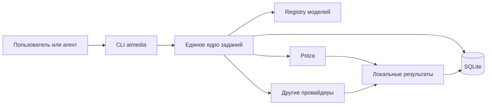
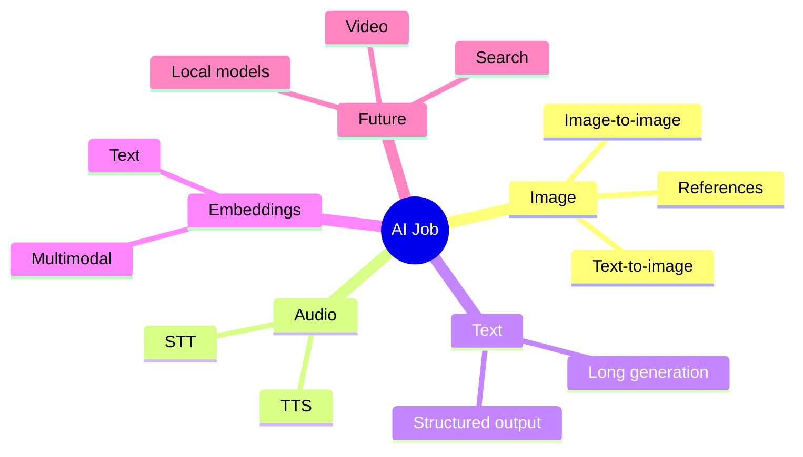
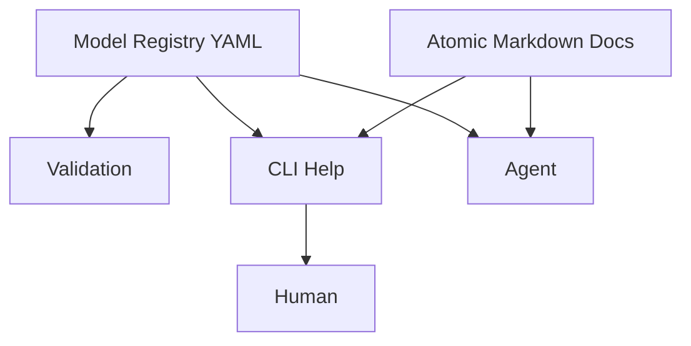
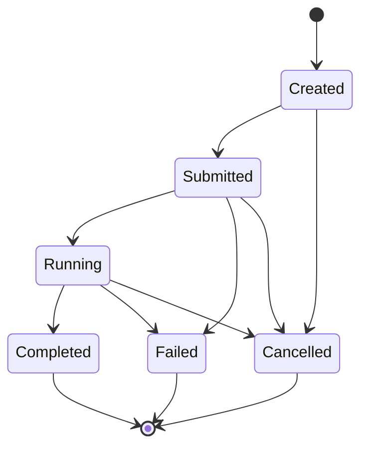

# 01. Product Scope — локальная CLI-платформа для AI-заданий

> [!abstract] Назначение документа
> Этот документ фиксирует границы продукта, его назначение, ключевые сценарии, принципы и состав первой версии. Он отвечает на вопрос **«что именно строится и зачем»**, но намеренно не уходит глубоко в устройство внутренних слоёв, классов, таблиц БД и контрактов провайдеров — эти вопросы раскрываются в следующих фундаментальных документах проекта.

---

## Статус документа 🧭

| Поле | Значение |
|---|---|
| Номер | `01` |
| Название | `Product Scope` |
| Статус | Draft / Foundation |
| Область | Границы продукта и цели |
| Основная версия | `v0.1` |
| Рабочее имя CLI | `aimedia` |
| Тип продукта | Локальная модульная CLI-утилита |
| Основной язык реализации | Python |
| Основное хранилище | SQLite |
| Основной интерфейс | CLI |
| Основной сценарий v0.1 | Генерация и обработка изображений через внешние AI-провайдеры |

> [!note]
> Рабочее имя `aimedia` используется в документации как короткий и удобный идентификатор команды. Оно не считается зафиксированным коммерческим названием продукта.

---

## Краткое описание продукта 🎯

Проект представляет собой локальную CLI-платформу для запуска AI-заданий через внешних поставщиков моделей с единым способом управления входными данными, параметрами, историей, результатами, затратами и документацией.

Первая версия сосредоточена на генерации изображений.

Пользователь или программный агент должен иметь возможность передать текстовый промпт, один или несколько файлов с промптами, изображения-референсы, параметры генерации и путь сохранения результата, после чего получить локальные файлы, запись задания в истории и информацию о фактической стоимости.

При этом продукт изначально проектируется не как «скрипт для картинок», а как локальный универсальный клиент для AI-заданий. Архитектура должна позволять позже добавлять распознавание речи, синтез речи, текстовую генерацию, embeddings, семантический поиск, работу с видео и новые типы AI-задач без переписывания ядра.



---

## Проблема, которую решает продукт 🧩

Современные генеративные модели доступны через разные API, агрегаторы и поставщиков. Даже если несколько сервисов предоставляют одинаковую модель, способы обращения к ней, названия параметров, механика асинхронных заданий, формат ответов и информация о стоимости могут различаться.

При прямой работе через API быстро возникают повторяющиеся задачи:

- подготовить и передать промпт;
- прочитать промпт из файла;
- приложить одно или несколько изображений;
- отправить запрос;
- дождаться завершения;
- скачать результат;
- сохранить файл в понятное место;
- преобразовать формат;
- записать параметры и фактическую стоимость;
- вспомнить, какой промпт использовался;
- повторить старое задание;
- найти недавнюю генерацию;
- понять, какие параметры поддерживает конкретная модель;
- предоставить эту же информацию AI-агенту в машинно читаемом виде.

При использовании нескольких провайдеров эта логика начинает дублироваться.

Продукт должен убрать это дублирование и дать единый локальный интерфейс.

> [!important]
> Цель продукта — не скрыть возможности конкретных моделей за чрезмерно абстрактным API, а предоставить **единое ядро выполнения задач**, сохранив доступ к реальным возможностям и ограничениям каждой модели.

---

## Продуктовая идея 🧠

Основной объект продукта — **AI-задание**.

Изображение, транскрипция, синтез речи, длинная текстовая генерация или создание embeddings рассматриваются как разные типы заданий, но имеют общие свойства:

- тип задания;
- модель;
- провайдер;
- входные данные;
- параметры;
- состояние выполнения;
- результат;
- использование ресурсов;
- стоимость;
- ошибки;
- время запуска и завершения.

Поэтому продукт строится вокруг общей модели задания, а не вокруг конкретного API генерации изображений.



---

## Видение продукта 🔭

Продукт должен стать локальным инструментом, через который человек или AI-агент может выполнять различные AI-задачи единообразно, воспроизводимо и наблюдаемо.

Вместо множества разрозненных скриптов:

```text
generate_image.py
edit_image.py
transcribe.py
speech.py
llm_report.py
embedding_test.py
```

появляется единая точка входа:

```bash
aimedia ...
```

и единая история выполнения.

Долгосрочно продукт может стать локальным AI-workbench без обязательного GUI: компактным инфраструктурным слоем между агентами и разными AI-сервисами.

---

## Цели проекта ✅

### Единый интерфейс запуска AI-задач

Для пользователя и агента должна существовать стабильная командная модель.

Например:

```bash
aimedia image generate ...
```

позже:

```bash
aimedia audio transcribe ...
aimedia audio speech ...
aimedia text generate ...
aimedia embedding create ...
```

Новые типы задач должны расширять CLI, а не ломать существующие команды.

### Локальная история и воспроизводимость

Каждое выполненное задание должно оставлять локальную запись.

Должна сохраняться информация, достаточная для ответа на вопросы:

- что запускалось;
- когда;
- через какого провайдера;
- какой моделью;
- с какими параметрами;
- какой итоговый промпт был отправлен;
- какие входные файлы использовались;
- какие результаты были получены;
- сколько стоило выполнение;
- чем завершилось задание.

### Удобство для AI-агентов

CLI должна быть пригодна не только для человека, но и для программного агента.

Это означает:

- стабильные команды;
- предсказуемые exit codes;
- машинно читаемый JSON;
- атомарную документацию;
- возможность запросить capabilities модели;
- отсутствие необходимости разбирать декоративный терминальный вывод.

### Независимость от одного поставщика

Первая реализация может использовать Polza как основной provider, но архитектура не должна связывать продукт с ним навсегда.

Подключение нового поставщика не должно требовать переписывания CLI, хранения заданий или общей модели результатов.

### Минимальная инфраструктурная сложность

Продукт локальный.

Для первой версии не требуются:

- Redis;
- RabbitMQ;
- Celery;
- Kafka;
- отдельный backend-сервер;
- постоянные worker-процессы;
- распределённая очередь;
- Kubernetes.

Параллельность нескольких генераций должна решаться обычной асинхронностью внутри одного процесса.

### Декларативное описание моделей

Поддерживаемые модели, их параметры и ограничения должны по возможности описываться декларативно.

В частности:

- remote model ID;
- семейство;
- capabilities;
- поддерживаемые разрешения;
- aspect ratios;
- допустимое число reference images;
- возможные output formats;
- model-specific ограничения;
- aliases;
- связанные страницы документации.

Это позволит добавлять и обновлять модели без изменения основной логики приложения.

---

## Не-цели первой версии 🚫

Первая версия намеренно не пытается решить всё.

### Не строится распределённая система очередей

CLI может одновременно отправлять несколько заданий и ожидать их завершения, но отдельный брокер сообщений и инфраструктура worker-ов не нужны.

### Не строится GUI

Основным интерфейсом является CLI.

GUI может появиться когда-нибудь отдельно, но v0.1 не должна зависеть от его существования.

### Не строится облачный multi-user сервис

Приложение работает локально от имени одного пользователя.

Нет:

- аккаунтов;
- ролей;
- команд;
- организации пользователей;
- серверной авторизации;
- общего сетевого хранилища.

### Не выполняется валютная конвертация

Provider может сообщить стоимость в RUB, USD или другой валюте.

Продукт сохраняет сумму и валюту как есть.

Например:

```text
4.00 RUB
0.08 USD
```

CLI не пытается:

- конвертировать валюты;
- запрашивать FX-курс;
- приводить расходы к единой валюте;
- рассчитывать бухгалтерскую стоимость.

### Не строится собственный биллинг

Стоимость берётся из фактического ответа поставщика, если он её предоставляет.

Продукт не должен считать себя источником истины о цене модели.

### Не требуется семантический поиск в v0.1

SQLite FTS5 может быть добавлен сравнительно рано, но `sqlite-vec`, embeddings и hybrid search не входят в обязательный минимальный объём первой версии.

Архитектура только не должна препятствовать их появлению.

### Не требуется поддержка всех типов AI-задач в v0.1

В первой версии реализуется прежде всего image-модуль.

Аудио, текст, embeddings и видео рассматриваются как следующие расширения.

---

## Целевая аудитория 👥

### Человек, работающий из терминала

Пользователь хочет запускать генерации без написания одноразовых Python-скриптов и вручную сохранять результаты.

### AI-агент

Агент должен иметь возможность:

- узнать доступные команды;
- узнать параметры модели;
- передать файлы;
- запустить несколько заданий;
- дождаться результата;
- получить JSON;
- найти прошлое задание;
- повторить его;
- определить путь к итоговому артефакту.

### Разработчик продукта

Разработчик должен иметь возможность добавлять:

- новые модели;
- новые provider adapters;
- новые task types;
- новые виды локальной обработки;

без модификации большого монолитного файла.

---

## Основные сценарии v0.1 🖼️

### Генерация из текстового промпта

```bash
aimedia image generate \
  --prompt "A small laboratory robot standing near a workbench" \
  --model gpt-image-2.5
```

Ожидаемый результат:

- создаётся Job;
- отправляется запрос provider;
- CLI ожидает завершения;
- результат скачивается;
- файл сохраняется локально;
- usage и cost записываются;
- Job получает статус `completed`.

### Промпт из файла

```bash
aimedia image generate \
  --prompt-file prompts/scientist.md \
  --model seedream-5-pro
```

CLI читает содержимое файла и сохраняет:

- сам источник;
- путь к файлу;
- фактический текст;
- финальный compiled prompt.

### Несколько файлов с промптами

```bash
aimedia image generate \
  --prompt-file prompts/base.md \
  --prompt-file prompts/character.md \
  --prompt-file prompts/scene.md
```

В обычном режиме эти файлы составляют одно задание.

Порядок объединения должен быть детерминированным и соответствовать порядку аргументов CLI.

### Комбинация текста и файлов

```bash
aimedia image generate \
  --prompt-file prompts/base.md \
  --prompt "Camera: full body, frontal view" \
  --image refs/character.png
```

CLI должен явно определить порядок сборки итогового prompt.

Этот порядок будет зафиксирован в `04-cli-contract.md`.

### Работа с несколькими reference images

```bash
aimedia image generate \
  --prompt-file prompts/scene.md \
  --image refs/face.png \
  --image refs/clothes.png \
  --image refs/lab.png
```

CLI валидирует количество изображений по capabilities выбранной модели.

### Batch из нескольких промптов

```bash
aimedia image batch prompts/*.md --concurrency 4
```

Каждый входной prompt создаёт отдельный Job.

Одновременно выполняется не больше заданного числа задач.

### Пользовательский путь вывода

```bash
aimedia image generate \
  --prompt-file prompt.md \
  --out D:\Projects\Comic\Scientist
```

Результат должен оказаться в указанной директории.

### Выбор формата

```bash
aimedia image generate \
  --prompt-file prompt.md \
  --format webp
```

Если provider умеет вернуть формат напрямую, используется его возможность.

Если нет, результат конвертируется локально.

### Машинно читаемый режим

```bash
aimedia image generate \
  --prompt-file prompt.md \
  --json
```

CLI возвращает JSON без декоративного вывода.

Пример концептуального результата:

```json
{
  "ok": true,
  "job_id": 481,
  "status": "completed",
  "provider": "polza",
  "model": "gpt-image-2.5",
  "cost": {
    "amount": 4.0,
    "currency": "RUB"
  },
  "artifacts": [
    {
      "type": "image",
      "path": "D:\\AI-Media\\outputs\\2026-09-28\\481\\result_001.webp"
    }
  ]
}
```

---

## Состав первой версии 🚀

### Обязательная функциональность

| Функция | v0.1 |
|---|---:|
| Text-to-image | ✅ |
| Image-to-image | ✅ |
| Один reference image | ✅ |
| Несколько reference images | ✅ |
| Prompt из CLI | ✅ |
| Prompt из файла | ✅ |
| Несколько prompt-файлов | ✅ |
| Batch генерация | ✅ |
| Ограничение concurrency | ✅ |
| Выбор модели | ✅ |
| Model Registry | ✅ |
| Валидация model capabilities | ✅ |
| Выбор provider | ✅ |
| Основной provider Polza | ✅ |
| Пользовательская output directory | ✅ |
| PNG/JPEG/WebP | ✅ |
| Локальная конвертация изображений | ✅ |
| SQLite history | ✅ |
| Сохранение prompt | ✅ |
| Сохранение raw usage | ✅ |
| Сохранение cost + currency | ✅ |
| Сохранение remote job ID | ✅ |
| История заданий | ✅ |
| Просмотр задания | ✅ |
| Повтор задания | ✅ |
| Синхронизация незавершённых заданий | ✅ |
| JSON output | ✅ |
| Markdown help system | ✅ |
| Atomic docs | ✅ |
| Help для моделей | ✅ |

### Желательно, но не блокирует v0.1

| Функция | Статус |
|---|---:|
| SQLite FTS5 по истории | Желательно |
| Фильтрация jobs по модели | Желательно |
| Статистика расходов | Желательно |
| Копирование старого Job как нового | Желательно |
| `--detach` | Желательно |
| Кэширование скачанных remote файлов | Желательно |
| Hash входных файлов | Желательно |

### Не входит в обязательную v0.1

| Функция | Статус |
|---|---:|
| STT | Позже |
| TTS | Позже |
| Text generation | Позже |
| Embeddings | Позже |
| sqlite-vec | Позже |
| Hybrid search | Позже |
| Video | Позже |
| GUI | Позже / необязательно |
| Persistent workers | Не планируется на старте |
| Cloud server | Не планируется на старте |

---

## Принципы продукта ⚙️

### Простота эксплуатации

Установка и использование не должны требовать запуска нескольких сервисов.

Минимальная рабочая система:

```text
Python package
+
SQLite
+
локальная файловая система
+
API key
```

### Offline-first для истории

Внешний provider нужен для выполнения AI-задачи, но история, документы, metadata и результаты после скачивания должны быть доступны локально.

### Provider-neutral core

Внутреннее представление задания не должно использовать термины конкретного API, если они не являются частью предметной области.

Например ядро знает:

```text
resolution = 2K
```

а adapter решает, отправить ли это как:

```text
image_resolution
```

или:

```text
size
```

### Model-aware validation

CLI должна знать реальные ограничения выбранной модели до отправки запроса, насколько это возможно.

Например:

```text
Model does not support 4K.
Supported values: 1K, 2K.
```

лучше, чем отправить заведомо неверный запрос и получить ошибку provider.

### Фактическая стоимость важнее каталожной

Если provider вернул usage/cost после выполнения, именно эти значения сохраняются как фактические.

Каталожная цена может использоваться для справки или предварительной оценки, но не должна заменять фактическое значение.

### Сохранение исходных данных

Для воспроизводимости нужно сохранять не только результат, но и контекст задания.

В частности:

- финальный prompt;
- источники prompt;
- model ID;
- provider;
- параметры;
- входные файлы;
- raw usage;
- raw response при необходимости;
- remote job ID.

### Документация как часть продукта

Документация не является отдельным сайтом, который может устареть независимо от программы.

Она должна поставляться вместе с CLI.

---

## Работа с моделями 📚

Поддерживаемые модели описываются через Model Registry.

Registry должен содержать структурированные сведения, пригодные для:

- валидации;
- CLI help;
- JSON output;
- работы AI-агентов;
- отображения доступных параметров;
- обновления моделей без изменения core.

Концептуальный пример:

```yaml
id: seedream-5-pro
name: Seedream 5.0 Pro
family: image

capabilities:
  text_to_image: true
  image_to_image: true
  multi_reference: true

parameters:
  resolution:
    type: enum
    values:
      - 1K
      - 2K
      - 4K

  aspect_ratio:
    type: enum
    values:
      - "1:1"
      - "4:3"
      - "3:4"
      - "16:9"
      - "9:16"

  output_format:
    type: enum
    values:
      - png
      - jpeg
      - webp

providers:
  polza:
    remote_id: provider/model-id
```

> [!important]
> Registry описывает **что модель умеет**. Provider adapter описывает **как вызвать конкретный API**.

---

## Документация и справка 📖

Система документации должна быть атомарной.

Вместо одного огромного README:

```text
docs/
├── image/
│   ├── generate.md
│   ├── references.md
│   ├── batch.md
│   └── formats.md
├── jobs/
│   ├── history.md
│   ├── retry.md
│   └── costs.md
├── models/
│   └── overview.md
└── audio/
    ├── transcribe.md
    └── speech.md
```

Каждый документ отвечает на один вопрос.

CLI должна уметь использовать эти же Markdown-файлы как встроенную справку.

Например:

```bash
aimedia help image.references
```

для человека и:

```bash
aimedia help image.references --raw
```

для агента.

Model Registry дополняет Markdown-документацию машинно читаемыми capabilities.



---

## Хранение результатов 📦

Результат внешней генерации должен быть сохранён локально.

Удалённая ссылка provider не считается постоянным артефактом.

Для каждого полученного файла желательно сохранять:

- локальный путь;
- исходный remote URL;
- MIME type;
- размер файла;
- hash;
- технические metadata;
- связь с Job.

Стандартная директория данных должна определяться средствами ОС, например через `platformdirs`.

Концептуально:

```text
AI-Media/
├── database.sqlite3
├── outputs/
│   └── 2026-09-28/
│       └── job_481/
│           ├── result_001.webp
│           └── result_002.webp
├── cache/
└── logs/
```

Пользователь может указать собственную директорию через `--out`.

---

## История заданий 🕘

CLI должна рассматривать историю как полноценную функцию продукта.

Минимальные сценарии:

```bash
aimedia jobs recent
aimedia jobs show 481
aimedia jobs retry 481
aimedia jobs sync
```

Желательные расширения:

```bash
aimedia jobs search "laboratory robot"
aimedia jobs costs --today
aimedia jobs costs --month
```

История нужна не только человеку.

AI-агент должен иметь возможность восстановить контекст прошлой работы и использовать предыдущие prompts/results.

---

## Асинхронность и параллельность ⚡

Асинхронность в продукте имеет две разные задачи.

### Асинхронный API provider

Некоторые provider возвращают remote job ID и требуют polling статуса.

Это часть поведения adapter.

### Параллельная работа локального CLI

Пользователь может передать несколько заданий:

```bash
aimedia image batch prompts/*.md --concurrency 4
```

CLI запускает до четырёх операций одновременно.

Для первой версии достаточно:

- `asyncio`;
- асинхронного HTTP-клиента;
- semaphore;
- SQLite как журнала состояния.

> [!warning]
> Наличие нескольких одновременных заданий не является основанием для появления Celery, Redis или другого постоянного job broker.

---

## Состояния задания 🔄

На продуктовом уровне Job должен иметь понятный lifecycle.



Точные имена внутренних enum и переходы фиксируются в `03-domain-model.md` и `08-job-execution.md`.

---

## Ошибки и наблюдаемость 🧯

CLI должна различать как минимум следующие классы ошибок:

- ошибка CLI-аргументов;
- неизвестная модель;
- неподдерживаемый параметр;
- ошибка чтения файла;
- ошибка provider;
- недостаток средств;
- timeout;
- remote generation failure;
- ошибка скачивания результата;
- ошибка локального преобразования;
- ошибка БД.

Для человека сообщение должно быть понятным.

Для агента та же ошибка должна иметь стабильный машинный код.

Пример:

```json
{
  "ok": false,
  "error": {
    "code": "UNSUPPORTED_PARAMETER",
    "message": "Model qwen-image-2.1 does not support resolution 4K",
    "details": {
      "parameter": "resolution",
      "allowed": ["1K", "2K"]
    }
  }
}
```

---

## Требования к UX CLI 💻

CLI должна быть удобной в двух режимах.

### Human mode

Допускаются:

- Rich;
- progress bars;
- таблицы;
- читаемые статусы;
- форматирование;
- краткие подсказки.

### Agent mode

Через `--json` вывод должен быть:

- стабильным;
- минимально двусмысленным;
- без ANSI;
- без progress bar;
- пригодным для парсинга;
- документированным.

Ни один важный результат не должен существовать только как человекочитаемый текст.

---

## Конфигурация 🔧

Продукт должен отделять пользовательскую конфигурацию от model registry.

### Пользовательский config

Предпочтительный формат — TOML.

Пример:

```toml
default_provider = "polza"

[providers.polza]
api_key_env = "POLZA_API_KEY"

[image]
default_format = "webp"

[batch]
concurrency = 4
```

### Model Registry

Предпочтительный формат — YAML.

Причина разделения:

```text
TOML
→ настройки пользователя

YAML
→ описание возможностей моделей
```

---

## Работа с секретами 🔐

API keys не должны храниться:

- в SQLite history;
- в Job request;
- в логах;
- в Markdown docs;
- в model registry.

Предпочтительный механизм:

```text
environment variables
```

или пользовательский config, содержащий имя переменной окружения.

Пример:

```toml
[providers.polza]
api_key_env = "POLZA_API_KEY"
```

---

## Расширение на аудио 🎙️

Аудио не входит в обязательную реализацию v0.1, но считается ближайшим расширением.

Будущие команды:

```bash
aimedia audio transcribe lecture.mp3
```

и:

```bash
aimedia audio speech \
  --text-file narration.md \
  --voice alloy
```

Они должны использовать те же фундаментальные механизмы:

```text
Job
Provider
Model Registry
History
Usage
Cost
Artifacts
Documentation
```

При этом конкретные endpoints и параметры остаются ответственностью audio-модуля и provider adapter.

---

## Расширение на текстовые генерации 📝

Архитектура должна позволять добавить длительные текстовые задачи.

Например:

```bash
aimedia text generate \
  --prompt-file task.md \
  --input docs/*.md \
  --output report.md
```

В этом случае результатом Job может стать Markdown-файл или JSON.

Общие механизмы остаются прежними:

- история;
- provider;
- model;
- usage;
- cost;
- retries;
- artifacts;
- JSON mode.

Продукт не должен предполагать, что результат AI-задачи всегда является бинарным медиафайлом.

---

## Расширение на embeddings и sqlite-vec 🔎

Embeddings не обязательны для первой версии, но должны естественно вписываться позже.

Возможная цепочка:


В будущем это позволит искать не только по точным словам, но и по смыслу.

Например:

```bash
aimedia search "тот промпт, где робот выглядел уставшим возле лабораторного стола"
```

Даже если эти слова не совпадают дословно с сохранённым prompt.

На старте достаточно оставить этому расширению архитектурное место.

---

## Поиск по истории 🔍

Первый уровень поиска может быть реализован через SQLite FTS5.

Индексировать потенциально полезно:

- compiled prompts;
- текстовые outputs;
- названия файлов;
- имена моделей;
- пользовательские labels;
- metadata.

Semantic search поверх sqlite-vec — отдельный будущий слой.

---

## Границы ответственности 🧱

Чтобы проект не превратился в монолит с взаимными зависимостями, продуктовые границы должны быть понятными уже на уровне scope.

| Компонент | Отвечает за |
|---|---|
| CLI | ввод/вывод, команды, human/JSON mode |
| Application | сценарии выполнения |
| Domain | понятия Job, Cost, Artifact, Request |
| Provider | взаимодействие с внешним API |
| Registry | возможности и ограничения моделей |
| Storage | история и локальные данные |
| Processing | локальное преобразование файлов |
| Docs | встроенная справка |
| Search | поиск по локальным данным |

Детальная архитектура фиксируется отдельно в документе `02-system-architecture.md`.

---

## Принцип постепенного роста 🌱

Проект должен следовать правилу:

> Архитектура предусматривает расширение, но код для будущей функциональности не пишется заранее без необходимости.

Поэтому наличие будущего `text.generate` не означает, что в v0.1 нужно создавать пустой TextService.

Наличие будущего `sqlite-vec` не означает необходимость создавать vector tables заранее.

Наличие будущих providers не означает необходимость реализовывать универсальный plugin framework в первой версии.

Нужны стабильные границы, а не преждевременная инфраструктура.

---

## Что считается готовой v0.1 🏁

Версия v0.1 считается функционально готовой, если выполняется следующий сценарий.

Пользователь устанавливает CLI, задаёт API key и может выполнить:

```bash
aimedia image generate \
  --prompt-file character.md \
  --image reference.png \
  --model <supported-model> \
  --resolution 2K \
  --format webp \
  --out ./results
```

После завершения:

1. запрос успешно отправлен;
2. входные параметры проверены по Model Registry;
3. при асинхронном API CLI дождалась результата;
4. изображение скачано локально;
5. при необходимости выполнена конвертация;
6. Job записан в SQLite;
7. финальный prompt сохранён;
8. входные файлы связаны с Job;
9. model/provider сохранены;
10. remote job ID сохранён;
11. usage сохранён;
12. фактическая cost сохранена вместе с currency;
13. output artifact сохранён;
14. команда `jobs show` отображает историю;
15. режим `--json` возвращает структурированный результат.

Кроме того, должно быть возможно выполнить batch нескольких генераций с ограничением concurrency без отдельного queue server.

---

## Критерии качества первой версии 🧪

### Функциональность

Основные image-сценарии работают без ручного вмешательства.

### Воспроизводимость

По сохранённому Job можно понять, что именно отправлялось provider.

### Расширяемость

Добавление новой image-модели не требует изменения CLI-команды.

### Provider isolation

Логика Polza не просачивается в domain и CLI.

### Agent friendliness

Основные действия имеют JSON-представление и встроенную документацию.

### Локальность

История и результаты доступны без отдельного сервера.

### Простота

Для запуска не нужны внешние инфраструктурные сервисы кроме выбранного AI provider.

---

## Потенциальные риски ⚠️

### Различия моделей

Одинаково названные параметры могут иметь разную семантику у разных моделей.

Решение: Model Registry + provider mapping.

### Быстро меняющиеся каталоги моделей

ID, возможности и цены могут изменяться.

Решение: отделить registry от кода и не считать статическую цену источником фактической стоимости.

### Неполные ответы provider

Не каждый provider может возвращать cost.

Решение: стоимость является nullable.

```text
cost_amount = null
cost_currency = null
```

### Долгие задания

Некоторые операции могут выполняться минуты.

Решение: remote job IDs, polling и возможность восстановления состояния.

### Временные remote URLs

Ссылки provider могут иметь ограниченный срок жизни.

Решение: автоматическое локальное сохранение результата.

### Разрастание универсального API

Попытка сделать один request на все типы задач приведёт к десяткам optional-полей.

Решение: общий Job и специализированные request types.

### Преждевременная сложность

Потенциальная возможность будущих batch-задач может спровоцировать внедрение тяжёлой системы очередей.

Решение: concurrency внутри одного процесса до появления реальной необходимости в другом подходе.

---

## Осознанно отложенные решения ⏸️

В рамках документа `01` не фиксируются окончательно:

- конкретная схема классов;
- структура Peewee models;
- точные enum статусов;
- SQL schema;
- формат repository layer;
- интерфейс ProviderAdapter;
- структура model YAML schema;
- точные CLI exit codes;
- точная логика retry;
- точная политика логирования;
- формат migrations;
- структура sqlite-vec индекса;
- конкретные модели будущих audio/text модулей.

Эти решения относятся к следующим фундаментальным документам.

---

## Карта фундаментальной документации 🗺️

Этот документ является первым в серии.

```text
01-product-scope.md
02-system-architecture.md
03-domain-model.md
04-cli-contract.md
05-provider-system.md
06-model-registry.md
07-storage-history-costs.md
08-job-execution.md
09-documentation-help.md
```

После них идут спецификации модулей:

```text
modules/
├── image.md
├── audio.md
├── text.md
└── search.md
```

И короткие Architecture Decision Records:

```text
decisions/
├── ADR-001-sqlite.md
├── ADR-002-peewee.md
├── ADR-003-yaml-model-registry.md
└── ADR-004-no-job-broker.md
```

---

## Сводка границ продукта 📌

```mermaid
flowchart TB
    CORE[Core v0.1]

    CORE --> IMG[Image generation]
    CORE --> HIST[History]
    CORE --> REG[Model Registry]
    CORE --> PROV[Provider adapters]
    CORE --> DOCS[Docs / Help]
    CORE --> COST[Usage / Cost]
    CORE --> ASYNC[Async batch]

    FUTURE[Future]
    FUTURE --> AUDIO[Audio]
    FUTURE --> TEXT[Text]
    FUTURE --> EMB[Embeddings]
    FUTURE --> SEARCH[sqlite-vec / Search]
    FUTURE --> VIDEO[Video]

    EXCLUDED[Not v0.1]
    EXCLUDED --> QUEUE[Distributed queue]
    EXCLUDED --> GUI[GUI]
    EXCLUDED --> CLOUD[Cloud multi-user backend]
    EXCLUDED --> FX[Currency conversion]
```



---

## Итоговая формулировка продукта 🧩

> [!success]
> Проект — это локальная модульная CLI-платформа для выполнения AI-заданий через подключаемых провайдеров. Первая версия сосредоточена на генерации изображений и обеспечивает единый запуск, передачу промптов и референсов, параллельное выполнение нескольких задач, локальное сохранение результатов, историю, фактическую стоимость, Model Registry и встроенную документацию. Архитектура должна позволять позднее добавить аудио, текстовые генерации, embeddings, sqlite-vec и другие типы AI-задач без перестройки фундаментального ядра.
