# 02. System Architecture — архитектура локальной AI CLI-платформы

> [!abstract] Назначение документа
> Этот документ фиксирует **системную архитектуру** проекта: основные слои, модули, направления зависимостей, границы ответственности, точки расширения и типовые потоки выполнения.
>
> Документ отвечает на вопрос **«как устроена система в целом»**.
>
> Он не фиксирует окончательно детали доменных классов, точную схему SQLite, конкретный YAML schema моделей, полный CLI contract или интерфейс каждого provider adapter — эти вопросы раскрываются в следующих документах серии.

---

## Статус документа 🧭

| Поле | Значение |
|---|---|
| Номер | `02` |
| Название | `System Architecture` |
| Статус | Draft / Foundation |
| Область | Архитектура системы |
| Основная версия | `v0.1` |
| Архитектурный стиль | Modular Monolith + Ports & Adapters |
| Основной интерфейс | CLI |
| Основное хранилище | SQLite + локальная файловая система |
| Основной runtime | Один локальный Python-процесс |
| Основной provider v0.1 | Polza |
| Основной модуль v0.1 | Image |
| Будущие модули | Audio, Text, Embeddings, Search, Video |

---

## Архитектурная цель 🏗️

Система должна оставаться простой в эксплуатации, но не быть одноразовым скриптом.

Основная архитектурная задача — совместить четыре свойства:

1. **Локальность** — приложение запускается как обычная CLI-утилита без отдельного backend.
2. **Модульность** — image, audio, text, embeddings и search развиваются независимо.
3. **Независимость от provider** — Polza является первой интеграцией, а не фундаментом всей системы.
4. **Расширяемость без преждевременной сложности** — будущие возможности предусмотрены границами модулей, но не реализуются заранее.

> [!important]
> Архитектура не должна решать будущие гипотетические задачи ценой сложности текущей версии.
>
> Она должна **оставлять дверь открытой**, а не строить пустые этажи.

---

## Архитектурный стиль 🧱

Для проекта выбирается **модульный монолит** с элементами **Ports & Adapters**.

Это означает:

- один Python package;
- один основной процесс;
- одна локальная SQLite;
- одна файловая область данных;
- единый CLI;
- отдельные модули по функциональным областям;
- внешние API спрятаны за adapters;
- core не зависит от конкретного provider;
- инфраструктурные детали не проникают в domain layer.

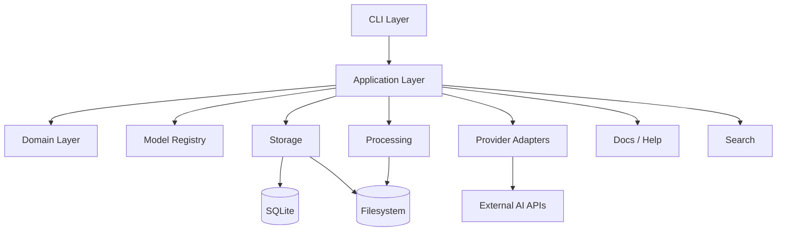

---

## Почему не микросервисы 🚫

Проект не нуждается в:

- отдельных сервисах;
- service discovery;
- message broker;
- distributed tracing;
- сетевом RPC между внутренними частями;
- отдельной БД для каждого домена;
- оркестрации контейнеров.

Главная причина проста: приложение локальное, однопользовательское и выполняет ограниченное число параллельных AI-задач.

Разделение на процессы не даёт полезной изоляции, но значительно увеличивает сложность разработки, тестирования и эксплуатации.

---

## Почему не «всё в одном файле» 🧨

Обратная крайность также неприемлема.

Файл вида:

```text
app.py
```

с:

```text
CLI
HTTP
SQLite
Pillow
Provider API
Prompt compilation
Polling
Help
Model validation
```

очень быстро становится нерасширяемым.

Поэтому система должна оставаться единым приложением, но с явными внутренними границами.

---

# Архитектурные слои 🧩

## CLI Layer ⌨️

CLI — внешний интерфейс приложения.

Он отвечает за:

- разбор аргументов;
- команды и подкоманды;
- human-readable output;
- JSON output;
- exit codes;
- progress display;
- выбор input/output;
- вызов application use cases.

CLI **не должна**:

- выполнять HTTP-запросы напрямую;
- работать с Peewee напрямую;
- знать URL provider;
- преобразовывать model capabilities вручную;
- выполнять бизнес-логику;
- решать, как устроен polling;
- знать структуру таблиц SQLite.

Правильный поток:

```text
CLI command
   ↓
Application use case
   ↓
Domain + Infrastructure ports
```

Неправильный поток:

```text
CLI command
   ↓
requests.post(...)
   ↓
sqlite.execute(...)
```

---

## Application Layer 🎛️

Application Layer координирует сценарии.

Примеры use cases:

```text
GenerateImage
GenerateImageBatch
RetryJob
SyncJobs
ShowJob
ListModels
ShowModel
RenderHelp
```

Именно здесь решается:

- какой domain request создать;
- какую модель проверить;
- какой provider выбрать;
- создать ли Job;
- когда записать состояние;
- вызвать ли polling;
- когда скачать artifact;
- когда обновить cost;
- как завершить операцию.

Application Layer знает **что сделать**, но не знает деталей внешнего API или SQL.

---

## Domain Layer 🧠

Domain Layer содержит основные понятия продукта.

Ключевые сущности:

```text
Job
JobRequest
JobResult
Artifact
Input
PromptSource
Cost
Usage
ModelDefinition
ModelCapabilities
ProviderReference
```

Domain Layer не должен зависеть от:

```text
Typer
Rich
Peewee
httpx
Polza API
YAML parser
Pillow
platformdirs
sqlite-vec
```

Это центральное правило архитектуры.

> [!important]
> Domain Layer должен быть тестируемым без сети, без SQLite и без CLI.

---

## Infrastructure Layer 🔌

Infrastructure Layer реализует конкретные способы взаимодействия с внешним миром.

Он включает:

```text
providers/
storage/
registry/
processing/
search/
docs/
```

Infrastructure зависит от domain contracts, но domain не зависит от infrastructure.

---

# Направление зависимостей ➡️

Критически важное правило:

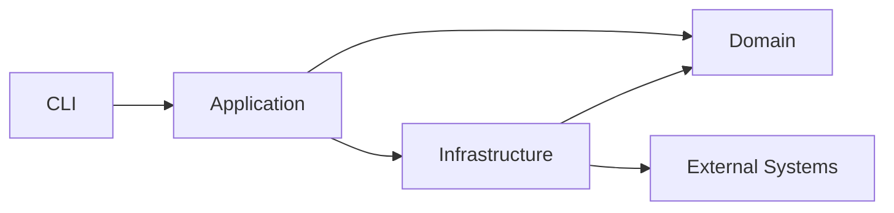

В коде это означает:

```text
domain/
    не импортирует application/
    не импортирует cli/
    не импортирует providers/
    не импортирует storage/

application/
    импортирует domain/
    использует ports

providers/
    импортирует domain contracts
    реализует ports

storage/
    импортирует domain
    реализует repositories

cli/
    импортирует application
```

---

# Общая структура проекта 📂

Рекомендуемая структура:

```text
src/aimedia/
│
├── cli/
│   ├── app.py
│   ├── image.py
│   ├── audio.py
│   ├── text.py
│   ├── embeddings.py
│   ├── jobs.py
│   ├── models.py
│   ├── search.py
│   └── help.py
│
├── application/
│   ├── image/
│   │   ├── generate.py
│   │   └── batch.py
│   ├── jobs/
│   │   ├── retry.py
│   │   ├── sync.py
│   │   └── history.py
│   ├── models/
│   │   ├── list.py
│   │   └── show.py
│   ├── prompts/
│   │   └── compile.py
│   └── artifacts/
│       └── download.py
│
├── domain/
│   ├── jobs.py
│   ├── artifacts.py
│   ├── costs.py
│   ├── usage.py
│   ├── models.py
│   ├── providers.py
│   ├── errors.py
│   └── requests/
│       ├── image.py
│       ├── audio.py
│       ├── text.py
│       └── embeddings.py
│
├── providers/
│   ├── base.py
│   └── polza/
│       ├── client.py
│       ├── image.py
│       ├── transcription.py
│       ├── speech.py
│       ├── status.py
│       └── mapper.py
│
├── storage/
│   ├── database.py
│   ├── repositories.py
│   ├── models.py
│   ├── migrations/
│   └── filesystem.py
│
├── registry/
│   ├── loader.py
│   ├── validator.py
│   ├── schema.py
│   └── models/
│
├── processing/
│   ├── images.py
│   ├── audio.py
│   └── files.py
│
├── search/
│   ├── lexical.py
│   ├── semantic.py
│   └── hybrid.py
│
├── docs/
│
├── config.py
├── paths.py
└── main.py
```

> [!note]
> Отсутствующие в v0.1 модули не обязаны существовать пустыми.
>
> Структура показывает будущую архитектурную форму, а не требует создавать заглушки заранее.

---

# Главный runtime flow 🔄

Типичная генерация изображения проходит через следующие стадии:

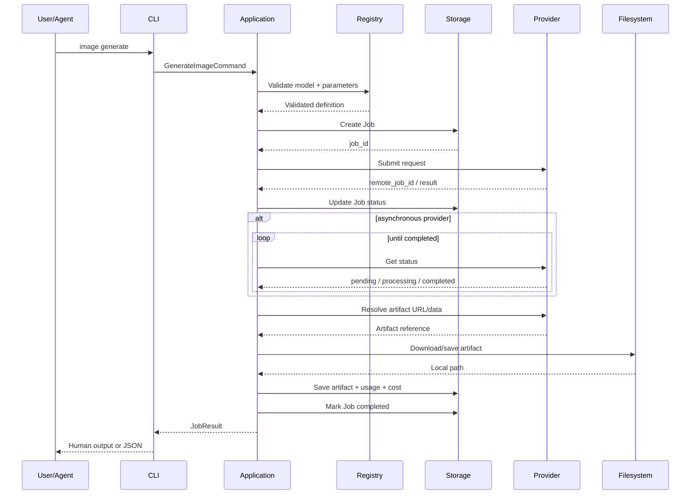

---

# Command → Use Case → Port 🧭

CLI command не должен обращаться напрямую к infrastructure.

Например:

```text
aimedia image generate
```

вызывает:

```text
GenerateImageUseCase
```

который использует абстракции:

```text
ModelRegistry
JobRepository
ProviderGateway
ArtifactStorage
PromptCompiler
```

Таким образом CLI остаётся тонким.

---

# Ports & Adapters 🔌

## Что считается port

Port — контракт, который нужен application/domain, но реализуется снаружи.

Примеры:

```python
class JobRepository(Protocol):
    ...

class ProviderGateway(Protocol):
    ...

class ModelRegistry(Protocol):
    ...

class ArtifactStorage(Protocol):
    ...
```

Application зависит от этих интерфейсов.

---

## Что считается adapter

Adapter — конкретная реализация port.

Примеры:

```text
PeeweeJobRepository
PolzaProviderGateway
YamlModelRegistry
LocalArtifactStorage
```

Схема:

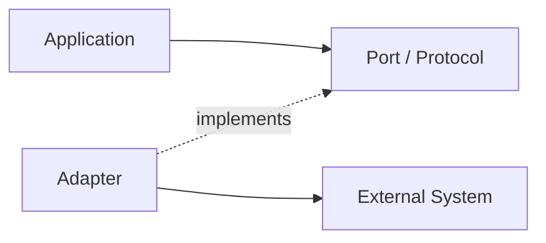

---

# Provider subsystem 🌐

Provider subsystem изолирует особенности внешних API.

Общая идея:

```text
providers/
├── base.py
└── polza/
```

В будущем:

```text
providers/
├── polza/
├── openai/
├── fal/
├── replicate/
└── other/
```

---

## Provider не равен Model

Модель и provider — разные понятия.

Одна модель потенциально может быть доступна через несколько провайдеров.

Например:

```text
logical model:
gpt-image-x

provider:
polza

remote model id:
openai/...
```

или:

```text
provider:
openai

remote model id:
gpt-image-...
```

Поэтому system architecture не должна связывать модель с одним API навсегда.

---

## Provider adapter отвечает за

- авторизацию;
- endpoint URLs;
- сериализацию request;
- mapping внутренних параметров в API;
- обработку response;
- polling;
- provider-specific errors;
- remote job IDs;
- provider usage;
- provider cost;
- загрузку/получение remote artifacts.

Provider adapter **не отвечает** за:

- CLI formatting;
- хранение истории;
- локальную конвертацию результата;
- модель пользовательской документации;
- глобальные правила output paths.

---

# Model Registry subsystem 📚

Model Registry является отдельным инфраструктурным модулем.

Он нужен для:

- перечисления доступных моделей;
- разрешения aliases;
- определения capabilities;
- валидации параметров;
- получения provider-specific remote IDs;
- генерации справки;
- предоставления данных агенту.

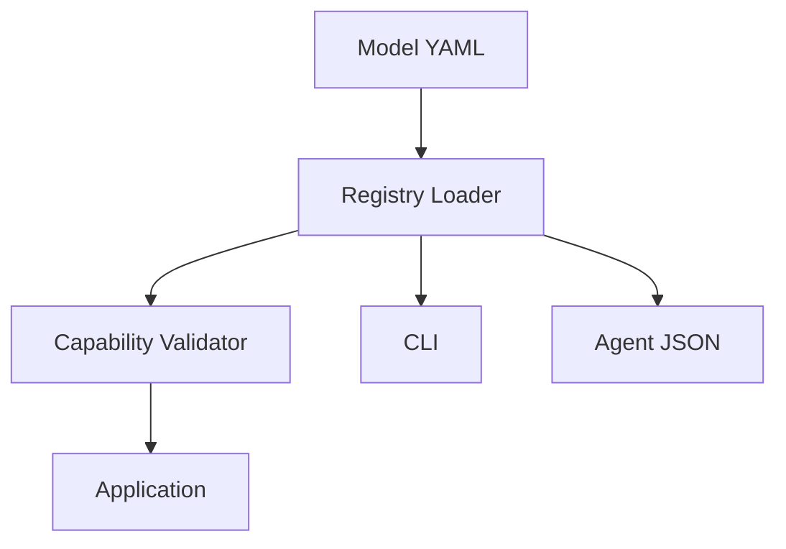

---

## Registry не должен выполнять provider logic

Если модель поддерживает:

```text
resolution = 2K
```

Registry может знать, что значение допустимо.

Но он не должен знать, что Polza требует поле:

```text
image_resolution
```

а другой provider:

```text
size
```

Это ответственность adapter.

---

# Documentation subsystem 📖

Документация является runtime-ресурсом приложения.

Markdown-файлы:

- читаются человеком;
- отображаются через CLI;
- возвращаются агенту через raw mode.

Система должна поддерживать:

```bash
aimedia help image.generate
```

и:

```bash
aimedia help image.generate --raw
```

Документация и Model Registry дополняют друг друга:

```text
Markdown
→ объяснения и примеры

YAML
→ машинные capabilities и ограничения
```

---

# Storage architecture 🗄️

Хранение разделяется на два независимых типа.

## Structured storage

SQLite хранит:

- Jobs;
- metadata;
- inputs;
- prompts;
- outputs metadata;
- costs;
- usage;
- provider references;
- search indexes.

## Artifact storage

Файловая система хранит:

- изображения;
- аудио;
- видео;
- Markdown;
- JSON;
- другие результаты.

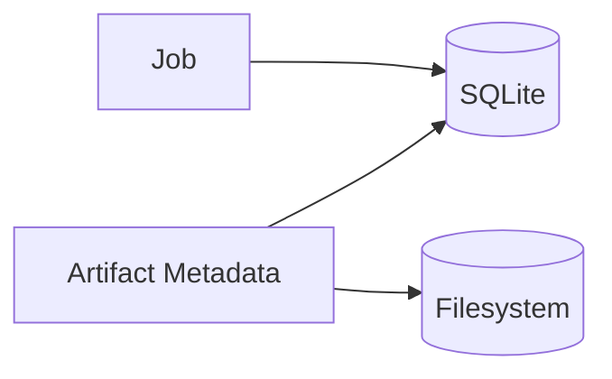

---

## Почему binary не хранится в SQLite

Изображения и другие крупные файлы не должны храниться BLOB-ами без специальной причины.

Плюсы обычной файловой системы:

- проще открыть файл;
- проще копировать;
- проще индексировать;
- проще использовать сторонними программами;
- проще отдавать агенту путь;
- меньше размер SQLite;
- легче backup/cleanup.

SQLite хранит ссылку и metadata.

---

# Работа с путями 📁

Приложение должно иметь системную data directory.

Например через `platformdirs`.

Концептуально:

```text
<app_data>/
├── database.sqlite3
├── outputs/
├── cache/
└── logs/
```

При указании:

```bash
--out <path>
```

пользовательский путь имеет приоритет.

---

# Prompt subsystem 📝

Prompt processing следует выделить из CLI.

Он отвечает за:

- строковый prompt;
- prompt files;
- несколько prompt files;
- порядок объединения;
- нормализацию;
- compiled prompt;
- сохранение источников.

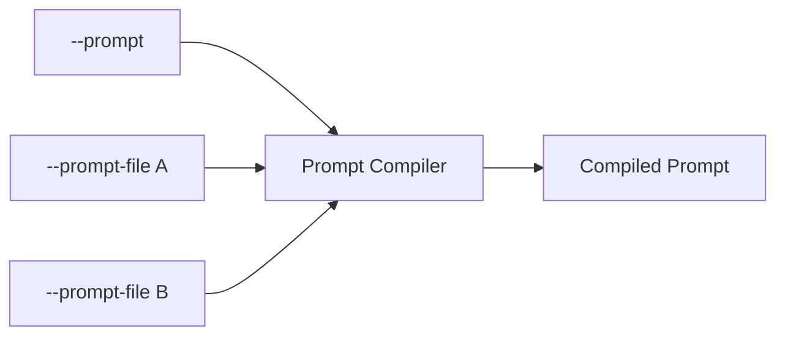

PromptCompiler не должен зависеть от конкретной image-модели.

Модельные ограничения проверяются отдельно.

---

# Processing subsystem 🛠️

Processing отвечает за локальные операции над файлами.

Для image:

- PNG/JPEG/WebP conversion;
- metadata extraction;
- size detection;
- MIME detection;
- hashing;
- optional resize;
- future preprocessing.

Provider и processing должны быть разделены.

Например:

```text
Provider returns PNG
        ↓
Processing converts to WebP
        ↓
Artifact storage saves final file
```

---

# Job architecture ⚙️

Job — центральная orchestration entity.

Каждая внешняя AI-операция оформляется как Job.

Это позволяет единообразно работать с:

```text
image.generate
audio.transcribe
audio.speech
text.generate
embedding.create
```

Но request types при этом остаются специализированными.

---

## Нельзя делать один MegaRequest

Плохой вариант:

```python
class GenerationRequest:
    prompt: str | None
    images: list | None
    voice: str | None
    temperature: float | None
    resolution: str | None
    duration: int | None
    dimensions: int | None
    ...
```

Такой класс быстро становится мешком optional-параметров.

Правильнее:

```text
Job
└── request
    ├── ImageGenerationRequest
    ├── AudioTranscriptionRequest
    ├── SpeechGenerationRequest
    ├── TextGenerationRequest
    └── EmbeddingRequest
```

---

# Job lifecycle 🔄

На системном уровне Job проходит состояния.

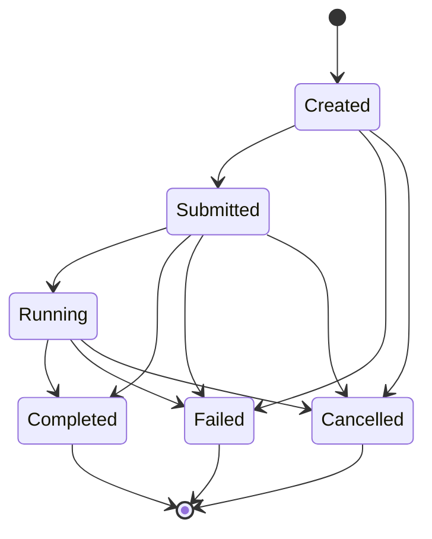

Точные enum и допустимые переходы фиксируются в `03-domain-model.md` и `08-job-execution.md`.

---

# Синхронные и асинхронные providers ⏳

Архитектура должна поддерживать оба варианта.

## Синхронный provider

```text
submit
↓
result
```

## Асинхронный provider

```text
submit
↓
remote_job_id
↓
poll
↓
completed
↓
result
```

Application layer не должен делать предположение, что все providers работают одинаково.

---

# Параллельность без job broker ⚡

Параллельное выполнение 3–5 генераций решается внутри одного процесса.

Минимальная схема:

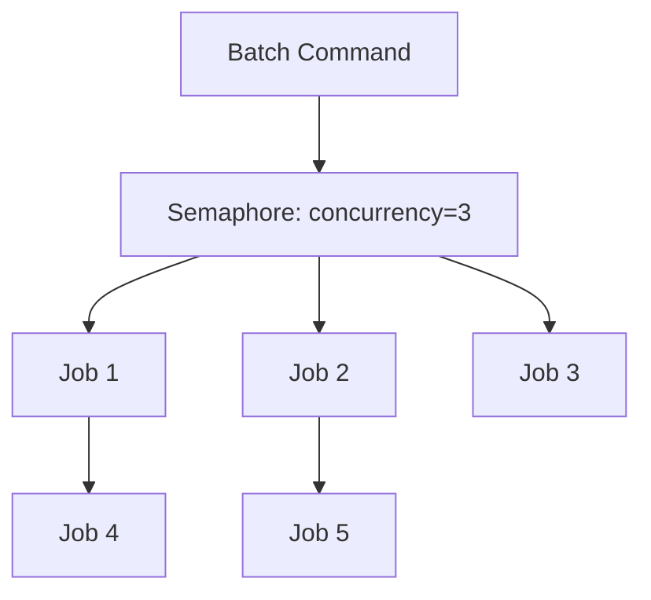

Технически достаточно:

```text
asyncio
httpx.AsyncClient
asyncio.Semaphore
```

---

## Что не требуется

```text
Redis
RabbitMQ
Celery
Kafka
worker daemon
scheduler service
```

Если когда-нибудь появится реальная необходимость в фоновых процессах, это будет отдельное архитектурное решение.

---

# Recovery после остановки 🧯

SQLite должна позволять восстановить информацию о незавершённых заданиях.

Например Job содержит:

```text
status
provider
remote_job_id
```

После принудительного завершения CLI можно выполнить:

```bash
aimedia jobs sync
```

Application:

1. находит незавершённые Jobs;
2. проверяет наличие remote job ID;
3. обращается к provider;
4. обновляет статусы;
5. скачивает готовые artifacts;
6. завершает Jobs.

Это обеспечивает достаточную устойчивость без постоянного worker-процесса.

---

# Конфигурационная архитектура ⚙️

Система разделяет три разных вида конфигурации.

## User configuration

TOML:

```text
default provider
default image format
concurrency
API key env names
output preferences
```

## Model Registry

YAML:

```text
model capabilities
constraints
remote model IDs
aliases
defaults
```

## Secrets

Environment variables или безопасный локальный механизм.

API keys не должны попадать в:

- Job history;
- logs;
- YAML registry;
- documentation;
- JSON output.

---

# Cost architecture 💰

Стоимость хранится как независимый value object:

```text
amount
currency
```

Примеры:

```text
4.00 RUB
0.08 USD
```

Ядро не выполняет FX conversion.

Provider adapter нормализует внешний ответ к внутренней структуре.

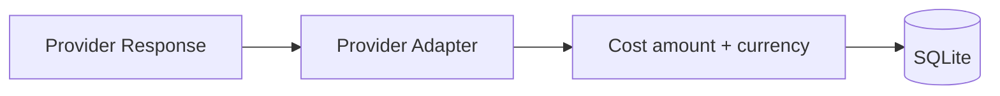

Raw usage также сохраняется отдельно.

---

# Error architecture 🧯

Ошибки разделяются на несколько уровней.

## Domain errors

Примеры:

```text
UnsupportedParameter
UnknownModel
InvalidJobState
```

## Application errors

```text
JobExecutionError
ArtifactDownloadError
PromptCompilationError
```

## Infrastructure errors

```text
ProviderTimeout
ProviderRateLimit
ProviderAuthenticationError
DatabaseError
FilesystemError
```

CLI преобразует их в:

- human-readable сообщение;
- JSON error;
- exit code.

---

## Ошибка provider не должна протекать наружу как сырой HTTP response

Плохой результат:

```text
HTTP 400 {"foo":"bar"}
```

Лучше:

```text
Model does not support resolution 4K.
```

При этом raw provider details могут сохраняться в diagnostic metadata.

---

# Logging & observability 📜

Система должна иметь обычное локальное логирование.

Минимум:

```text
timestamp
level
component
job_id
provider
message
```

Полезные события:

```text
job_created
request_submitted
remote_job_received
poll_started
poll_completed
artifact_downloaded
job_completed
job_failed
```

---

## Логи не являются историей заданий

SQLite Job history — бизнес-данные.

Logs — диагностические данные.

Это разные сущности.

---

## Не логировать секреты

Запрещено писать:

```text
API keys
Authorization headers
raw secrets
```

Также стоит осторожно относиться к base64 image/audio payloads.

---

# Search architecture 🔎

Search является отдельной функциональной областью.

На первом этапе:

```text
FTS5
```

Позже:

```text
sqlite-vec
```

И затем:

```text
hybrid search
```

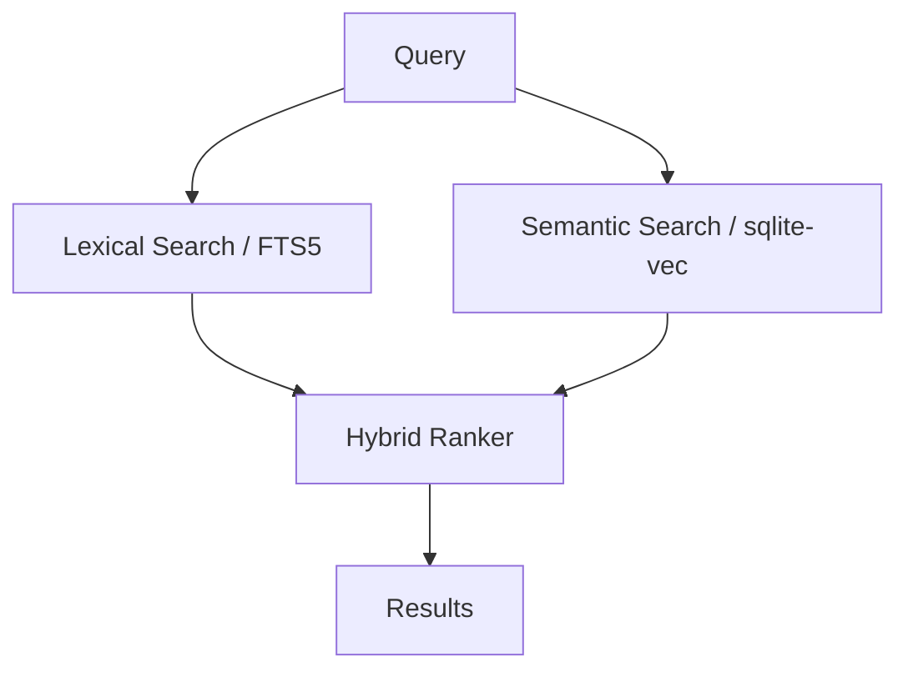

---

## Search не должен быть частью JobRepository

JobRepository отвечает за хранение и получение Jobs.

Search отвечает за информационный поиск.

Даже если оба используют SQLite, это разные обязанности.

---

# Embeddings architecture 🧬

Embeddings в будущем могут использоваться для:

- prompts;
- generated text;
- documents;
- image descriptions;
- multimodal search;
- semantic history search.

Но embeddings не должны быть обязательной зависимостью core.

Они подключаются как отдельный модуль.

---

# Text generation extension 📝

Text generation должна вписываться в существующую архитектуру без изменения базовых слоёв.

Поток:

```text
CLI
↓
TextGenerateUseCase
↓
TextGenerationRequest
↓
Provider adapter
↓
Text Artifact
↓
History / Cost / Usage
```

Разница только в специализированном request и результате.

---

## Длинные задания

Для длинных текстовых генераций архитектура должна позволять:

- polling;
- streaming;
- delayed result;
- large output artifact;
- input documents;
- structured JSON output.

Но v0.1 не обязана реализовывать эти возможности.

---

# Audio extension 🎙️

Audio subsystem может содержать отдельные use cases:

```text
TranscribeAudio
GenerateSpeech
```

Они используют общую Job architecture, но разные provider endpoints.

Именно поэтому provider layer должен иметь внутреннее разделение по capability.

---

# Video extension 🎬

Video потенциально использует:

- длительные async jobs;
- большие artifacts;
- callbacks;
- polling;
- upscale/extend operations.

Это не требует менять архитектурный фундамент.

---

# Dependency Injection 🔧

Для проекта не требуется тяжёлый DI-framework.

Достаточно обычной явной композиции объектов.

Например:

```text
main.py
  ↓
create_application()
  ↓
repositories
registry
providers
artifact storage
use cases
```

Это делает зависимости прозрачными.

---

## Composition Root

`main.py` или отдельный bootstrap module должен быть единственным местом, где соединяются конкретные реализации.

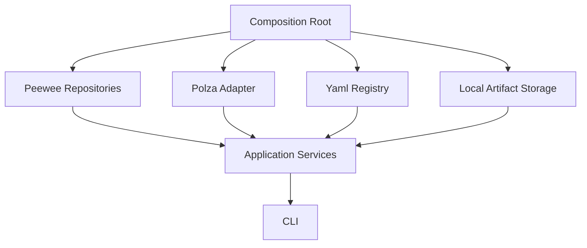

---

# Testing architecture 🧪

Архитектура должна позволять тестировать слои независимо.

## Domain tests

Без:

```text
network
SQLite
filesystem
```

## Application tests

С fake implementations:

```text
FakeProvider
FakeJobRepository
FakeRegistry
FakeArtifactStorage
```

## Provider tests

Через HTTP mock.

Например:

```text
respx
```

## Storage tests

На временной SQLite.

## CLI tests

Через:

```text
Typer CliRunner
```

---

## Основная тестовая пирамида

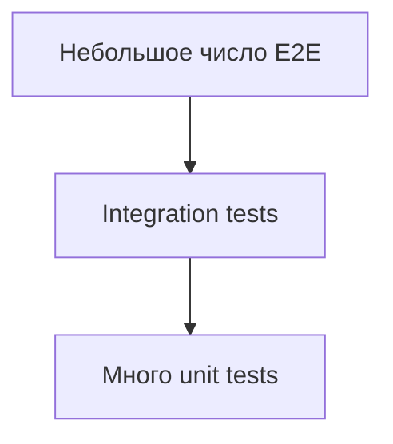

Основная бизнес-логика должна тестироваться без реального provider.

---

# Data flow: image generation 🖼️

```mermaid
flowchart LR
    INPUT[Prompt + Files]
    COMPILE[Prompt Compiler]
    MODEL[Model Validation]
    JOB[Create Job]
    PROVIDER[Provider Adapter]
    REMOTE[Remote API]
    RESULT[Remote Result]
    DOWNLOAD[Artifact Download]
    PROCESS[Optional Processing]
    STORE[Local Storage]
    HISTORY[(SQLite History)]

    INPUT --> COMPILE
    COMPILE --> MODEL
    MODEL --> JOB
    JOB --> HISTORY
    JOB --> PROVIDER
    PROVIDER --> REMOTE
    REMOTE --> RESULT
    RESULT --> DOWNLOAD
    DOWNLOAD --> PROCESS
    PROCESS --> STORE
    STORE --> HISTORY
```

---

# Data flow: batch generation 📦

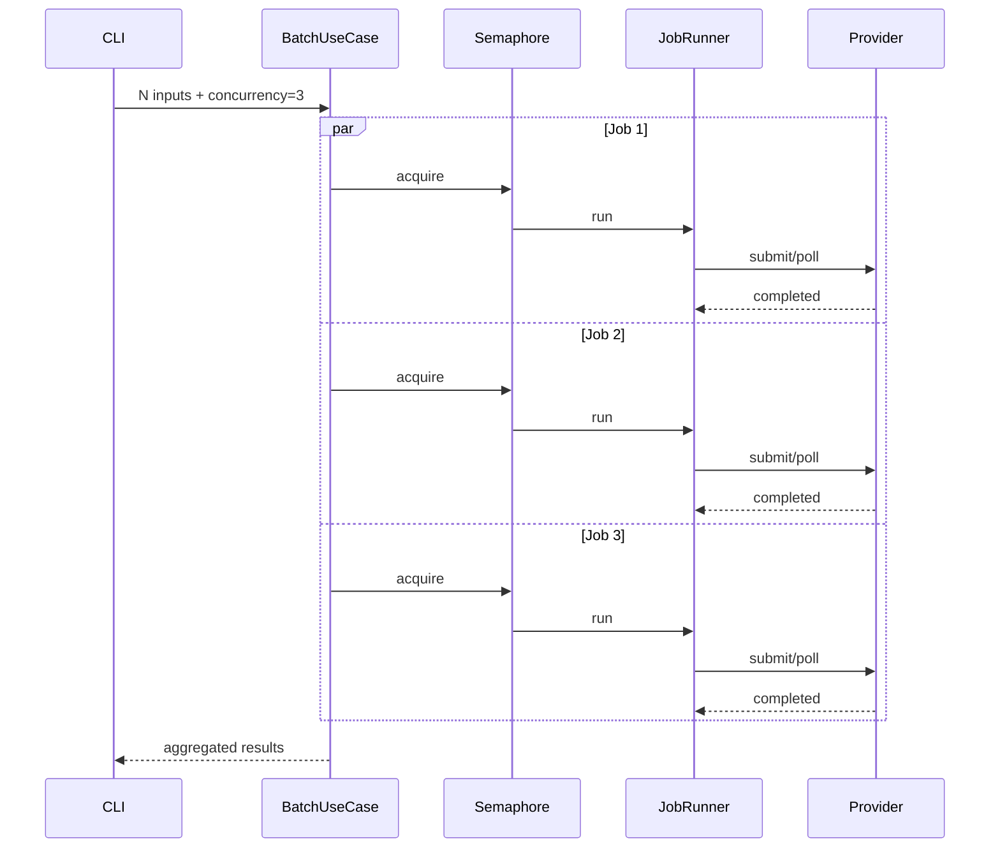

---

# Human mode и Agent mode 🤖

Архитектурно это два presentation mode одного CLI.

## Human mode

Использует:

- Rich;
- таблицы;
- progress;
- понятные сообщения.

## Agent mode

Использует:

- JSON;
- стабильные поля;
- deterministic output;
- отсутствие ANSI;
- отсутствие progress output.

Application layer при этом один и тот же.

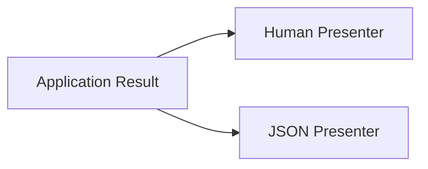

---

# Версионирование внутренних контрактов 🧷

На старте не нужен сложный API versioning.

Но стабильными должны считаться:

- CLI command names;
- JSON output schema;
- YAML model registry schema;
- DB migrations.

Изменения должны быть управляемыми.

---

# Архитектурные ограничения v0.1 📌

Первая версия должна соблюдать следующие ограничения:

### Один процесс

Приложение работает в одном локальном процессе.

### Один пользователь

Нет multi-user concurrency.

### Одна локальная БД

SQLite.

### Ограниченная параллельность

Порядка нескольких одновременных сетевых задач.

### Нет долгоживущего daemon

После завершения команды процесс завершается.

### Remote state хранится в provider

Для async generation локально хранится `remote_job_id`.

---

# Возможные будущие точки расширения 🔭

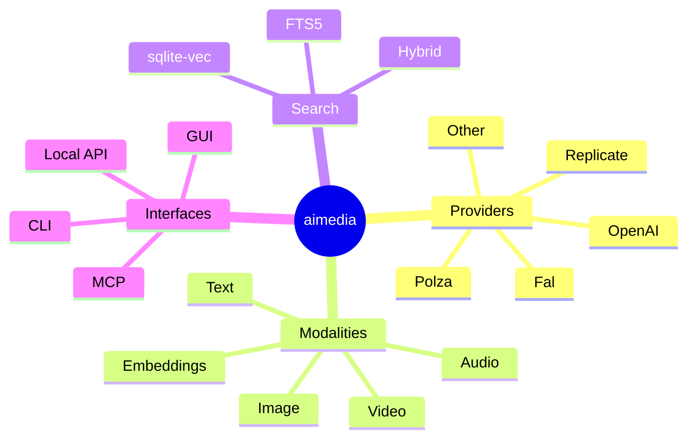

---

## MCP как потенциальный будущий интерфейс

Если потребуется, поверх Application Layer можно добавить MCP server.

Он не должен обращаться напрямую к storage/provider.

Правильная схема:

```text
MCP
 ↓
Application
 ↓
Domain + Infrastructure
```

Так же, как CLI.

---

## Local API как потенциальный будущий интерфейс

Аналогично можно добавить:

```text
FastAPI
```

или другой локальный API.

Но он является ещё одним adapter/presentation layer, а не новым core.

---

# Что архитектура сознательно не фиксирует 🕒

В этом документе не закрепляются окончательно:

- конкретные Python class names;
- поля Job;
- точные enum JobStatus;
- точный Provider protocol;
- schema YAML registry;
- SQLite table schema;
- формат migrations;
- exit codes;
- retry policy;
- exact polling intervals;
- exact CLI commands;
- exact file naming;
- specific model list;
- exact search ranking;
- embedding model selection.

Эти темы относятся к следующим документам.

---

# Архитектурные инварианты 🔒

Ниже — правила, которые должны сохраняться при развитии проекта.

> [!important]
> **1. CLI не обращается к provider напрямую.**

> [!important]
> **2. Domain не импортирует infrastructure.**

> [!important]
> **3. Provider-specific поля не должны становиться частью общего domain без реальной необходимости.**

> [!important]
> **4. Model Registry отвечает за capabilities, adapter — за API mapping.**

> [!important]
> **5. Binary artifacts хранятся как файлы, SQLite хранит metadata.**

> [!important]
> **6. Cost хранится как amount + currency без обязательной конвертации.**

> [!important]
> **7. Параллельность не должна автоматически превращаться в distributed queue.**

> [!important]
> **8. Новая modality должна добавляться новым request/use case/module, а не десятком optional-полей в старый request.**

> [!important]
> **9. Human mode и agent mode используют одно application core.**

> [!important]
> **10. Документация и model metadata являются частью runtime системы.**

---

# Архитектурная карта модулей 🗺️

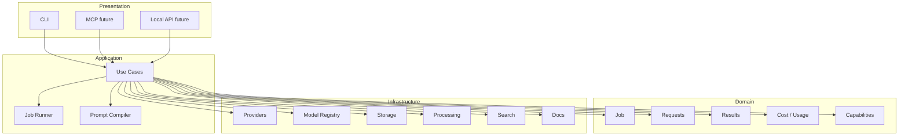

---

# Рекомендуемый стек 🧰

| Область | Технология |
|---|---|
| Runtime | Python 3.12+ |
| Package management | `uv` |
| CLI | `Typer` |
| Terminal UI | `Rich` |
| Validation | `Pydantic v2` |
| Settings | `pydantic-settings` |
| HTTP | `httpx` |
| Async | `asyncio` |
| Database | SQLite |
| ORM | Peewee |
| Migrations | Peewee / project migration layer |
| Image processing | Pillow |
| Model registry | YAML |
| User config | TOML |
| Paths | `platformdirs` |
| Lexical search | SQLite FTS5 |
| Vector search later | `sqlite-vec` |
| Tests | `pytest` |
| HTTP mocks | `respx` |

---

# Почему этот стек соответствует архитектуре 🧠

## Typer

Позволяет строить дерево CLI-команд без избыточного framework layer.

## Rich

Отвечает только за presentation.

## Pydantic

Подходит для request schemas, model registry validation и конфигурации.

## httpx

Даёт единый sync/async HTTP-клиент, что полезно для batch execution.

## Peewee

Достаточен для локальной SQLite и не создаёт лишнюю инфраструктурную нагрузку.

## SQLite

Соответствует локальному однопользовательскому приложению и позже допускает FTS5/sqlite-vec.

## YAML

Удобен для сложного Model Registry с capabilities и constraints.

## TOML

Удобен для пользовательских настроек.

---

# Критерии архитектурной готовности v0.1 ✅

Архитектура первой версии считается реализованной корректно, если выполняются следующие условия.

### Provider isolation

Замена Polza adapter на fake provider не требует изменения CLI/use case.

### Storage isolation

Application tests могут работать с fake repository.

### Registry isolation

Model capabilities можно загрузить независимо от provider.

### Agent mode

JSON presenter не зависит от Rich output.

### Batch

Несколько Jobs выполняются параллельно без broker.

### Recovery

Незавершённый remote Job может быть синхронизирован позже.

### Extensibility

Добавление нового image provider не требует изменения domain model.

### Modality extension

Добавление `audio.transcribe` возможно отдельным module/use case/request без изменения `ImageGenerationRequest`.

---

# Архитектурные анти-паттерны для этого проекта ☠️

## Provider logic внутри CLI

```python
@app.command()
def generate(...):
    response = httpx.post("https://...")
```

Запрещённый путь.

---

## Giant Service

```text
AIService
├── image
├── audio
├── text
├── embeddings
├── search
├── database
├── files
└── help
```

Такой сервис превращается в новый монолит внутри монолита.

---

## Giant Request

Один request с десятками optional-полей для всех modalities.

---

## YAML с программной логикой

Registry не должен превращаться в scripting language.

---

## ORM leakage

Peewee models не должны передаваться по всей системе как domain entities.

---

## Raw HTTP leakage

Application не должна зависеть от `httpx.Response`.

---

## Global singleton soup

Не следует создавать десятки глобальных объектов:

```text
db
provider
registry
config
client
```

к которым обращаются любые модули.

Лучше явная композиция зависимостей.

---

# Минимальная реализация архитектуры v0.1 🪶

Несмотря на все описанные границы, первая версия может быть достаточно компактной.

Реально необходимы:

```text
CLI
Application
Domain
Polza adapter
YAML registry
SQLite storage
Local file storage
Image processing
Docs/help
```

Не нужны заранее:

```text
audio/
text/
embeddings/
semantic search/
MCP/
FastAPI/
GUI/
```

если эти модули ещё не реализуются.

---

# Связь с остальной документацией 🔗

Этот документ задаёт архитектурный каркас.

Следующие документы уточняют его части.

```text
01-product-scope.md
    Что строим

02-system-architecture.md
    Как система разделена на части

03-domain-model.md
    Какие сущности и контракты существуют

04-cli-contract.md
    Как выглядит внешний CLI API

05-provider-system.md
    Как устроены provider adapters

06-model-registry.md
    Как описываются модели и capabilities

07-storage-history-costs.md
    Как хранятся Jobs, artifacts, usage и cost

08-job-execution.md
    Как выполняются async/batch/retry/sync задачи

09-documentation-help.md
    Как устроена встроенная документация
```

---

# Итоговая архитектура 🧩

> [!success]
> Система строится как локальный модульный монолит на Python.
>
> CLI является presentation layer, application layer координирует use cases, domain layer содержит независимые бизнес-понятия, а внешние API, SQLite, файловая система, Model Registry, processing и search подключаются как infrastructure adapters.
>
> Центральной единицей выполнения является Job, но каждый тип AI-задачи имеет собственный специализированный request.
>
> Provider-specific детали изолированы в adapters, capabilities моделей находятся в декларативном registry, binary artifacts хранятся локально, история — в SQLite.
>
> Параллельность реализуется обычным `asyncio` с ограничением concurrency и не требует отдельной distributed queue.
>
> Такая архитектура позволяет начать с image generation и позднее добавить audio, text generation, embeddings, sqlite-vec, video, MCP или локальный API без перестройки фундаментального ядра.
