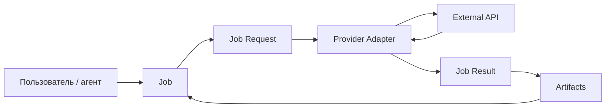
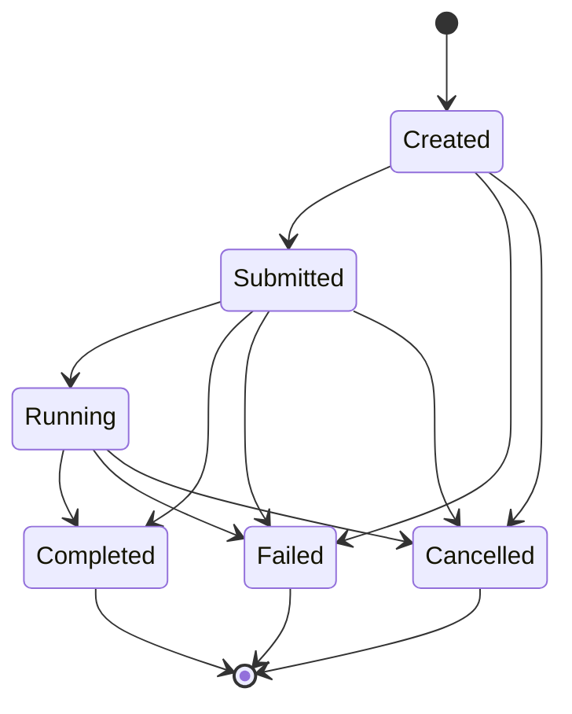
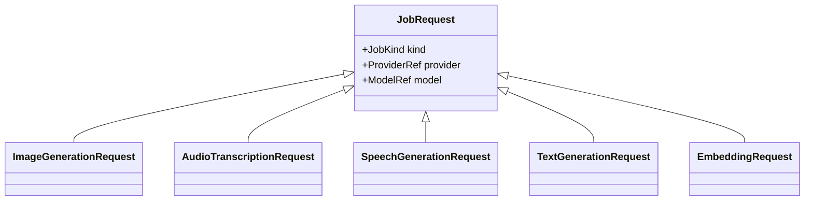
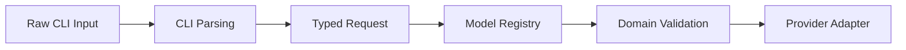
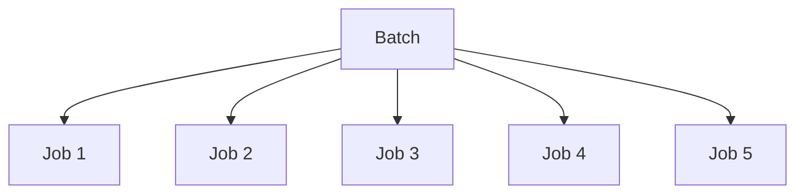
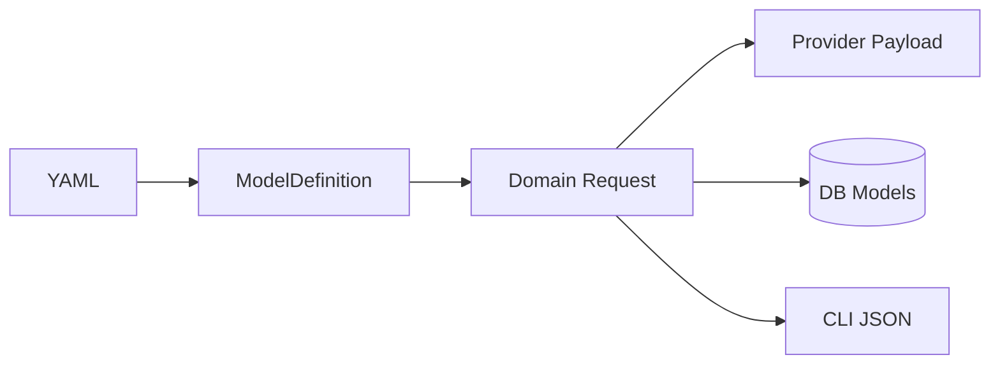
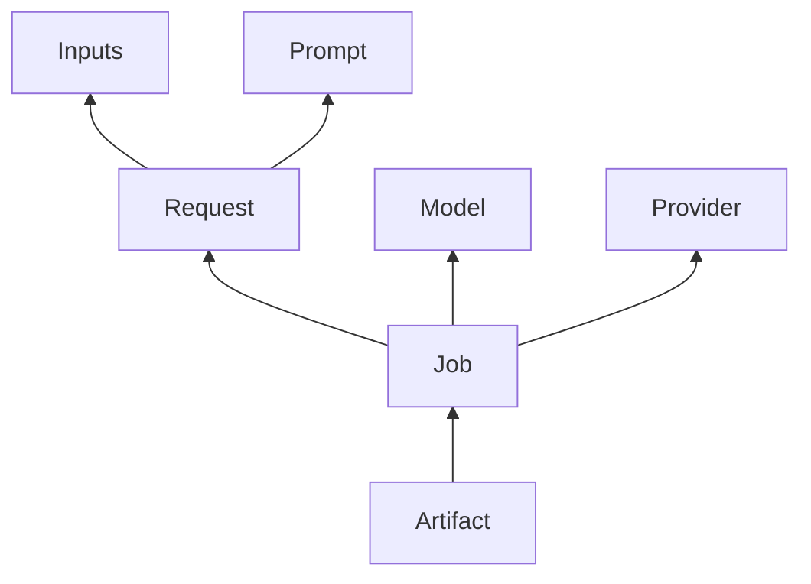
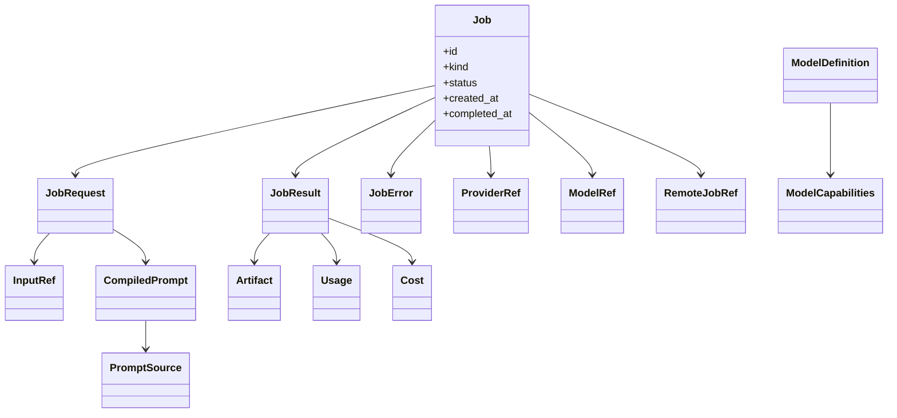

# 03. Domain Model — доменная модель AI CLI-платформы

> [!abstract] Назначение документа
> Этот документ фиксирует **доменную модель проекта**: основные сущности, value objects, типы запросов, результаты, состояния, инварианты и границы ответственности между доменом и инфраструктурой.
>
> Документ отвечает на вопрос **«какими понятиями мыслит система»**.
>
> Он не описывает конкретную SQL-схему, Peewee-модели, HTTP payload конкретного провайдера или точный синтаксис CLI. Эти детали относятся к последующим документам.

---

## Статус документа 🧭

| Поле | Значение |
|---|---|
| Номер | `03` |
| Название | `Domain Model` |
| Статус | Draft / Foundation |
| Область | Доменная модель и внутренние контракты |
| Основная версия | `v0.1` |
| Главная доменная сущность | `Job` |
| Основной тип задачи v0.1 | `image.generate` |
| Будущие типы | Audio, Text, Embeddings, Video |
| Архитектурный стиль | Modular Monolith + Ports & Adapters |

---

## Главная идея домена 🧠

Система не должна мыслить категориями конкретного API.

Для домена не существует:

```text
POST /v1/media
GET /v1/media/{id}
Polza response
OpenAI response
httpx.Response
```

Вместо этого существуют понятия:

```text
Job
Request
Result
Artifact
Input
Prompt
Provider
Model
Usage
Cost
Error
```

Внешний API является лишь одним из способов выполнить доменное задание.



---

# Глоссарий 📚

Перед описанием классов фиксируются термины проекта.

| Термин | Значение |
|---|---|
| `Job` | Конкретный запуск AI-задачи |
| `JobKind` | Тип задачи: `image.generate`, `audio.transcribe` и т. д. |
| `JobRequest` | Нормализованный запрос на выполнение задачи |
| `JobResult` | Нормализованный результат выполнения |
| `Input` | Внешний входной ресурс задания |
| `PromptSource` | Источник текстовой инструкции |
| `CompiledPrompt` | Финальный текст, отправленный модели |
| `Artifact` | Полученный и сохранённый результат |
| `Provider` | Внешний поставщик модели/API |
| `ModelDefinition` | Описание модели в локальном Model Registry |
| `ModelCapabilities` | Возможности и ограничения модели |
| `Usage` | Данные об использованных ресурсах |
| `Cost` | Фактическая стоимость задания |
| `RemoteJobRef` | Ссылка на асинхронное задание provider |
| `JobError` | Нормализованная информация об ошибке |

---

# Центральный агрегат: Job ⚙️

`Job` — центральная сущность проекта.

Он представляет один логический запуск одной AI-задачи.

Примеры:

```text
сгенерировать изображение
транскрибировать аудио
озвучить текст
сгенерировать большой Markdown-документ
создать embeddings
```

Каждая такая операция создаёт отдельный Job.

---

## Концептуальная структура Job

```text
Job
├── id
├── kind
├── status
│
├── provider
├── model
│
├── request
├── result
│
├── inputs[]
├── prompt_sources[]
├── compiled_prompt
├── artifacts[]
│
├── usage
├── cost
├── remote_ref
│
├── created_at
├── submitted_at
├── started_at
├── completed_at
│
└── error
```

Не каждое поле обязательно существует у каждого Job.

Например:

- `audio.transcribe` может не иметь `compiled_prompt`;
- `embedding.create` может не иметь файлового `Artifact`;
- синхронная модель может не иметь `remote_ref`.

---

## Идентификатор Job

Внутренний `Job.id` должен быть независим от provider.

Provider может вернуть собственный идентификатор:

```text
aig_abc123
task_129391
generation_xyz
```

Он сохраняется отдельно как `RemoteJobRef`.

То есть:

```text
Job.id
→ локальный ID системы

RemoteJobRef.remote_job_id
→ ID удалённого задания provider
```

Эти идентификаторы нельзя смешивать.

---

# JobKind 🧩

Тип задания должен быть отдельным доменным значением.

Рекомендуемая форма:

```python
class JobKind(StrEnum):
    IMAGE_GENERATE = "image.generate"
    IMAGE_EDIT = "image.edit"

    AUDIO_TRANSCRIBE = "audio.transcribe"
    AUDIO_SPEECH = "audio.speech"

    TEXT_GENERATE = "text.generate"

    EMBEDDING_CREATE = "embedding.create"

    VIDEO_GENERATE = "video.generate"
```

В v0.1 реально реализованным может быть только:

```text
image.generate
```

и, при необходимости:

```text
image.edit
```

Остальные значения вводятся по мере появления функциональности.

> [!important]
> Не следует добавлять enum-значения просто «на будущее», если они нигде не используются. Документ фиксирует архитектурное направление, а не требует заранее реализовывать весь список.

---

# JobStatus 🔄

Статус описывает состояние локального Job.

Рекомендуемая минимальная модель:

```python
class JobStatus(StrEnum):
    CREATED = "created"
    SUBMITTED = "submitted"
    RUNNING = "running"
    COMPLETED = "completed"
    FAILED = "failed"
    CANCELLED = "cancelled"
```

---

## Семантика состояний

### `created`

Job создан локально, но запрос ещё не подтверждён provider.

### `submitted`

Provider принял запрос.

Для асинхронного API обычно уже существует `remote_job_id`.

### `running`

Удалённый provider сообщает, что задача выполняется.

### `completed`

Задание успешно завершено.

Для задач, создающих файлы, все обязательные artifacts должны быть уже сохранены локально.

### `failed`

Задание завершилось ошибкой.

### `cancelled`

Задание было отменено локально или удалённо, если provider поддерживает отмену.

---

## Допустимые переходы



---

## Инварианты статусов

Некоторые правила должны считаться доменными инвариантами.

> [!important]
> `completed` означает завершённое задание, а не просто успешный HTTP-response.

Для file-producing задач Job не должен считаться полностью завершённым, если remote generation уже готова, но обязательный локальный artifact не сохранён.

То есть:

```text
remote completed
+
download failed
=
local Job failed или требует recovery
```

Точная стратегия recovery будет определена в `08-job-execution.md`.

---

# JobRequest 📨

Общая ошибка архитектуры — создать один универсальный request с десятками nullable-полей.

Этого делать не следует.

Плохой вариант:

```python
class GenerationRequest:
    prompt: str | None
    images: list | None
    voice: str | None
    temperature: float | None
    seed: int | None
    resolution: str | None
    dimensions: int | None
    duration: int | None
    language: str | None
    ...
```

Через несколько модулей такой request превращается в невалидируемый мешок параметров.

---

## Правильная модель запросов

Каждый тип задачи имеет собственный request.



При этом наследование в Python не является обязательным.

Главная идея — отдельные модели данных с общей семантикой.

---

# ImageGenerationRequest 🖼️

Для v0.1 это основной request type.

Концептуально:

```python
class ImageGenerationRequest(BaseModel):
    provider: ProviderRef
    model: ModelRef

    prompt: CompiledPrompt

    images: list[ImageInput] = []

    aspect_ratio: str | None = None
    resolution: str | None = None
    quality: str | None = None
    output_format: str | None = None

    seed: int | None = None
    max_images: int = 1

    provider_options: dict[str, Any] = {}
```

---

## Почему `provider_options` допустим

У разных providers и моделей могут существовать специфические параметры.

Не следует каждый раз расширять общий domain request полем, которое нужно одной модели.

Поэтому допустим ограниченный escape hatch:

```text
provider_options
```

Но он не должен становиться основным способом работы.

Общие параметры, которые имеют устойчивую доменную семантику, должны иметь нормальные поля.

---

## ImageInput

Изображение-референс представляется отдельным input object.

```python
class ImageInput(BaseModel):
    path: Path
    mime_type: str | None = None
    sha256: str | None = None
```

Для домена предпочтительно работать с локальными ресурсами.

Преобразование:

```text
Path → base64
Path → provider upload
Path → URL
```

является обязанностью infrastructure/provider adapter.

---

# Prompt domain 📝

Prompt должен быть полноценным понятием домена, а не просто случайной строкой из CLI.

---

## PromptSource

`PromptSource` описывает источник текста.

Возможные типы:

```python
class PromptSourceKind(StrEnum):
    INLINE = "inline"
    FILE = "file"
```

Концептуально:

```python
class PromptSource(BaseModel):
    kind: PromptSourceKind
    text: str
    position: int
    path: Path | None = None
```

---

## Почему сохраняется сам текст

Если источник:

```text
prompts/character.md
```

позже изменится, история должна всё равно показывать, какой текст реально использовался в старом Job.

Поэтому недостаточно хранить только путь.

Нужно сохранять:

```text
source path
+
original text snapshot
```

---

## CompiledPrompt

После объединения нескольких источников получается:

```text
CompiledPrompt
```

Он содержит **точный текст, отправленный модели**.

Концептуально:

```python
class CompiledPrompt(BaseModel):
    text: str
    source_count: int
```

Позже сюда можно добавить:

```text
length_chars
hash
```

---

## Инвариант prompt history

> [!important]
> История должна хранить финальный compiled prompt независимо от того, пришёл он из одного файла, пяти файлов или CLI-строки.

Это обеспечивает воспроизводимость.

---

# Input 📥

`Input` — более общее понятие, чем reference image.

Input может быть:

```text
image
audio
video
text file
document
```

Концептуальный тип:

```python
class InputKind(StrEnum):
    IMAGE = "image"
    AUDIO = "audio"
    VIDEO = "video"
    TEXT_FILE = "text_file"
    DOCUMENT = "document"
```

---

## InputRef

```python
class InputRef(BaseModel):
    kind: InputKind
    path: Path

    mime_type: str | None = None
    size_bytes: int | None = None
    sha256: str | None = None

    managed_path: Path | None = None   # CN-01, планируется

    metadata: dict[str, Any] = {}
```

> [!note] Managed-копия входа (`CN-01`, планируется)
> `path` остаётся provenance исходного файла и не подменяется. Необязательный
> `managed_path` — **относительный** путь управляемой копии внутри managed-дерева
> app data (`inputs/<job_id>/<position>.<ext>`); его отсутствие означает
> legacy-запись без копии, а не ошибку. Домен остаётся IO-free: файловые операции
> и чтение байтов выполняет application-слой, байты не попадают ни в домен, ни в
> SQLite. Копия входа **не является** `Artifact` результата.
> Контракт и порядок до платного POST — `07-storage-history-costs.md`, раздел
> «Managed-копии reference images»; объём — `release-scope.md`, `CN-01`.
> **Не реализовано**: на HEAD `dfbb930` поля нет.

`metadata` может содержать:

```text
width
height
duration
codec
page_count
```

в зависимости от типа ресурса.

---

# Artifact 📦

`Artifact` — результат задания, сохранённый системой.

Это может быть:

```text
image
audio
video
markdown
text
json
subtitle
other file
```

---

## ArtifactKind

```python
class ArtifactKind(StrEnum):
    IMAGE = "image"
    AUDIO = "audio"
    VIDEO = "video"
    TEXT = "text"
    MARKDOWN = "markdown"
    JSON = "json"
    SUBTITLE = "subtitle"
    OTHER = "other"
```

---

## Artifact model

```python
class Artifact(BaseModel):
    kind: ArtifactKind

    local_path: Path | None = None
    remote_url: str | None = None

    mime_type: str | None = None
    size_bytes: int | None = None
    sha256: str | None = None

    metadata: dict[str, Any] = {}
```

---

## Локальный artifact важнее remote URL

Для проекта remote URL является временной ссылкой на источник результата.

Постоянным результатом считается локально сохранённый artifact.

Поэтому:

```text
remote_url
→ provenance / retrieval reference

local_path
→ основной рабочий результат
```

> [!note] Artifact — это результат, а не вход
> Managed-копия входного reference image (`CN-01`, планируется) не становится
> `Artifact`: она не входит в `JobResult`, не участвует в выборе `--out` и не
> выдаётся как output. Своё место входа — `InputRef.managed_path`.

---

## Несколько artifacts

Один Job может вернуть несколько результатов.

Например:

```text
max_images = 4
```

может породить:

```text
artifact_1.webp
artifact_2.webp
artifact_3.webp
artifact_4.webp
```

Поэтому связь:

```text
Job 1 → N Artifacts
```

должна считаться нормальной.

---

# JobResult ✅

`JobResult` — нормализованное представление успешного результата.

Концептуально:

```python
class JobResult(BaseModel):
    artifacts: list[Artifact] = []

    content: str | None = None

    usage: Usage | None = None
    cost: Cost | None = None

    metadata: dict[str, Any] = {}
```

---

## `content`

Некоторые модели могут вернуть текст вместо файла или вместе с файлом.

Поэтому `JobResult` может содержать:

```text
content
```

Например:

- текстовая генерация;
- description;
- warning;
- transcript.

Но если текст является конечным пользовательским результатом и должен сохраняться как файл, application layer может дополнительно создать `ArtifactKind.TEXT` или `ArtifactKind.MARKDOWN`.

---

# ProviderRef 🌐

Provider должен быть доменным идентификатором, а не объектом HTTP-клиента.

```python
class ProviderRef(BaseModel):
    id: str
```

Примеры:

```text
polza
openai
fal
replicate
```

---

## ProviderRef не содержит secrets

В нём не должно быть:

```text
API key
Authorization header
base URL credentials
```

Secrets относятся к configuration/infrastructure layer.

---

# ModelRef 🧬

`ModelRef` — ссылка на логическую модель внутри системы.

```python
class ModelRef(BaseModel):
    id: str
```

Например:

```text
seedream-5-pro
qwen-image-2.1
gpt-image-2.5
```

Это может отличаться от provider-specific remote model ID.

---

## Логический и удалённый ID

```text
ModelRef.id
    ↓
Model Registry
    ↓
provider mapping
    ↓
remote model id
```

Пример:

```text
logical:
gpt-image-2.5

provider:
polza

remote:
openai/...
```

Domain не обязан знать remote ID.

---

# ModelDefinition 📚

`ModelDefinition` описывает модель, загруженную из registry.

Концептуально:

```python
class ModelDefinition(BaseModel):
    id: str
    name: str
    family: ModelFamily

    capabilities: ModelCapabilities
    parameters: dict[str, ParameterDefinition]

    providers: dict[str, ProviderModelBinding]

    aliases: list[str] = []
```

---

# ModelFamily 🧩

```python
class ModelFamily(StrEnum):
    IMAGE = "image"
    AUDIO = "audio"
    TEXT = "text"
    EMBEDDING = "embedding"
    VIDEO = "video"
```

Семейство описывает основную modality.

---

# ModelCapabilities 🧠

Capabilities должны описывать именно возможности модели.

Для image-модели:

```python
class ImageCapabilities(BaseModel):
    text_to_image: bool
    image_to_image: bool
    multi_reference: bool

    max_reference_images: int | None = None
```

Для других модальностей будут свои capability structures.

---

## Почему capabilities не должны быть просто `dict[str, bool]`

На раннем этапе это выглядит удобно:

```yaml
capabilities:
  image_to_image: true
  multi_reference: true
```

Но со временем появляются численные ограничения:

```text
max_reference_images
max_prompt_length
supported_formats
supports_streaming
```

Поэтому доменная модель должна допускать структурированные capabilities.

---

# ParameterDefinition 🎚️

Параметры модели должны описываться декларативно.

Концептуально:

```python
class ParameterDefinition(BaseModel):
    name: str
    type: ParameterType

    required: bool = False
    default: Any | None = None

    allowed_values: list[Any] | None = None

    min_value: float | None = None
    max_value: float | None = None

    description: str | None = None
```

---

## ParameterType

```python
class ParameterType(StrEnum):
    STRING = "string"
    INTEGER = "integer"
    NUMBER = "number"
    BOOLEAN = "boolean"
    ENUM = "enum"
```

---

## Пример

```yaml
resolution:
  type: enum
  values:
    - 1K
    - 2K
    - 4K
```

или:

```yaml
seed:
  type: integer
  min: 0
  max: 2147483647
```

---

# ProviderModelBinding 🔗

Одна логическая модель может иметь разные настройки у разных providers.

```python
class ProviderModelBinding(BaseModel):
    provider_id: str
    remote_model_id: str

    options: dict[str, Any] = {}
```

Здесь допускаются provider-specific metadata, но не бизнес-логика.

Каноническое имя фактического model ID — `remote_model_id`; оно едино для
`03`/`05`/`06`/`07` (см. baseline E00). Локальный `model_id` — canonical ID
логической модели, `remote_model_id` — то, что реально ушло provider.

---

# Cost 💰

Стоимость — отдельный value object.

```python
class Cost(BaseModel):
    amount: Decimal
    currency: str
```

Примеры:

```text
4.00 RUB
0.08 USD
```

---

## Инварианты Cost

### Валюта обязательна, если сумма известна

Недопустимо:

```text
amount = 4
currency = null
```

Если provider вернул число без валюты, adapter должен знать, в какой валюте работает этот provider, либо оставить Cost неизвестным.

### Конвертация не выполняется

```text
RUB остаётся RUB
USD остаётся USD
```

Domain не занимается FX.

### Cost может отсутствовать

Не все providers обязаны сообщать стоимость.

```python
cost: Cost | None
```

является нормальным состоянием.

---

# Usage 📊

Usage отличается от Cost.

`Cost` отвечает:

> сколько стоило?

`Usage` отвечает:

> какие ресурсы были использованы?

---

## Нормализованные поля

Некоторые usage-поля имеют универсальный смысл:

```python
class Usage(BaseModel):
    input_tokens: int | None = None
    output_tokens: int | None = None
    total_tokens: int | None = None

    input_units: float | None = None
    output_units: float | None = None

    duration_seconds: float | None = None
    characters: int | None = None

    raw: dict[str, Any] = {}
```

---

## Почему сохраняется `raw`

Provider может вернуть показатели, которых ещё нет в доменной модели.

Вместо потери информации они сохраняются:

```text
usage.raw
```

Позже часто используемое поле может быть поднято в нормализованную структуру.

---

# RemoteJobRef ⏳

Для асинхронного provider Job получает ссылку на удалённую задачу.

```python
class RemoteJobRef(BaseModel):
    provider_id: str
    remote_job_id: str
    operation: str | None = None
```

> [!important]
> Каноническое имя поля remote job — `remote_job_id` (не `remote_id`),
> согласовано с `05` и `07` и зафиксировано в baseline E00
> [`decisions/implementation-baseline.md`](decisions/implementation-baseline.md).
> `operation` хранит тип удалённой операции (для image — `media`); endpoint по
> строке ID не угадывается.

Позже возможно добавить:

```text
remote_status
submitted_at
last_polled_at
```

Но точная структура будет зафиксирована в документе выполнения Jobs.

---

# JobError 🧯

Ошибка должна быть нормализована.

```python
class JobError(BaseModel):
    code: str
    message: str

    provider_code: str | None = None
    provider_message: str | None = None

    retryable: bool | None = None

    details: dict[str, Any] = {}
```

---

## Почему `provider_message` отдельно

Пользовательское сообщение:

```text
Недостаточно средств у provider.
```

не обязано совпадать с сырой ошибкой:

```text
INSUFFICIENT_BALANCE
```

Domain должен позволять сохранить обе формы.

---

# Ошибки домена ⚠️

Доменные ошибки не должны быть HTTP-ошибками.

Примеры:

```text
UnknownModel
UnsupportedParameter
InvalidParameterValue
InvalidJobState
UnsupportedCapability
PromptRequired
TooManyReferenceImages
```

---

## Пример

Если модель допускает:

```text
resolution:
1K
2K
```

а request содержит:

```text
4K
```

это:

```text
InvalidParameterValue
```

или специализированная domain validation error.

Это ошибка до обращения к provider.

---

# Validation pipeline ✅

Перед отправкой request проходит несколько уровней проверки.



---

## CLI validation

Проверяет синтаксис:

```text
путь существует
число разбирается
обязательная опция передана
```

## Domain validation

Проверяет смысл:

```text
модель поддерживает 4K?
можно ли передать 5 reference images?
поддерживается ли image-to-image?
```

## Provider validation

Может выполнить финальную проверку provider-specific ограничений.

---

# Инварианты ImageGenerationRequest 🖼️

Для первой версии полезно зафиксировать несколько правил.

### Prompt обязателен

Пустой финальный prompt не допускается, если модель явно не поддерживает другой режим.

### Reference images валидируются по модели

Если:

```text
max_reference_images = 3
```

передача четырёх изображений должна завершиться локальной ошибкой.

### `max_images` валидируется

Если модель поддерживает максимум 4 outputs, значение 6 должно быть отклонено до запроса.

### Формат должен быть допустимым

Если provider/model поддерживает только:

```text
png
jpeg
```

запрос `webp` может быть:

- преобразован локально после получения;
- либо отклонён в зависимости от уровня параметра.

Это различие должно быть явно отражено в model registry.

---

# Provider output vs Final output 🖼️

Важно разделить два понятия:

```text
provider output format
```

и:

```text
final local output format
```

Например пользователь просит:

```text
webp
```

provider возвращает:

```text
png
```

Processing layer может преобразовать:

```text
png → webp
```

Поэтому domain может понадобиться различать:

```text
requested_output_format
provider_output_format
final_artifact_format
```

В v0.1 это можно реализовать проще, но семантическое различие должно быть сохранено.

---

# Job и Batch 📦

Batch не является отдельным типом Job.

```text
Batch
→ набор независимых Jobs
```

Это принципиально.

Если пользователь запускает пять prompts:

```text
prompt1.md
prompt2.md
prompt3.md
prompt4.md
prompt5.md
```

создаются пять Jobs.



---

## Почему batch не Job

У каждого задания могут быть:

- свой remote ID;
- своя стоимость;
- своя ошибка;
- свой artifact;
- своё время завершения.

Поэтому batch является orchestration concept application layer, а не основной доменной сущностью.

---

# Retry ♻️

Retry не должен изменять старый Job.

Правильнее:

```text
Job 481
failed
```

и затем:

```text
Job 512
retry_of = 481
```

Это сохраняет историю.

---

## Почему не переиспользовать Job

Если изменить старый Job:

- теряется исходное состояние;
- смешивается история стоимости;
- невозможно понять, сколько попыток было;
- усложняется аудит.

---

# Parent / relation между Jobs 🔗

Для будущих сценариев полезно предусмотреть связь:

```text
parent_job_id
relation_type
```

Например:

```text
retry_of
variation_of
upscale_of
extend_of
derived_from
```

Не обязательно реализовывать все типы в v0.1.

---

# Timestamp model 🕒

Job должен иметь несколько временных отметок.

Минимально:

```text
created_at
submitted_at
started_at
completed_at
```

---

## Разница времён

### `created_at`

Локальный Job появился.

### `submitted_at`

Запрос успешно принят provider.

### `started_at`

Provider сообщил реальное начало работы, если это известно.

### `completed_at`

Локальный Job достиг terminal state.

---

# Terminal states 🏁

Terminal states:

```text
completed
failed
cancelled
```

После terminal state обычный Job не должен возвращаться в `running`.

Retry создаёт новый Job.

> [!important]
> Единственное исключение из инварианта: `failed → completed` разрешён только при
> recovery того же самого remote execution (без новой генерации), когда ранее
> провалившаяся локальная финализация позже завершилась успешно. Прежняя ошибка
> сохраняется в записи recovery. Уточнено в baseline E00
> [`decisions/implementation-baseline.md`](decisions/implementation-baseline.md).

---

# JobResult после failure ❌

У failed Job может существовать частичный result.

Например:

- provider создал один artifact из четырёх;
- скачивание одного результата удалось, второго — нет;
- usage успел прийти;
- cost известен.

Domain не должен требовать полного уничтожения этой информации.

Поэтому failed Job может иметь:

```text
partial artifacts
usage
cost
error
```

---

# Raw request и raw response 🧾

Для диагностики полезно сохранять нормализованные данные и, при необходимости, сырой provider exchange.

Но raw data не являются основной доменной моделью.

Концептуально:

```text
Job.request
→ доменный request

provider_request_json
→ diagnostic infrastructure metadata

provider_response_json
→ diagnostic infrastructure metadata
```

---

## Почему нельзя использовать raw JSON как домен

Если приложение хранит только:

```json
{
  "model": "...",
  "input": {...}
}
```

то вся логика начинает зависеть от API первого provider.

Это разрушает provider-neutral architecture.

---

# Serialization boundary 🧱

Domain objects не обязаны совпадать один-в-один с:

- Peewee models;
- YAML structures;
- JSON CLI output;
- HTTP payload.

Между ними должны существовать mapper/serializer layers.



---

# ORM не является доменом 🗄️

Peewee class:

```python
class JobModel(Model):
    ...
```

не должен автоматически считаться `Job`.

Рекомендуется разделять:

```text
domain.Job
storage.models.JobRecord
```

или аналогично.

Это позволяет:

- тестировать domain без SQLite;
- менять storage;
- не протаскивать ORM lazy loading;
- избежать инфраструктурных зависимостей.

---

# DTO и Domain Model 📦

Не каждый объект обязан быть богатой domain entity.

Проект может использовать простые Pydantic-модели как immutable/validated data structures.

Разделение должно быть смысловым:

```text
Domain Model
→ смысл и инварианты

DTO
→ транспорт данных между слоями
```

На старте часть структур может совпадать технически, но архитектурно эти роли следует различать.

---

# Будущий AudioTranscriptionRequest 🎙️

Концептуально:

```python
class AudioTranscriptionRequest(BaseModel):
    provider: ProviderRef
    model: ModelRef

    audio: InputRef

    language: str | None = None
    response_format: str | None = None
    prompt: str | None = None

    diarization: bool = False
```

Точные поля определяются при реализации audio module.

---

# Будущий SpeechGenerationRequest 🔊

```python
class SpeechGenerationRequest(BaseModel):
    provider: ProviderRef
    model: ModelRef

    text: str
    voice: str

    output_format: str | None = None
    speed: float | None = None

    instructions: str | None = None
```

---

# Будущий TextGenerationRequest 📝

```python
class TextGenerationRequest(BaseModel):
    provider: ProviderRef
    model: ModelRef

    prompt: CompiledPrompt

    inputs: list[InputRef] = []

    temperature: float | None = None
    max_output_tokens: int | None = None

    output_format: str = "markdown"
```

В будущем могут появиться:

```text
reasoning
structured output
tools
streaming
```

Но только при реальной необходимости.

---

# Будущий EmbeddingRequest 🧬

```python
class EmbeddingRequest(BaseModel):
    provider: ProviderRef
    model: ModelRef

    inputs: list[str | InputRef]

    dimensions: int | None = None
```

Embedding result не обязательно является обычным файловым Artifact.

Он может сохраняться в специализированном vector storage.

---

# Search domain 🔎

Search не является частью Job aggregate.

Это отдельная доменная область.

Концептуальные сущности:

```text
SearchQuery
SearchResult
SearchMode
IndexedDocument
Chunk
EmbeddingRef
```

Search может использовать Job data как источник, но не должен становиться обязанностью самого Job.

---

# Model Registry и Domain Model 📚

Registry загружает внешние YAML-файлы, но наружу должен отдавать нормализованные domain structures:

```text
ModelDefinition
ModelCapabilities
ParameterDefinition
ProviderModelBinding
```

Application не должна работать с сырым YAML dict.

---

# Alias моделей 🏷️

Registry может поддерживать aliases.

Например:

```text
gpt-image
gpt-image-latest
gpt-image-2.5
```

Alias разрешается в канонический `ModelRef`.

История Job должна хранить канонический ID.

Дополнительно можно сохранить исходный alias, который использовал пользователь, если это полезно для аудита.

---

# Model versioning 🔢

Если provider меняет модель под тем же alias, система должна по возможности сохранять фактический remote model ID, использованный в Job.

Поэтому полезно различать:

```text
requested_model_id
resolved_model_id
provider_remote_model_id
```

Не все три значения обязательны в первой версии, но их смысл должен быть понятен.

---

# Immutable history 🧾

История завершённого Job должна рассматриваться как практически неизменяемая.

Допустимые изменения после завершения:

- добавить локальный artifact, если выполняется recovery;
- добавить вычисленный hash;
- добавить search index;
- добавить derived metadata.

Не следует менять:

- исходный prompt;
- модель;
- provider;
- исходные параметры;
- cost;
- usage.

---

# Derived metadata 🧮

Некоторые данные можно вычислить локально после завершения.

Например для изображения:

```text
width
height
format
file size
sha256
```

Эти данные являются derived metadata.

Они не должны смешиваться с параметрами provider.

---

# Provenance 🧬

Для каждого результата желательно сохранять происхождение.

```text
Artifact
↓
Job
↓
Request
↓
Inputs + Prompt
↓
Provider + Model
```

Это позволяет ответить:

> Откуда взялся этот файл?



---

# Identity и equality 🪪

Не все доменные объекты сравниваются одинаково.

## Entities

Имеют идентичность:

```text
Job
Artifact
Input record
```

## Value Objects

Сравниваются по значению:

```text
Cost
ModelRef
ProviderRef
CompiledPrompt
```

---

# Nullability rules 🕳️

Nullable-поля должны появляться из реальной семантики, а не потому что «так проще».

Нормально:

```text
Job.cost = None
```

если provider не сообщил цену.

Нормально:

```text
remote_ref = None
```

для синхронного provider.

Плохо:

```text
model = None
```

для Job, который без модели не может существовать.

---

# Job creation invariants 🔒

Job нельзя создать без:

```text
kind
provider
model
request
created_at
status = created
```

Для image generation также должен существовать валидный compiled prompt.

---

# Completion invariants 🔐

Job `completed` должен иметь:

- отсутствие terminal error;
- финальный result;
- завершённую фиксацию usage/cost, если provider их предоставил;
- сохранённые обязательные artifacts для file-producing задач;
- `completed_at`.

---

# Failure invariants 💥

Job `failed` должен иметь:

```text
error
completed_at
```

Дополнительно может иметь:

```text
remote_ref
usage
cost
partial artifacts
```

---

# Domain services 🛠️

Не вся логика должна жить внутри entity.

Некоторые операции естественно оформить как domain/application services.

Примеры:

```text
ModelRequestValidator
PromptCompiler
JobStateMachine
CostNormalizer
```

---

## PromptCompiler

Получает:

```text
PromptSource[]
```

и возвращает:

```text
CompiledPrompt
```

Он не знает CLI.

---

## ModelRequestValidator

Получает:

```text
ModelDefinition
+
JobRequest
```

и возвращает:

```text
valid
```

или domain validation error.

---

# Domain events — нужны ли они? 📣

Для v0.1 полноценная event-driven architecture не нужна.

Не требуется вводить:

```text
Event Bus
Message Broker
Domain Event Dispatcher
```

Но полезно мыслить событиями:

```text
JobCreated
JobSubmitted
JobCompleted
ArtifactSaved
JobFailed
```

На старте они могут существовать только как логируемые события или методы application layer.

> [!note]
> Если позднее появятся plugins, GUI или background indexing, domain events можно формализовать. До этого момента отдельная событийная инфраструктура избыточна.

---

# Concurrency и доменная модель ⚡

Параллельное выполнение не меняет сам Job.

Job ничего не знает о:

```text
Semaphore
asyncio
task group
concurrency limit
```

Это application concern.

Доменно существуют просто несколько независимых Jobs.

---

# Cancellation 🛑

Отмена может иметь два уровня.

### Local cancellation

CLI перестаёт ожидать результат.

### Remote cancellation

Provider отменяет remote job, если умеет.

Domain status:

```text
cancelled
```

не должен автоматически означать, что provider физически прекратил вычисление, если API этого не поддерживает.

Это distinction должно сохраняться в metadata/error/details.

---

# Idempotency 🔁

Для v0.1 полная idempotency не обязательна.

Однако архитектура должна учитывать, что повторный HTTP request после timeout может случайно создать вторую генерацию.

Если provider поддерживает idempotency key, adapter может использовать:

```text
Job.id
```

или отдельный request ID.

Это provider concern и не должно быть обязательным полем всех requests.

---

# Retryability 🧯

Не каждая ошибка одинаково пригодна для retry.

Например:

```text
timeout
rate limit
temporary service unavailable
```

могут быть retryable.

А:

```text
unsupported parameter
invalid model
content policy rejection
```

обычно нет.

Поэтому `JobError` может иметь:

```text
retryable
```

Но автоматическая retry policy определяется в `08-job-execution.md`.

---

# Доменный контракт JSON output 🤖

JSON CLI не является самой domain model, но должен сериализоваться из неё.

Например:

```json
{
  "ok": true,
  "job": {
    "id": 481,
    "kind": "image.generate",
    "status": "completed",
    "provider": "polza",
    "model": "seedream-5-pro"
  },
  "cost": {
    "amount": "4.00",
    "currency": "RUB"
  },
  "artifacts": [
    {
      "kind": "image",
      "path": "..."
    }
  ]
}
```

CLI presenter отвечает за форму JSON, но значения приходят из domain/application result.

---

# Денежные значения и Decimal 💰

Для стоимости предпочтительно использовать:

```python
Decimal
```

а не:

```python
float
```

Причина — предсказуемое хранение и сериализация денежных значений.

В JSON сумма может передаваться строкой:

```json
"amount": "4.00"
```

чтобы избежать неоднозначности floating point.

Точный JSON contract фиксируется отдельно.

---

# Timezone и время 🕒

Все системные timestamps рекомендуется хранить как timezone-aware UTC.

Presentation layer может отображать их в локальном часовом поясе.

Domain не должен зависеть от локальной timezone машины.

---

# Hashing файлов 🔐

Для Input и Artifact полезно иметь:

```text
sha256
```

Это позволяет:

- обнаруживать одинаковые файлы;
- проверять целостность;
- сопоставлять результаты;
- в будущем кэшировать embeddings;
- облегчать deduplication.

Hash может вычисляться не сразу, если это дорого, но поле должно быть предусмотрено.

---

# Удаление файлов 🗑️

Удаление локального Artifact не должно автоматически удалять Job history.

После удаления запись может остаться:

```text
artifact metadata
local_path
missing = true
```

или аналогичным образом.

Политика lifecycle файлов будет определена в storage-документе.

---

# Внешние URL 🌐

Input в будущем может поступать не только локальным Path, но и URL.

В первой версии можно ограничиться локальными файлами.

Если URL будут добавлены, лучше расширить источник через tagged union:

```text
LocalFileInput
RemoteUrlInput
```

а не добавлять десятки nullable-полей.

---

# Tagged unions как общий принцип 🏷️

Для доменных объектов с несколькими существенно разными вариантами полезнее использовать discriminated unions.

Например:

```text
InputSource
├── LocalFile
└── RemoteUrl
```

или:

```text
JobRequest
├── ImageGenerationRequest
├── AudioTranscriptionRequest
└── TextGenerationRequest
```

Это лучше, чем объект со множеством `None`.

---

# Пример полного image Job 🖼️

Концептуальное представление:

```yaml
id: 481
kind: image.generate
status: completed

provider:
  id: polza

model:
  id: seedream-5-pro

request:
  prompt:
    text: |
      Full-body futuristic laboratory robot...
  images:
    - path: ./refs/robot.png
      mime_type: image/png
  resolution: 2K
  aspect_ratio: "16:9"
  output_format: webp
  max_images: 1

remote_ref:
  provider_id: polza
  remote_job_id: aig_abc123
  operation: media

result:
  artifacts:
    - kind: image
      local_path: ./outputs/481/result_001.webp
      remote_url: https://...
      mime_type: image/webp
      size_bytes: 1854921

usage:
  output_units: 1
  raw:
    output_units: 1
    cost_rub: 4.00

cost:
  amount: "4.00"
  currency: RUB

created_at: 2026-09-28T08:00:00Z
submitted_at: 2026-09-28T08:00:01Z
completed_at: 2026-09-28T08:00:21Z
```

Это не DB schema и не обязательный JSON output.

Это иллюстрация семантики домена.

---

# Пример failed Job 💥

```yaml
id: 482
kind: image.generate
status: failed

provider:
  id: polza

model:
  id: qwen-image-2.1

request:
  resolution: 4K

error:
  code: INVALID_PARAMETER_VALUE
  message: Model does not support resolution 4K.
  retryable: false
  details:
    parameter: resolution
    allowed:
      - 1K
      - 2K

created_at: 2026-09-28T08:05:00Z
completed_at: 2026-09-28T08:05:00Z
```

В этом случае request даже не обязан доходить до provider.

---

# Что не должно попадать в domain ❌

Следующие вещи не являются частью доменной модели:

```text
httpx.AsyncClient
requests.Response
Typer Context
Rich Console
Peewee ForeignKeyField
SQLite cursor
YAML parser objects
Pillow Image object
platformdirs
Authorization header
API key
```

Они находятся на инфраструктурной границе.

---

# Карта доменной модели 🗺️



---

# Граница Job aggregate 🧱

В логическом смысле Job aggregate включает:

```text
Job
JobRequest
JobResult
RemoteJobRef
JobError
```

Но крупные binary files физически находятся вне агрегата.

`Artifact` внутри Job — metadata/reference, а не байтовое содержимое файла.

---

# Порядок развития домена 🌱

Рекомендуется развивать доменную модель по мере появления модулей.

### v0.1

Реально нужны:

```text
Job
JobStatus
JobKind
ImageGenerationRequest
PromptSource
CompiledPrompt
InputRef
Artifact
Cost
Usage
ProviderRef
ModelRef
RemoteJobRef
JobError
ModelDefinition
ModelCapabilities
ParameterDefinition
```

### Следующий этап

Добавляются:

```text
AudioTranscriptionRequest
SpeechGenerationRequest
```

### Позже

```text
TextGenerationRequest
EmbeddingRequest
Search domain
VideoGenerationRequest
```

---

# Не создавать «универсальность ради универсальности» ⚖️

Доменная модель должна быть расширяемой, но понятной.

Плохой признак:

```text
BaseThing
GenericResource
AbstractPayload
UniversalResult
DynamicAnything
```

если без них можно обойтись конкретными понятиями.

Хороший принцип:

> Общая абстракция появляется тогда, когда уже существует несколько реальных случаев с одинаковой семантикой.

---

# Архитектурные инварианты домена 🔒

> [!important]
> **1. Каждый внешний AI-запуск представлен отдельным Job.**

> [!important]
> **2. Batch — набор Jobs, а не один Job с массивом независимых состояний.**

> [!important]
> **3. Job имеет локальный ID, независимый от provider remote ID.**

> [!important]
> **4. Каждый тип задачи имеет специализированный request.**

> [!important]
> **5. Domain не зависит от HTTP, ORM, CLI и конкретного provider.**

> [!important]
> **6. Compiled prompt хранит точный текст, реально отправленный модели.**

> [!important]
> **7. Источники prompt сохраняются отдельно от compiled prompt.**

> [!important]
> **8. Один Job может иметь несколько Artifacts.**

> [!important]
> **9. Cost хранится как amount + currency без FX-конвертации.**

> [!important]
> **10. Raw usage сохраняется даже при наличии нормализованных полей.**

> [!important]
> **11. Remote URL не считается достаточным постоянным результатом file-producing Job.**

> [!important]
> **12. Retry создаёт новый Job, а не переписывает историю старого.**

> [!important]
> **13. Terminal Job не возвращается в non-terminal status.** Единственное исключение — `failed → completed` при recovery того же remote execution без новой генерации (см. раздел Terminal states и baseline E00). Промежуточное возвращение в `running` запрещено и для этого случая.

> [!important]
> **14. Model Registry описывает способности модели, а Provider Adapter — способ вызова API.**

> [!important]
> **15. Provider-specific особенности не должны загрязнять общий domain без необходимости.**

---

# Что этот документ намеренно не фиксирует ⏸️

В `03-domain-model.md` не определяется окончательно:

- точная SQLite schema;
- Peewee class layout;
- имена repository methods;
- формат миграций;
- exact YAML schema;
- точный CLI JSON schema;
- exact exit codes;
- polling intervals;
- retry backoff;
- конкретные provider payloads;
- конкретные таблицы FTS5;
- sqlite-vec schema;
- формат логов.

Эти решения находятся в следующих документах.

---

# Связь с другими фундаментальными документами 🔗

```text
01-product-scope.md
    Определяет границы продукта.

02-system-architecture.md
    Определяет архитектурные слои и зависимости.

03-domain-model.md
    Определяет сущности, value objects и инварианты.

04-cli-contract.md
    Определит внешний CLI API и JSON contracts.

05-provider-system.md
    Определит provider protocols и mapping.

06-model-registry.md
    Определит YAML schema моделей и capabilities.

07-storage-history-costs.md
    Определит хранение Job, Artifact, Usage и Cost.

08-job-execution.md
    Определит lifecycle, polling, concurrency, retry и recovery.

09-documentation-help.md
    Определит встроенную систему документации и agent help.
```

---

# Итоговая доменная модель 🧩

> [!success]
> Центральным понятием системы является `Job` — один логический запуск одной AI-задачи.
>
> Каждый Job имеет собственный тип, специализированный request, provider, модель, состояние, result, usage, cost, artifacts и при необходимости remote job reference.
>
> Домен отделён от CLI, HTTP, SQLite, Peewee и конкретных провайдеров.
>
> Изображения, аудио, текстовые генерации и embeddings используют одно ядро истории и выполнения, но не сводятся к одному универсальному request с десятками nullable-полей.
>
> Такая модель сохраняет простоту первой image-версии и одновременно позволяет расширять продукт новыми modalities без разрушения существующего домена.
