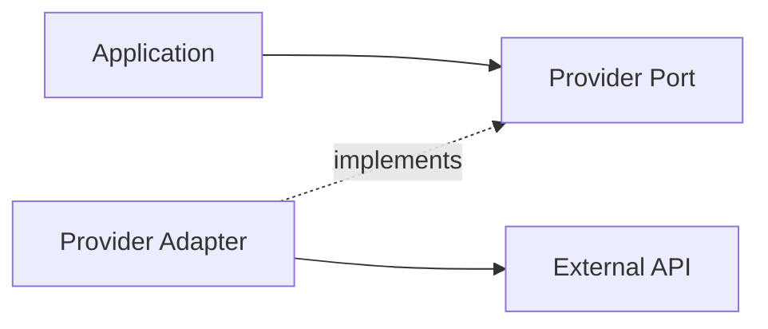
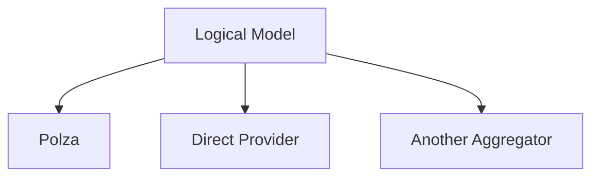
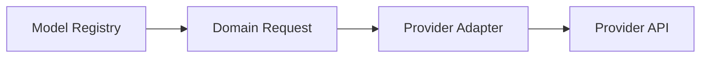
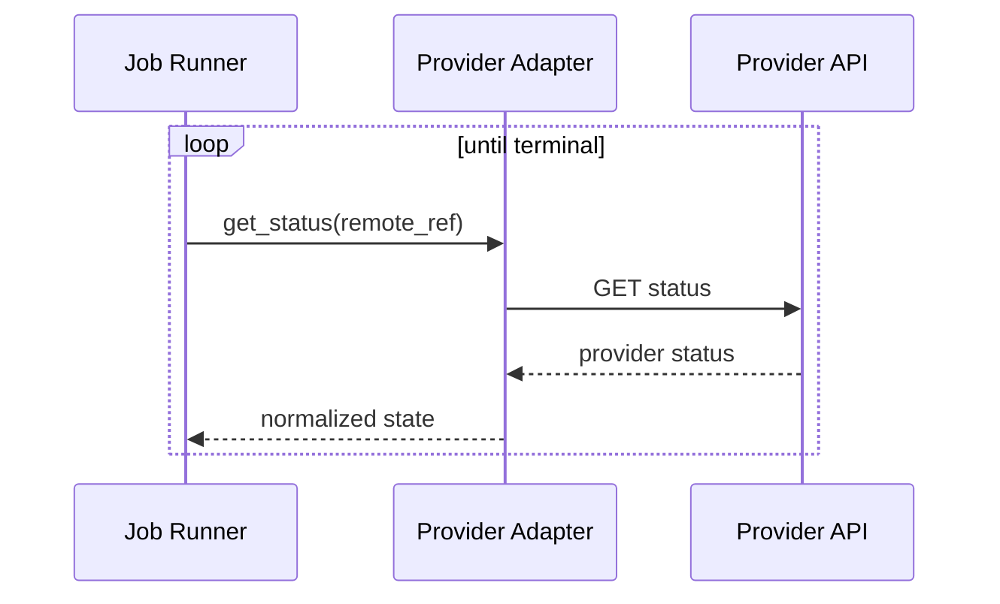
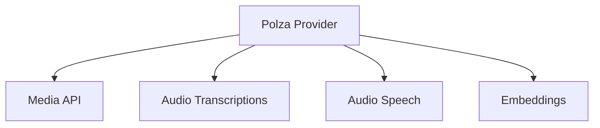
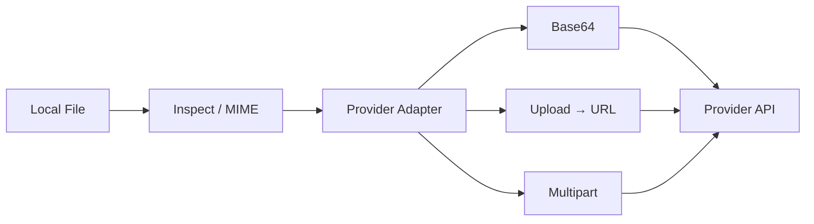
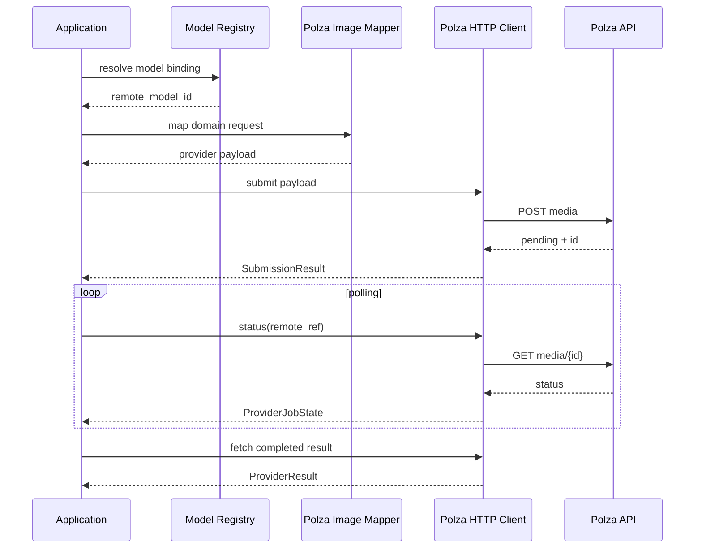
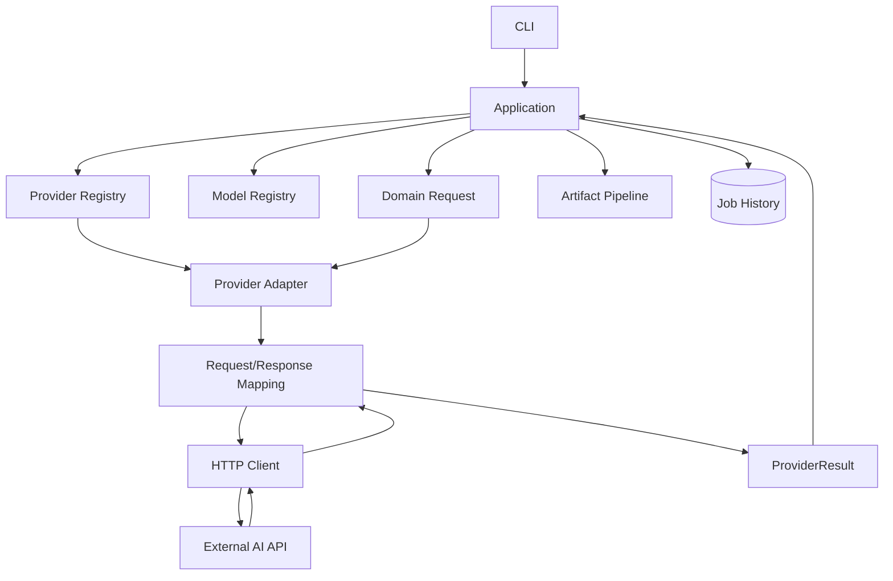

# 05. Provider System — система провайдеров и внешних AI API

> [!abstract] Назначение документа
> Этот документ фиксирует архитектуру **Provider System**: контракты взаимодействия с внешними AI-поставщиками, границы ответственности adapters, правила преобразования запросов и ответов, работу с синхронными и асинхронными API, ошибки, usage/cost, загрузку файлов, polling и расширение системы новыми провайдерами.
>
> Документ отвечает на вопрос **«как приложение разговаривает с внешними AI API, не связывая домен и CLI с конкретным поставщиком»**.
>
> Первая реализация ориентирована на Polza, но контракт проектируется так, чтобы позже можно было добавить других поставщиков без переписывания CLI, Job-модели, истории и Model Registry.

---

## Статус документа 🧭

| Поле | Значение |
|---|---|
| Номер | `05` |
| Название | `Provider System` |
| Статус | Draft / Foundation |
| Область | Внешние AI API и adapters |
| Основная версия | `v0.1` |
| Первый provider | `polza` |
| Основной модуль v0.1 | `image` |
| Будущие provider-модули | Audio, Text, Embeddings, Video |
| Архитектурный стиль | Ports & Adapters |
| HTTP-клиент | `httpx` |
| Async runtime | `asyncio` |

---

## Главная архитектурная идея 🔌

Provider — это **инфраструктурный adapter**, который переводит внутренние запросы приложения в формат конкретного внешнего API и затем нормализует внешний ответ обратно во внутреннюю модель.

Внутренние слои не должны знать:

- endpoint URL;
- Authorization header;
- provider-specific field names;
- формат polling;
- структуру HTTP response;
- конкретные коды provider;
- способ передачи base64;
- способ загрузки файлов;
- provider-specific статусные значения.



---

## Что означает provider в проекте 🧩

Provider — внешний сервис или API-шлюз, через который выполняется AI-задача.

Примеры потенциальных provider IDs:

```text
polza
openai
fal
replicate
other
```

Provider не является моделью.

Одна и та же логическая модель может быть доступна через несколько providers.



---

## Provider и Model Registry — разные роли 🧠

Это фундаментальное разделение.

### Model Registry знает

- логический ID модели;
- capabilities;
- допустимые параметры;
- допустимые значения;
- ограничения;
- aliases;
- provider bindings;
- remote model IDs.

### Provider Adapter знает

- endpoint;
- HTTP method;
- auth;
- request payload;
- имена provider-specific полей;
- polling;
- response parsing;
- error mapping;
- usage/cost normalization;
- способ получения artifacts.



> [!important]
> Registry отвечает на вопрос **«что модель умеет»**.
>
> Adapter отвечает на вопрос **«как вызвать эту модель через конкретный API»**.

---

# Provider Port 🧱

Application Layer должна зависеть не от конкретного Polza-клиента, а от абстрактного provider port.

Концептуальный интерфейс:

```python
class ProviderGateway(Protocol):
    async def submit(
        self,
        request: JobRequest,
        model: ModelDefinition,
    ) -> SubmissionResult:
        ...

    async def get_status(
        self,
        remote_ref: RemoteJobRef,
    ) -> ProviderJobState:
        ...

    async def fetch_result(
        self,
        remote_ref: RemoteJobRef,
    ) -> ProviderResult:
        ...

    async def cancel(
        self,
        remote_ref: RemoteJobRef,
    ) -> None:
        ...
```

Это концептуальная схема.

Точные сигнатуры могут быть изменены при реализации.

---

## Не все providers обязаны поддерживать всё

Например:

```text
submit        — почти всегда
get_status    — только async providers
cancel        — только если API поддерживает
stream        — только если API поддерживает
```

Поэтому provider capabilities должны быть отдельным понятием.

---

# ProviderCapabilities ⚙️

Концептуально:

```python
class ProviderCapabilities(BaseModel):
    async_jobs: bool = False
    polling: bool = False
    cancellation: bool = False
    streaming: bool = False
    direct_file_upload: bool = False
    base64_input: bool = False
    url_input: bool = False
```

Эти capabilities описывают **провайдера**, а не модель.

Это другой уровень, чем `ModelCapabilities`.

---

## Пример различия

Модель может поддерживать:

```text
image_to_image = true
```

Но конкретный provider может принимать image input только через:

```text
base64
```

а другой — только через:

```text
URL
```

Это уже provider behavior.

---

# SubmissionResult 📨

Результат `submit()` должен нормализовать как синхронный, так и асинхронный API.

Концептуально:

```python
class SubmissionResult(BaseModel):
    state: ProviderJobState
    remote_ref: RemoteJobRef | None = None
    result: ProviderResult | None = None
```

---

## Синхронный provider

```text
submit()
↓
completed result
```

Пример:

```python
SubmissionResult(
    state="completed",
    result=...
)
```

---

## Асинхронный provider

```text
submit()
↓
remote ID
↓
poll
↓
result
```

Пример:

```python
SubmissionResult(
    state="submitted",
    remote_ref=...
)
```

---

# ProviderJobState 🔄

Нужно отделить provider-specific statuses от внутреннего JobStatus.

Внешний API может использовать:

```text
pending
processing
queued
running
rendering
completed
failed
cancelled
```

Adapter нормализует их.

Концептуально:

```python
class ProviderJobState(StrEnum):
    SUBMITTED = "submitted"
    RUNNING = "running"
    COMPLETED = "completed"
    FAILED = "failed"
    CANCELLED = "cancelled"
```

---

## Provider status не равен локальному JobStatus

Например:

```text
provider = completed
```

ещё не обязательно означает:

```text
local Job = completed
```

Потому что результат может требовать:

```text
download
conversion
artifact save
DB update
```

Локальный Job завершён только после выполнения обязательных локальных этапов.

---

# ProviderResult 📦

Нормализованный ответ provider не должен быть сырым HTTP JSON.

Концептуально:

```python
class ProviderResult(BaseModel):
    remote_artifacts: list[RemoteArtifact] = []
    content: str | None = None

    usage: Usage | None = None
    cost: Cost | None = None

    provider_metadata: dict[str, Any] = {}
```

---

# RemoteArtifact 🌐

Provider обычно возвращает:

- URL;
- base64;
- binary;
- storage ID.

Внутренне это можно нормализовать.

Концептуально:

```python
class RemoteArtifact(BaseModel):
    kind: ArtifactKind

    url: str | None = None
    base64_data: str | None = None
    content_type: str | None = None

    provider_file_id: str | None = None

    metadata: dict[str, Any] = {}
```

---

## RemoteArtifact не является финальным Artifact

```text
RemoteArtifact
↓
download / decode
↓
optional processing
↓
local Artifact
```

Это важная граница.

---

# Polza как первый provider 🟦

Polza выступает первым adapter, но внутри неё уже существует несколько API-механик.

Это означает, что даже **один provider** не должен реализовываться одним огромным универсальным методом.

Рекомендуемая структура:

```text
providers/polza/
├── client.py
├── auth.py
├── mapper.py
├── errors.py
│
├── media/
│   ├── create.py
│   ├── status.py
│   └── operations.py
│
├── audio/
│   ├── transcription.py
│   └── speech.py
│
└── embeddings.py
```

Для v0.1 реально могут существовать только необходимые части.

---

# Polza Media API 🖼️

Для генерации изображений Polza предоставляет универсальный media endpoint.

Концептуальный поток:

```text
POST media
↓
generation ID
↓
GET status
↓
completed
↓
data.url
```

Media API принимает:

```text
model
input
async
user
provider
```

А image input может содержать:

```text
prompt
images
aspect_ratio
seed
image_resolution
quality
output_format
max_images
strength
...
```

При этом конкретная модель поддерживает только собственное подмножество этих параметров.

---

## Почему Adapter не может просто передать весь request как есть

Внутреннее:

```text
resolution = 2K
```

может соответствовать:

```text
image_resolution = 2K
```

в Polza.

Другой provider может ожидать:

```text
size = 2048
```

Поэтому mapping должен происходить внутри adapter.

---

# Polza Media status ⏳

Для async media jobs Polza возвращает status.

Типичные значения:

```text
pending
processing
completed
failed
cancelled
```

Adapter должен преобразовать их в внутренний `ProviderJobState`.

Пример:

```text
pending
→ submitted

processing
→ running

completed
→ completed

failed
→ failed

cancelled
→ cancelled
```

---

# Polling 🕒

Polling — обязанность execution layer совместно с provider adapter.

Provider adapter должен знать **как получить статус**.

Application / Job Runner знает **когда и сколько раз его запрашивать**.

То есть adapter не должен самостоятельно бесконечно ждать результат внутри скрытого цикла, если это мешает контролировать timeout/recovery.

---

## Рекомендуемое разделение

```text
Provider Adapter
→ get_status(remote_ref)

Job Runner
→ polling loop
```



---

# Polling interval 🕐

Provider-specific документация может рекомендовать разные интервалы.

Для Polza image jobs разумно учитывать рекомендованный interval порядка нескольких секунд.

Но точная стратегия:

```text
interval
backoff
max wait
jitter
```

фиксируется в `08-job-execution.md`.

Provider adapter может публиковать suggested polling metadata.

---

# Audio в Polza — отдельный путь 🎙️

Не следует пытаться заставить все задачи Polza идти через один Media API.

Для STT существует dedicated transcription endpoint.

Для TTS существует dedicated speech endpoint.

Поэтому внутри provider adapter должны существовать modality-specific clients/mappers.



---

# Polza STT 📝

Speech-to-Text имеет собственный endpoint и собственную семантику.

Поддерживаются:

- синхронные модели;
- отдельные асинхронные модели;
- language;
- response format;
- timestamps;
- diarization;
- prompt;
- chunking;
- streaming у части моделей.

Provider adapter должен скрывать эти различия от общего Job layer.

---

## Асинхронный STT — отдельный remote flow

Некоторые transcription models возвращают:

```text
id
status = processing
```

и требуют polling через endpoint транскрипций, а не через Media status.

Это важный пример того, почему:

```text
remote_ref
```

должен включать информацию, достаточную для правильного routing внутри provider adapter.

---

# RemoteJobRef расширенного вида 🔗

Концептуально:

```python
class RemoteJobRef(BaseModel):
    provider_id: str
    remote_job_id: str
    operation: str | None = None
```

Например:

```text
provider_id = polza
remote_job_id = aig_abc123
operation = media
```

или:

```text
provider_id = polza
remote_job_id = gen_123
operation = audio.transcription
```

Каноническое имя поля — `remote_job_id` (согласовано с `03`/`07`, baseline E00).
`operation` хранится в remote ref/snapshot; endpoint не угадывается по строке ID.
Точная схема будет определена позже, но сама проблема должна быть учтена.

---

# Polza TTS 🔊

Speech generation через dedicated endpoint может возвращать base64 audio.

Adapter обязан:

1. получить response;
2. извлечь base64;
3. определить MIME/content type;
4. сформировать `RemoteArtifact` или эквивалент;
5. нормализовать usage/cost.

То есть даже если provider не возвращает URL, внешний контракт приложения остаётся тем же.

---

# Polza Embeddings 🧬

Embeddings имеют отдельный endpoint.

Они возвращают:

```text
vectors
model
usage
cost
```

Такой результат не обязан превращаться в обычный файловый Artifact.

Provider system должен уметь возвращать domain-specific payload.

Это означает, что `ProviderResult` не следует проектировать только под файлы.

---

# Media Operations 🛠️

Некоторые providers поддерживают операции над уже созданным media:

```text
extend
upscale
```

Такие операции в будущем лучше моделировать как **новые Jobs**, связанные с исходным Job.

Например:

```text
Job 481
image.generate

Job 512
image.upscale
derived_from = 481
```

Adapter вызывает provider operation API, но история остаётся общей.

---

# Provider dispatch 🧭

Application Layer должна выбирать adapter по `ProviderRef`.

Концептуально:

```python
provider = provider_registry.get(job.provider.id)
```

`provider_registry` здесь не равен Model Registry.

Это обычный runtime registry adapters.

---

## ProviderRegistry

```python
class ProviderRegistry:
    def get(self, provider_id: str) -> ProviderGateway:
        ...
```

На старте:

```text
polza → PolzaProvider
```

Позже:

```text
openai → OpenAIProvider
fal → FalProvider
```

---

# Provider configuration ⚙️

Provider adapter получает настройки из configuration layer.

Пример:

```toml
[providers.polza]
base_url = "https://..."
api_key_env = "POLZA_API_KEY"
```

Но API key не должен попадать в domain objects.

---

# Secrets 🔐

Provider system отвечает за безопасное использование secret.

Запрещено записывать API keys:

```text
Job
request_json
response_json
logs
CLI JSON
error details
model registry
```

Authorization headers должны маскироваться даже в debug logging.

---

# HTTP client architecture 🌐

Рекомендуется один `httpx.AsyncClient` на provider instance или application lifetime.

Плюсы:

- connection pooling;
- меньше накладных расходов;
- единая настройка timeout;
- единые headers;
- удобное тестирование.

---

## Не создавать client на каждый polling request

Плохо:

```python
async with httpx.AsyncClient() as client:
    ...
```

в каждом маленьком методе при многократном polling.

Лучше переиспользовать клиент в пределах lifecycle команды/application context.

---

# Timeout model ⏱️

Нужно различать:

```text
HTTP timeout
```

и:

```text
Job timeout
```

### HTTP timeout

Один сетевой запрос завис слишком долго.

### Job timeout

Удалённая генерация не завершилась за допустимое время.

Это разные ошибки.

---

# Retry HTTP vs Retry Job ♻️

Также нужно разделять:

### Transport retry

Повтор того же технического HTTP request после временной сетевой ошибки.

### Job retry

Создание нового AI Job после failed generation.

Это совершенно разные операции.

---

# Transport retry 🚚

Может применяться к:

```text
GET status
download artifact
safe idempotent GET
```

С POST generation нужно быть осторожнее: повтор после timeout может создать дубликат.

---

## Idempotency

Если provider поддерживает idempotency key, adapter должен использовать его.

Если не поддерживает, повтор `submit()` после неизвестного outcome должен быть консервативным.

Эта логика относится к provider/execution contract.

---

# Error mapping 🧯

Adapter обязан преобразовать provider-specific ошибки во внутренние ошибки.

Например:

```text
HTTP 401
→ ProviderAuthenticationError

HTTP 402 / insufficient balance
→ ProviderInsufficientBalance

HTTP 429
→ ProviderRateLimit

timeout
→ ProviderTimeout

remote failed
→ RemoteGenerationFailed
```

---

## Сохранять provider details

Нормализованная ошибка может дополнительно включать:

```text
provider_code
provider_message
trace_id
metadata
```

Но application не должна парсить сырые строки provider.

---

# Категории provider errors ⚠️

Рекомендуемые внутренние категории:

| Категория | Пример |
|---|---|
| Authentication | Неверный API key |
| Authorization | Нет доступа к модели |
| Balance | Недостаточно средств |
| Rate limit | 429 |
| Validation | Provider отверг payload |
| Timeout | Network/API timeout |
| Temporary unavailable | 502/503 |
| Remote failure | Генерация завершилась failed |
| Content policy | Provider отклонил контент |
| Unknown | Нераспознанная ошибка |

---

# Retryable errors 🔁

Adapter может маркировать ошибку:

```text
retryable = true / false / unknown
```

Пример:

```text
429
→ обычно retryable

503
→ обычно retryable

invalid parameter
→ not retryable

authentication
→ not retryable
```

Автоматическая политика retry определяется execution layer.

---

# Usage normalization 📊

Provider может возвращать разные usage fields.

Например:

```text
input_tokens
output_tokens
duration_seconds
characters
output_units
```

Adapter нормализует известные значения в `Usage`, а сырой provider usage сохраняет в:

```text
usage.raw
```

---

# Cost normalization 💰

Стоимость должна нормализоваться в:

```text
amount
currency
```

Пример Polza:

```text
4.00 RUB
```

Другой provider:

```text
0.08 USD
```

Provider adapter должен знать валюту своего API.

---

## Не вычислять FX

Provider system не выполняет:

```text
RUB → USD
USD → KZT
```

Это не его задача.

---

## Если cost отсутствует

Нормальное состояние:

```text
cost = None
```

Нельзя придумывать стоимость по статическому прайс-листу и выдавать её за фактическую.

---

# Каталожная цена vs фактическая стоимость 💵

Можно хранить model price metadata в Registry для справки.

Но:

```text
Registry price
→ estimate

Provider response cost
→ actual
```

История Job должна предпочитать фактическую стоимость.

---

# File input strategy 📁

Provider может принимать файлы разными способами:

```text
base64
URL
multipart
provider storage ID
```

Domain request не должен быть привязан к одному из них.

---

## Рекомендуемый pipeline



Adapter выбирает способ передачи, поддерживаемый provider/model.

---

# Base64 📦

Если provider принимает base64 напрямую, adapter может кодировать локальный файл.

Не следует хранить полную base64-строку в Job history.

История хранит ссылку на исходный local input.

---

# Provider temporary storage 🗃️

Если provider автоматически загружает base64 в своё временное storage, это инфраструктурная деталь.

Domain не должен зависеть от неё.

---

# Artifact retrieval 📥

Provider result может вернуть:

```text
URL
base64
binary
```

Нужно привести их к единому потоку:

```text
RemoteArtifact
↓
Artifact downloader/decoder
↓
Local Artifact
```

---

# Download responsibility 🔽

Рекомендуется разделить:

### Provider Adapter

Определяет remote artifact и авторизацию/способ получения.

### Artifact Service

Сохраняет artifact локально.

Это особенно важно, если URL обычный CDN и не требует provider client.

---

## Исключение

Если скачивание требует provider-specific auth/headers, adapter может предоставить stream/download method.

---

# Content-Type и extension 📎

Не следует доверять только расширению URL.

При сохранении результата желательно учитывать:

```text
Content-Type
provider metadata
requested format
actual decoded format
```

Финальный extension должен соответствовать реальному локальному формату.

---

# Provider-specific warnings ⚠️

Некоторые API могут сообщать:

```text
parameter ignored
fallback provider used
unsupported option
```

Adapter должен нормализовать их в warnings.

Warnings не должны теряться.

---

# Fallback providers внутри агрегатора 🔀

Агрегатор может сам выбирать downstream provider.

Это отличается от provider selection нашей CLI.

Например:

```text
CLI provider = polza
```

а внутри Polza запрос может быть отправлен к одному из downstream поставщиков.

Domain по-прежнему считает provider:

```text
polza
```

Если Polza возвращает информацию о фактическом downstream provider, её можно сохранить как metadata.

---

# Provider routing options 🧭

Некоторые агрегаторы поддерживают:

```text
order
only
ignore
allow_fallbacks
sort
max_price
```

Эти параметры являются provider-specific.

Не следует сразу поднимать их все в общий CLI contract.

---

## Escape hatch

Для advanced use cases допустим provider options object.

Но он должен использоваться аккуратно.

Например будущий config:

```yaml
provider_options:
  allow_fallbacks: true
```

В v0.1 можно вообще не предоставлять публичный generic escape hatch.

---

# Почему не нужен generic `--provider-json` ☠️

Команда вида:

```bash
--provider-json '{"allow_fallbacks":true,...}'
```

делает CLI зависимой от API конкретного поставщика.

Такая возможность может существовать только как advanced/experimental режим, если вообще понадобится.

---

# Provider-specific extensions 🧩

Если параметр становится важным продуктовым сценарием и встречается у нескольких providers, его следует поднять в domain.

Если он уникален для одного provider, оставить в adapter/config.

---

# Provider binding в Model Registry 🔗

Пример:

> [!note]
> Значение `some/model/id` ниже — **явно демонстрационный placeholder**, а не
> проверенный remote model ID. Реальный binding содержит только ID, документально
> подтверждённый источником и live-проверкой; источник параметров, дата и результат
> фиксируются в evidence.

```yaml
id: seedream-5-pro

providers:
  polza:
    remote_model_id: <PLACEHOLDER_REMOTE_MODEL_ID>
```

Позже:

```yaml
providers:
  polza:
    remote_model_id: <PLACEHOLDER_REMOTE_MODEL_ID>

  another:
    remote_model_id: <PLACEHOLDER_REMOTE_MODEL_ID_OTHER>
```

Application выбирает provider, затем registry отдаёт нужный binding. Переименование
параметров и любой mapping из domain-полей в provider-параметры выполняет Python
adapter, а не YAML (см. baseline E00).

---

# Проверка доступности модели ✅

Registry может знать, что binding существует.

Но реальная доступность API может меняться.

Поэтому:

```text
configured in registry
≠ guaranteed online
```

Provider adapter может получить runtime error:

```text
model unavailable
```

Это нормальный сценарий.

---

# Discovery моделей 🔎

В будущем можно добавить:

```bash
aimedia models sync
```

если provider предоставляет machine-readable catalog.

Но автоматический sync не должен напрямую переписывать локальный registry без validation.

Предпочтительно:

```text
fetch
↓
normalize
↓
compare
↓
review/update registry
```

---

# Provider operations и отдельные Jobs 🛠️

Операции типа:

```text
upscale
extend
```

лучше представлять отдельными JobKind.

Например:

```text
image.upscale
video.extend
```

И связывать с исходным Job.

Это делает историю последовательной.

---

# Provider abstraction не должна быть чрезмерно общей ⚖️

Плохой вариант:

```python
provider.execute(any_payload)
```

Такой интерфейс ничего не гарантирует.

Лучше либо:

```text
единый submit(JobRequest)
```

с typed requests,

либо modality-specific ports:

```python
ImageProvider
AudioProvider
TextProvider
```

---

# Один ProviderAdapter или несколько modality ports? 🧠

Для проекта разумна гибридная схема.

Runtime provider object может объединять несколько capability-specific adapters:

```text
PolzaProvider
├── image
├── transcription
├── speech
└── embeddings
```

Application use case получает нужный port.

---

## Возможный контракт

```python
class ImageProvider(Protocol):
    async def submit_image(...): ...
    async def get_image_status(...): ...

class TranscriptionProvider(Protocol):
    async def transcribe(...): ...

class SpeechProvider(Protocol):
    async def synthesize(...): ...
```

Это часто чище, чем один интерфейс с десятком методов.

---

# Provider factory 🏭

Composition root может создавать adapters по config.

```text
config
↓
ProviderFactory
↓
PolzaProvider
```

На старте factory может быть обычной Python-функцией.

Не требуется plugin framework.

---

# Plugin architecture — не сейчас 🚫

Не нужно заранее строить:

```text
dynamic package discovery
entry points
third-party plugin registry
hot loading
sandboxing
```

Новый provider на раннем этапе может добавляться обычным Python module и регистрацией в composition root.

---

# Логирование provider operations 📜

Полезно логировать:

```text
provider
operation
job_id
remote_job_id
HTTP status
duration
attempt
```

Но не:

```text
API key
Authorization
full base64
sensitive request body
```

---

# Correlation IDs 🧷

Если provider возвращает:

```text
trace_id
request_id
```

их полезно сохранять в provider metadata/error details.

Это сильно помогает диагностике.

---

# Raw provider payloads 🧾

Raw request/response можно сохранять для диагностики, но с ограничениями.

### Нельзя сохранять

- secrets;
- большие base64 payloads;
- бинарные данные.

### Можно сохранять

- endpoint operation;
- normalized payload metadata;
- provider IDs;
- status;
- warnings;
- usage;
- error metadata.

---

# Observability boundary 👀

Provider adapter должен выдавать структурированные события application/logging layer.

Например:

```text
provider_request_started
provider_request_completed
provider_poll
provider_error
provider_artifact_ready
```

Но полноценный event bus в v0.1 не нужен.

---

# Testing provider adapters 🧪

Provider tests должны работать без реального списания денег.

Основной инструмент:

```text
respx
```

или другой HTTP mock для `httpx`.

---

## Что тестировать

### Request mapping

Domain request:

```text
resolution = 2K
```

правильно превращается в provider field.

### Response mapping

Provider JSON превращается в:

```text
ProviderResult
Cost
Usage
RemoteArtifact
```

### Error mapping

HTTP/provider errors превращаются в нормализованные ошибки.

### Polling status mapping

Все provider statuses корректно нормализуются.

### File handling

Base64, URLs и MIME обрабатываются корректно.

---

# Contract tests 🔒

Для каждого adapter полезны contract tests:

```text
given normalized request
when provider response X
then normalized result Y
```

Это особенно важно при изменениях API.

---

# Optional live smoke tests 🌐

Можно иметь отдельный набор:

```text
tests/live/
```

который запускается только при наличии API key.

Он не должен входить в обычный unit test suite.

---

# Provider emulator / fake provider 🧪

Для application tests нужен FakeProvider.

Например:

```python
class FakeImageProvider:
    async def submit(...):
        return predefined_result
```

Это позволяет тестировать:

```text
Job lifecycle
history
batch
artifact save
JSON output
```

без сети.

---

# Versioning provider adapters 🔢

Provider API может меняться.

Adapter должен локализовать эти изменения.

Если Polza меняет:

```text
field name
endpoint
response shape
```

изменяется:

```text
providers/polza/
```

а не domain/CLI.

---

# Backward compatibility 🧷

Если provider поддерживает несколько API versions, adapter может выбрать одну явно.

Не следует размазывать version checks по application layer.

---

# Provider timeout policy ⏱️

Provider adapter должен иметь разумные network timeout defaults.

Но максимальное время ожидания целого Job задаётся execution policy.

```text
network timeout
≠ job timeout
```

---

# Rate limiting 🚦

На старте отдельный rate limiter может быть не нужен.

Batch concurrency уже снижает нагрузку.

Если provider начнёт требовать ограничение RPS, rate limiter можно добавить внутри provider/execution layer.

---

# Concurrency и provider limits ⚡

Глобальный:

```text
--concurrency 4
```

не гарантирует, что каждый provider разрешает четыре одновременных запроса.

В будущем provider config может содержать:

```text
max_concurrency
```

и итоговый лимит будет:

```text
min(user_requested, provider_limit)
```

Для v0.1 это можно не реализовывать, если Polza не требует отдельного ограничения.

---

# Provider health check 🩺

Полноценная health-check система не нужна.

Но полезная future-команда:

```bash
aimedia providers check polza
```

может проверить:

```text
configured
auth works
basic endpoint reachable
```

Не является обязательной v0.1.

---

# Provider selection rule 🧭

Рекомендуемый порядок:

```text
explicit CLI provider
↓
user config default provider
↓
single available binding
↓
error if ambiguous
```

---

# Provider fallback на уровне приложения 🔀

Автоматический fallback:

```text
Polza failed → OpenAI
```

не должен включаться неявно в v0.1.

Причины:

- другой cost;
- другая модель/версия;
- другой output;
- другая политика;
- непредсказуемая воспроизводимость.

Если такая функция появится, она должна быть явной и документированной.

---

# Downstream fallback внутри Polza 🌀

Если сам Polza использует fallback среди upstream providers, это уже его внутреннее поведение.

Приложение может передавать provider-specific настройки, если пользователь осознанно их выбрал.

---

# Security boundaries 🔐

Provider subsystem должен гарантировать:

- TLS по умолчанию;
- secrets не логируются;
- URL с токенами маскируются;
- base64 не попадает в диагностические логи;
- provider error raw message проходит sanitization перед публичным JSON при необходимости.

---

# Будущий direct OpenAI provider 🧠

Если позже появится прямой OpenAI adapter:

```text
CLI
↓
same ImageGenerationRequest
↓
OpenAIImageAdapter
↓
OpenAI API
```

CLI и Job history не меняются.

Это главный практический критерий корректности Provider System.

---

# Будущий локальный provider 🖥️

Provider не обязан быть облачным.

В будущем adapter может обращаться к:

```text
LM Studio
Ollama
локальному HTTP серверу
локальному subprocess
```

если контракт результата совпадает.

То есть понятие provider означает **исполнитель задачи**, а не обязательно коммерческий SaaS.

---

# Provider vs Processing 🛠️

Не смешивать:

```text
provider generated image
```

и:

```text
Pillow converted image
```

Provider отвечает за AI-вычисление.

Processing — за локальное преобразование.

---

# Provider vs Storage 🗄️

Provider не должен писать Job history напрямую.

Правильный поток:

```text
ProviderResult
↓
Application
↓
Repository
```

Не:

```text
PolzaAdapter
↓
SQLite UPDATE jobs ...
```

---

# Provider vs CLI ⌨️

Provider не должен печатать:

```text
console.print(...)
```

Он возвращает данные и ошибки.

Presentation выполняет CLI layer.

---

# Provider vs Model Validation ✅

Model Registry выполняет локальную validation до API.

Provider всё равно может выполнить дополнительную validation.

Но adapter не должен быть единственным местом, где обнаруживаются очевидные ограничения модели.

---

# Polza-specific особенности, которые надо учесть 🧷

Для первого adapter важно поддержать несколько разных механик:

### Media generation

```text
POST media
GET media status
remote artifact URL
usage/cost
```

### Audio transcription

```text
dedicated transcription endpoint
sync + async families
own polling path
```

### Audio speech

```text
dedicated TTS endpoint
base64 audio result
voice/model-specific params
```

### Embeddings

```text
dedicated embeddings endpoint
vector output
usage/cost
```

### Media operations

```text
extend
upscale
```

Это хороший аргумент в пользу внутренней модульности Polza adapter.

---

# Рекомендуемая структура Polza adapter 📂

```text
providers/polza/
│
├── __init__.py
├── provider.py
├── client.py
├── config.py
├── errors.py
├── mapping.py
│
├── media/
│   ├── image.py
│   ├── status.py
│   └── operations.py
│
├── audio/
│   ├── transcription.py
│   └── speech.py
│
└── embeddings/
    └── client.py
```

На v0.1 можно реализовать только:

```text
provider.py
client.py
errors.py
mapping.py
media/image.py
media/status.py
```

Остальное добавляется по мере появления модулей.

---

# Не создавать один `polza.py` на тысячи строк ☠️

Такой файл быстро начнёт содержать:

```text
images
video
speech
transcription
embeddings
music
polling
upscale
errors
pricing
```

и станет фактически новым монолитом.

---

# Provider request mapping 🗺️

Рекомендуется отдельный mapper.

```python
class PolzaImageMapper:
    def to_provider_request(
        self,
        request: ImageGenerationRequest,
        binding: ProviderModelBinding,
    ) -> dict:
        ...
```

Это делает mapping отдельно тестируемым.

---

# Provider response mapping 🔄

Аналогично:

```python
class PolzaMediaResponseMapper:
    def from_status_response(...) -> ProviderResult:
        ...
```

Не смешивать HTTP transport и mapping, если код становится сложным.

---

# Provider client 🌐

`PolzaClient` отвечает за transport:

```text
base URL
headers
HTTP methods
timeouts
```

Но не должен знать бизнес-смысл всех моделей.

---

# Architecture flow Polza image 🖼️



---

# Добавление нового provider — ожидаемый процесс ➕

Чтобы добавить нового provider, разработчик должен:

1. создать config schema;
2. реализовать нужный provider port;
3. реализовать request mapping;
4. реализовать response mapping;
5. реализовать error mapping;
6. добавить provider bindings в Model Registry;
7. зарегистрировать adapter в composition root;
8. добавить tests;
9. добавить atomic docs.

При этом не должно требоваться менять:

```text
Job
ImageGenerationRequest
CLI image generate
jobs history
artifact storage
```

---

# Definition of Done для нового provider ✅

Новый provider считается интегрированным, если:

- можно выбрать его через `--provider`;
- модель разрешается через registry binding;
- domain request корректно преобразуется;
- ошибки нормализуются;
- usage/cost сохраняются;
- async status поддерживается, если нужен;
- artifacts скачиваются;
- `jobs show` отображает результат одинаково с другими providers;
- JSON output не содержит provider-specific структуры вместо domain structure;
- adapter покрыт contract tests.

---

# Что может оставаться provider-specific 🧩

Допустимо:

```text
remote trace ID
downstream provider name
raw warnings
provider operation ID
provider storage ID
```

Но эти данные должны находиться в:

```text
metadata
```

а не ломать основной контракт.

---

# Что должно быть нормализовано 🧱

Обязательно нормализуются:

```text
job state
remote reference
artifacts
cost
usage
errors
model identity
```

---

# Provider System и JSON CLI 🤖

Agent mode не должен видеть raw provider response как основной ответ.

Плохо:

```json
{
  "status": "processing",
  "object": "media.generation",
  "data": {...}
}
```

Хорошо:

```json
{
  "ok": true,
  "data": {
    "job": {
      "id": 481,
      "status": "completed",
      "provider": "polza"
    },
    "artifacts": [...]
  }
}
```

Raw provider data может существовать только как optional diagnostics.

---

# Provider System и история 🕘

История должна сохранять:

```text
provider_id
remote_job_id
resolved remote model ID
usage
cost
error metadata
```

Но не должна зависеть от полной provider response schema.

---

# Provider System и воспроизводимость 🧬

Для воспроизводимости желательно сохранять:

```text
logical model ID
provider ID
remote model ID
normalized parameters
provider-relevant resolved parameters
```

Это особенно важно, если alias модели со временем начинает указывать на другую версию.

---

# Architecture Decision: без автоматического cross-provider fallback 🚫

На старте fallback между providers не выполняется автоматически.

Если Polza недоступна, Job должен завершиться ошибкой.

Пользователь может повторить Job через другой provider явно.

Это сохраняет:

- предсказуемость;
- прозрачную стоимость;
- воспроизводимость;
- контроль модели.

---

# Architecture Decision: provider adapter не хранит состояние Jobs 🧠

Adapter может иметь HTTP client и config, но не является repository.

Он не должен знать всю историю приложения.

Remote state получает через:

```text
RemoteJobRef
```

и возвращает нормализованный результат.

---

# Architecture Decision: один provider может иметь несколько внутренних clients 🧱

Это допускается и рекомендуется, если API реально разделён.

Polza уже является примером такой ситуации.

---

# Architecture Decision: provider-specific параметры не становятся глобальными автоматически 🎚️

Если Polza имеет уникальный параметр, это не означает, что CLI немедленно получает глобальный flag.

Сначала оценивается:

```text
имеет ли параметр общую продуктовую семантику?
```

Если нет — он остаётся внутри provider config/options.

---

# Архитектурные анти-паттерны ☠️

## HTTP внутри CLI

```python
@app.command()
def generate(...):
    await client.post(...)
```

Нельзя.

---

## Peewee внутри provider

```python
JobModel.update(...)
```

из adapter — нельзя.

---

## Provider response как domain result

Передача raw JSON вверх по стеку без normalization — нельзя.

---

## Model constraints внутри provider if/else

```python
if model == "x":
    ...
elif model == "y":
    ...
```

для всех capabilities — плохой путь.

Capabilities должны жить в Registry, а adapter занимается API mapping.

---

## Один универсальный provider method

```python
execute(payload: dict) -> dict
```

как основной контракт — слишком слабая абстракция.

---

## Silent fallback

Нельзя незаметно переключать provider/model после ошибки, если пользователь этого не запросил.

---

## Silent parameter dropping

Явно переданный параметр нельзя молча удалить только потому, что provider его не понимает.

---

# Минимальный Provider System v0.1 🪶

Для первой версии достаточно реализовать:

```text
ProviderRegistry
Provider config
Polza HTTP client
Polza image request mapper
Polza media submit
Polza media status polling support
Polza result mapper
Polza error mapper
Cost/usage normalization
RemoteArtifact extraction
Fake provider for tests
```

Не требуется сразу реализовывать:

```text
audio
embeddings
video
operations
multiple cloud providers
dynamic plugins
health checks
cross-provider fallback
```

---

# Критерии архитектурной готовности Provider System ✅

Provider System v0.1 считается готовой, если:

### Изоляция

CLI и domain не импортируют Polza-specific код.

### Mapping

ImageGenerationRequest корректно превращается в Polza request.

### Async

Remote ID сохраняется и status может быть получен отдельным вызовом.

### Result

Completed response превращается в нормализованный ProviderResult.

### Artifacts

Remote result можно сохранить локально через общий artifact pipeline.

### Cost

Стоимость нормализуется как:

```text
amount + currency
```

### Usage

Raw usage не теряется.

### Errors

401/402/429/timeout/failed generation имеют нормализованные ошибки.

### Testing

Основные сценарии тестируются без реального API.

### Extensibility

Добавление второго provider не требует изменения CLI image contract.

---

# Архитектурные инварианты Provider System 🔒

> [!important]
> **1. Provider — инфраструктурный adapter, а не часть domain layer.**

> [!important]
> **2. Model и Provider — разные понятия.**

> [!important]
> **3. Model Registry определяет capabilities, Provider Adapter определяет API mapping.**

> [!important]
> **4. Raw HTTP response не должен становиться публичной моделью приложения.**

> [!important]
> **5. Provider-specific statuses нормализуются.**

> [!important]
> **6. Remote completion не равен local Job completion до сохранения обязательных artifacts.**

> [!important]
> **7. Cost нормализуется как amount + currency без FX-конвертации.**

> [!important]
> **8. Raw usage сохраняется.**

> [!important]
> **9. Secrets никогда не попадают в Job history и public output.**

> [!important]
> **10. Retry HTTP и Retry Job — разные механизмы.**

> [!important]
> **11. Provider adapter не пишет напрямую в SQLite.**

> [!important]
> **12. Provider adapter не печатает напрямую в CLI.**

> [!important]
> **13. Provider-specific файлы/base64/URL нормализуются через общий artifact/input pipeline.**

> [!important]
> **14. Один provider может иметь несколько modality-specific внутренних clients.**

> [!important]
> **15. Автоматический fallback между providers не выполняется неявно.**

---

# Что этот документ намеренно не фиксирует ⏸️

В `05-provider-system.md` не определяется окончательно:

- точная Python signature всех Protocol;
- exact HTTP timeout values;
- polling intervals;
- retry backoff;
- exact config keys;
- конкретные provider bindings моделей;
- список всех Polza model IDs;
- точный формат provider metadata;
- формат локальных artifact filenames;
- SQL schema;
- exact YAML registry schema;
- CLI exit codes;
- exact retry policy;
- callback/webhook support.

Эти решения находятся в соответствующих документах или будут уточняться при реализации.

---

# Связь с другими фундаментальными документами 🔗

```text
01-product-scope.md
    Определяет границы продукта.

02-system-architecture.md
    Определяет слои и Ports & Adapters.

03-domain-model.md
    Определяет Job, Request, Result, Cost, Usage и RemoteJobRef.

04-cli-contract.md
    Определяет внешний интерфейс пользователя и агента.

05-provider-system.md
    Определяет взаимодействие с внешними AI API.

06-model-registry.md
    Определит capabilities, model bindings и YAML schema.

07-storage-history-costs.md
    Определит долговременное хранение provider/job данных.

08-job-execution.md
    Определит polling, concurrency, timeout, retry и recovery.

09-documentation-help.md
    Определит документацию providers и встроенную справку.
```

---

# Итоговая модель Provider System 🧩



> [!success]
> Provider System строится как изолированный инфраструктурный слой между Application Layer и внешними AI API.
>
> Первый adapter реализуется для Polza, но Polza не становится частью доменной модели.
>
> Внутренние requests, статусы, results, cost, usage и artifacts нормализуются; endpoint URLs, provider-specific параметры, base64, polling и error payload остаются внутри adapter.
>
> Такая архитектура позволяет использовать Polza для image v0.1, позже подключить её STT/TTS/embeddings API и при необходимости добавить других облачных или локальных providers без изменения фундаментального CLI и Job-модели.
