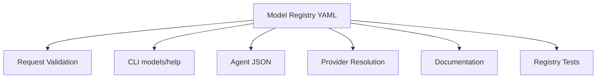
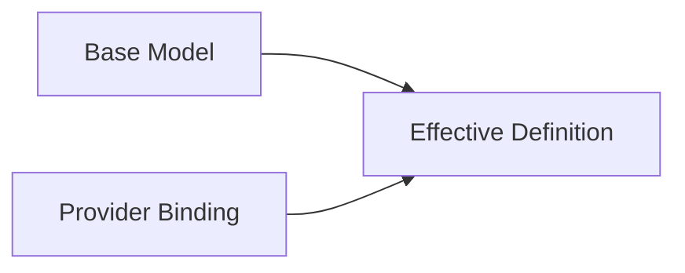
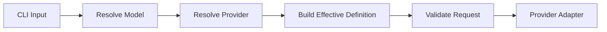
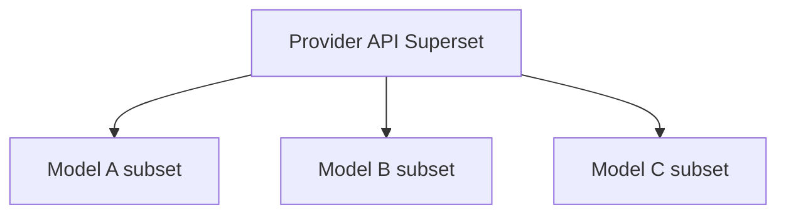
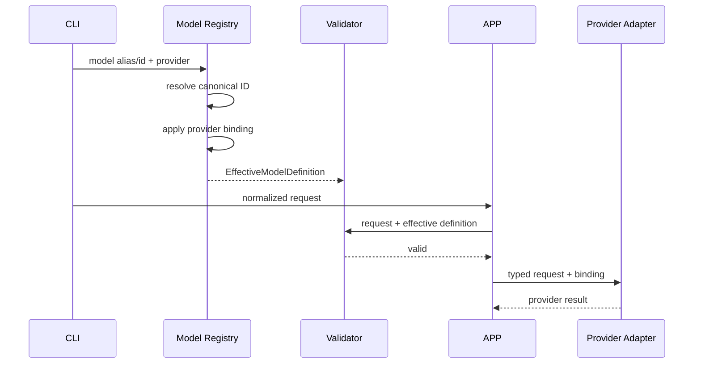
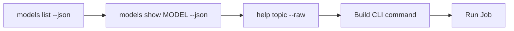
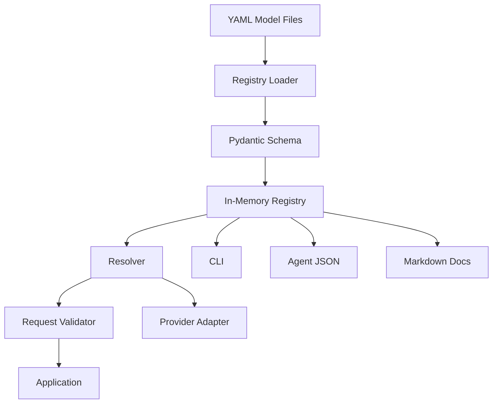

# 06. Model Registry — каталог моделей, capabilities, параметров и ограничений

> [!abstract] Назначение документа
> Этот документ фиксирует устройство **Model Registry** — декларативного каталога моделей, который является единым машинно читаемым источником знаний о том, **какие модели доступны, что они умеют, какие параметры принимают, какие ограничения имеют и через каких провайдеров могут быть вызваны**.
>
> Документ отвечает на вопрос **«как система описывает модели без зашивания их возможностей в Python-код»**.
>
> Model Registry должен одновременно обслуживать:
>
> - валидацию запросов;
> - CLI-команды `models list/show`;
> - agent-friendly JSON;
> - встроенную справку;
> - provider routing;
> - обновление каталога моделей;
> - будущие audio/text/embedding/video модули.

---

## Статус документа 🧭

| Поле | Значение |
|---|---|
| Номер | `06` |
| Название | `Model Registry` |
| Статус | Draft / Foundation |
| Область | Каталог моделей и их возможностей |
| Основная версия | `v0.1` |
| Основной формат | YAML |
| Валидатор схемы | Pydantic |
| Основная modality v0.1 | Image |
| Первый provider | Polza |
| Основной потребитель | Application / CLI / Agent |
| Публичный интерфейс | `aimedia models ...` |

---

# Зачем нужен Model Registry 🧠

Без отдельного реестра сведения о моделях быстро начинают жить в нескольких местах одновременно:

```text
if model == ...
в CLI
в provider adapter
в документации
в README
в validation
в коде batch
```

Через некоторое время эти копии расходятся.

Одна часть программы считает, что модель поддерживает 4K, другая — что только 2K, а документация продолжает обещать то, чего API уже не принимает.

Model Registry нужен как единый декларативный слой между:

```text
человеком
агентом
CLI
Application
Provider Adapter
документацией
```



---

# Главный принцип 📌

> [!important]
> **Model Registry описывает свойства модели.**
>
> **Provider Adapter описывает способ вызова внешнего API.**

Например Registry может знать:

```text
resolution:
  1K
  2K
  4K
```

Но не обязан знать, что Polza называет соответствующее поле:

```text
image_resolution
```

а другой provider:

```text
size
```

Это остаётся обязанностью adapter.

---

# Что должно находиться в Registry 📚

Registry хранит декларативные сведения:

- канонический ID модели;
- человекочитаемое название;
- семейство / modality;
- статус поддержки;
- aliases;
- capabilities;
- входные ограничения;
- выходные ограничения;
- параметры;
- допустимые значения;
- defaults;
- числовые диапазоны;
- количество reference files;
- provider bindings;
- remote model IDs;
- provider-specific declarative overrides;
- ссылка на атомарную документацию;
- optional pricing metadata;
- optional lifecycle metadata.

Registry **не содержит**:

- API keys;
- HTTP-клиенты;
- endpoint URLs, если они общие для provider;
- Python-код;
- polling loops;
- SQL;
- обработчики CLI;
- сложную вычислительную логику.

---

# Формат хранения: YAML 📄

Для Model Registry выбирается YAML.

Причины:

- удобно читать человеком;
- хорошо подходит для вложенных capabilities;
- удобен для списков допустимых значений;
- легко хранит provider bindings;
- пригоден для ручного редактирования;
- не требует изменения Python-кода при добавлении модели.

Пример общего вида:

```yaml
schema_version: 1

id: seedream-5-pro
name: Seedream 5.0 Pro

family: image
status: active

aliases:
  - seedream5
  - seedream-5

capabilities:
  text_to_image: true
  image_to_image: true
  multi_reference: true

inputs:
  images:
    min: 0
    max: 4

parameters:
  resolution:
    type: enum
    values:
      - 1K
      - 2K
      - 4K

  aspect_ratio:
    type: enum
    values:
      - "1:1"
      - "16:9"
      - "9:16"

providers:
  polza:
    remote_model_id: some/provider/model

docs:
  overview: models/seedream-5-pro.md
```

---

# Один файл — одна логическая модель 🧩

Рекомендуемый layout:

```text
registry/
└── models/
    ├── image/
    │   ├── seedream-5-pro.yaml
    │   ├── qwen-image-2-1.yaml
    │   └── gpt-image-2-5.yaml
    │
    ├── audio/
    │   ├── whisper-large-v3.yaml
    │   └── qwen3-asr-flash.yaml
    │
    ├── text/
    │   └── ...
    │
    ├── embedding/
    │   └── ...
    │
    └── video/
        └── ...
```

Один YAML-файл описывает **одну логическую модель**, даже если она доступна через несколько providers.

---

# Канонический Model ID 🪪

Каждая модель имеет стабильный локальный ID.

Пример:

```yaml
id: seedream-5-pro
```

CLI использует именно его:

```bash
aimedia image generate \
  --model seedream-5-pro
```

Этот ID:

- не обязан совпадать с remote model ID;
- не должен зависеть от конкретного provider;
- используется в истории;
- используется в документации;
- используется в CLI;
- является основным ключом Registry.

---

## Требования к ID

Рекомендуемый формат:

```text
lowercase-kebab-case
```

Например:

```text
qwen-image-2-1
seedream-5-pro
whisper-large-v3
```

Не рекомендуется:

```text
Qwen_Image_2.1
qwen/image/2.1
QWEN21
```

---

# Alias модели 🏷️

Aliases позволяют принимать удобные альтернативные имена.

```yaml
aliases:
  - seedream5
  - seedream-5
```

Но после resolution система должна работать с каноническим ID:

```text
seedream5
↓
seedream-5-pro
```

---

## История и aliases

В Job history рекомендуется хранить:

```text
canonical_model_id
```

Опционально можно сохранить:

```text
requested_model_alias
```

если важно восстановить точный пользовательский input.

---

# Уникальность aliases 🔒

Alias не может принадлежать двум моделям.

Loader обязан обнаруживать конфликт при старте Registry.

Например это ошибка:

```yaml
# model A
aliases:
  - image-pro
```

и:

```yaml
# model B
aliases:
  - image-pro
```

Registry должен считаться невалидным.

---

# Schema Version 🔢

Каждый registry-файл должен иметь:

```yaml
schema_version: 1
```

Это позволяет развивать структуру YAML без угадывания формата.

---

## Почему schema version нужна сразу

Registry является фактически внутренним API.

Со временем могут измениться:

- naming;
- capabilities format;
- parameter constraints;
- provider binding structure;
- pricing metadata.

Явная версия сильно упрощает миграцию.

---

# Family / Modality 🧩

Основное семейство:

```yaml
family: image
```

Допустимые значения по мере реализации:

```text
image
audio
text
embedding
video
```

`family` задаёт базовую схему capabilities и request type.

---

# Status 🚦

Полезно хранить lifecycle status модели.

```yaml
status: active
```

Возможные значения:

```text
active
experimental
deprecated
disabled
```

---

## Семантика

### `active`

Модель считается поддерживаемой.

### `experimental`

Модель присутствует, но контракт или параметры ещё могут изменяться.

### `deprecated`

Поддерживается для совместимости, но не рекомендуется для новых сценариев.

### `disabled`

Описание сохраняется, но модель нельзя использовать в обычном запуске.

---

# Capabilities 🧠

Capabilities описывают качественные возможности модели.

Для image:

```yaml
capabilities:
  text_to_image: true
  image_to_image: true
  multi_reference: true
```

Но capabilities не должны ограничиваться только boolean.

Например:

```yaml
capabilities:
  text_to_image: true
  image_to_image: true
  multi_reference:
    supported: true
    max_images: 4
```

---

# Структурированные capabilities лучше плоских флагов 🏗️

Плоская модель:

```yaml
supports_images: true
```

быстро перестаёт быть достаточной.

Появляются вопросы:

```text
сколько изображений?
каких форматов?
какой общий размер?
обязателен ли prompt?
поддерживается ли маска?
```

Поэтому capabilities должны допускать вложенную структуру.

---

# Image capabilities 🖼️

Рекомендуемый набор для image family:

```yaml
capabilities:
  text_to_image: true
  image_to_image: true

  reference_images:
    supported: true
    min: 0
    max: 4

  multiple_outputs:
    supported: true
    max: 4
```

Дополнительно в будущем:

```yaml
  masks:
    supported: false

  inpainting:
    supported: false

  outpainting:
    supported: false
```

---

# Audio capabilities 🎙️

Пример будущей модели:

```yaml
capabilities:
  transcription: true

  diarization:
    supported: true

  timestamps:
    word: true
    segment: true

  streaming: false
```

---

# Text capabilities 📝

Пример:

```yaml
capabilities:
  streaming: true
  reasoning: true
  structured_output: true
  tools: false

  input:
    text: true
    images: true
    files: false
```

---

# Embedding capabilities 🧬

Пример:

```yaml
capabilities:
  text: true
  images: true
  multimodal: true

  dimensions:
    default: 3072
    configurable: true
```

---

# Inputs section 📥

Capabilities говорят, **умеет ли модель принимать тип входа**.

`inputs` описывает количественные и технические ограничения.

Пример:

```yaml
inputs:
  prompt:
    required: true
    max_chars: 20000

  images:
    min: 0
    max: 4
    formats:
      - png
      - jpeg
      - webp
```

---

## Input constraints не должны выдумываться

Если точное ограничение неизвестно, лучше:

```yaml
max: null
```

или не указывать поле вовсе.

Нельзя подставлять «разумное» ограничение только потому, что оно кажется вероятным.

---

# Outputs section 📤

Аналогично можно описывать результаты:

```yaml
outputs:
  images:
    min: 1
    max: 4

    formats:
      - png
      - jpeg
      - webp
```

Это полезно для validation и help.

---

# Parameters 🎚️

Параметры модели являются одной из центральных частей Registry.

Пример:

```yaml
parameters:
  resolution:
    type: enum
    values:
      - 1K
      - 2K
      - 4K
    default: 2K

  aspect_ratio:
    type: enum
    values:
      - "1:1"
      - "16:9"
      - "9:16"

  seed:
    type: integer
    min: 0
    max: 2147483647

  max_images:
    type: integer
    min: 1
    max: 4
    default: 1
```

---

# Parameter types 🧱

Базовые типы:

```text
string
integer
number
boolean
enum
```

При необходимости позже:

```text
string_list
integer_list
object
```

Но без реальной нужды типовую систему расширять не следует.

---

# Enum parameter 📋

```yaml
resolution:
  type: enum
  values:
    - 1K
    - 2K
    - 4K
```

Validation:

```text
2K → valid
8K → invalid
```

---

# Numeric parameter 🔢

```yaml
guidance_scale:
  type: number
  min: 0
  max: 20
  default: 7.5
```

---

# Boolean parameter ☑️

```yaml
safety_checker:
  type: boolean
  default: true
```

---

# String parameter 🔤

```yaml
watermark:
  type: string
  max_length: 100
```

---

# Required parameters ❗

```yaml
voice:
  type: string
  required: true
```

Однако часть required-параметров может принадлежать request type, а не отдельной модели.

Например image prompt может быть обязательным доменно.

Не следует дублировать базовые доменные требования без пользы.

---

# Defaults 🎯

Default может жить на нескольких уровнях:

```text
CLI explicit
↓
user config
↓
model default
↓
application default
```

Registry хранит **model default**.

Пример:

```yaml
output_format:
  type: enum
  values:
    - png
    - jpeg
    - webp
  default: png
```

---

# Не все параметры должны попадать в CLI ⚖️

Registry может описывать параметры шире, чем публичный CLI v0.1.

Например provider/model может поддерживать редкий параметр, который пока не является частью public contract.

Поэтому параметр может иметь metadata:

```yaml
exposure:
  cli: false
```

или:

```yaml
visibility: internal
```

Но такую возможность стоит вводить только при необходимости.

---

# Рекомендуемые metadata параметра 📝

Концептуально:

```yaml
resolution:
  type: enum
  values:
    - 1K
    - 2K
    - 4K

  default: 2K

  title: Resolution
  description: Output image resolution.

  docs: parameters/resolution.md
```

---

# Provider binding 🔗

Каждая модель содержит bindings к поддерживаемым providers.

```yaml
providers:
  polza:
    remote_model_id: provider/model-id
```

Позже:

```yaml
providers:
  polza:
    remote_model_id: provider/model-id-a

  direct:
    remote_model_id: model-id-b
```

---

# Provider binding — не provider adapter config ⚠️

Binding содержит сведения, относящиеся к **конкретной модели через конкретного provider**.

Он не должен содержать:

```text
API key
base URL
HTTP timeout
```

Это provider config.

---

# Provider-specific parameter overrides 🧩

Иногда одна логическая модель через разные providers имеет разные ограничения.

Например:

```yaml
providers:
  polza:
    remote_model_id: model-x

    parameter_overrides:
      resolution:
        values:
          - 1K
          - 2K
```

а другой provider:

```yaml
  direct:
    remote_model_id: model-x-direct

    parameter_overrides:
      resolution:
        values:
          - 1K
          - 2K
          - 4K
```

---

## Принцип override

Базовая модель описывает общую capability.

Binding может **сужать** её для конкретного provider.

Расширять базовую capability стоит осторожно.

---

# Effective Model Definition 🧠

При выборе модели и provider строится effective definition:

```text
Base Model Definition
+
Provider Binding Overrides
=
Effective Model Definition
```



Validation должна работать именно с effective definition.

---

# Provider-specific field names не должны жить в обычных parameters 🚫

Плохо:

```yaml
parameters:
  image_resolution:
```

если внутри приложения параметр называется:

```text
resolution
```

Registry должен использовать доменное имя:

```yaml
resolution:
```

Mapping:

```text
resolution
→ image_resolution
```

делает provider adapter.

---

# Допустимый declarative provider mapping 🗺️

Для простых случаев можно позволить binding:

```yaml
providers:
  polza:
    remote_model_id: model-x

    parameter_map:
      resolution: image_resolution
      output_format: output_format
```

Однако это должно использоваться только для **простого переименования**.

---

## Где заканчивается YAML и начинается Python

YAML подходит для:

```text
rename field
constant value
allowed values
remote model ID
simple override
```

Python adapter нужен для:

```text
условного преобразования
вложенных payloads
конвертации единиц
специальной загрузки файлов
ветвления по режиму
нестандартной сериализации
```

> [!important]
> YAML не должен превращаться в язык программирования.

---

# Constraints 🧮

Некоторые ограничения зависят от нескольких параметров.

Например:

```text
4K поддерживается только при max_images = 1
```

или:

```text
10 seconds несовместимы с 1080p
```

Для таких случаев нужен механизм cross-field constraints.

---

# Простые cross-field constraints 🧩

Можно поддержать небольшой декларативный формат.

Например:

```yaml
constraints:
  - when:
      resolution: 4K
    require:
      max_images:
        max: 1
```

или:

```yaml
constraints:
  - when:
      quality: high
    disallow:
      aspect_ratio:
        - "1:8"
        - "8:1"
```

---

## Не строить rule engine

Если ограничения требуют сложной логики:

```text
A && (B || C) unless D...
```

лучше вынести validation в специализированный Python validator.

Registry может ссылаться на validator ID:

```yaml
validators:
  - image.seedream5
```

Но только если реально потребуется.

---

# Registry loader 📥

`RegistryLoader` отвечает за:

1. поиск YAML-файлов;
2. parsing;
3. schema validation;
4. построение `ModelDefinition`;
5. проверку ID;
6. проверку alias conflicts;
7. проверку provider bindings;
8. построение indexes.

---

# Registry indexes 🗂️

После загрузки полезно иметь:

```text
models_by_id
aliases_to_id
models_by_family
models_by_provider
```

Это ускоряет CLI и validation.

---

# Загрузка Registry происходит один раз 🚀

В обычном запуске CLI нет смысла заново парсить YAML перед каждым внутренним вызовом.

Registry загружается при bootstrap приложения.

---

# Fail Fast 💥

Если встроенный Registry повреждён:

```text
duplicate model id
invalid alias
unknown schema version
invalid enum default
```

приложение должно обнаружить проблему при старте.

Лучше упасть сразу с понятной диагностикой, чем обнаружить дефект во время платной генерации.

---

# Validation самой модели ✅

Registry schema должна проверять внутреннюю согласованность.

Например:

```yaml
default: 4K
values:
  - 1K
  - 2K
```

невалидно.

---

# Основные schema invariants 🔒

### ID обязателен

```text
id != empty
```

### Name обязателен

Для human help.

### Family обязателен

Определяет тип capability schema.

### Enum default входит в values

Обязательно.

### min <= max

Для numeric constraints.

### Input min <= max

Для количества файлов.

### Provider remote_model_id обязателен для активного binding

Если нет особой причины.

### Alias не равен ID другой модели

Конфликт запрещён.

---

# Registry service interface 🧱

Концептуально:

```python
class ModelRegistry(Protocol):
    def get(self, model_id_or_alias: str) -> ModelDefinition:
        ...

    def list(
        self,
        family: ModelFamily | None = None,
        provider: str | None = None,
    ) -> list[ModelDefinition]:
        ...

    def resolve(
        self,
        model_id_or_alias: str,
        provider: str,
    ) -> EffectiveModelDefinition:
        ...
```

---

# `models list` и Registry 📚

CLI:

```bash
aimedia models list
```

получает данные только из Registry.

Он не должен иметь отдельный hardcoded список.

---

# `models show` и Registry 🔎

CLI:

```bash
aimedia models show seedream-5-pro
```

выводит:

- model ID;
- name;
- family;
- status;
- aliases;
- capabilities;
- parameters;
- provider availability;
- defaults;
- docs links.

---

# Agent JSON 🤖

```bash
aimedia models show seedream-5-pro --json
```

должен сериализовать effective structured definition, а не Markdown.

Пример:

```json
{
  "ok": true,
  "data": {
    "id": "seedream-5-pro",
    "name": "Seedream 5.0 Pro",
    "family": "image",
    "status": "active",
    "capabilities": {
      "text_to_image": true,
      "image_to_image": true,
      "reference_images": {
        "supported": true,
        "max": 4
      }
    },
    "parameters": {
      "resolution": {
        "type": "enum",
        "values": ["1K", "2K", "4K"],
        "default": "2K"
      }
    },
    "providers": ["polza"]
  }
}
```

---

# Documentation integration 📖

Registry должен ссылаться на атомарные Markdown-документы.

Например:

```yaml
docs:
  overview: models/seedream-5-pro.md
  generation: image/generate.md
  references: image/references.md
```

Это позволяет CLI связать machine-readable данные и prose docs.

---

# Генерация части help из Registry 🧩

Не следует вручную дублировать в Markdown:

```text
Supported resolutions:
1K
2K
4K
```

если эти данные уже есть в YAML.

CLI может рендерить dynamic section:

```text
Capabilities
Parameters
Allowed values
```

из Registry.

Markdown отвечает за:

- объяснения;
- нюансы;
- примеры;
- рекомендации по использованию.

---

# Source of Truth 📌

Рекомендуемое разделение:

```text
YAML
→ фактические machine-readable capabilities

Markdown
→ объяснения и контекст
```

Если Markdown противоречит Registry по допустимому значению, bug находится в документации.

---

# Pricing metadata 💰

Registry может содержать ориентировочную цену.

Например:

```yaml
pricing:
  provider: polza
  currency: RUB
  type: per_image
  amount: 4.00
  updated_at: 2026-09-28
```

Но это **справочная информация**.

---

## Фактическая стоимость не берётся из Registry

История Job должна использовать:

```text
Provider response cost
```

если он доступен.

Registry pricing используется для:

- help;
- estimate;
- отображения каталога;
- предварительной информации.

---

# Price может зависеть от параметров ⚠️

Если цена зависит от:

```text
resolution
quality
duration
```

не следует сразу строить универсальный pricing engine.

Можно хранить:

```yaml
pricing:
  note: See provider pricing.
```

или структурированные tiers, только если они действительно нужны.

---

# Source metadata 🔍

Полезно сохранять происхождение информации:

```yaml
sources:
  - type: provider_docs
    reference: polza-media
    checked_at: 2026-09-28
```

Это помогает обновлять Registry.

Но в v0.1 поле optional.

---

# `verified_at` 🕒

Для быстро меняющихся моделей полезно:

```yaml
verified_at: 2026-09-28
```

Это не влияет на runtime validation, но показывает свежесть данных.

---

# Lifecycle models 🔄

Модели исчезают, переименовываются и заменяются.

Registry не должен просто удалять старую запись, если она фигурирует в истории.

Лучше:

```yaml
status: deprecated
```

или:

```yaml
status: disabled
```

---

## Историческая воспроизводимость

Даже если модель больше недоступна, `jobs show` должен продолжать показывать:

```text
model_id
remote_model_id
provider
```

из истории.

Для этого history не должна зависеть от того, что модель всё ещё присутствует в текущем Registry.

---

# Model replacement 🔁

Можно добавить metadata:

```yaml
replacement: seedream-6
```

для deprecated модели.

CLI может показать warning:

```text
Model seedream-5-pro is deprecated.
Replacement: seedream-6
```

Но не должна автоматически менять модель в существующем request.

---

# Experimental models 🧪

```yaml
status: experimental
```

CLI может требовать:

```text
warning
```

но не обязательно блокировать использование.

---

# Disabled model 🚫

```yaml
status: disabled
```

обычная генерация должна быть запрещена.

Причина может быть:

```yaml
disabled_reason: Provider no longer exposes this model.
```

---

# Registry и user overrides ⚙️

В будущем пользователь может захотеть добавить свою модель.

Например:

```text
~/.config/aimedia/models/
```

Но v0.1 может работать только с встроенным Registry.

---

## Если user registry появится

Нужно определить precedence:

```text
built-in registry
↓
user overlay
```

Но пользовательский override существующей модели опасен.

Лучше разрешить:

```text
добавлять новые IDs
```

а override существующих — отдельной явной функцией.

---

# Registry и update mechanism 🔄

На старте Registry поставляется вместе с приложением.

Обновление:

```text
новая версия package
→ новый Registry
```

Это самый простой и надёжный механизм.

---

# Будущий `models sync` 🌐

Если provider даёт каталог моделей:

```bash
aimedia models sync polza
```

может:

1. получить remote catalog;
2. сравнить с локальным;
3. показать изменения;
4. сформировать proposal.

Не следует автоматически превращать remote catalog в validated Registry.

Причина: remote metadata может быть неполной.

---

# Registry tests 🧪

Нужны отдельные тесты целостности всего каталога.

Например:

```text
test_all_registry_files_validate
test_model_ids_unique
test_aliases_unique
test_enum_defaults_valid
test_active_models_have_provider_binding
test_docs_paths_exist
```

---

# Snapshot tests 📸

Полезно snapshot-тестировать JSON:

```bash
models show ... --json
```

чтобы случайно не сломать agent contract.

---

# Image Registry v0.1 🖼️

Для первой версии достаточно описывать параметры, реально используемые CLI.

Минимальный разумный image schema:

```yaml
schema_version: 1

id: example-image-model
name: Example Image Model

family: image
status: active

aliases: []

capabilities:
  text_to_image: true
  image_to_image: true

  reference_images:
    supported: true
    min: 0
    max: 4

  multiple_outputs:
    supported: true
    max: 4

inputs:
  prompt:
    required: true

  images:
    formats:
      - png
      - jpeg
      - webp

parameters:
  resolution:
    type: enum
    values:
      - 1K
      - 2K

  aspect_ratio:
    type: enum
    values:
      - "1:1"
      - "16:9"
      - "9:16"

  quality:
    type: enum
    values:
      - basic
      - high

  output_format:
    type: enum
    values:
      - png
      - jpeg
      - webp
    default: png

  seed:
    type: integer
    required: false

  max_images:
    type: integer
    min: 1
    max: 4
    default: 1

providers:
  polza:
    remote_model_id: provider/example-model

docs:
  overview: models/example-image-model.md
```

---

# Output format: provider vs local 🖼️

Registry должен уметь различать:

```text
provider-supported output formats
```

и:

```text
CLI locally-supported final formats
```

Например provider выдаёт:

```text
png
jpeg
```

но CLI может локально сделать:

```text
webp
```

Поэтому лучше не утверждать, что модель «поддерживает WebP», если это делает только локальный processing.

---

## Предлагаемая модель

В Registry:

```yaml
parameters:
  provider_output_format:
    ...
```

или provider binding metadata.

А CLI `--format` относится к final local output.

Однако в v0.1 можно упростить интерфейс при условии, что validation понимает разницу.

Точное решение должно быть согласовано с image module specification.

---

# Capability levels 🧱

Чтобы избежать путаницы, полезно мысленно разделять:

```text
Model capability
Provider capability
Local processing capability
```

Пример:

```text
Model:
генерирует PNG

Provider:
может вернуть PNG URL

Local processing:
умеет сделать WebP
```

Пользователь при этом всё равно может получить WebP.

---

# Validation flow ✅



---

# Validation order 🧭

Рекомендуемый порядок:

1. разрешить alias модели;
2. проверить status;
3. выбрать provider;
4. проверить binding;
5. построить effective definition;
6. проверить capabilities;
7. проверить parameters;
8. проверить cross-field constraints;
9. передать request adapter.

---

# Unknown parameter ❓

Если CLI/application передаёт параметр, отсутствующий в effective model definition:

```text
UnsupportedParameter
```

Если параметр доменный, но временно отсутствует в старом Registry, это bug Registry.

---

# Unknown model ❌

```bash
--model not-existing
```

должно возвращать:

```text
UNKNOWN_MODEL
```

Желательно добавить suggestions по близкому ID, если это просто реализовать.

---

# Unknown provider binding 🌐

Модель существует, но выбранный provider не указан:

```text
MODEL_NOT_AVAILABLE_ON_PROVIDER
```

Пример:

```text
Model seedream-5-pro is not configured for provider direct-openai.
Available providers:
- polza
```

---

# Model status validation 🚦

### active

Разрешено.

### experimental

Разрешено с warning.

### deprecated

Разрешено с warning.

### disabled

Ошибка.

---

# Model-level docs для агента 🤖

Agent может выполнить:

```bash
aimedia models show qwen-image-2-1 --json
```

и получить только структурированные capabilities.

Если нужен контекст:

```bash
aimedia help models.qwen-image-2-1 --raw
```

Таким образом агент не обязан загружать огромную общую документацию.

---

# Atomic model docs 📄

Каждая сложная модель может иметь отдельный документ:

```text
docs/models/qwen-image-2-1.md
```

Он описывает:

- назначение;
- сильные стороны;
- особенности references;
- известные provider quirks;
- примеры.

Но не должен вручную дублировать все enum values из YAML.

---

# Registry serialization 🔄

Для JSON output Registry models сериализуются в чистые структуры.

Не следует выдавать:

```text
Pydantic internal metadata
YAML anchors
Python enums
Path objects
```

Все значения переводятся в публичный JSON contract.

---

# YAML style rules ✍️

Для читаемости рекомендуется:

- 2 пробела indentation;
- строки aspect ratio всегда в кавычках;
- явные booleans `true/false`;
- IDs без пробелов;
- один логический блок на секцию;
- комментарии только для maintenance notes;
- не использовать сложные YAML anchors на старте.

---

# Почему не YAML anchors 🪝

Anchors могут сократить дублирование, но усложняют:

- чтение;
- diff;
- tooling;
- debugging;
- автоматическую генерацию.

В v0.1 лучше простое явное описание.

---

# Наследование моделей 🧬

Не следует сразу вводить:

```yaml
extends: base-image-model
```

или множественное наследование Registry.

Даже если несколько моделей похожи.

Цена дублирования нескольких строк ниже цены сложной системы inheritance.

---

## Когда inheritance может появиться

Только если каталог станет большим и появится реальная повторяемость, которую трудно сопровождать.

До этого — нет.

---

# Template fragments ⚖️

Если позже понадобится устранить небольшое дублирование, лучше использовать генератор Registry на этапе разработки, а runtime хранить уже развёрнутые файлы.

Но это не требуется v0.1.

---

# User-visible order параметров 📑

YAML сохраняет порядок ключей.

CLI может использовать его для красивого help.

Например:

```text
resolution
aspect_ratio
quality
seed
max_images
```

Это полезнее случайной сортировки по алфавиту.

---

# Descriptions 📝

Каждый публичный параметр желательно снабжать коротким description.

Например:

```yaml
resolution:
  type: enum
  description: Target generation resolution.
```

CLI может использовать это в `models show`.

---

# Localization 🌍

В v0.1 Registry descriptions лучше хранить на одном основном техническом языке.

Полную русскоязычную prose-справку лучше держать в Markdown docs.

Не стоит превращать YAML в систему локализации.

---

# Модель цены как metadata, а не contract 💰

Если добавляется price:

```yaml
pricing:
  currency: RUB
  note: Approximate provider catalog price.
```

Нужно явно показывать пользователю, что это estimate.

Например:

```text
Catalog estimate: 4 RUB/image
Actual job cost: returned by provider
```

---

# Unknown capability 🕳️

Иногда документация provider не даёт ответа.

Нельзя автоматически считать:

```text
unknown = false
```

Если это существенно.

В отдельных местах может понадобиться tri-state:

```text
true
false
unknown
```

Но вводить tri-state стоит только там, где реально появляются такие случаи.

---

# Registry confidence / verification 🧪

Полезное optional поле:

```yaml
verification:
  checked_at: 2026-09-28
  source: provider_docs
```

Для rapidly changing моделей это может быть полезно при сопровождении.

---

# Динамические ограничения провайдера 🌐

Некоторые ограничения могут меняться на стороне API.

Registry является локальным knowledge snapshot, а не гарантией.

Поэтому provider error остаётся валидным даже после локальной validation.

---

# Registry не заменяет server-side validation ⚠️

Локальная validation нужна для:

- удобства;
- экономии запросов;
- agent reasoning;
- понятных ошибок.

Но конечным арбитром remote request остаётся provider API.

---

# Обновление Registry без изменения core 🔄

Ключевой критерий архитектуры:

> Добавление новой image-модели не должно требовать изменения Python-кода, если её параметры укладываются в существующую schema и provider adapter уже умеет её API-семантику.

Нужно:

1. добавить YAML;
2. добавить docs;
3. добавить tests/fixtures;
4. при необходимости provider binding.

---

# Когда Python-код всё-таки нужен 🐍

Новая модель требует код, если:

- использует новый endpoint;
- имеет уникальную сериализацию;
- требует новый тип input;
- требует сложный validator;
- вводит новую modality/capability;
- возвращает новый тип результата.

Это нормально.

Registry не должен пытаться отменить программирование как явление. 🙂

---

# Registry и provider superset 🧩

Некоторые provider API публикуют общий superset параметров.

Это не означает, что каждая модель поддерживает всё.

Registry должен описывать **подмножество конкретной модели**.



Это одна из главных причин существования Registry.

---

# Feature discovery 🔎

AI-агент должен иметь возможность сначала спросить:

```bash
aimedia models list --family image --json
```

затем:

```bash
aimedia models show seedream-5-pro --json
```

и только после этого построить корректную команду.

Так Registry становится частью agent tool discovery.

---

# Возможная команда `models validate` 🧪

Полезное dev/admin расширение:

```bash
aimedia models validate
```

Проверяет весь Registry.

Это может быть отдельной developer-командой, а не публичной feature v0.1.

---

# Возможная команда `models path` 📁

Для debugging:

```bash
aimedia models path seedream-5-pro
```

может показать source YAML.

Не обязательна для обычного пользователя.

---

# Model Registry как package resource 📦

Встроенные YAML должны поставляться внутри Python package.

То же касается Markdown docs.

Loader не должен зависеть от текущей рабочей директории.

---

# Runtime path resolution 🗂️

Использовать package resources или явно определённый data path.

Плохой вариант:

```python
Path("./registry/models")
```

который работает только при запуске из репозитория.

---

# Cache Registry 🧠

Для обычного CLI достаточно загрузки в память на время процесса.

Отдельный persisted cache Registry не требуется.

---

# Registry и database 🗄️

Registry не нужно копировать целиком в SQLite.

Job history должна сохранять необходимый snapshot:

```text
model_id
provider
remote_model_id
resolved parameters
```

Но текущие capabilities читаются из YAML.

---

# Зачем не хранить models только в DB

Если модели живут только в DB:

- сложнее version control;
- сложнее review;
- сложнее diff;
- сложнее поставлять вместе с кодом;
- сложнее редактировать документацию рядом.

YAML лучше соответствует природе статического каталога.

---

# Snapshot модели в Job 🧬

Для исторической надёжности полезно сохранять в Job часть resolved metadata.

Минимум:

```text
canonical_model_id
provider_id
remote_model_id
```

Возможно:

```text
registry_schema_version
```

Но не обязательно копировать весь YAML.

---

# Parameter normalization 🔄

Registry определяет канонические внутренние значения.

Например:

```text
jpeg
```

а CLI может принять:

```text
jpg
```

Нормализация alias значения должна происходить до validation или быть описана schema.

Пример:

```yaml
output_format:
  type: enum
  values:
    - png
    - jpeg
    - webp
  aliases:
    jpg: jpeg
```

Это полезный механизм.

---

# Parameter value aliases 🏷️

Аналогично:

```yaml
resolution:
  aliases:
    "1024": 1K
```

Но использовать value aliases стоит только для реально удобных пользовательских вариантов.

Не создавать десятки магических соответствий.

---

# Dependent defaults 🔀

Сложные defaults вроде:

```text
если quality=high → resolution=2K
```

лучше не реализовывать декларативно в v0.1.

Default должен быть простым и явным.

---

# Cross-field validation strategy 🧠

Рекомендуемые уровни:

```text
1. Generic parameter validator
2. Generic simple constraints
3. Optional model-specific Python validator
```

Так большая часть моделей остаётся декларативной.

---

# Validator ID 🧩

Если нужен custom validator:

```yaml
validators:
  - seedream5.image
```

Loader разрешает его через заранее зарегистрированный код.

YAML не содержит import path произвольного Python-кода.

Это безопаснее и контролируемее.

---

# Нельзя исполнять код из Registry 🚫

Запрещены конструкции вида:

```yaml
validator: "eval('...')"
```

или dynamic Python import от пользователя без отдельной plugin architecture.

Registry — данные, а не executable config.

---

# Registry security 🔐

YAML parsing должен использовать safe loader.

Не использовать небезопасную object deserialization.

---

# Полный концептуальный пример image модели 🖼️

```yaml
schema_version: 1

id: example-image-pro
name: Example Image Pro
family: image
status: active

aliases:
  - example-pro

capabilities:
  text_to_image: true
  image_to_image: true

  reference_images:
    supported: true
    min: 0
    max: 4

  multiple_outputs:
    supported: true
    max: 4

inputs:
  prompt:
    required: true

  images:
    formats:
      - png
      - jpeg
      - webp

parameters:
  resolution:
    type: enum
    values:
      - 1K
      - 2K
      - 4K
    default: 2K
    description: Requested generation resolution.

  aspect_ratio:
    type: enum
    values:
      - "1:1"
      - "4:3"
      - "3:4"
      - "16:9"
      - "9:16"
    default: "1:1"

  quality:
    type: enum
    values:
      - basic
      - high
    default: high

  seed:
    type: integer
    required: false
    min: 0

  max_images:
    type: integer
    min: 1
    max: 4
    default: 1

providers:
  polza:
    remote_model_id: provider/example-image-pro

    parameter_map:
      resolution: image_resolution

    parameter_overrides:
      resolution:
        values:
          - 1K
          - 2K
          - 4K

docs:
  overview: models/example-image-pro.md
  generation: image/generate.md
  references: image/references.md

verification:
  checked_at: 2026-09-28
  source: provider_docs
```

> [!note]
> Это **пример структуры**, а не утверждение о параметрах какой-либо реальной модели.

---

# Полный conceptual resolution flow 🔄



---

# Registry loader errors 🧯

Отдельные ошибки:

```text
REGISTRY_INVALID_FILE
REGISTRY_DUPLICATE_MODEL
REGISTRY_DUPLICATE_ALIAS
REGISTRY_UNKNOWN_SCHEMA_VERSION
REGISTRY_INVALID_DEFAULT
REGISTRY_INVALID_PROVIDER_BINDING
REGISTRY_MISSING_DOC
```

Это в основном startup/developer errors, а не пользовательские ошибки генерации.

---

# Поведение при одной битой модели ⚠️

Для встроенного Registry предпочтителен fail-fast.

Если пакет содержит повреждённую модель, это ошибка релиза.

Для будущего user registry можно рассмотреть soft-fail только пользовательской записи.

---

# Registry и миграции 🧬

Изменение `schema_version` требует migration strategy.

Для встроенных файлов migration может выполняться при обновлении исходников.

Runtime migration YAML не обязательна.

---

# Registry version приложения 📦

Полезно различать:

```text
application version
registry schema version
```

Например:

```text
aimedia 0.4.0
registry schema 1
```

---

# Стабильность публичного model contract 🔒

Если model parameter называется:

```text
resolution
```

его не следует переименовывать в:

```text
image_size
```

без причины.

Это часть public machine-readable API.

Provider может менять своё поле как угодно — adapter скрывает это.

---

# Расширение на audio 🎙️

При добавлении аудио Registry продолжает использовать ту же оболочку:

```yaml
schema_version: 1
id: ...
name: ...
family: audio
status: active
capabilities: ...
parameters: ...
providers: ...
docs: ...
```

Но capability schema будет audio-specific.

---

# Расширение на text 📝

Для text models Registry потенциально будет описывать:

```text
context window
max output
input modalities
reasoning
streaming
structured output
tool calling
```

Нужно избегать попытки впихнуть эти поля в image schema.

---

# Family-specific Pydantic models 🧱

Рекомендуется использовать discriminated union.

Концептуально:

```python
ModelDefinition =
    ImageModelDefinition
    | AudioModelDefinition
    | TextModelDefinition
    | EmbeddingModelDefinition
    | VideoModelDefinition
```

Общие поля находятся в base model.

---

# Почему это лучше одного giant schema

Иначе появятся:

```text
image_resolution?
voice?
context_window?
embedding_dimensions?
duration?
```

почти всё nullable.

Family-specific schema сохраняет строгую validation.

---

# Registry code structure 📂

Рекомендуемая структура:

```text
registry/
├── loader.py
├── registry.py
├── errors.py
├── resolver.py
├── validator.py
│
├── schema/
│   ├── base.py
│   ├── image.py
│   ├── audio.py
│   ├── text.py
│   ├── embedding.py
│   └── video.py
│
└── models/
    ├── image/
    ├── audio/
    ├── text/
    ├── embedding/
    └── video/
```

---

# Resolver 🧭

`ModelResolver` отвечает за:

```text
alias → canonical ID
canonical model + provider → effective definition
```

Это отдельная обязанность от parsing YAML.

---

# Validator ✅

`ModelRequestValidator` отвечает за:

- capability checks;
- parameter existence;
- enum values;
- numeric ranges;
- input count;
- output count;
- simple constraints;
- custom validators.

---

# Registry и application layer 🔗

Application не должна знать пути YAML-файлов.

Она получает:

```text
ModelRegistry interface
```

---

# Registry и provider adapter 🔌

Adapter получает:

```text
ProviderModelBinding
```

и typed request.

Он не должен сам читать YAML с диска.

---

# Registry и storage 🗄️

Storage не должен зависеть от Registry для чтения старого Job.

Старые Jobs должны оставаться отображаемыми, даже если модель удалена из текущего Registry.

---

# Registry и search 🔎

Model metadata можно индексировать для:

```text
поиска моделей
aliases
descriptions
capabilities
```

Но это optional feature.

---

# Agent workflow 🤖

Рекомендуемый сценарий агента:



Так агент получает ровно столько информации, сколько ему нужно.

---

# Anti-patterns ☠️

## Hardcoded model table в Python

```python
if model == "x":
    resolutions = [...]
```

Плохо.

---

## Полный provider catalog как runtime truth

Remote catalog может быть неполным и нестабильным.

Registry должен быть validated local knowledge layer.

---

## Один YAML на все модели

Огромный `models.yaml` на тысячи строк неудобен для:

- diff;
- review;
- конфликтов;
- atomic updates.

---

## Сложное inheritance

Не вводить без необходимости.

---

## Logic language в YAML

Никакого `eval`, expression engine и мини-Python.

---

## Дублирование capabilities в docs

Machine-readable значения должны жить в одном месте.

---

## Цена как абсолютная истина

Registry price — estimate, не actual Job cost.

---

## Provider remote ID как canonical model ID

Это связывает domain с первым provider.

---

# Минимальный Model Registry v0.1 🪶

Для первой версии достаточно:

```text
YAML files
schema_version
id
name
family=image
status
aliases
image capabilities
input image limits
parameters
provider binding
remote model ID
docs links
loader
resolver
validator
models list/show
JSON serialization
tests
```

Не требуется сразу:

```text
remote sync
user overlays
custom validators
complex constraints
pricing engine
inheritance
localization
plugin models
```

---

# Definition of Done для Registry v0.1 ✅

Model Registry считается готовым, если:

### Загрузка

Все YAML загружаются при старте.

### Validation

Невалидный встроенный Registry обнаруживается до запуска Job.

### Resolution

Alias корректно превращается в canonical ID.

### Provider binding

Для выбранного provider определяется remote model ID.

### Capabilities

Image requests проверяются по реальным ограничениям модели.

### Parameters

Enum/range/default валидируются.

### CLI

`models list/show` не используют hardcoded model tables.

### Agent mode

`models show --json` возвращает стабильную структуру.

### Docs

Registry связан с Markdown help.

### Extensibility

Новая обычная image-модель может добавляться YAML-файлом без изменения core.

---

# Архитектурные инварианты Model Registry 🔒

> [!important]
> **1. Registry является единым machine-readable source of truth о capabilities моделей.**

> [!important]
> **2. Canonical model ID не зависит от конкретного provider remote ID.**

> [!important]
> **3. Один YAML описывает одну логическую модель.**

> [!important]
> **4. Provider bindings находятся внутри модели, но secrets и transport config — нет.**

> [!important]
> **5. Effective definition строится из base model + provider overrides.**

> [!important]
> **6. Adapter отвечает за API mapping, Registry — за capability/constraint metadata.**

> [!important]
> **7. Registry не исполняет произвольный код.**

> [!important]
> **8. YAML не превращается в rule engine или programming language.**

> [!important]
> **9. Actual Job cost не берётся из статического Registry price.**

> [!important]
> **10. История старых Jobs не должна ломаться при удалении модели из текущего Registry.**

> [!important]
> **11. Alias conflicts запрещены.**

> [!important]
> **12. Family-specific schema предпочтительнее giant nullable schema.**

> [!important]
> **13. Machine-readable значения не должны вручную дублироваться в Markdown без необходимости.**

> [!important]
> **14. Неизвестное ограничение не следует выдумывать.**

> [!important]
> **15. Добавление стандартной модели должно в основном быть data change, а не code change.**

---

# Что этот документ намеренно не фиксирует ⏸️

В `06-model-registry.md` не определяется окончательно:

- точный список моделей v0.1;
- реальные remote IDs всех моделей;
- фактические цены;
- полный набор capabilities каждой модели;
- точный Pydantic class code;
- exact JSON Schema;
- exact user override mechanism;
- custom validator API;
- remote catalog sync;
- exact pricing tiers;
- final image module model list.

Эти данные должны заполняться только после проверки актуальной документации конкретных моделей.

---

# Связь с другими фундаментальными документами 🔗

```text
01-product-scope.md
    Задаёт границы продукта.

02-system-architecture.md
    Размещает Registry как отдельный infrastructure component.

03-domain-model.md
    Определяет ModelRef, ModelDefinition и ModelCapabilities.

04-cli-contract.md
    Использует Registry в models list/show и validation.

05-provider-system.md
    Использует provider bindings и remote model IDs.

06-model-registry.md
    Определяет декларативное описание моделей.

07-storage-history-costs.md
    Определит, какой snapshot модели сохраняется в Job history.

08-job-execution.md
    Использует effective model definition перед запуском Job.

09-documentation-help.md
    Свяжет YAML capabilities и атомарные Markdown docs.
```

---

# Итоговая схема Model Registry 🧩



> [!success]
> Model Registry является декларативным каталогом моделей и единым machine-readable источником знаний об их возможностях.
>
> Каждая логическая модель описывается отдельным YAML-файлом, имеет стабильный canonical ID, family-specific capabilities, параметры, ограничения и bindings к providers.
>
> Registry используется для локальной validation, `models list/show`, agent JSON, документации и разрешения remote model ID.
>
> Provider-specific transport logic остаётся в adapters, а фактическая стоимость Job берётся из ответа provider, а не из статического каталога.
>
> Такой подход позволяет обновлять и расширять набор моделей преимущественно изменением данных, а не разрастанием условной логики в Python-коде.
