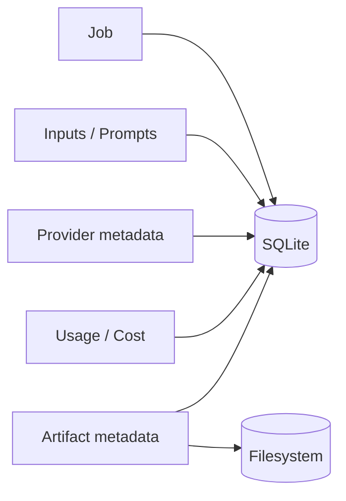
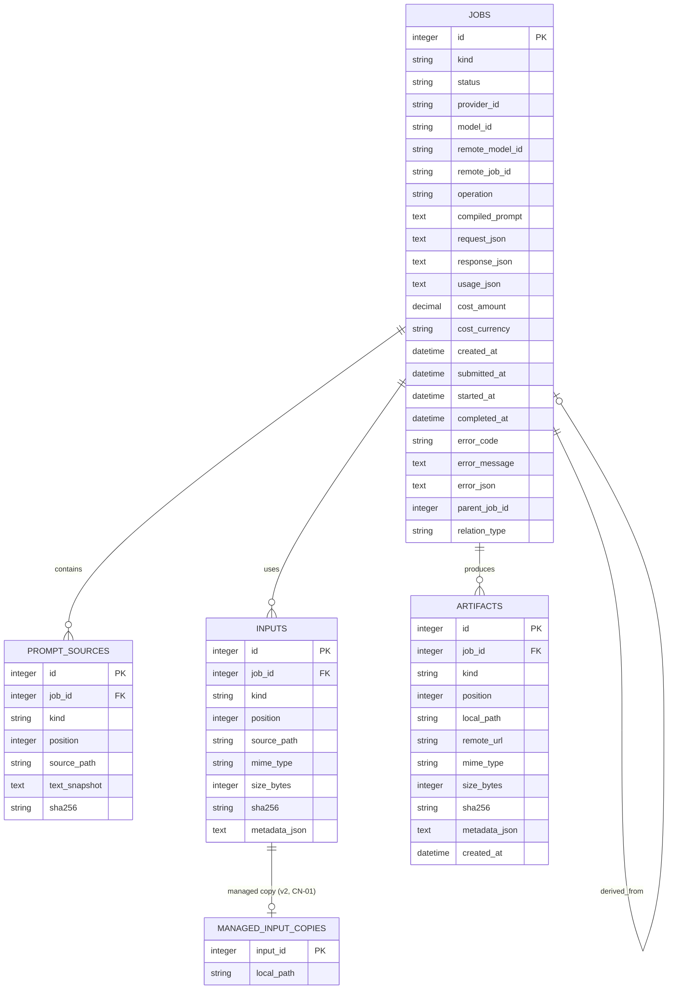
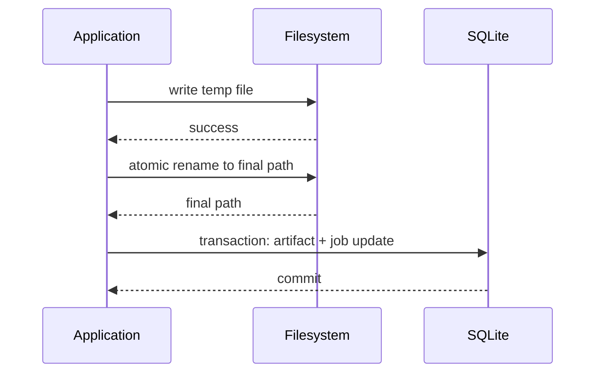
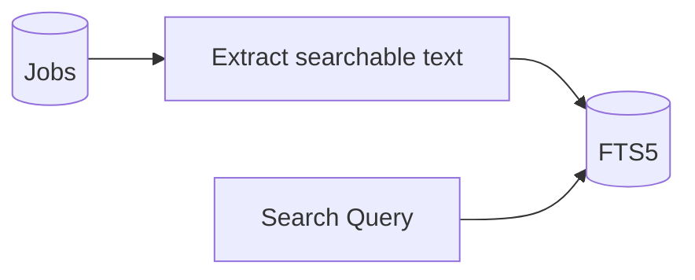
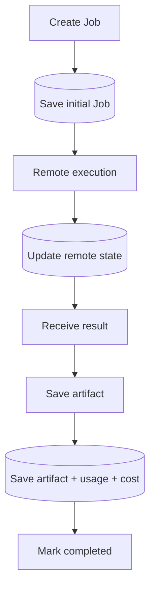
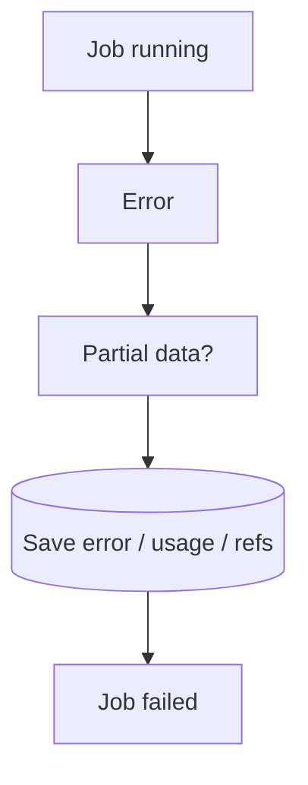
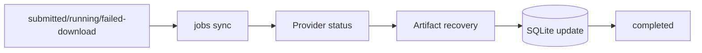
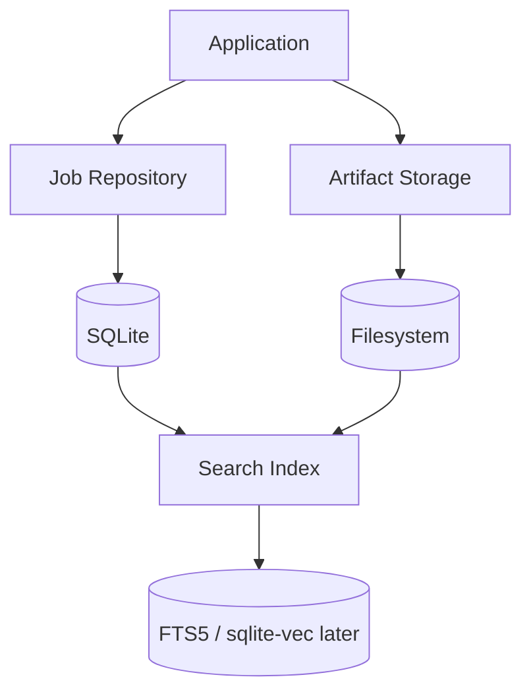

# 07. Storage, History & Costs — SQLite, история заданий, артефакты и учёт стоимости

> [!abstract] Назначение документа
> Этот документ фиксирует архитектуру **локального хранения данных**: SQLite, Peewee-модели, историю Jobs, prompts, inputs, artifacts, usage, cost, файловое хранилище, migrations, recovery-данные и будущие поисковые индексы.
>
> Документ отвечает на вопрос **«что именно сохраняется локально, в каком виде, зачем и какие данные считаются источником истины»**.
>
> В документе намеренно разделяются:
>
> - структурированные данные в SQLite;
> - реальные файлы на диске;
> - provider metadata;
> - история пользователя;
> - диагностические логи;
> - стоимость;
> - usage;
> - будущие search/vector-данные.

---

## Статус документа 🧭

| Поле | Значение |
|---|---|
| Номер | `07` |
| Название | `Storage, History & Costs` |
| Статус | Draft / Foundation |
| Область | Локальное хранение и история |
| Основная версия | `v0.1` |
| Основная БД | SQLite |
| ORM | Peewee |
| Файловое хранилище | Локальная файловая система |
| Поиск v0.1 | SQLite FTS5 (обязателен, E09) |
| Vector search | Позже через `sqlite-vec` |
| Денежная модель | `amount + currency` |
| Валютная конвертация | Не выполняется |

---

# Главная идея хранения 🧠

Приложение должно сохранять достаточно данных, чтобы спустя время можно было ответить на вопросы:

- что было запущено;
- какой prompt реально ушёл модели;
- откуда этот prompt был собран;
- какие файлы использовались;
- какая модель и provider были выбраны;
- какой remote job ID был получен;
- какие параметры были разрешены и отправлены;
- чем завершилось задание;
- какие artifacts были получены;
- где они находятся локально;
- сколько стоил запрос;
- какие usage-метрики вернул provider;
- что произошло при ошибке;
- можно ли безопасно повторить или синхронизировать Job.

История является частью продукта, а не побочным логом.



---

# Основной принцип разделения 🧱

> [!important]
> **SQLite хранит структуру, связи, историю и metadata.**
>
> **Файловая система хранит реальные бинарные и текстовые artifacts.**

Изображения, аудио, видео, большие Markdown/JSON outputs не должны по умолчанию складываться в SQLite BLOB.

---

# Почему SQLite 🗄️

Для локального однопользовательского CLI SQLite подходит почти идеально.

Преимущества:

- не нужен отдельный сервер;
- один файл базы;
- транзакции;
- индексы;
- foreign keys;
- FTS5;
- хорошая переносимость;
- простое резервное копирование;
- возможность позже подключить `sqlite-vec`;
- достаточно для десятков тысяч и даже значительно большего числа Jobs.

---

## Что SQLite здесь не должна изображать

Не нужно превращать локальную БД в:

- распределённую очередь;
- event store;
- message broker;
- аналитический warehouse;
- shared multi-user database.

Это обычное локальное операционное хранилище.

---

# Почему Peewee 🐍

Peewee выбран как лёгкий ORM для локального SQLite-приложения.

Он должен использоваться для:

- моделей таблиц;
- простых relations;
- запросов;
- транзакций;
- миграций;
- repository implementation.

При этом domain objects и Peewee models не должны считаться одним и тем же.

```text
domain.Job
≠
storage.models.JobRecord
```

---

# Основные области хранения 📦

Минимальный набор таблиц первой версии:

```text
jobs
prompt_sources
inputs
artifacts
```

Дополнительно разумно иметь:

```text
schema_migrations
```

С `CN-01` к этому набору добавляется **одна** таблица v2 — `managed_input_copies`
(раздел «Managed-копии reference images»).

Provider/model можно хранить прямо в `jobs` как snapshot-поля.

Отдельные таблицы `providers` и `models` для v0.1 не обязательны, потому что:

- providers задаются кодом/config;
- модели живут в YAML Registry;
- история должна сохранять snapshot, даже если Registry позже изменится.

---

# Предлагаемая логическая схема 🗺️



> [!note]
> Это логическая схема. Точные имена полей и типы Peewee могут быть уточнены при реализации.

---

# Таблица `jobs` ⚙️

`jobs` — центральная таблица истории.

Одна строка соответствует одному логическому AI Job.

---

## Базовые поля

```text
id
kind
status
```

### `id`

Локальный первичный ключ.

Не совпадает с remote ID provider.

### `kind`

Например:

```text
image.generate
audio.transcribe
text.generate
embedding.create
```

### `status`

Нормализованный локальный статус:

```text
created
submitted
running
completed
failed
cancelled
```

---

# Provider snapshot 🌐

В `jobs` должны сохраняться как минимум:

```text
provider_id
model_id
remote_model_id
remote_job_id
operation
```

---

## `provider_id`

Например:

```text
polza
```

Это логический ID adapter.

---

## `model_id`

Canonical model ID из Model Registry.

Например:

```text
seedream-5-pro
```

---

## `remote_model_id`

Фактический model ID, использованный provider adapter.

Это важно для исторической воспроизводимости.

Даже если через полгода binding в Registry изменится, старый Job должен помнить, что реально было вызвано.

---

## `remote_job_id`

Provider task/generation ID.

Он нужен для:

- polling;
- recovery;
- `jobs sync`;
- диагностики;
- связи с provider support.

---

## `operation`

Тип удалённой операции provider (для image — `media`; см. RemoteJobRef в `03`/`05`).
Он сохраняется в provider snapshot, а не выводится заново по строке ID: когда
provider вернул операцию, она хранится вместе с `remote_job_id` и позволяет
восстановить историю и найти правильный remote endpoint после перезапуска CLI.
Endpoint по одной строке ID не угадывается (baseline E00, D10).

---

# Snapshot запроса 📨

History должна сохранять **нормализованный request snapshot**.

Рекомендуемое поле:

```text
request_json
```

Оно содержит сериализованный domain request в provider-neutral форме.

Пример:

```json
{
  "resolution": "2K",
  "aspect_ratio": "16:9",
  "output_format": "webp",
  "max_images": 1
}
```

---

## Почему request snapshot нужен

Даже если часть параметров хранится отдельными колонками, snapshot помогает:

- воспроизводить Jobs;
- добавлять новые параметры без миграции таблицы на каждый флаг;
- показывать `jobs show`;
- сравнивать старые и новые вызовы;
- делать retry.

---

## Что не должно попадать в `request_json`

Запрещено сохранять:

```text
API keys
Authorization headers
полный base64 файлов
секреты
```

Input files описываются отдельно через `inputs`.

---

# Provider response snapshot 📥

Полезно иметь:

```text
response_json
```

Но это не должен быть гигантский сырой payload со всем подряд.

Рекомендуется хранить:

- provider status;
- warnings;
- remote URLs;
- trace IDs;
- provider metadata;
- compact normalized response;
- диагностически важные поля.

---

## Не хранить большие данные внутри response JSON

Не сохранять:

```text
base64 image
base64 audio
binary data
```

Если provider вернул base64, после декодирования сохранить artifact, а в response metadata оставить только факт/размер/MIME.

---

# Prompt history 📝

Prompt history — отдельная важная часть продукта.

Недостаточно сохранить только:

```text
compiled_prompt
```

Нужно также знать, из чего он был собран.

---

# `compiled_prompt`

В `jobs` хранится:

```text
compiled_prompt
```

Это точный финальный текст, переданный модели.

---

## Почему именно точный snapshot

Файл:

```text
character.md
```

может измениться завтра.

Но Job #481 должен навсегда помнить старую версию текста.

---

# Таблица `prompt_sources` 📄

Одна строка — один источник prompt.

Поля:

```text
id
job_id
kind
position
source_path
text_snapshot
sha256
```

---

## `kind`

Например:

```text
inline
file
```

---

## `position`

Фиксирует порядок сборки.

Если CLI был:

```bash
--prompt-file base.md \
--prompt "camera frontal" \
--prompt-file style.md
```

то positions:

```text
0 base.md
1 inline
2 style.md
```

---

## `source_path`

Для inline prompt:

```text
NULL
```

Для файла:

```text
/path/to/base.md
```

---

## `text_snapshot`

Содержимое источника на момент выполнения Job.

---

## `sha256`

Позволяет позже понять, изменился ли source file.

---

# Inputs 📥

Таблица `inputs` хранит внешние файлы, использованные Job.

Примеры:

```text
reference image
audio
video
document
```

---

## Рекомендуемые поля

```text
id
job_id
kind
position
source_path
mime_type
size_bytes
sha256
metadata_json
```

---

# `position` для inputs

Порядок особенно важен для нескольких image references.

```text
image 0
image 1
image 2
```

Должен сохраняться точно.

---

# Input file copy policy 📁

В v0.1 **не обязательно копировать все input files внутрь app storage**.

Можно хранить:

```text
source_path
sha256
metadata
```

Это экономит место.

Но у такого подхода есть ограничение:

> Пользователь может удалить или изменить исходный файл.

---

## Возможные режимы

### Reference-only

Храним путь + hash.

Плюсы:

- просто;
- без дублирования.

Минусы:

- старый Job может потерять исходник.

### Snapshot-copy

Копируем input в app storage.

Плюсы:

- полная воспроизводимость.

Минусы:

- расход диска.

---

> [!warning] Раздел устарел (superseded решением `CN-01`)
> Рекомендация ниже — reference-only без копирования inputs — **не действует** для
> reference images. Решение — [`release-scope.md`](release-scope.md), change note
> `CN-01`: входы сохраняются долговечными managed-копиями. Исходный текст
> спецификации сохранён ниже как история; при расхождении действуют `CN-01` и
> раздел «Managed-копии reference images» ниже.

## Решение для v0.1

Рекомендуется:

> **По умолчанию хранить ссылку + hash, без копирования inputs.**

Hash входного файла — обязательное поле истории v0.1 (baseline E00, D15): даже
режим reference-only без копирования сохраняет `inputs.sha256` и `source_path`.

В будущем можно добавить настройку:

```text
preserve_inputs = true
```

для snapshot-copy — **не** для reference images (см. `CN-01` выше).

---

# Managed-копии reference images (CN-01) 🗂️

Reference images, переданные в Job, сохраняются управляемыми копиями в
managed-дереве app data и связываются с Job. Это закрывает единственное слабое
место reference-only режима: пользователь может удалить или изменить исходник
после выполнения Job.

> [!important] Первый code-срез `CN-01` реализован не весь
> Реализованы: доменное поле `InputRef.managed_path` (лексическая проверка без IO) и
> таблица **v2** `managed_input_copies` в единственной цепочке `MIGRATIONS`; v1 DDL
> не переписывается, legacy-строки не backfill-ятся. **Не реализованы:** файлы
> managed-копий (каталог `inputs/`, публикация, чтение), порядок D03, обработка сбоя
> после публикации и backup-манифест. Ссылка на этот раздел не подтверждает
> существования managed-копии как файла. Объём — [`release-scope.md`](release-scope.md), `CN-01`.

## Схема v2

Новые данные оформляются **миграцией v2**, которая добавляет **одну** таблицу:

```text
managed_input_copies
    input_id    INTEGER PRIMARY KEY REFERENCES inputs(id) ON DELETE CASCADE
    local_path  TEXT NOT NULL UNIQUE
```

- Связь `InputRef → копия` — `1:0..1`: строка есть только у входа с managed-копией.
- `local_path` — относительный путь внутри managed-дерева; уникальность не даёт
  двум входам сослаться на один файл.
- Hash, MIME, размер, позиция и `source_path` **остаются в `inputs`**: v2 не
  дублирует исторические поля и не добавляет колонок в `inputs`. Строка копии
  допустима только при заполненных `sha256`, MIME и размере: копия публикуется из
  проверенных байтов, и ссылка без них не доказывает соответствие копии входу.
  Повреждённая строка (пустой путь, `//`, `./`) — отказ чтения Job, а не legacy-вход:
  legacy — это **отсутствие** строки.
- Schema **v1 не переписывается**. Новые ORM-модели подключаются в runtime bindings,
  но не попадают в список создания v1; повторный запуск миграций — no-op;
  автоматический destructive downgrade не обещается (D11).
- Старые строки `inputs` **не backfill-ятся**: миграция не читает пользовательские
  файлы и не меняет `completed` Jobs. Отсутствие строки в `managed_input_copies`
  означает «managed-копии нет» (legacy), а не повреждение истории.
- Новых конфигурационных флагов не вводится: копирование reference images не
  управляется опцией `preserve_inputs` и не отключается на один запуск.

## Пути

```text
<app_data>/inputs/<job_id>/<position>.<ext>
```

- Путь строится из **Job ID и position**, а не из изменяемого локального `input.id`.
- `<ext>` берётся из MIME проверенных байтов, а не из расширения исходного файла.
- `local_path` относителен: абсолютные и drive-relative пути, `..`, выход за root,
  symlink/junction в существующих компонентах отклоняются.
- Публикация — no-clobber по тем же правилам, что и managed artifacts: временный
  файл, flush/fsync, эксклюзивное создание конечного имени; при конфликте
  используется suffix-схема с сохранением фактического пути. Чужой файл не
  перезаписывается, пользовательский исходник не копируется в `--out` и не
  удаляется.
- Копии входят в то же managed-дерево и тот же манифест quiescent offline backup,
  что и managed artifacts ([`backup-contract.md`](backup-contract.md)).

## Порядок до платного POST (D03)

1. Разобрать intent и один раз прочитать исходные байты источника.
2. Создать и подтвердить Job ID.
3. Выполнить предметную pre-submit validation подготовленного снимка.
4. Опубликовать **неизменённые проверенные** байты в managed-копию.
5. Сохранить связи для **всех** референсов Job и подтвердить запись.
6. Только затем разрешить submit.

Ошибка чтения источника не создаёт Job (D03). Ошибка validation оставляет `failed`
Job. Ошибка публикации копии запрещает submit. SQLite-транзакция через HTTP не
удерживается.

## Домен, история и транспорт

- `InputRef.path` остаётся provenance исходного файла и не подменяется;
  необязательное поле `InputRef.managed_path` несёт относительный путь копии и
  требует заполненных `sha256`/MIME/размера ([`03-domain-model.md`](03-domain-model.md)).
- Копия входного ресурса **не является** `Artifact` результата: artifacts —
  результат Job, копия — вход.
- Байты копии не попадают ни в SQLite, ни в домен: таблица хранит только связь и
  относительный путь.
- Application-слой формирует небольшой снимок «`InputRef` + bytes», а transport
  request строится из безопасно разрешённых managed-путей; проверка фактических
  байтов/hash в gateway перед POST сохраняется.
- Repository удаляет и пересоздаёт `inputs` при каждом сохранении Job, поэтому
  строка `managed_input_copies` пересоздаётся вместе с новым `input.id` в той же
  транзакции и восстанавливается при чтении. Файловое имя не зависит от `input.id`.
  Прочитанное значение передаётся домену сырой строкой: пустой путь или `//`/`./`
  отклоняется как повреждённая запись, а не превращается в legacy-`None`.

## Отказы и владение файлами

FS и SQLite не образуют общую атомарную транзакцию.

- Неопубликованный собственный temp-файл можно удалить.
- После публикации и ошибки БД файл **не удаляется**, submit запрещён; состояние
  сверяется по известному Job ID, относительному пути, hash и размеру.
- Исключение после возможного DB commit не доказывает rollback: без успешной
  сверки нужно остановиться, ничего не удалять и не повторять создание Job или
  оплаченный submit.
- Crash может оставить orphan; фоновый GC, cleanup-команда, дедупликация и backup
  CLI в v0.1 не появляются. Пользовательские файлы и чужие конфликты имён не
  удаляются.
- Windows stdlib threat model не расширяется: враждебная подмена каталогов после
  preflight и атомарная power-loss durability не обещаются.

## Требуемые проверки при реализации (файловый слой — `NOT_RUN`)

Первые два пункта покрыты первым code-срезом `CN-01` (миграция v1→v2 и пересоздание
связи при повторном `save`); остальные — файловая работа, порядок D03, отказы
публикации и backup — остаются `NOT_RUN` до следующего среза.

- миграция v1 → v2: DDL v1 не изменён, данные v1 сохранены, повторный apply — no-op,
  FK/`ON DELETE CASCADE` работают, сбой не оставляет половину v2;
- повторный `save` Job, смена статуса и reopen восстанавливают связь
  Job → managed-копия с новыми `input.id`;
- удаление или изменение исходника после подготовки не мешает чтению копии и не
  меняет сохранённые hash/MIME/size/позицию;
- конфликт имени, symlink/junction и `..` не выходят за managed root;
- сбой до и после commit не создаёт ложный `completed` и не приводит к повторному
  submit (`submit_count == 0` для pre-submit отказов);
- backup/restore с отсутствующим файлом, несовпадающим hash или дубликатом пути
  делает снимок непроверенным.

---

# Artifact storage 📦

Artifacts — реальные результаты Jobs.

Примеры:

```text
PNG
WebP
JPEG
MP3
WAV
Markdown
JSON
SRT
VTT
MP4
```

---

# Таблица `artifacts`

Рекомендуемые поля:

```text
id
job_id
kind
position
local_path
remote_url
mime_type
size_bytes
sha256
metadata_json
created_at
```

---

# `local_path`

Главная ссылка на реальный сохранённый результат.

---

# `remote_url`

Provider URL сохраняется как provenance/diagnostic metadata.

Он не считается постоянным результатом.

---

# Почему remote URL недостаточно ⚠️

Provider/CDN может:

- удалить файл;
- истечь по TTL;
- изменить URL;
- потребовать auth;
- стать недоступным.

Поэтому file-producing Job должен стремиться к локальному artifact.

---

# `metadata_json`

Для изображений:

```json
{
  "width": 2048,
  "height": 2048,
  "format": "WEBP"
}
```

Для аудио:

```json
{
  "duration_seconds": 43.2,
  "sample_rate": 44100
}
```

Для видео:

```json
{
  "duration_seconds": 10,
  "width": 1920,
  "height": 1080
}
```

---

# Artifact directory layout 📂

Рекомендуемая структура:

```text
<app_data>/
├── database.sqlite3
├── outputs/
│   ├── 2026-09-28/
│   │   ├── job_481/
│   │   │   ├── result_001.webp
│   │   │   └── result_002.webp
│   │   └── job_482/
│   │       └── result_001.png
│   └── ...
├── inputs/
│   └── ...
├── cache/
└── logs/
```

Каталог `inputs/` — managed-копии reference images по `CN-01` (планируется):
`inputs/<job_id>/<position>.<ext>`. Внешние `--out` байты в managed-копию не
входят.

---

## Почему группировать по Job

Преимущества:

- нет конфликтов имён;
- легко найти все artifacts задания;
- простое удаление/архивация;
- понятная связь с history;
- удобно агентам.

---

# Пользовательский `--out` 📁

Если пользователь указывает:

```bash
--out D:\Comic\Scientist
```

artifact сохраняется туда.

SQLite всё равно хранит фактический путь.

---

## App-managed vs user-managed output

Полезно различать:

```text
managed
user_output
```

в metadata, если позже появится cleanup.

Приложение не должно автоматически удалять пользовательский output.

> [!important]
> Решение baseline E00: при заданном `--out` сохраняется **один конечный artifact по
> фактическому пути**; SQLite хранит этот фактический путь (абсолютный для внешнего
> `--out`). Скрытое двойное копирование в managed-каталог не выполняется.
> `--keep-original` сохраняет provider-original отдельной ролью artifact.

---

# Формат пути в БД 🧭

Если artifact находится внутри app data directory, можно хранить относительный путь.

Если пользователь указал внешний `--out`, хранить абсолютный путь.

---

## Почему так

Перенос app directory проще при relative paths.

Но внешний пользовательский путь нельзя надёжно сделать relative.

---

# File naming 🏷️

По умолчанию:

```text
result_001.webp
result_002.webp
```

Если пользователь передал:

```bash
--name scientist-front
```

получаем:

```text
scientist-front.webp
scientist-front_002.webp
```

---

# Политика коллизий ♻️

Нельзя молча перезаписывать существующий пользовательский файл.

Рекомендуемая политика:

```text
name.ext
name_002.ext
name_003.ext
```

---

## Explicit overwrite

Если когда-нибудь появится:

```bash
--overwrite
```

он должен быть явным.

В v0.1 можно вообще не вводить overwrite.

---

# Hashing 🔐

Для inputs и artifacts — SHA-256. Для `inputs.sha256` это **обязательное** поле
истории v0.1 (baseline E00, D15); интерфейс artifact допускает `sha256 = NULL`
только если hash артефакта ещё не вычислен.

---

## Зачем hash

- проверка целостности;
- deduplication;
- cache;
- embeddings cache;
- поиск одинаковых files;
- reproducibility;
- сравнение source snapshot.

---

## Когда считать hash

Для типичных image files можно считать сразу при сохранении.

Для очень больших будущих video files можно рассмотреть lazy hash.

Но интерфейс должен допускать `sha256 = NULL`.

---

# Usage 📊

Usage должен храниться отдельно от Cost.

Полезно иметь:

```text
usage_json
```

как raw/normalized snapshot.

---

## Пример

```json
{
  "output_units": 1,
  "duration_seconds": null,
  "input_tokens": null,
  "output_tokens": null,
  "raw": {
    "output_units": 1,
    "cost_rub": 4.0
  }
}
```

---

# Почему JSON, а не десятки колонок

Разные modalities используют разные метрики:

```text
images
tokens
seconds
characters
dimensions
output units
```

Попытка создать столбец на каждый тип приведёт к огромной nullable-таблице.

Поэтому:

- несколько часто используемых полей можно позже денормализовать;
- полный usage хранится в JSON.

---

# Cost 💰

Стоимость хранится отдельно:

```text
cost_amount
cost_currency
```

Примеры:

```text
4.00 + RUB
0.08 + USD
```

---

# Почему две колонки, а не строка

Плохо:

```text
"4 RUB"
```

Лучше:

```text
amount = Decimal("4.00")
currency = "RUB"
```

Это позволяет:

- фильтровать;
- суммировать внутри одной валюты;
- строить отчёты;
- не парсить строки.

---

# Тип `cost_amount`

В Python:

```text
Decimal
```

В SQLite можно хранить:

- TEXT decimal representation;
- либо integer minor units;
- либо NUMERIC с аккуратной сериализацией.

---

## Рекомендуемый вариант для v0.1

Хранить decimal как строковое значение:

```text
"4.00"
"0.0831"
```

и преобразовывать через `Decimal`.

Это проще и исключает floating-point surprises.

> [!important]
> Решение baseline E00: decimal-as-TEXT ↔ `Decimal` в Python без прохождения через
> float. Суммы по каждой валюте считаются **в Python**, а не SQL `SUM()`; агрегаты
> разных валют не смешиваются. Ноль (известная цена `0`) и неизвестная цена —
> разные состояния и не сводятся друг к другу.

---

# Currency 💱

`cost_currency` хранит ISO-style код:

```text
RUB
USD
KZT
EUR
```

В v0.1 реально ожидаются прежде всего:

```text
RUB
USD
```

---

# Нет валютной конвертации 🚫

Приложение **не конвертирует**:

```text
RUB → USD
USD → KZT
```

Если Jobs имеют разные валюты, отчёт должен группировать их отдельно.

---

## Правильный отчёт

```text
Today:
  148.00 RUB
  3.42 USD
```

---

## Неправильный отчёт

```text
Total: 2143.17 KZT
```

если пользователь не подключал отдельную систему валютных курсов.

---

# Cost может быть неизвестен 🕳️

Нормально:

```text
cost_amount = NULL
cost_currency = NULL
```

если provider не сообщил цену.

---

# Нельзя подменять фактическую стоимость каталожной ⚠️

Registry pricing:

```text
estimate
```

Provider response:

```text
actual
```

История Job хранит actual.

Если actual отсутствует, можно отдельно показывать estimate, но не записывать его как будто он фактический.

---

# Cost reports 📈

Обязательные команды v0.1 (E09):

```bash
aimedia jobs costs --today
aimedia jobs costs --month
```

Результат группируется по валюте; `--json` сохраняет тот же контракт и exit codes,
что и остальные команды.

---

## Пример

```text
September 2026

RUB
  428.50

USD
  12.84
```

---

# Job timestamps 🕒

Рекомендуемые поля:

```text
created_at
submitted_at
started_at
completed_at
```

Хранятся в UTC.

---

## Presentation

CLI может показывать локальное время.

Но БД хранит timezone-aware UTC representation.

---

# Ошибки 🧯

Для failed Job необходимо сохранять:

```text
error_code
error_message
error_json
```

---

## `error_code`

Нормализованный внутренний код:

```text
PROVIDER_TIMEOUT
REMOTE_GENERATION_FAILED
ARTIFACT_DOWNLOAD_FAILED
```

---

## `error_message`

Читаемая краткая ошибка.

---

## `error_json`

Дополнительные детали:

```json
{
  "provider_code": "BAD_GATEWAY",
  "trace_id": "...",
  "retryable": true,
  "metadata": {}
}
```

---

# Не хранить stack trace как часть Job history 📜

Stack trace — диагностический log.

Job history хранит нормализованную ошибку.

---

# Logs ≠ History ⚠️

Это отдельные системы.

```text
History
→ что произошло с пользовательским Job

Logs
→ как работала программа внутри
```

---

# Логи 📜

Рекомендуемая директория:

```text
<app_data>/logs/
```

Минимальные поля события:

```text
timestamp
level
component
job_id
provider
event
message
```

---

# Что нельзя логировать 🔐

- API keys;
- Authorization headers;
- полный base64;
- secrets;
- огромные binary payloads.

Prompt logging лучше ограничить или отключить в diagnostics, потому что prompt уже хранится в history.

---

# Родительские связи Jobs 🔗

Для retry/variation/upscale полезны поля:

```text
parent_job_id
relation_type
```

Примеры:

```text
retry_of
variation_of
derived_from
upscale_of
extend_of
```

---

# Retry history ♻️

Retry **не изменяет** исходный Job.

Пример:

```text
Job 481 failed
↓ retry
Job 512 created
parent_job_id = 481
relation_type = retry_of
```

---

# Почему это важно

Можно увидеть:

- сколько было попыток;
- какие стоили денег;
- какие упали;
- какой вариант оказался успешным.

---

# Иммутабельность истории 🔒

После terminal state ключевые поля Job считаются историческим snapshot.

Не следует менять:

- prompt;
- model;
- provider;
- request parameters;
- cost;
- usage;
- remote model ID.

---

## Что можно дополнять позже

Допустимо:

- добавить hash artifact;
- восстановить пропущенный artifact;
- добавить search index;
- добавить derived metadata;
- отметить file missing;
- добавить downstream provider metadata.

---

# Job completion и storage consistency ✅

Для file-producing Job статус `completed` должен выставляться только после:

1. provider сообщил успех;
2. обязательный result получен;
3. artifact сохранён локально;
4. artifact metadata записана;
5. usage/cost сохранены;
6. транзакция history успешно завершена.

---

# Локальный сбой после remote success ⚠️

Сценарий:

```text
provider generation completed
↓
download failed
```

Нельзя просто потерять remote result.

Job должен сохранить:

```text
remote_job_id
remote_url
provider completed state
error = ARTIFACT_DOWNLOAD_FAILED
```

чтобы `jobs sync` или recovery мог повторить скачивание.

---

# Storage transaction boundaries 🧱

SQLite операции вокруг важных переходов должны использовать транзакции.

Например:

```text
save artifact metadata
update usage
update cost
set completed
```

желательно выполнять атомарно.

---

# Но файловая система не транзакционна 🗂️

Нельзя сделать настоящую общую транзакцию:

```text
SQLite + file write
```

Поэтому нужен аккуратный порядок.

---

# Рекомендуемый порядок записи artifact 📦



---

# Temporary files 🧪

При скачивании использовать:

```text
.tmp
.part
```

или временный файл.

После успешной записи:

```text
atomic rename
```

где ОС позволяет.

---

# Если DB commit упал после сохранения файла 🧯

Может остаться orphan file.

Поэтому полезна будущая maintenance-команда:

```text
aimedia maintenance scan
```

Но для v0.1 достаточно логировать проблему.

---

# Если файл не сохранился

Не записывать artifact как успешный.

---

# File existence tracking 🔎

При `jobs show` можно проверять:

```text
local_path exists?
```

и показывать:

```text
available
missing
```

Это лучше, чем предполагать, что история всегда соответствует диску.

---

# Delete policy 🗑️

Удаление Job history и удаление artifacts — разные операции.

Не следует автоматически связывать их без явного UX.

---

## Возможная будущая команда

```bash
aimedia jobs delete 481
```

может иметь режимы:

```text
history only
artifacts only
both
```

Но v0.1 удаление не является обязательным.

---

# Cleanup cache 🧹

`cache/` можно безопасно очищать.

`outputs/` — пользовательские результаты, их автоматическая очистка опасна.

---

# Database location 📍

Использовать системную data directory через `platformdirs`.

Концептуально:

```text
Windows:
%LOCALAPPDATA%/AI-Media/

Linux:
~/.local/share/AI-Media/

macOS:
~/Library/Application Support/AI-Media/
```

Точный package name можно определить позже.

---

# Config ≠ Data ⚙️

Разделять:

```text
config directory
```

и:

```text
data directory
```

Config:

```text
settings.toml
```

Data:

```text
database.sqlite3
outputs/
```

---

# Database connection settings 🔧

Для локальной CLI разумно:

```text
foreign_keys = ON
WAL mode
busy_timeout
```

---

## WAL

Write-Ahead Logging полезен даже локально:

- лучше concurrency;
- чтение меньше блокирует запись;
- batch Jobs проще сосуществуют.

---

# SQLite concurrency ⚡

При 3–5 параллельных async Jobs SQLite справится нормально, если:

- записи короткие;
- транзакции не держатся во время HTTP;
- БД не используется как очередь;
- включён reasonable busy timeout.

---

# Не держать транзакцию во время network call 🚫

Плохо:

```text
BEGIN
↓
POST provider
↓
wait 40 seconds
↓
COMMIT
```

Правильно:

```text
short DB update
↓
network
↓
short DB update
```

---

# Repository layer 🧱

Application должна работать через repositories.

Концептуально:

```python
class JobRepository(Protocol):
    def create(...)
    def get(...)
    def update_status(...)
    def save_result(...)
    def list_recent(...)
```

---

# Не передавать Peewee models наружу 🚫

Repository преобразует:

```text
Peewee record
↔
domain object / application DTO
```

---

# Migrations 🔄

Schema должна развиваться через миграции.

Не использовать:

```text
drop DB and recreate
```

после появления пользовательской истории.

---

# Таблица `schema_migrations` 🧬

Минимально:

```text
version
applied_at
```

---

# Версия схемы

Например:

```text
1
2
3
```

При старте приложение проверяет current schema.

> [!note]
> Следующая версия после v1 — **v2** по `CN-01` (реализована): добавляется только
> таблица `managed_input_copies`, DDL v1 не переписывается (раздел
> «Managed-копии reference images»).

---

# Миграции должны быть последовательными 🧱

```text
001_initial
002_add_parent_job
003_add_artifact_hash
```

---

# Peewee migrator 🛠️

Можно использовать `playhouse.migrate` или собственный небольшой migration runner.

Не требуется Alembic.

> [!important]
> Решение baseline E00: в v0.1 используется **ровно один** migration runner. После
> проверки версии Peewee выбирается поддерживаемый API (`playhouse.migrate` /
> `pwmigrate` из `playhouse.migrations.Runner`) **или** один собственный runner,
> но не оба одновременно. Конкретный API фиксируется на E01/E04 по фактической
> закреплённой версии; здесь — требование, не выбранная реализация.

---

# Backup перед рискованной миграцией 💾

Для destructive/complex migration полезно:

```text
database.sqlite3.backup-YYYYMMDD...
```

Это особенно дешёвая страховка для локального файла.

---

# JSON fields 🧾

SQLite не требует отдельного document store.

Для гибких metadata подходят TEXT JSON поля:

```text
request_json
response_json
usage_json
error_json
metadata_json
```

---

# JSON serialization rules 🔒

- UTF-8;
- stable keys для tests желательно;
- без secrets;
- Path → string;
- Decimal → string;
- datetime → ISO 8601;
- enum → value.

---

# FTS5 🔍

FTS5 является обязательным компонентом v0.1 (E09); поиск остаётся лексическим.

Полезно индексировать:

```text
compiled_prompt
artifact text content
model_id
source filenames
labels
```

---

# FTS5 не должен быть частью основной таблицы Jobs

Лучше отдельный virtual table / индексный слой.



---

# Reindex 🔄

Если search schema изменится:

```text
rebuild FTS index
```

должно быть возможно без изменения основной истории.

---

# sqlite-vec позже 🧬

Vector search — будущий отдельный слой.

Потенциальная схема:

```text
documents
chunks
embeddings
vec index
```

---

## Не хранить vectors в `jobs`

Embedding data имеют другой lifecycle и размер.

---

# Будущие таблицы semantic search 🔭

Концептуально:

```text
documents
chunks
embeddings
```

где source может ссылаться на:

```text
job prompt
artifact text
external document
```

---

# Embedding cache 🧠

SHA-256 текста/чанка можно использовать как cache key.

Это одна из причин хранить hashes.

---

# Search data можно пересоздать ♻️

FTS/vector indexes считаются производными.

Если они сломались, их можно rebuild из основной истории.

Это важный архитектурный принцип.

---

# Source of Truth 🧭

Основные источники истины:

| Данные | Source of Truth |
|---|---|
| Job history | SQLite `jobs` |
| Prompt snapshot | SQLite |
| Input metadata | SQLite |
| Binary output | Filesystem |
| Artifact metadata | SQLite |
| Model capabilities | YAML Registry |
| Provider secrets | Config/env |
| Actual cost | Job history from provider response |
| Search index | Derived / rebuildable |
| Logs | Diagnostic only |

---

# Backup strategy 💾

Для локального приложения резервная копия проста.

Нужно сохранить:

```text
database.sqlite3
outputs/
inputs/
```

`inputs/` — managed-копии reference images по `CN-01` (до реализации файлового
слоя копий их в дереве нет). Внешние `--out` байты в managed-копию не входят.

---

# Consistent backup 🧱

Если CLI активно пишет в WAL, простой copy DB-файла может быть недостаточен.

Для будущей backup-команды использовать SQLite backup API.

> [!important]
> Полный инвариант согласованной копии БД и managed artifacts — в
> [`backup-contract.md`](backup-contract.md). Это политика E05+, а не функция v0.1.0.

---

# Возможная команда `backup` 🔒

Не обязательна v0.1:

```bash
aimedia backup create
```

Создаёт:

```text
database snapshot
+
managed artifacts
```

---

# Portability 📦

Если все managed paths относительные внутри app data, проект проще переносить на другую машину.

User-output paths могут стать недоступными — это нормально и отражается как missing external artifact.

---

# Import/export Jobs 🔄

Не обязательная v0.1 функция, но архитектура должна позволять экспорт:

```json
job
prompts
inputs metadata
artifacts metadata
```

без прямого копирования всей БД.

---

# Privacy 🔐

History хранит пользовательские prompts и пути к файлам.

Это локальные данные.

Не отправлять историю наружу автоматически.

---

# API keys не хранятся в history 🚫

Никогда.

Даже если provider response случайно вернул часть credential metadata, mapper должен её удалить.

---

# Path privacy 🧷

Если когда-нибудь появится экспорт diagnostics, абсолютные пользовательские пути желательно редактировать/анонимизировать.

Обычный локальный `jobs show` может показывать реальные пути.

---

# Cost aggregation 📊

Суммировать можно только совместимые валюты.

SQL/application:

```text
GROUP BY cost_currency
```

---

# Cost by provider/model 💵

Позже легко строить:

```text
cost by provider
cost by model
cost by day
cost by month
```

без FX.

---

# Failed Jobs и cost 💸

Failed Job может иметь стоимость.

Например provider мог списать деньги до локального download failure.

Поэтому:

```text
status = failed
```

не означает:

```text
cost = 0
```

---

# Cancelled Jobs и cost 💸

Аналогично provider может частично списать средства.

История хранит фактический provider response.

---

# Unknown cost не равен zero ⚠️

```text
NULL
```

и:

```text
0.00
```

имеют разный смысл.

`NULL` — неизвестно.

`0.00` — provider явно сообщил нулевую стоимость.

---

# Usage и failed Jobs 📊

Даже failed Job может содержать usage.

Не удалять его.

---

# Partial artifacts 🧩

Failed Job может иметь несколько сохранённых artifacts.

История должна это поддерживать.

---

# Artifact position 🔢

Поле `position` позволяет сохранить исходный порядок provider results.

Например:

```text
0
1
2
3
```

---

# MIME и extension consistency 📎

После локальной конвертации metadata должны отражать **финальный файл**:

```text
local_path = result.webp
mime_type = image/webp
```

Provider original metadata можно сохранить отдельно.

---

# Original + converted artifact 🖼️

Если пользователь выбрал:

```bash
--keep-original
```

можно сохранить два artifacts:

```text
provider_original
final
```

или использовать metadata role.

Например:

```json
{
  "role": "original"
}
```

и:

```json
{
  "role": "final"
}
```

---

# Job labels / notes 🏷️

Не обязательны v0.1, но полезное расширение.

Можно позже добавить:

```text
label
note
tags
```

без изменения основной модели.

---

# IDs для artifacts и inputs 🪪

Каждая запись получает собственный локальный ID.

Это пригодится для:

- search;
- embeddings;
- ссылок;
- будущих operations.

---

# Foreign keys 🔗

Все дочерние записи:

```text
prompt_sources
inputs
artifacts
```

имеют FK на Job.

---

# Delete behavior 🚫

Не использовать случайный `ON DELETE CASCADE` без продуктового решения.

Удаление Job может нечаянно потерять важную историю.

Для v0.1 удаление вообще можно не реализовывать.

> [!note]
> `ON DELETE CASCADE` в v2 (`managed_input_copies.input_id → inputs.id`) — принятое
> решение `CN-01` для связи копии со входом, а не разрешение каскадно удалять
> историю Job: каскад убирает только строку связи «вход → копия».

---

# Soft delete 🗑️

Если позже понадобится удаление, лучше рассмотреть:

```text
deleted_at
```

чем физическое удаление сразу.

Но это не обязательная часть первой версии.

---

# DB indexes ⚡

Минимальные индексы:

```text
jobs(status)
jobs(created_at)
jobs(model_id)
jobs(provider_id)
artifacts(job_id)
inputs(job_id)
prompt_sources(job_id)
```

---

# Индекс remote job ID 🔎

Полезно:

```text
(provider_id, remote_job_id)
```

для recovery/sync.

---

# Uniqueness remote job ID 🧷

Не обязательно глобально unique.

Лучше:

```text
UNIQUE(provider_id, remote_job_id)
```

если provider действительно гарантирует уникальность.

Если нет уверенности — обычный индекс.

---

# Recent Jobs 🕘

`jobs recent` должен быть дешёвым:

```text
ORDER BY created_at DESC
LIMIT N
```

Поэтому индекс по `created_at` обязателен.

---

# Status sync query 🔄

`jobs sync` обычно ищет:

```text
status IN (submitted, running)
AND remote_job_id IS NOT NULL
```

Это тоже кандидат на индекс.

---

# Database size 📏

Даже сотни тысяч Jobs с metadata останутся вполне приемлемыми для SQLite.

Основной объём будут занимать artifacts, а не БД.

---

# Vacuum / maintenance 🧹

Автоматический `VACUUM` после каждого действия не нужен.

Можно позже добавить maintenance-команду.

---

# Integrity check 🩺

Полезная будущая команда:

```bash
aimedia maintenance check
```

может проверять:

- SQLite integrity;
- missing artifacts;
- orphan files;
- invalid hashes.

---

# Storage service boundaries 🧱

Рекомендуемые компоненты:

```text
JobRepository
PromptSourceRepository
ArtifactRepository
ArtifactStorage
DatabaseManager
MigrationRunner
```

Не обязательно делать repository на каждую таблицу, если это приводит к бюрократии.

---

# ArtifactStorage interface 📦

Концептуально:

```python
class ArtifactStorage(Protocol):
    async def save(...)
    def exists(...)
    def resolve_path(...)
```

Он не знает о HTTP provider.

---

# DatabaseManager 🗄️

Отвечает за:

- connection;
- pragmas;
- migrations;
- transaction helper;
- lifecycle.

---

# Composition root 🔧

При запуске создаются:

```text
database
repositories
artifact storage
```

и передаются application services.

---

# Отдельный storage domain не нужен ☁️

В v0.1 не надо строить абстракцию:

```text
S3
MinIO
Cloud Storage
```

Локальная файловая система — достаточный adapter.

Если позже появится cloud storage, можно добавить второй ArtifactStorage.

---

# Экспорт результата в пользовательский путь 📁

`--out` не отменяет запись artifact metadata.

Даже внешний файл остаётся связан с Job.

---

# External artifact missing 📭

Если пользователь позже удалил файл:

```text
jobs show
```

может показать:

```text
Artifact: missing
Path: ...
```

History при этом остаётся.

---

# Обновление path после ручного перемещения 🚚

Автоматически отслеживать ручные перемещения файлов не нужно.

Будущая команда relink может быть добавлена при необходимости.

---

# Input path changes 📂

Hash позволяет пользователю понять, что файл по старому path теперь другой.

Но CLI не обязана постоянно сканировать это автоматически.

---

# Metadata versioning 🔢

Внутренние JSON structures могут иметь optional:

```text
schema_version
```

если их формат начнёт активно меняться.

В v0.1 можно обойтись DB schema version.

---

# Storage tests 🧪

Нужны отдельные тесты:

### Job create/read

Созданный Job восстанавливается без потери данных.

### Prompt order

Prompt sources сохраняют position.

### Artifact metadata

Путь, MIME, hash, size сохраняются.

### Cost precision

`Decimal("0.0831")` не превращается в неточный float.

### Multi-currency

RUB и USD не суммируются вместе.

### Migration

Старая schema обновляется.

### Recovery

Remote job ID можно найти и синхронизировать.

### Missing file

History остаётся читаемой.

### Managed-копии входов (`CN-01`)

Миграция v1 → v2 без правки v1; связь Job → managed-копия после повторного
save/смены статуса/reopen; копия читается после удаления исходника; collision,
`..` и symlink не выходят за managed root; отказ публикации или БД не создаёт
ложный `completed` и не повторяет submit.

---

# Temporary test database 🧪

Tests используют временную SQLite.

Не трогают пользовательскую БД.

---

# Filesystem tests 📁

Использовать temporary directory.

Проверять:

- atomic save;
- collision policy;
- format extension;
- hash;
- user output path.

---

# Backup tests 💾

Если backup появится, тестировать отдельно.

---

# Migration tests 🔄

Каждая migration должна тестироваться:

```text
previous schema
↓
apply
↓
new schema
↓
data preserved
```

---

# FTS tests 🔍

FTS5 входит в обязательный scope v0.1 (E09):

- prompt indexing;
- search result mapping;
- rebuild.

---

# sqlite-vec не должен ломать базовую БД 🧬

Vector extension подключается как optional capability.

Если `sqlite-vec` отсутствует, базовая история должна продолжать работать.

---

# Возможная модульная структура storage 📂

```text
storage/
├── database.py
├── pragmas.py
├── migrations.py
│
├── models/
│   ├── job.py
│   ├── prompt_source.py
│   ├── input.py
│   └── artifact.py
│
├── repositories/
│   ├── jobs.py
│   └── artifacts.py
│
├── filesystem.py
├── serialization.py
└── search/
    ├── fts.py
    └── vector.py
```

---

# Что хранить в Job, а что вычислять 🧮

Хранить:

```text
что реально произошло
```

Вычислять:

```text
presentation
aggregates
derived reports
```

Например:

```text
duration = completed_at - created_at
```

можно вычислять, если нет причины хранить отдельно.

---

# Job duration ⏱️

Если provider сообщает отдельную generation duration, это usage/provider metadata.

Не путать с:

```text
wall-clock elapsed
```

---

# `jobs show` как view над storage 🔎

`jobs show 481` собирает:

```text
jobs
prompt_sources
inputs
artifacts
```

и формирует один application DTO.

CLI не должна сама делать несколько Peewee queries.

---

# История как audit trail 🧾

Хотя продукт не является финансовой или юридической системой, history полезно строить как лёгкий audit trail.

То есть старые Jobs не перезаписываются ради удобства.

---

# Никакого «последнего prompt в config» как единственной истории 🚫

Полная история должна жить в БД.

---

# Cost source metadata 💰

Полезно знать, откуда взялась стоимость:

```text
provider_actual
estimated
unknown
```

Для v0.1 actual cost хранится в `cost_amount/currency`, а estimate можно не сохранять вообще.

Если позже понадобится, добавить `cost_source`.

---

# Downstream provider metadata 🔀

Если агрегатор сообщает реального downstream provider, его можно сохранить:

```json
{
  "downstream_provider": "..."
}
```

в response/provider metadata.

Не менять `provider_id = polza`.

---

# Trace IDs 🧷

Сохранять provider trace/request IDs в error/response metadata.

Это полезно для support.

---

# Data retention 🕒

В v0.1 локальная история хранится без автоматического TTL.

Пользователь сам решает, когда удалять данные.

---

# Remote retention ≠ local retention 🌐

Provider может удалять remote media через 7 дней или другой срок.

Локальные artifacts живут независимо.

---

# Managed outputs и remote TTL 📦

Именно поэтому загрузка artifacts должна происходить сразу после remote completion.

---

# Форматы текстовых artifacts 📝

Для будущего Text module можно сохранять:

```text
.md
.txt
.json
```

Текст можно дополнительно индексировать в FTS.

---

# Transcript artifacts 🎙️

Audio transcription может создать:

```text
.txt
.json
.srt
.vtt
```

Все они обычные artifacts Job.

---

# Embedding Jobs 🧬

Embedding Job может не создавать пользовательский файл.

В таком случае result живёт:

```text
specialized embedding storage
```

а Job history всё равно содержит:

```text
usage
cost
model
provider
status
```

---

# Vector storage relation 🔗

Embedding records должны ссылаться на source entity:

```text
job
prompt
artifact
document
chunk
```

Но это следующий этап.

---

# Не перегружать `artifacts` vectors-данными 🚫

Vector — не файл и не обычный artifact.

Лучше отдельная таблица.

---

# Data lifecycle diagram 🔄



---

# Failure lifecycle 💥



---

# Recovery lifecycle ♻️



---

# Архитектурные анти-паттерны ☠️

## Хранить изображения BLOB-ами без причины

Не нужно.

---

## Хранить только remote URL

История станет битой после TTL.

---

## Хранить только путь к prompt file

Файл изменится — история потеряна.

---

## Хранить cost как float

Нежелательно.

---

## Складывать RUB и USD в одну сумму

Нельзя без явного FX слоя.

---

## Использовать logs как history

Логи не являются надёжной пользовательской моделью.

---

## Перезаписывать Job при retry

История попыток теряется.

---

## Держать SQLite transaction во время HTTP

Плохая concurrency и блокировки.

---

## Копировать весь YAML модели в каждый Job

Избыточно.

Сохранять только необходимые resolved snapshot fields.

---

## Делать search index источником истины

Индексы должны быть rebuildable.

---

# Минимальная storage-реализация v0.1 🪶

Обязательно:

```text
SQLite
Peewee
migrations
jobs
prompt_sources
inputs
artifacts
request_json
usage_json
cost_amount
cost_currency
remote_job_id
operation
error fields
filesystem outputs
hashes
timestamps
```

Желательно:

```text
WAL
FTS5
basic cost reports
file existence check
```

Позже:

```text
sqlite-vec
documents/chunks/embeddings
backup command
maintenance tools
soft delete
```

Managed-копии reference images не откладываются «на позже» по `CN-01`: схема v2 и
связь входа с копией уже реализованы, а файловый слой копий — следующий срез.

---

# Definition of Done для Storage v0.1 ✅

Storage layer считается готовым, если:

### Job persistence

Job сохраняется до отправки provider.

### Status updates

Все основные переходы фиксируются.

### Prompt reproducibility

Compiled prompt и source snapshots сохраняются.

### Input metadata

Reference images сохраняют path/order/hash; после `CN-01` — ещё и managed-копию
(раздел «Managed-копии reference images»).

### Remote recovery

Provider/remote job ID и тип операции (`remote_job_id` + `operation`) можно
восстановить после перезапуска CLI.

### Artifact persistence

Финальные файлы сохранены локально и связаны с Job.

### Cost

RUB/USD хранятся как amount + currency без конвертации.

### Usage

Raw usage не теряется.

### Failure history

Failed Jobs сохраняют error и частичные данные.

### Retry lineage

Новый Job может ссылаться на старый.

### Migrations

Schema обновляется без удаления пользовательской БД.

### Isolation

Application не работает с Peewee models напрямую.

---

# Архитектурные инварианты Storage 🔒

> [!important]
> **1. SQLite хранит историю и metadata, filesystem хранит реальные artifacts.**

> [!important]
> **2. Binary outputs не хранятся BLOB-ами по умолчанию.**

> [!important]
> **3. Compiled prompt сохраняется целиком как snapshot.**

> [!important]
> **4. Prompt source file сохраняется вместе с text snapshot, а не только path.**

> [!important]
> **5. Remote URL не является постоянным artifact.**

> [!important]
> **6. Cost хранится как Decimal-compatible amount + currency.**

> [!important]
> **7. RUB и USD не конвертируются и не суммируются вместе.**

> [!important]
> **8. Unknown cost (`NULL`) не равен zero.**

> [!important]
> **9. Failed/cancelled Job может иметь cost, usage и partial artifacts.**

> [!important]
> **10. Retry создаёт новый Job.**

> [!important]
> **11. Terminal history не переписывается задним числом без необходимости.**

> [!important]
> **12. Peewee models не являются domain entities.**

> [!important]
> **13. Search/vector indexes являются производными и rebuildable.**

> [!important]
> **14. API keys и secrets никогда не сохраняются в history.**

> [!important]
> **15. DB transactions должны быть короткими и не включать network wait.**

> [!important]
> **16. Managed-копия входа (`CN-01`) не заменяет provenance и не является artifact
> результата.**

---

# Что этот документ намеренно не фиксирует ⏸️

В `07-storage-history-costs.md` не определяется окончательно:

- точные имена Peewee classes;
- final SQL DDL;
- точный migration runner implementation;
- точный app data directory name;
- exact file naming algorithm;
- точный FTS5 schema;
- sqlite-vec schema;
- backup format;
- delete/cleanup CLI;
- full reporting commands;
- user input snapshot-copy UX (кроме контракта `CN-01`: schema v2, пути, ownership,
  отказы);
- final JSON structure `jobs show`.

Эти детали могут уточняться при реализации, если не нарушают зафиксированные инварианты.

---

# Связь с другими фундаментальными документами 🔗

```text
01-product-scope.md
    Определяет, что история и cost tracking входят в продукт.

02-system-architecture.md
    Разделяет Storage, Filesystem и Domain.

03-domain-model.md
    Определяет Job, Artifact, Cost, Usage, PromptSource.

04-cli-contract.md
    Определяет jobs recent/show/retry/sync и --out.

05-provider-system.md
    Поставляет remote IDs, usage, cost, errors и remote artifacts.

06-model-registry.md
    Определяет текущие model capabilities; history хранит только нужный snapshot.

07-storage-history-costs.md
    Определяет долговременное локальное хранение.

08-job-execution.md
    Определит точные переходы, polling, retry, recovery и concurrency.

09-documentation-help.md
    Определит docs/help и связь с history/model metadata.
```

---

# Итоговая модель хранения 🧩



> [!success]
> Локальное хранилище проекта состоит из двух основных частей: SQLite для истории и metadata и файловой системы для реальных artifacts.
>
> Каждый Job сохраняет provider/model snapshot, нормализованный request, compiled prompt, prompt sources, inputs, remote IDs, usage, фактическую стоимость, ошибки и связи с artifacts.
>
> Стоимость хранится как `amount + currency`; RUB и USD не конвертируются автоматически. Неизвестная стоимость отличается от нулевой.
>
> История должна оставаться полезной даже после изменения Registry, удаления remote файлов и перезапуска CLI.
>
> SQLite FTS5 и будущий `sqlite-vec` подключаются как производные поисковые слои и не становятся источником истины.
>
> Такая модель даёт достаточную воспроизводимость, recovery и учёт расходов без превращения локальной CLI в тяжёлую серверную систему.
