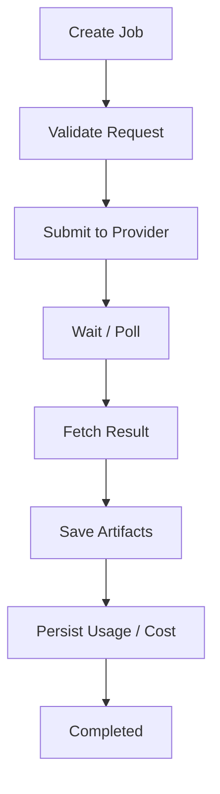
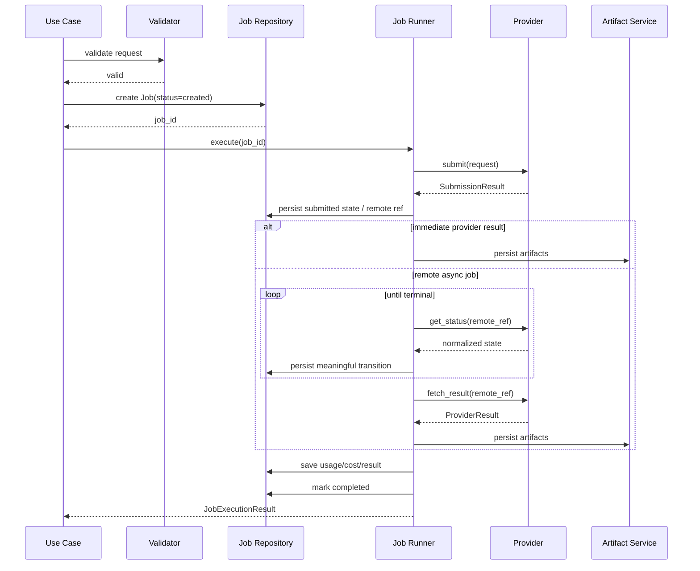
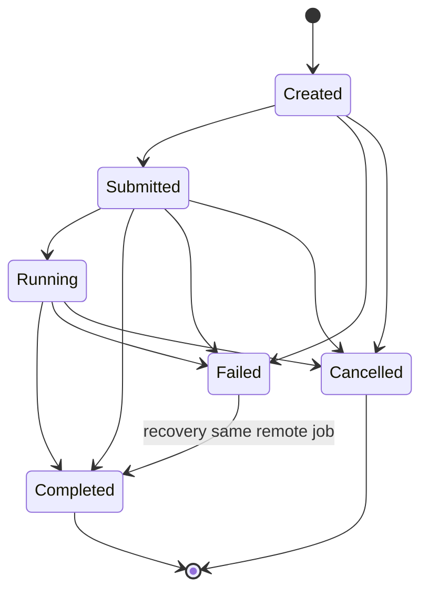
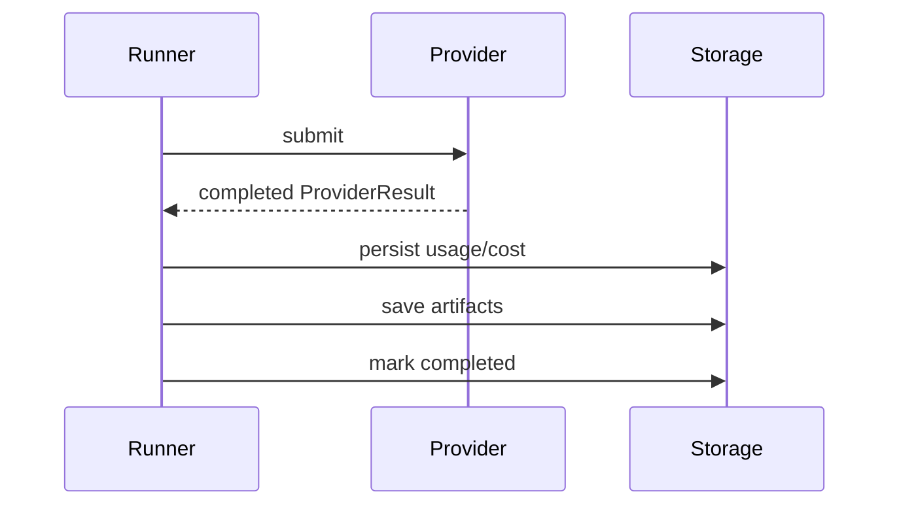
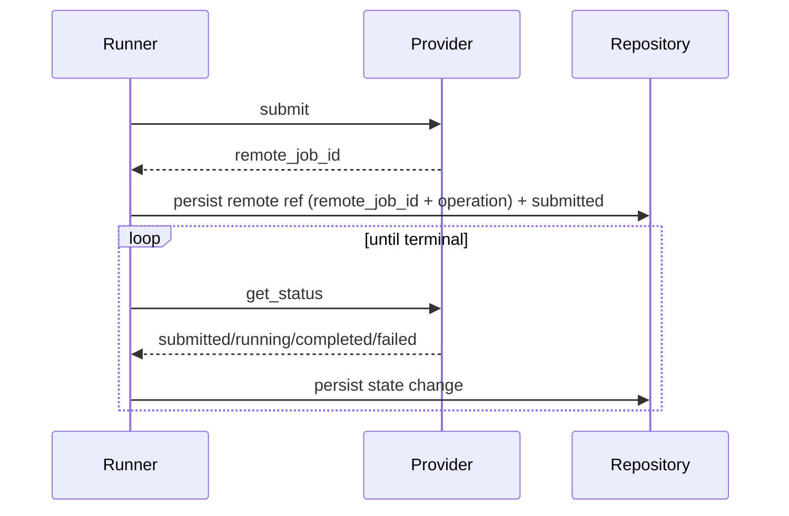
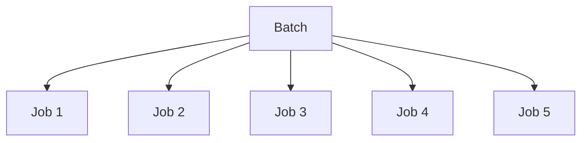
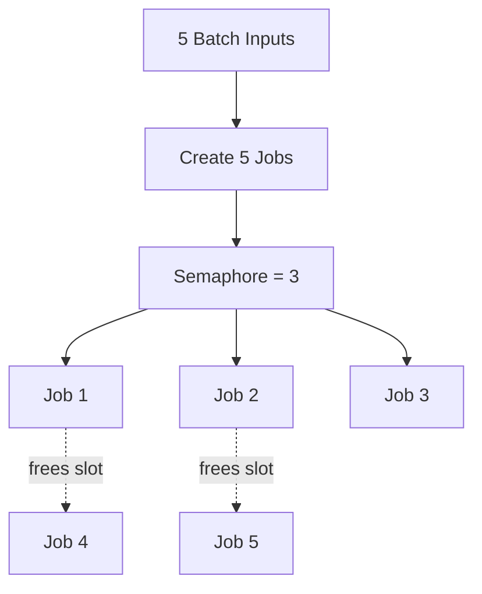
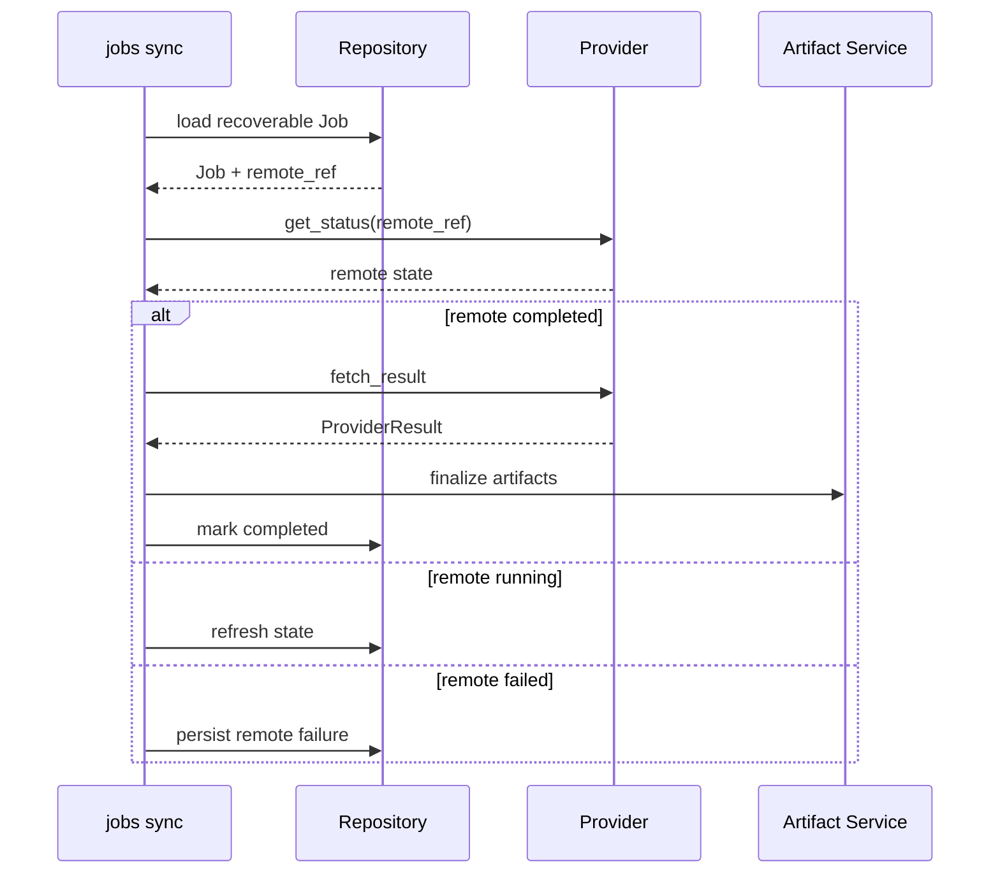
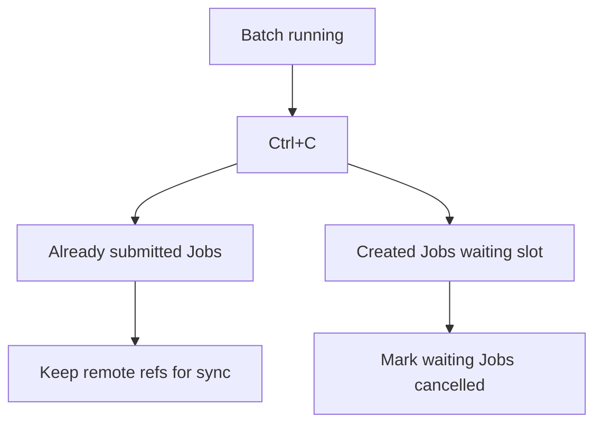
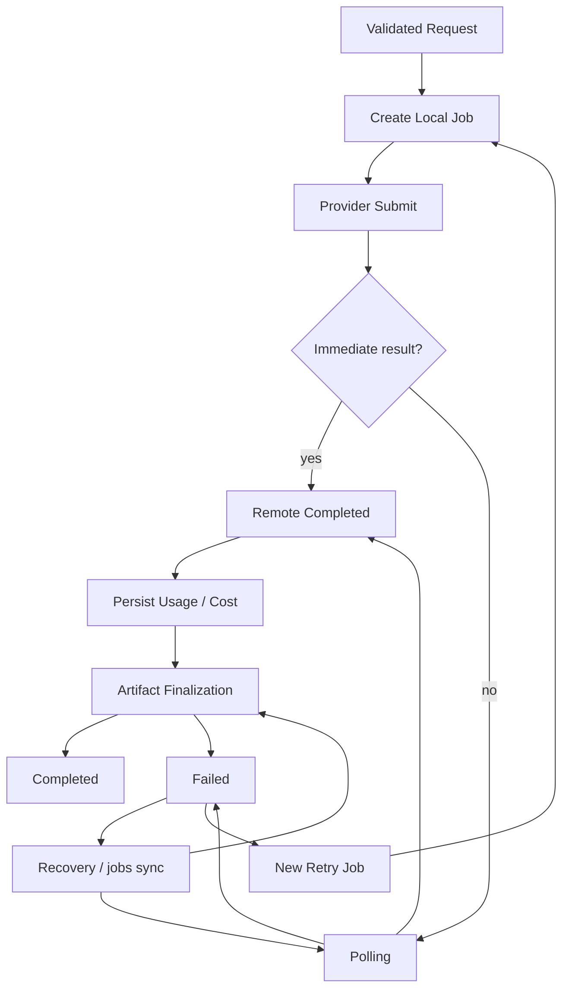

# 08. Job Execution — выполнение, async, polling, concurrency, retry и recovery

> [!abstract] Назначение документа
> Этот документ фиксирует **модель выполнения AI-заданий**: жизненный цикл Job, взаимодействие с Provider System, асинхронные remote jobs, polling, batch-запуски, ограничение concurrency, timeout, retry, cancellation, recovery после остановки процесса и правила финализации результата.
>
> Документ отвечает на вопрос **«как Job проходит путь от создания до результата или ошибки»**.
>
> Он не описывает детали HTTP API конкретного провайдера, SQL DDL или синтаксис каждой CLI-команды. Здесь фиксируется orchestration logic — то есть правила исполнения, которые должны оставаться одинаковыми независимо от provider и modality.

---

## Статус документа 🧭

| Поле | Значение |
|---|---|
| Номер | `08` |
| Название | `Job Execution` |
| Статус | Draft / Foundation |
| Область | Выполнение Jobs |
| Основная версия | `v0.1` |
| Runtime | Один локальный Python-процесс |
| Async runtime | `asyncio` |
| HTTP | `httpx.AsyncClient` |
| Параллельность | Ограниченная через semaphore |
| Persistent queue | Нет |
| Worker daemon | Нет |
| Recovery | SQLite + remote job IDs |
| Основной сценарий v0.1 | Image generation |

---

## Главная идея исполнения ⚙️

Каждый внешний AI-запуск представлен отдельным `Job`.

Job должен быть создан локально **до обращения к provider**, после чего проходит через контролируемую последовательность стадий:

```text
создание
↓
локальная validation
↓
submit provider
↓
ожидание / polling
↓
получение remote result
↓
скачивание / декодирование artifacts
↓
локальная обработка
↓
сохранение usage / cost / metadata
↓
terminal state
```



Execution layer отвечает за orchestration, а не за особенности конкретной модели.

---

## Execution Layer как отдельная ответственность 🧱

Application Layer содержит use cases:

```text
GenerateImage
GenerateImageBatch
RetryJob
SyncJobs
```

Но повторяющаяся логика исполнения должна быть централизована в одном компоненте.

Рабочее имя:

```text
JobRunner
```

или:

```text
ExecutionService
```

Название вторично; граница ответственности — фундаментальна.

---

### Что делает JobRunner

Он отвечает за:

- получение уже валидированного request;
- создание/загрузку локального Job;
- применение execution policy;
- вызов provider adapter;
- сохранение remote job ID;
- polling;
- timeout;
- получение финального ProviderResult;
- запуск artifact pipeline;
- сохранение usage/cost;
- перевод Job в terminal state;
- обработку execution errors;
- формирование recovery-compatible состояния.

### Что JobRunner не делает

Он не должен:

- парсить CLI;
- читать YAML напрямую;
- знать endpoint URL;
- строить raw provider payload;
- хранить API keys;
- выполнять Pillow-конвертацию сам;
- писать SQL напрямую;
- печатать Rich output.

---

## Базовый execution flow 🔄



---

## Job создаётся до provider submit 📝

Сначала в SQLite создаётся:

```text
Job(status=created)
```

и только затем выполняется:

```text
provider.submit()
```

Это правило позволяет всегда иметь локальный `job_id`, даже если ошибка произойдёт во время первого сетевого запроса.

> [!important]
> Решение baseline E00 о моменте создания Job: синтаксическая ошибка CLI (invalid
> arguments, `Exit code 2`) **не создаёт Job**. Job создаётся после успешного разбора
> intent и чтения prompt-источников/входов, но **до** предметной pre-submit validation;
> последняя может завершить Job ошибкой. `provider.submit()` **без сохранённого Job
> запрещён**.

Такой `job_id` используется:

- в logs;
- в human/JSON output;
- при diagnostics;
- при recovery;
- при поддержке пользователя.

---

## Pre-submit validation ✅

До потенциально платного запроса должны выполняться все проверки, которые можно сделать локально:

- модель существует;
- provider существует;
- provider binding существует;
- JobKind поддерживается;
- prompt не пуст;
- input files доступны;
- reference count допустим;
- resolution допустимо;
- aspect ratio допустимо;
- max_images допустимо;
- параметры не конфликтуют;
- output directory может быть создана или доступна для записи;
- необходимые secrets/config присутствуют.

> [!important]
> Цель local validation — не гарантировать успех provider, а не отправлять **заведомо неправильный платный запрос**.

---

# State Machine 🔄

Основные состояния:

```text
created
submitted
running
completed
failed
cancelled
```



---

## `created` 🆕

Локальная запись существует, provider ещё не подтвердил приём.

Job может закончиться здесь из-за:

- validation error;
- configuration error;
- missing input;
- local cancellation;
- submit failure.

---

## `submitted` 📤

Provider принял request.

Для async provider здесь обычно уже есть:

```text
remote_job_id
```

Job может перейти напрямую:

```text
submitted → completed
```

если provider не имеет отдельного `running`.

---

## `running` ⚡

Удалённый provider сообщает, что вычисление выполняется.

Не все providers различают очередь и выполнение, поэтому локальная модель намеренно остаётся простой.

---

## `completed` ✅

Для file-producing Job `completed` означает не просто remote success.

Должны быть выполнены все обязательные локальные действия:

1. provider завершил задачу;
2. ProviderResult получен и валиден;
3. usage/cost сохранены, если предоставлены;
4. обязательные artifacts получены;
5. artifacts скачаны/декодированы;
6. локальная обработка завершена;
7. финальные файлы записаны;
8. artifact metadata записана;
9. `completed_at` установлен.


---

## `failed` 💥

Job становится failed, если текущий execution не может корректно продолжиться.

Примеры:

- provider rejected request;
- auth error;
- generation failed;
- job timeout;
- malformed provider response;
- artifact download failed;
- conversion failed;
- output write failed.

Failed Job может при этом иметь:

```text
remote_job_id
usage
cost
remote result metadata
partial artifacts
```

Эти данные нельзя терять.

---

## `cancelled` 🛑

Cancellation означает намеренную остановку локального execution flow.

Нужно различать:

```text
local cancellation
```

и:

```text
remote cancellation
```

Если provider не умеет отменять remote task, локальное `cancelled` не гарантирует, что вычисление на стороне provider прекратилось.

---

# Terminal states и recovery 🏁

Обычно terminal states:

```text
completed
failed
cancelled
```

Но существует одно контролируемое исключение:

```text
failed → completed
```

разрешается при **recovery того же remote Job**, если генерация не повторялась.

Пример:

```text
remote generation completed
↓
artifact download failed
↓
Job failed
↓
jobs sync
↓
download succeeds
↓
Job completed
```

> [!important]
> `failed → completed` допустим только для локальной recovery уже существующего remote execution. Он не является скрытым retry генерации.
>
> Согласовано baseline E00 (`03` / `08`): terminal = `completed`/`failed`/`cancelled`;
> единственное исключение — именно `failed → completed` при recovery того же remote
> execution. `sync` не вызывает submit, не стирает прежнюю ошибку и при продолжающемся
> remote Job обновляет только наблюдение; прежняя ошибка сохраняется в записи recovery.

---

# Синхронный provider 🔁

Flow:

```text
submit
↓
completed result
↓
artifact finalization
↓
completed
```



---

# Асинхронный provider ⏳

Flow:

```text
submit
↓
remote ID
↓
poll
↓
completed
↓
fetch result
↓
artifact finalization
```



---

# Polling 🕒

Provider Adapter знает:

```text
как получить remote status
```

Execution Layer знает:

```text
когда poll'ить
как долго ждать
когда прекратить
```

Это разделение обязательно.

---

## Polling policy 🎛️

Концептуально:

```text
interval
max_wait
safe transport retries
```

Для v0.1 достаточно:

- фиксированного разумного interval;
- provider-recommended default, если он известен;
- общего Job timeout;
- ограниченного retry для безопасных status requests.

Не требуется полноценный policy engine.

---

## Не писать одинаковый status в БД постоянно

Если provider вернул:

```text
pending
pending
pending
processing
processing
completed
```

достаточно зафиксировать:

```text
submitted
running
completed
```

при реальном изменении состояния.

---

## Polling не должен быть busy loop

Запрещено:

```text
while true:
    GET status
```

без sleep и timeout.

---

# Job timeout ⏱️

Job timeout — максимальное время ожидания remote execution в текущем CLI процессе.

Это не HTTP timeout.

---

## Timeout не означает remote failure

Если локальный процесс перестал ждать через 5 минут, remote task может продолжаться.

Поэтому при timeout сохраняются:

```text
remote_job_id
operation
last known remote state
provider
model
```

и Job получает нормализованную ошибку:

```text
JOB_TIMEOUT
```

с признаком возможной recovery.

> [!important]
> Решение baseline E00 (timeout): локальное прекращение ожидания ≠ remote cancel.
> При timeout с known remote ref recovery разрешён; неизвестный outcome submit
> запрещает автоматический повтор и не маскируется как «можно просто повторить».

---

# HTTP timeout 🌐

Отдельный timeout одного сетевого вызова.

Типы:

```text
connect
read
write
pool
```

Управляются HTTP/provider layer.

---

# Transport retry и Job retry — разные вещи ♻️

### Transport retry

Повтор технической операции:

```text
GET status
GET artifact
```

после временной сетевой ошибки.

### Job retry

Новая AI-генерация.

```text
новый Job
новый provider execution
новая стоимость
```

---

# Опасность retry submit ⚠️

Сценарий:

```text
POST generation
↓
provider создал remote job
↓
ответ потерян
↓
local timeout
```

Если автоматически повторить POST, можно получить:

```text
две генерации
двойную стоимость
```

---

## Правило v0.1

Если outcome `submit()` неизвестен и provider не поддерживает idempotency:

```text
automatic submit retry = запрещён
```

Job завершается ошибкой с диагностикой:

```text
remote outcome uncertain
```

---

# Idempotency 🔑

Если provider поддерживает idempotency key, adapter может использовать:

```text
Job UUID
```

или другой стабильный request ID.

Это provider-specific механизм.

Core не должен считать его гарантированно доступным.

---

# Автоматический retry generation 🚫

v0.1 не должна автоматически создавать новый AI Job после:

- remote failure;
- content rejection;
- timeout;
- provider unavailable.

Пользователь выполняет явный:

```bash
aimedia jobs retry <id>
```

---

# `jobs retry` 🔄

Retry:

1. читает старый Job;
2. создаёт новый request snapshot;
3. применяет разрешённые overrides;
4. создаёт новый Job;
5. устанавливает `retry_of`;
6. запускает его обычным JobRunner.

---

## Что копируется

Обычно:

```text
compiled prompt
model
provider
inputs
parameters
```

---

## Что не копируется

```text
remote_job_id
status
old cost
old usage
old artifacts
old error
timestamps
```

---

# Batch Execution 📦

Batch — application orchestration над независимыми Jobs.



---

## Batch не является отдельным Job

Это важно, потому что у каждого элемента:

- свой remote ID;
- своя стоимость;
- своё состояние;
- своя ошибка;
- свой artifact.

---

# Concurrency ⚡

Если пользователь запускает 5 Jobs с:

```text
concurrency = 3
```

одновременно выполняются максимум три полных execution flow.

Базовый механизм:

```python
asyncio.Semaphore(3)
```

---

## Что считается занятым slot

Slot удерживается на протяжении активной работы Job:

```text
submit
poll
result fetch
artifact download
finalization
```

а не только во время POST.

---

# Batch flow 🧭



Пунктир показывает освобождение slots, а не гарантированный порядок.

---

## Jobs создаются до запуска batch

Рекомендуется сначала создать локальные records для всех элементов batch.

Плюсы:

- у всех есть IDs;
- намерение запуска зафиксировано;
- crash не теряет batch inputs;
- можно корректно обработать Ctrl+C.

---

# Jobs, ожидающие semaphore 🕒

Для них не нужен отдельный status `queued`.

До получения slot они могут оставаться:

```text
created
```

Это проще и не путается с remote provider queue.

---

# Ошибка одного Job не отменяет остальные 💥

Default batch behavior:

```text
best effort
```

Например:

```text
Job 1 completed
Job 2 failed
Job 3 completed
Job 4 completed
Job 5 completed
```

Batch summary:

```text
4 completed
1 failed
```

---

# Fail-fast не нужен v0.1 🚫

Future option:

```text
--fail-fast
```

может появиться позже, но не является default.

---

# Async primitives 🧩

Для v0.1 достаточно:

```text
asyncio
asyncio.Semaphore
asyncio.TaskGroup
httpx.AsyncClient
```

Не нужны:

```text
Celery
Redis
RabbitMQ
Kafka
worker daemon
scheduler service
```

---

# Почему persistent queue не нужна 🪶

Пользовательский сценарий:

```text
3–5 одновременных генераций
```

не требует отдельной инфраструктуры.

Remote providers уже сами управляют своими вычислительными очередями.

Локальная утилита должна только:

- submit;
- ограничить concurrency;
- дождаться;
- сохранить состояние.

---

# SQLite и concurrency 🗄️

Несколько async Jobs могут безопасно работать с одной SQLite при соблюдении правил:

- короткие транзакции;
- WAL;
- busy timeout;
- никакой DB-транзакции вокруг network wait;
- state updates только при необходимости.

---

## Не держать транзакцию во время polling 🚫

Плохо:

```text
BEGIN
↓
wait remote 30 sec
↓
COMMIT
```

Правильно:

```text
short update
↓
network wait
↓
short update
```

---

# Peewee и async 🐍

Peewee остаётся синхронным ORM.

Для v0.1 это нормально, потому что DB-операции короткие.

Не требуется тащить отдельный async ORM только потому, что network layer использует asyncio.

---

# Artifact Finalization 📦

После remote success выполняется локальная finalize-фаза.

```text
ProviderResult
↓
persist usage/cost
↓
resolve RemoteArtifacts
↓
download / decode
↓
local conversion
↓
hash / metadata
↓
atomic save
↓
DB artifact records
↓
completed
```

---

# Usage/Cost сохраняются до поздней локальной ошибки 💰

Если provider уже сообщил:

```text
cost = 4 RUB
```

а затем download упал, стоимость всё равно сохраняется.

Потому что деньги могли быть реально списаны.

---

# Remote success + local failure ⚠️

Пример:

```text
provider completed
↓
remote URL known
↓
disk full
```

Job:

```text
status = failed
cost = actual
usage = known
remote metadata = preserved
error = OUTPUT_WRITE_FAILED
```

Это не provider failure.

---

# Сохранение файла 💾

Рекомендуемый порядок:

1. писать во временный `.part`/temp file;
2. проверить успешность;
3. выполнить local conversion при необходимости;
4. вычислить hash;
5. atomic rename;
6. сохранить artifact metadata;
7. завершить Job.

---

# Conversion failure 🎨

Если provider вернул PNG, пользователь запросил WebP, а conversion упала:

Job не становится completed.

Если original уже сохранён и используется `--keep-original`, он остаётся partial/original artifact.

---

# Artifact count 🔢

`max_images = 4` не обязательно означает, что provider гарантированно вернёт ровно четыре.

Execution Layer должен проверять минимально допустимый success condition.

Для image Job:

```text
минимум один usable image artifact
```

если модель/контракт не определяет иначе.

---

# Невалидный provider result 💣

HTTP 200 не означает корректный ProviderResult.

Ошибка, если:

- status говорит completed, но required data отсутствует;
- artifact reference некорректна;
- структура usage повреждена критически;
- image Job не содержит usable image.

Нормализованная ошибка:

```text
PROVIDER_INVALID_RESPONSE
```

---

# Recovery ♻️

Recovery существует потому, что CLI не является daemon.

Процесс может завершиться из-за:

- Ctrl+C;
- закрытия терминала;
- OS reboot;
- Python crash;
- network loss;
- local artifact failure.

SQLite + remote references позволяют продолжить тот же Job.

---

# `jobs sync` 🔄

`jobs sync` — основной recovery-механизм.

Он:

1. находит подходящий Job;
2. проверяет наличие remote reference;
3. запрашивает состояние у provider;
4. обновляет локальный status;
5. если remote completed — получает result;
6. повторяет локальную finalization;
7. сохраняет artifacts/usage/cost;
8. завершает Job.

---

# Sync не создаёт новую генерацию 🚫

Это один из важнейших инвариантов.

```text
sync
→ продолжает существующий remote job

retry
→ создаёт новый remote job
```

---

# Recovery flow 🗺️



---

# Recoverable failure 🧯

Примеры:

```text
ARTIFACT_DOWNLOAD_FAILED
OUTPUT_WRITE_FAILED
LOCAL_CONVERSION_FAILED
JOB_TIMEOUT with known remote ID
process crashed during polling
```

если remote Job всё ещё можно получить.

---

# Non-recoverable same-job failure ❌

Примеры:

```text
provider rejected request
remote generation failed
invalid parameter
content policy rejection
```

Тут нужен новый retry Job, если пользователь хочет попробовать снова.

---

# Remote result expired ⌛

Если provider уже удалил remote artifact:

```text
REMOTE_RESULT_EXPIRED
```

Job остаётся failed.

`jobs sync` не создаёт новую генерацию.

---

# Recovery должен быть идемпотентным 🔁

Повтор:

```bash
aimedia jobs sync 481
aimedia jobs sync 481
```

не должен создавать новые artifacts каждый раз.

Если Job уже completed:

```text
ничего не делать
```

или вернуть:

```text
already completed
```

---

# Artifact recovery idempotency 📦

Перед повторным save можно проверять:

- artifact position;
- remote file ID;
- remote URL;
- existing path;
- hash.

---

# Ctrl+C 🛑

При interrupt CLI должна стремиться:

1. перестать запускать новые batch Jobs;
2. отменить локальное ожидание;
3. сохранить известные remote refs;
4. не удалять Job history;
5. закрыть HTTP client;
6. корректно завершить process.

---

# Не отправлять remote cancel автоматически по Ctrl+C 🚫

Ctrl+C обычно означает:

> перестать ждать.

Это не обязательно означает:

> уничтожить remote generation.

Remote cancellation должна быть отдельной явной командой/опцией.

> [!important]
> Решение baseline E00 (Ctrl+C): Ctrl+C не отправляет remote cancel; known remote refs
> сохраняются; ожидающие локального слота Jobs отменяются. Штатно обработанный
> Ctrl+C даёт exit code `130` (см. `04`), а не выдаётся за подтверждённую remote
> cancellation.

---

# Поведение batch при Ctrl+C 🧩



---

## Submitted Jobs после interrupt

Если remote Job существует:

```text
не маркировать бездумно как cancelled
```

Лучше оставить фактический known state:

```text
submitted
running
```

и дать пользователю выполнить:

```bash
aimedia jobs sync
```

---

# Future `jobs cancel` 🛑

Будущая команда:

```bash
aimedia jobs cancel 481
```

может:

- вызвать provider cancel, если доступно;
- сохранить результат попытки;
- обновить local state.

Не обязательна v0.1.

---

# Detach mode 🛰️

Опциональное расширение:

```bash
aimedia image generate ... --detach
```

Flow:

```text
create
↓
submit
↓
save remote ID
↓
exit
```

---

## Detach не требует worker

```text
detach ≠ background daemon
```

Remote provider выполняет задачу сам.

Позже пользователь вызывает:

```bash
aimedia jobs sync 481
```

---

# Когда detach невозможен 🚫

Если provider полностью синхронный и не возвращает recoverable remote ID, detach не поддерживается.

---

# JobRunner contract 🧱

Концептуально:

```python
class JobRunner:
    async def execute(
        self,
        job_id: int,
    ) -> JobExecutionResult:
        ...

    async def recover(
        self,
        job_id: int,
    ) -> JobExecutionResult:
        ...

    async def execute_many(
        self,
        job_ids: list[int],
        concurrency: int,
    ) -> BatchExecutionResult:
        ...
```

---

## `execute` vs `recover`

### execute

Разрешено:

```text
provider.submit()
```

### recover

Запрещено:

```text
provider.submit()
```

Разрешено только:

```text
status
fetch existing result
download
finalize
```

Это сильная защита от случайного повторного платного запуска.

---

# ExecutionResult 📦

Концептуальный результат:

```text
job_id
status
artifacts
usage
cost
warnings
error
```

CLI преобразует его либо в human output, либо в JSON.

---

# BatchExecutionResult 📚

```text
total
completed
failed
cancelled
jobs[]
```

---

# Provider-specific state не просачивается наружу 🔌

Provider может иметь:

```text
pending
queued
rendering
processing
```

JobRunner работает с нормализованными состояниями.

Raw provider state можно сохранить только в metadata/logs.

---

# No implicit cross-provider fallback 🚫

Если Polza недоступна:

```text
Job fails
```

а не:

```text
silently run through another provider
```

Retry через другого provider должен быть явным новым Job.

---

# Почему это важно

Другой provider может иметь:

- другую цену;
- другую модель;
- другие ограничения;
- другой result;
- другую safety policy.

---

# Request freeze 🧊

После provider submit нельзя менять:

```text
prompt
model
provider
resolution
aspect ratio
input images
```

Если нужно изменить request — создаётся новый Job.

---

# Effective model snapshot 🧬

Перед submit фиксируются:

```text
canonical model ID
provider ID
remote model ID
resolved parameters
```

Это позволяет history оставаться понятной даже после обновления Registry.

---

# Prompt compilation 📝

Compiled prompt должен быть сформирован и сохранён до submit.

```text
PromptSources
↓
PromptCompiler
↓
CompiledPrompt
↓
Job snapshot
↓
provider submit
```

---

# Output path validation 📁

Если пользователь передал `--out`, желательно проверить directory до provider submit.

Это снижает риск:

```text
платная генерация завершилась
↓
локально нет прав на запись
```

---

# Execution events 📣

Полезно концептуально выделять:

```text
job_created
validation_completed
submit_started
submitted
remote_running
remote_completed
artifact_download_started
artifact_saved
job_completed
job_failed
```

v0.1 не требует event bus.

Эти events могут быть:

- логами;
- callbacks для CLI progress;
- внутренними application notifications.

---

# Progress reporting 📊

Human mode может показывать:

```text
Submitting...
Waiting...
Downloading...
Converting...
Saved.
```

Но JobRunner не печатает напрямую в terminal.

Он сообщает состояние presentation layer.

---

# JSON mode 🤖

Обычная команда в `--json` выдаёт **один финальный JSON document**.

Промежуточный progress не печатается в stdout.

Future streaming mode можно сделать отдельно:

```text
--json-lines
```

но это не v0.1.

---

# Error handling 🧯

Ошибка преобразуется по слоям:

```text
low-level exception
↓
provider/storage/domain error
↓
JobError
↓
execution result
↓
CLI human/JSON
```

---

# Generic unexpected error 💣

На внешней execution boundary допустим catch-all, чтобы:

- не потерять Job;
- выставить `INTERNAL_ERROR`;
- записать stack trace в logs;
- вернуть job_id пользователю.

Обычный CLI не должен выводить полный stack trace без debug mode.

---

# Error stages 🧩

Полезно различать:

### `pre_submit`

```text
validation
input
config
```

### `submit`

```text
auth
rate limit
network
provider rejection
```

### `remote`

```text
generation failed
remote timeout
remote cancel
```

### `finalize`

```text
download
decode
conversion
filesystem
DB finalize
```

---

# Recoverable vs retryable 🧠

Это разные свойства.

### Recoverable

Можно продолжить тот же remote Job.

### Retryable

Имеет смысл создать новый Job.

Пример:

| Ошибка | Recover same Job | Retry new Job |
|---|---:|---:|
| Artifact download failed | ✅ | обычно не нужен |
| CLI crashed during polling | ✅ | нет |
| Provider 503 before submit | ❌ | ✅ |
| Remote generation failed | ❌ | возможно |
| Invalid parameter | ❌ | только после изменения request |
| Content rejection | ❌ | только после изменения request |

---

# Cost и execution 💰

Execution Layer никогда не предполагает:

```text
failed = free
```

Failed Job может стоить денег.

Cancelled Job тоже потенциально может стоить денег.

Сохраняется фактический provider cost, если он известен.

---

# Multi-currency batch 💵

Batch aggregation не смешивает валюты.

Пример:

```text
Batch cost:
  18.00 RUB
  0.24 USD
```

---

# Rate limiting 🚦

На старте отдельный rate limiter не обязателен.

Concurrency limit уже ограничивает количество активных операций.

---

## 429 при status polling

Safe status call можно повторить позже с задержкой.

Если provider сообщает `Retry-After`, его полезно учитывать.

---

# Backoff 📈

Для v0.1 достаточно простого подхода:

- fixed polling interval;
- ограниченные safe retries;
- optional increased delay на rate limit / temporary errors.

Не нужен универсальный retry framework.

---

# Jitter 🎲

Для одной локальной CLI с несколькими Jobs jitter не критичен.

Не усложнять первую версию.

---

# Safe retry operations ✅

Обычно безопаснее повторять:

```text
GET status
GET/download artifact
```

чем:

```text
POST generation
```

Но окончательное решение зависит от provider contract.

---

# Shutdown semantics 🚪

Перед завершением process:

- остановить новые tasks;
- отменить local awaits;
- закрыть `httpx.AsyncClient`;
- завершить DB operations;
- закрыть DB connection;
- flush logs;
- сохранить remote refs.

---

# Автоматический recovery на startup? 🚫

Не следует автоматически poll'ить все старые Jobs при любом запуске CLI.

Иначе даже:

```bash
aimedia models list
```

может неожиданно идти в сеть.

Recovery остаётся явным:

```bash
aimedia jobs sync
```

---

# Background scheduler не нужен 🚫

Нет отдельного процесса, который после закрытия CLI продолжает polling.

Это осознанное ограничение v0.1.

---

# Future daemon mode 🔭

Если появится реальная потребность, можно добавить:

```text
aimedia daemon
```

поверх тех же JobRepository, Provider adapters и JobRunner.

Core не должен зависеть от daemon.

---

# Failure после получения remote ID, но до DB persist ⚠️

Это один из наиболее критичных edge cases.

Flow:

```text
provider accepted
↓
remote ID returned
↓
DB write failed
```

Правило:

- повторить локальную запись разумное число раз;
- залогировать remote ID;
- не повторять provider submit;
- завершить с явной ошибкой.

---

# Failure после artifact save, но до DB commit ⚠️

Может остаться orphan file.

Это допустимый редкий failure mode.

В будущем maintenance tool сможет искать orphan files.

Не нужно ради этого вводить распределённые транзакции.

---

# Exactly-once нельзя гарантировать ✋

Без provider-side idempotency невозможно гарантировать абсолютный exactly-once submit.

Поэтому default philosophy:

> При неизвестном результате submit безопаснее остановиться, чем скрыто повторить потенциально платный запрос.

---

# Request fingerprint 🧬

Можно считать hash нормализованного request для diagnostics.

Но он **не используется для автоматической дедупликации**.

Два одинаковых prompts могут намеренно создавать два разных генеративных результата.

---

# Resource cleanup 🧹

После ошибки:

- `.part` удаляется;
- временные conversion files удаляются;
- final artifact не удаляется, если он уже корректно сохранён и представляет partial result;
- logs/history сохраняются.

---

# Disk full / permissions 💾

Ошибки файловой системы нормализуются отдельно:

```text
OUTPUT_WRITE_FAILED
DISK_FULL
PERMISSION_DENIED
```

если есть смысл различать их.

Они не должны маскироваться как provider errors.

---

# Длинные text Jobs 📝

Будущий Text module может использовать:

- immediate response;
- streaming;
- remote async.

Общий Job lifecycle остаётся тем же.

Streaming станет отдельным execution mode, если реально понадобится.

---

# Audio Jobs 🎙️

STT может быть:

```text
sync
```

или:

```text
remote async
```

JobRunner не должен считать, что вся modality использует один execution pattern.

---

# Video Jobs 🎬

Video естественно ложится в существующую модель:

```text
submit
poll
large artifact download
finalize
```

---

# Derived Jobs 🧬

Операции:

```text
retry
upscale
extend
variation
```

создают отдельный Job и relation к исходному.

Execution flow нового Job обычный.

---

# `jobs sync --all` ♻️

Если команда синхронизирует много Jobs, она тоже должна использовать ограниченную concurrency.

Нет смысла одновременно делать сотни status requests.

---

# Multi-process race 🧷

v0.1 не ориентирована на несколько одновременно запущенных процессов, работающих над одним Job.

Минимальная защита:

- проверка status перед execution;
- короткая transaction при переходе;
- не делать submit для Job, который уже `submitted/running`.

Distributed locks не нужны.

> [!important]
> Решение baseline E00 (local ownership): v0.1 требует минимального cross-process
> guard (status-guard + короткая транзакция), но не брокера и не распределённой
> блокировки. Конкретная схема и способ снятия stale ownership **утверждаются до E08**
> (здесь — требование, не реализация).

---

# State transition guard 🔒

Полезно централизовать допустимые переходы.

Запрещено:

```text
completed → running
completed → submitted
failed → running
```

кроме явно разрешённого:

```text
failed(recoverable finalize) → completed
```

---

# Timestamps 🕒

Execution Layer управляет:

```text
created_at
submitted_at
started_at
completed_at
```

---

## `started_at`

Если provider не сообщает реальный момент старта:

```text
NULL
```

лучше, чем выдумывать значение.

---

## `completed_at`

Устанавливается для:

```text
completed
failed
cancelled
```

---

# `last_polled_at` 🔎

Optional operational field.

Полезно для:

- diagnostics;
- future daemon;
- sync visibility.

Не обязательно v0.1.

---

# Warnings ⚠️

Warnings не меняют status на failed, если результат корректен.

Например:

```text
provider ignored optional enhancement
downstream fallback used
```

Они сохраняются в result metadata и возвращаются CLI.

---

# ExecutionPolicy 🎛️

В реализации можно иметь простую структуру:

```text
poll_interval
job_timeout
safe_retry_attempts
concurrency
```

Это обычная settings/dataclass структура.

Не нужен сложный hierarchy framework.

---

# Precedence настроек ⚙️

Для execution options:

```text
CLI explicit
↓
user config
↓
provider recommendation
↓
application default
```

---

# Webhooks 🔔

Локальная CLI v0.1 не должна поднимать callback server ради provider webhooks.

Polling проще:

- без открытого порта;
- без NAT;
- без firewall;
- без server lifecycle.

---

# Testing strategy 🧪

Execution layer требует особенно хороших tests, потому что здесь соединяются network, state и storage.

---

## Fake Provider

Нужны сценарии:

```text
immediate_success
async_success
async_failure
never_complete
submit_timeout
poll_timeout_once
artifact_failure
```

---

## Fake clock / sleep

Polling tests не должны реально ждать минуты.

Sleep/clock желательно инъецировать или подменять.

---

## State transition tests

Проверяются:

```text
created → submitted
submitted → running
running → completed
```

и запрещённые переходы.

---

## Recovery tests

Обязательно:

```text
download failed
↓
jobs sync
↓
same remote job
↓
download succeeds
↓
completed
```

---

## Batch tests

Проверяются:

- concurrency limit;
- partial failure;
- один Job не отменяет остальные;
- interrupt;
- status preservation.

---

## Integration test

Хороший уровень:

```text
Fake Provider
+
temporary real SQLite
+
temporary filesystem
+
real JobRunner
```

без внешнего API.

---

## Provider live tests 💸

Реальные платные tests:

- отдельный marker;
- manual/opt-in;
- минимальное число;
- не обычный CI.

---

# Performance expectations ⚡

Основная работа:

```text
network wait
download
local file processing
```

Asyncio хорошо подходит.

---

## CPU-heavy processing

Если позже local processing станет тяжёлым:

```text
asyncio.to_thread
```

или process executor.

Не блокировать event loop тяжёлой CPU-задачей.

---

# Backpressure 🧱

Semaphore является достаточным backpressure для v0.1.

Не следует заранее читать/кодировать в память все inputs большого batch.

---

# Observability 📜

Полезные метрики/log fields:

```text
job_id
provider
remote_job_id
submit latency
remote wait duration
download duration
total duration
```

Но metrics backend не требуется.

Обычные structured logs достаточны.

---

# Human mode 👤

CLI может показывать:

```text
Job #481 submitted
Waiting for provider
Downloading result
Saved result_001.webp
Completed in 18.4s
```

Эти строки — presentation, а не execution contract.

---

# Agent mode 🤖

Агент получает:

- job ID;
- stable status;
- error code;
- recoverability;
- artifacts;
- cost;
- usage.

Не должно быть скрытого поведения, которое агент не может определить через history.

---

# Machine-readable recovery hints 🧩

В будущем JSON может содержать:

```json
{
  "recoverable": true,
  "recommended_action": "jobs.sync"
}
```

или:

```json
{
  "retryable": true,
  "recommended_action": "jobs.retry"
}
```

Это полезно для агентов, но exact JSON contract определяется отдельно.

---

# Execution anti-patterns ☠️

## Celery ради нескольких Jobs

Избыточно.

## Бесконечный polling

Недопустимо.

## Submit retry после неизвестного outcome

Риск двойной оплаты.

## Mark completed до artifact save

Ломает history.

## Retry внутри старого Job

Стирает историю попыток.

## `jobs sync`, который делает submit

Нельзя.

## Provider adapter, который сам пишет SQLite

Нарушение архитектуры.

## CLI, который реализует polling

Дублирование orchestration.

## DB transaction на время remote wait

Плохо для SQLite.

## Ошибка одного Job отменяет весь batch

Не default.

## Silent cross-provider fallback

Нельзя.

---

# Минимальная реализация v0.1 🪶

Обязательно:

```text
JobRunner
state transitions
create-before-submit
pre-submit validation
provider submit
remote ID persist
polling
job timeout
safe transport retry
artifact finalization
usage/cost persistence
batch execution
Semaphore
Ctrl+C handling
jobs sync
jobs retry creates new Job
```

Не требуется:

```text
daemon
webhooks
priority queue
distributed locks
scheduler
cross-provider fallback
streaming execution
complex policy engine
```

---

# Definition of Done ✅

Job Execution v0.1 считается готовым, если:

### Single Job

Image Job проходит полный flow до локального artifact.

### Async Provider

Remote ID сохраняется сразу после submit.

### Polling

Нет busy loop; status changes фиксируются корректно.

### Timeout

Job не ждёт бесконечно, recovery metadata сохраняется.

### Artifact Finalization

Remote success не превращается в local completed до сохранения результата.

### Cost / Usage

Provider usage/cost сохраняются даже при поздней local failure.

### Retry

Retry создаёт новый Job.

### Recovery

`jobs sync` продолжает существующий remote Job без submit.

### Batch

Несколько Jobs выполняются параллельно с concurrency limit.

### Partial Failure

Один failed Job не уничтожает остальные.

### Interrupt

Ctrl+C не теряет remote refs.

### Testing

Sync, async, timeout, failure, recovery и batch покрыты tests.

---

# Архитектурные инварианты 🔒

> [!important]
> **1. Job создаётся локально до provider submit.**

> [!important]
> **2. Локальная validation выполняется до потенциально платного запроса.**

> [!important]
> **3. Remote job ID сохраняется сразу после получения.**

> [!important]
> **4. Provider `completed` не равен local `completed`, пока обязательные artifacts не сохранены.**

> [!important]
> **5. Batch состоит из независимых Jobs.**

> [!important]
> **6. Concurrency ограничивается внутри одного процесса через async primitives.**

> [!important]
> **7. Persistent queue, Redis, Celery и worker daemon не нужны v0.1.**

> [!important]
> **8. Transport retry и Job retry — разные механизмы.**

> [!important]
> **9. Неизвестный outcome submit не повторяется автоматически без idempotency guarantee.**

> [!important]
> **10. `jobs sync` никогда не делает новый provider submit.**

> [!important]
> **11. Retry создаёт новый Job.**

> [!important]
> **12. Cost/usage сохраняются у failed Job, если provider их сообщил.**

> [!important]
> **13. Ctrl+C не должен уничтожать recovery information.**

> [!important]
> **14. Ошибка одного Job не отменяет остальные Jobs batch по умолчанию.**

> [!important]
> **15. `failed → completed` допустим только при recovery локальной финализации того же remote Job без новой генерации.**

---

# Что документ намеренно не фиксирует ⏸️

В `08-job-execution.md` не определяется окончательно:

- точное имя `JobRunner`;
- exact polling interval;
- exact timeout defaults;
- exact safe retry count;
- конкретный backoff algorithm;
- final Ctrl+C UI;
- обязательность `--detach`;
- final cancellation API;
- provider-specific idempotency implementation;
- exact asyncio code;
- exact DB transaction code;
- future streaming contract.

Эти детали могут уточняться при реализации при сохранении инвариантов.

---

# Связь с другими фундаментальными документами 🔗

```text
01-product-scope.md
    Определяет простую локальную модель без тяжёлой очереди.

02-system-architecture.md
    Размещает execution orchestration в Application Layer.

03-domain-model.md
    Определяет Job, состояния, Result, Error и Retry lineage.

04-cli-contract.md
    Определяет image batch, jobs retry, jobs sync и JSON output.

05-provider-system.md
    Определяет submit/status/result и provider error mapping.

06-model-registry.md
    Выполняет model-aware validation перед submit.

07-storage-history-costs.md
    Хранит state, remote refs, artifacts, cost и usage.

08-job-execution.md
    Определяет lifecycle, concurrency, timeout, retry и recovery.

09-documentation-help.md
    Определит help для execution, retry, sync и batch.
```

---

# Итоговая execution-модель 🧩



> [!success]
> Job Execution строится как управляемый жизненный цикл независимых Jobs внутри одного локального Python-процесса.
>
> Приложение создаёт Job до внешнего запроса, сохраняет remote ID сразу после submit, поддерживает синхронные и асинхронные providers, выполняет polling с timeout, финализирует artifacts и только затем переводит Job в `completed`.
>
> Batch реализуется обычным `asyncio` с ограничением concurrency и не требует persistent queue или worker daemon.
>
> Retry всегда создаёт новый Job, а `jobs sync` восстанавливает уже существующий remote Job без повторной генерации.
>
> Эта модель достаточно проста для нескольких параллельных image generations и одновременно подходит для будущих долгих audio, text и video задач.
