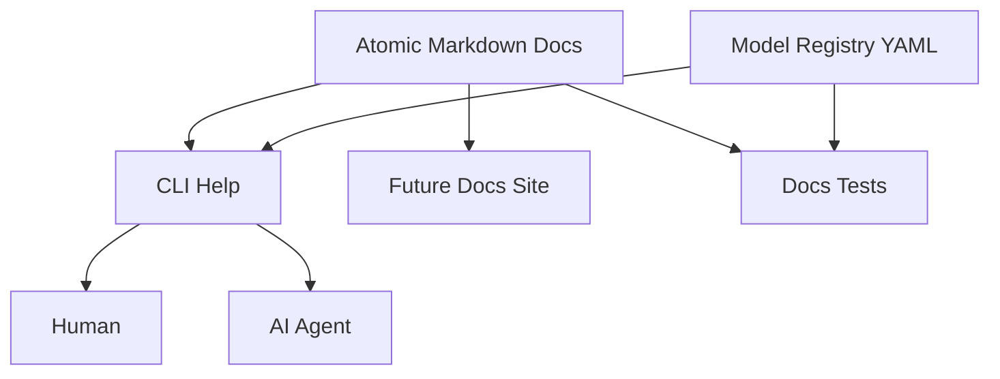
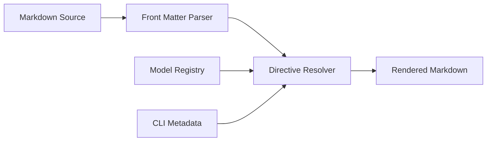
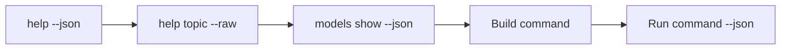
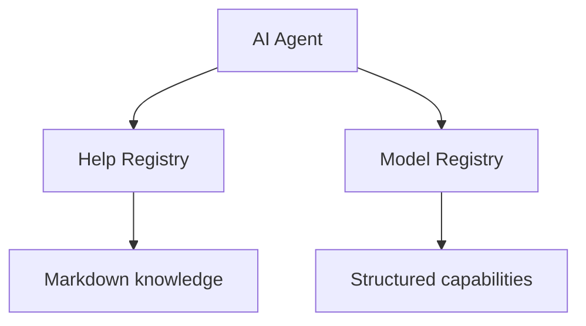
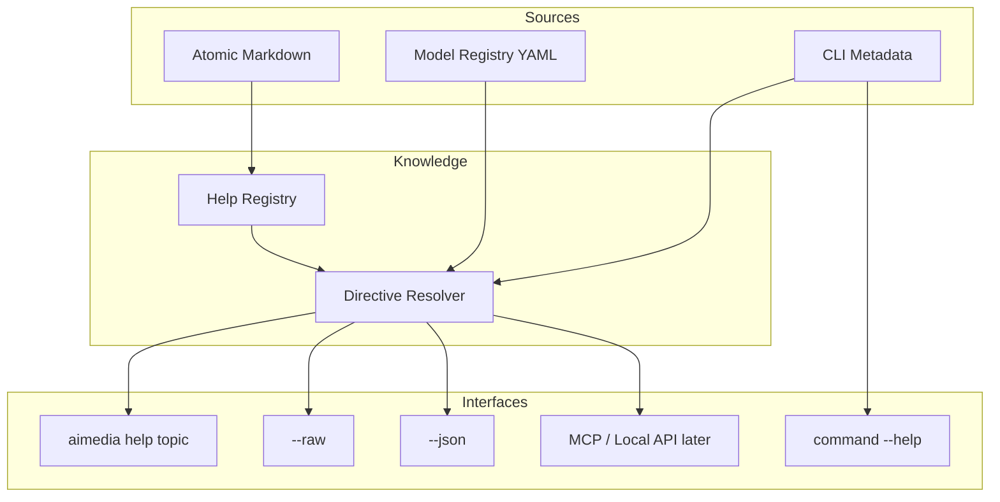

# 09. Documentation & Help — атомарная документация, CLI-справка и agent-friendly knowledge layer

> [!abstract] Назначение документа
> Этот документ фиксирует архитектуру **документации и встроенной справки** проекта: структуру Markdown-доков, связь с CLI, Model Registry и агентским режимом, правила атомарности, front matter, dynamic sections, raw/JSON output, проверку актуальности и поставку документации вместе с приложением.
>
> Документ отвечает на вопрос **«как сделать одну систему знаний, которой одинаково удобно пользоваться человеку, CLI и AI-агенту»**.
>
> Цель — избежать ситуации, когда существуют четыре расходящиеся версии истины:
>
> - README;
> - `--help`;
> - отдельный сайт;
> - инструкции для агента.
>
> Вместо этого документация проектируется как часть runtime-системы.

---

## Статус документа 🧭

| Поле | Значение |
|---|---|
| Номер | `09` |
| Название | `Documentation & Help` |
| Статус | Draft / Foundation |
| Область | Документация и встроенная справка |
| Основная версия | `v0.1` |
| Основной формат | Markdown |
| Machine-readable knowledge | Model Registry YAML |
| CLI rendering | Rich Markdown |
| Agent access | `--raw` и `--json` |
| Базовый принцип | Atomic docs |
| Runtime delivery | Package resources |

---

# Главная идея 📚

Документация является **частью продукта**, а не внешним приложением к нему.

Она должна использоваться одновременно:

```text
человеком
CLI
AI-агентом
разработчиком
тестами
```

Одна и та же страница Markdown должна быть доступна:

- как обычный файл;
- через `aimedia help`;
- через raw mode;
- как часть будущего статического сайта, если он когда-нибудь появится.



---

# Два слоя знаний 🧠

Система документации строится из двух разных источников.

## Markdown

Markdown отвечает за:

- объяснения;
- примеры;
- концепции;
- workflow;
- ограничения;
- практические сценарии;
- предупреждения;
- взаимосвязи;
- reasoning-friendly prose.

## Model Registry YAML

Registry отвечает за:

- model IDs;
- capabilities;
- параметры;
- enum values;
- defaults;
- limits;
- provider bindings;
- status модели.

---

## Главное разделение ответственности

```text
Markdown
→ почему и как пользоваться

YAML
→ что конкретно поддерживается
```

> [!important]
> Документация не должна вручную дублировать machine-readable facts, если приложение уже может получить их из Registry.

---

# Почему atomic docs 🧩

Один огромный README плохо подходит для агента.

Если агенту нужно узнать:

> Как передать несколько reference images?

ему не нужен документ на 3000 строк про всю систему.

Поэтому документация разбивается на **маленькие самостоятельные темы**.

---

## Пример структуры

```text
docs/
├── getting-started/
│   ├── installation.md
│   ├── configuration.md
│   └── first-generation.md
│
├── image/
│   ├── generate.md
│   ├── prompt-sources.md
│   ├── references.md
│   ├── batch.md
│   ├── output-formats.md
│   └── parameters.md
│
├── jobs/
│   ├── lifecycle.md
│   ├── history.md
│   ├── retry.md
│   ├── sync.md
│   ├── recovery.md
│   └── costs.md
│
├── models/
│   ├── overview.md
│   ├── capabilities.md
│   └── model-specific/
│
├── providers/
│   ├── overview.md
│   └── polza.md
│
├── cli/
│   ├── json-mode.md
│   ├── exit-codes.md
│   └── paths.md
│
├── audio/
│   ├── transcribe.md
│   └── speech.md
│
├── text/
│   └── generate.md
│
└── search/
    └── overview.md
```

В v0.1 реально нужны только темы реализованных функций.

---

# Atomic topic 🧱

Один документ должен отвечать **на один главный вопрос**.

Хорошие темы:

```text
image.generate
image.references
image.batch
jobs.retry
jobs.sync
cli.json
models.capabilities
```

Плохая тема:

```text
everything-about-images-and-jobs-and-models.md
```

---

# Размер atomic doc 📏

Не вводится жёсткий лимит строк.

Критерий:

> Документ можно запросить отдельно и получить завершённый ответ на конкретную задачу.

Если документ начинает содержать несколько независимых workflows — его стоит разделить.

---

# Topic ID 🪪

Каждый документ получает стабильный `topic`.

Например:

```text
image.generate
image.references
jobs.retry
jobs.sync
cli.json
```

Topic используется CLI:

```bash
aimedia help image.generate
```

---

# Front matter 📄

Рекомендуемый формат:

```yaml
---
topic: image.generate
title: Image generation
summary: Generate images from text prompts and optional reference images.
status: stable
since: 0.1.0
related:
  - image.references
  - image.batch
  - models.capabilities
---
```

После front matter идёт обычный Markdown.

---

# Минимальные поля front matter 📌

```text
topic
title
summary
status
```

---

## `topic`

Уникальный ID документа.

---

## `title`

Человекочитаемое название.

---

## `summary`

Короткое описание для:

- help index;
- search;
- agent discovery.

---

## `status`

Возможные значения:

```text
stable
experimental
deprecated
internal
```

---

# Optional front matter 🧩

Можно поддержать:

```text
since
deprecated_since
replacement
related
command
model
provider
family
tags
```

Но не превращать front matter в отдельную БД.

---

# Пример полной страницы 📄

```markdown
---
topic: image.references
title: Reference images
summary: How to pass one or more reference images to image generation.
status: stable
command: aimedia image generate
related:
  - image.generate
  - models.capabilities
---

## Reference images 🖼️

Reference images are passed with repeated `--image` options.

### Example

```bash
aimedia image generate \
  --prompt-file prompt.md \
  --image face.png \
  --image clothes.png \
  --model example-model
```

The number of accepted images depends on model capabilities.
```

---

# Topic naming convention 🧭

Topic IDs используют:

```text
lowercase.dot.separated
```

Например:

```text
image.generate
jobs.history
jobs.retry
models.capabilities
cli.json
providers.polza
```

---

# Почему не paths как public ID 📁

Файл может физически переехать:

```text
docs/image/generate.md
```

Но topic:

```text
image.generate
```

может остаться стабильным.

Это делает CLI help независимым от layout файлов.

---

# Help Registry 📚

При startup документация индексируется в небольшой runtime registry.

Концептуально:

```python
class HelpTopic:
    topic: str
    title: str
    summary: str
    status: str
    path: Path
    related: list[str]
```

---

# HelpRegistry 🧱

Концептуальный интерфейс:

```python
class HelpRegistry(Protocol):
    def get(self, topic: str) -> HelpTopic:
        ...

    def list(self) -> list[HelpTopic]:
        ...

    def search(self, query: str) -> list[HelpTopic]:
        ...
```

Полнотекстовый search необязателен v0.1.

---

# Загрузка документации 🚀

Документы должны поставляться вместе с Python package.

Нельзя рассчитывать на:

```text
./docs
```

относительно текущей рабочей директории.

Использовать package resources.

---

# Runtime layout 📦

Концептуально:

```text
src/aimedia/
├── docs/
│   ├── ...
│
├── registry/
│   └── models/
│
└── ...
```

При package build Markdown и YAML включаются как package data.

---

# `aimedia help` 📖

Без аргументов:

```bash
aimedia help
```

показывает индекс основных тем.

Пример:

```text
Image
  image.generate       Generate an image
  image.references     Use reference images
  image.batch          Run multiple generations

Jobs
  jobs.history         View previous jobs
  jobs.retry           Retry as a new job
  jobs.sync            Recover remote jobs

Models
  models.capabilities  Understand model parameters
```

---

# `aimedia help <topic>` 🔎

Пример:

```bash
aimedia help image.references
```

CLI:

1. разрешает topic;
2. читает Markdown;
3. удаляет front matter;
4. рендерит через Rich Markdown;
5. может добавить dynamic capability blocks.

---

# `--raw` 🤖

Для AI-агента:

```bash
aimedia help image.references --raw
```

возвращает Markdown без terminal formatting.

---

## Что именно возвращает raw

Предпочтительно:

- контент документа;
- без ANSI;
- без progress;
- front matter можно не включать в обычный raw output.

Если агенту нужны metadata — используется JSON mode.

---

# `--json` 🧠

```bash
aimedia help image.references --json
```

Пример:

```json
{
  "ok": true,
  "data": {
    "topic": "image.references",
    "title": "Reference images",
    "summary": "How to pass reference images.",
    "status": "stable",
    "markdown": "...",
    "related": [
      "image.generate",
      "models.capabilities"
    ]
  }
}
```

---

# `--raw` vs `--json` 🧩

```text
--raw
→ удобно прямо подать LLM Markdown

--json
→ удобно программно узнать metadata + content
```

---

# Стандартный `--help` 🪶

Обычный Typer help должен оставаться компактным.

```bash
aimedia image generate --help
```

Показывает:

- usage;
- аргументы;
- flags;
- краткие descriptions;
- ссылку на полную тему.

Например:

```text
More information:
  aimedia help image.generate
```

---

# Почему обычный `--help` не должен быть огромным 📏

Стандартный help нужен для быстрого напоминания синтаксиса.

Полная документация нужна для понимания workflow.

Если смешать их, terminal help становится неудобным и человеку, и агенту.

---

# CLI metadata как источник command reference ⌨️

Список опций команды лучше генерировать из Typer metadata.

Не нужно вручную писать в Markdown полный перечень flags, если он может устареть.

---

# Dynamic sections 🧩

Документация может содержать placeholders для динамических блоков.

Например:

```text
{{ cli:image.generate }}
```

или:

```text
{{ model:seedream-5-pro }}
```

Но систему шаблонов надо держать минимальной.

---

## Почему dynamic sections полезны

Из одного источника можно вставить:

- актуальный command usage;
- список параметров модели;
- допустимые resolutions;
- supported providers.

---

# Не строить полноценный template engine 🚫

Не нужны:

```text
Jinja с arbitrary code
условия
циклы
include graph
macro language
```

для v0.1.

Достаточно нескольких заранее известных directives.

---

# Возможные directives 🧱

Например:

```text
{{command:image.generate}}
{{model:seedream-5-pro}}
{{model-param:seedream-5-pro:resolution}}
```

---

# Renderer pipeline 🎨



---

# Raw mode и directives 🤖

Есть два возможных поведения.

### Raw source

Возвращать оригинальный Markdown с directives.

### Resolved raw

Возвращать Markdown после подстановки dynamic sections.

---

## Решение проекта

`--raw` должен возвращать **resolved Markdown**.

> [!important]
> Уточнение baseline E00: `--raw` возвращает resolved Markdown **без front matter и без
> неразрешённых директив/placeholders**; ANSI и progress отсутствуют. Исходные файлы
> справки остаются обычными читаемыми Markdown (source mode — отдельная роль).

Причина:

> Агенту нужна актуальная готовая справка, а не внутренние placeholders.

---

# Source mode 🔧

Для разработчика можно позже добавить:

```bash
aimedia help image.generate --source
```

если понадобится видеть исходный файл.

Не обязательная функция.

---

# Model-specific help 🧬

Для модели:

```bash
aimedia models show seedream-5-pro
```

должен использовать YAML как основной источник structured facts.

Если есть отдельный prose document:

```text
models.seedream-5-pro
```

можно дополнительно предложить:

```bash
aimedia help models.seedream-5-pro
```

---

# Что писать в model-specific Markdown 📝

Имеет смысл описывать:

- назначение модели;
- особенности промптинга;
- quirks;
- known limitations;
- reference behavior;
- примеры;
- provider caveats.

Не нужно вручную повторять:

```text
1K
2K
4K
```

если это уже есть в YAML.

---

# Generic model help 📚

Тема:

```text
models.capabilities
```

объясняет:

- что такое capabilities;
- откуда они берутся;
- как читать `models show`;
- чем model capability отличается от provider/local processing capability.

---

# Provider docs 🔌

Например:

```text
providers.polza
```

должны описывать:

- настройку API key;
- особенности billing currency;
- async behavior;
- provider-specific ограничения;
- troubleshooting.

---

# Secrets в документации 🔐

Примеры должны использовать:

```text
POLZA_API_KEY
YOUR_API_KEY
```

Никогда реальные ключи.

---

# Docs и config 🛠️

Тема:

```text
getting-started.configuration
```

должна показывать config examples.

Но значения defaults, которые можно получить из application settings, желательно не дублировать в нескольких местах.

---

# Agent-first documentation 🤖

Документация проектируется с учётом того, что агент будет читать её фрагментами.

Поэтому каждая тема должна:

1. начинаться с короткого определения;
2. быстро показывать основной workflow;
3. содержать copyable examples;
4. явно описывать ограничения;
5. ссылаться на related topics;
6. не требовать чтения пяти предыдущих страниц для понимания.

---

# Self-contained atomic page 📄

Страница может ссылаться на другие темы, но должна оставаться понятной самостоятельно.

Плохо:

> «Как уже сказано выше...»

если агент получил страницу отдельно.

Лучше:

> «Reference images передаются повторяемым параметром `--image`.»

---

# Related topics 🔗

В front matter:

```yaml
related:
  - image.generate
  - models.capabilities
```

CLI может показывать внизу:

```text
Related:
  aimedia help image.generate
  aimedia help models.capabilities
```

---

# No circular reading requirement 🔁

Циклические related links допустимы, но понимание одной страницы не должно требовать обязательного чтения другой.

---

# Examples 🧪

Examples должны быть максимально близки к реальному CLI.

---

## Terminal commands — отдельными блоками

```bash
aimedia image generate \
  --prompt-file prompt.md \
  --model seedream-5-pro
```

---

## Не использовать устаревшие flags

Docs tests должны по возможности проверять команды и options.

---

# Copy-paste friendliness 📋

Команды:

- без shell prompt `$`;
- без лишнего prose внутри code block;
- один пример = один блок;
- Windows-specific path examples отдельно от POSIX при необходимости.

---

# Windows и POSIX 🖥️

Поскольку CLI кроссплатформенная, docs должны избегать ненужной привязки к одной ОС.

Простой пример:

```bash
--out ./results
```

лучше, чем абсолютный Windows path, если путь не является предметом объяснения.

---

# Примеры JSON 🤖

JSON примеры должны быть валидными.

Никаких:

```json
{
  "foo": "...",
}
```

с trailing comma.

---

# Mermaid diagrams 🗺️

Большие концептуальные документы могут использовать Mermaid.

Atomic CLI help — умеренно.

Для маленькой темы диаграмма нужна только если реально улучшает понимание.

---

# Callouts 📝

Поддерживаем стиль Obsidian:

```markdown
> [!note]
> ...

> [!warning]
> ...

> [!important]
> ...
```

Rich renderer может показывать их как обычные blockquotes, если специального renderer нет.

---

# Документация и версии 🔢

Каждая тема может иметь:

```yaml
since: 0.1.0
```

Deprecated topic:

```yaml
status: deprecated
deprecated_since: 0.4.0
replacement: image.generate
```

---

# Deprecated help topic ♻️

Старый topic может временно продолжать работать:

```bash
aimedia help image.create
```

и показывать:

```text
Deprecated.
Use: image.generate
```

Не обязательная feature v0.1, но schema может это поддержать позже.

---

# Docs schema validation ✅

Front matter должен валидироваться.

Ошибки:

```text
duplicate topic
missing title
unknown status
broken related topic
missing source file
```

---

# Fail fast 🧯

Встроенная документация является частью release.

Если два файла имеют один topic:

```text
image.generate
```

это ошибка package/build.

---

# Broken internal links 🔗

Нужно проверять:

```text
related topics
docs references from Model Registry
```

---

# Model docs path validation 🧬

Если YAML говорит:

```yaml
docs:
  overview: models/seedream-5-pro.md
```

файл должен существовать.

---

# Docs tests 🧪

Минимальный набор:

```text
test_all_docs_frontmatter_valid
test_topics_unique
test_related_topics_exist
test_registry_docs_exist
test_required_topics_exist
```

---

# CLI docs contract tests ⌨️

Полезно проверять:

- документированная command существует;
- flag из dynamic directive существует;
- help topic resolve работает;
- `--raw` не содержит ANSI;
- `--json` валиден.

---

# Example validation 🧪

Полный запуск всех команд из Markdown может быть опасным, потому что некоторые вызывают платный API.

Но можно:

- parse command name;
- проверить существование flags;
- использовать dry-run/fake provider в docs tests.

---

# Fake provider для docs tests 🤖

Examples можно запускать через fake provider, если CLI поддерживает test injection.

Это уменьшает риск протухших команд.

---

# Documentation build check 🏗️

Перед release полезна команда:

```bash
aimedia docs validate
```

или dev script:

```text
python -m tools.validate_docs
```

Публичная CLI-команда не обязательна.

---

# Documentation index 🗂️

HelpRegistry строит индекс:

```text
topic
title
summary
tags
status
```

---

# Help search 🔍

В будущем:

```bash
aimedia help search "reference image"
```

может искать по:

```text
topic
title
summary
body
```

Для v0.1 необязательно.

---

# Agent topic discovery 🤖

Агент может запросить:

```bash
aimedia help --json
```

и получить список тем.

Пример:

```json
{
  "ok": true,
  "data": {
    "topics": [
      {
        "topic": "image.generate",
        "title": "Image generation",
        "summary": "Generate images from prompts."
      },
      {
        "topic": "image.references",
        "title": "Reference images",
        "summary": "Use one or more image references."
      }
    ]
  }
}
```

---

# Это фактически lightweight tool discovery 🧠

Агент может:

```text
discover topics
↓
прочитать одну тему
↓
узнать capabilities модели
↓
выполнить команду
```

Без огромного system prompt.

---

# Suggested agent workflow 🤖



---

# Что агенту не нужно давать автоматически 🚫

Не следует при каждом запуске отправлять:

- весь README;
- все модели;
- весь provider docs;
- все команды;
- всю архитектуру.

Это расход контекста без необходимости.

---

# Progressive disclosure 📚

Документация строится слоями.

### Level 1

```text
--help
```

Краткий syntax.

### Level 2

```text
aimedia help <topic>
```

Полный workflow.

### Level 3

```text
models show --json
```

Machine facts.

### Level 4

```text
model/provider-specific docs
```

Нюансы.

---

# README 📘

README не должен быть полной документацией.

Его задача:

- что это;
- установка;
- первый запуск;
- 3–5 ключевых примеров;
- ссылка на встроенный help.

---

# README не source of truth 🚫

Если README перечисляет все flags каждой команды, он начнёт устаревать.

Подробный command reference должен идти из CLI metadata / atomic docs.

---

# Architecture docs vs User docs 🧱

Фундаментальные документы:

```text
01–09
```

предназначены прежде всего для разработки проекта.

Runtime help не должен автоматически включать их целиком.

---

## Разделение каталогов

Например:

```text
docs/
├── user/
│   ├── image/
│   ├── jobs/
│   └── models/
│
└── project/
    ├── 01-product-scope.md
    ├── ...
    └── 09-documentation-help.md
```

---

# Runtime package docs 📦

В package можно включать только:

```text
docs/user/
```

а project architecture docs оставить в repository, если они не нужны конечной CLI.

---

# Но project docs могут быть доступны разработчику 🛠️

Например в source repo.

Не нужно засорять `aimedia help` архитектурными документами, если это пользовательская команда.

---

# Internal topics 🔒

Если всё же нужны dev docs в HelpRegistry:

```yaml
status: internal
```

Обычный:

```bash
aimedia help
```

их не показывает.

---

# User-facing language 🌍

На первом этапе docs могут быть русскоязычными, если основная аудитория такая.

Machine IDs при этом остаются английскими:

```text
image.generate
jobs.retry
```

---

# Почему topic IDs не переводятся 🧭

Стабильность.

Нельзя иметь:

```text
изображение.генерация
```

как API identifier.

---

# Future localization 🌐

Если понадобится несколько языков:

```text
docs/ru/
docs/en/
```

с одинаковыми topic IDs.

Но v0.1 не нуждается в localization framework.

---

# Language fallback 🔄

Будущее:

```text
requested locale
↓
available locale
↓
default locale
```

Не реализовывать заранее.

---

# Documentation style ✍️

Пользовательские docs должны быть:

- короткими;
- конкретными;
- с примерами;
- без лишней архитектурной терминологии;
- с явными warnings;
- с терминологией CLI.

---

# Architecture docs style 🧠

Project docs, наоборот, могут подробно объяснять:

- причины решений;
- границы;
- trade-offs;
- invariants;
- diagrams.

---

# Терминология должна совпадать 🔒

Если доменная модель использует:

```text
Job
Provider
Artifact
Model Registry
```

docs не должны случайно называть те же сущности:

```text
Task
Vendor
Output object
Model list
```

без причины.

---

# Glossary topic 📚

Полезная пользовательская тема:

```text
concepts.glossary
```

с короткими определениями:

```text
Job
Provider
Model
Artifact
Reference image
Batch
Recovery
```

---

# Help resolver 🧭

Алгоритм:

1. получить topic string;
2. проверить точное совпадение;
3. при отсутствии — предложить близкие topic IDs;
4. загрузить документ;
5. применить directives;
6. вернуть renderer.

---

# Topic suggestions 🔍

Ошибка:

```text
Unknown help topic: image.ref
```

может предложить:

```text
image.references
image.generate
```

---

# Не делать fuzzy search слишком магическим 🪄

CLI должна явно говорить, что exact topic не найден.

Не стоит молча открывать случайный документ.

---

# Help rendering 🎨

Human mode:

```text
Markdown → Rich Markdown
```

Raw mode:

```text
resolved Markdown
```

JSON:

```text
metadata + resolved Markdown
```

---

# Code blocks 💻

Renderer должен сохранять:

- indentation;
- backticks;
- language identifier;
- copyability.

---

# Tables 📊

Rich умеет Markdown tables ограниченно в зависимости от реализации.

Если renderer плохо поддерживает таблицы, CLI help может оставить Markdown-like representation.

Главное — content correctness.

---

# Mermaid в terminal 🗺️

Terminal не обязан рендерить Mermaid графически.

Можно показывать code block:

```mermaid
...
```

или скрывать сложные диаграммы в CLI renderer.

---

## Raw mode должен сохранять Mermaid

Агент/Markdown viewer сможет её использовать.

---

# Dynamic command reference ⌨️

Команда:

```text
{{command:image.generate}}
```

может рендериться как:

```text
Usage:
  aimedia image generate [OPTIONS]

Options:
  ...
```

из реального Typer command metadata.

---

# Dynamic model reference 🧬

```text
{{model:seedream-5-pro}}
```

может рендерить:

```text
Capabilities
Parameters
Provider availability
```

из Registry.

---

# Dynamic values и source of truth 🔐

Если dynamic value существует, handwritten copy не должна считаться authoritative.

---

# Стабильность документации 🧷

Topic ID является публичным interface.

Физический filename — нет.

---

# Rename topic 🔄

Если topic меняется:

- старый ID желательно временно оставить alias;
- показать deprecated warning;
- направить на replacement.

Не обязательно v0.1.

---

# Help topic aliases 🏷️

Возможное front matter:

```yaml
aliases:
  - images.generate
```

Но вводить только если реально нужно.

---

# Documentation freshness 🕒

Для model-specific docs полезно:

```yaml
verified_at: 2026-09-28
```

но фактические capabilities всё равно должны идти из Registry.

---

# Provider docs freshness 🌐

Можно использовать:

```yaml
verified_at
source
```

для maintenance.

---

# Не показывать дату как гарантию ⚠️

`verified_at` означает:

> информация проверялась тогда.

Не:

> API гарантированно не менялся после этой даты.

---

# Ссылки на внешнюю документацию 🔗

Можно хранить в Markdown обычные URLs.

В runtime help они показываются как текст/ссылки.

---

# Offline usefulness 📴

Основные workflows должны быть понятны даже без доступа к вебу.

Внешняя ссылка — дополнение, а не замена локальной справки.

---

# Документация errors 🧯

Если Markdown topic отсутствует:

```text
HELP_TOPIC_NOT_FOUND
```

Если файл повреждён:

```text
HELP_DOCUMENT_INVALID
```

Это не должно влиять на выполнение unrelated generation commands, если HelpRegistry загружается lazily.

---

# Fail-fast или lazy help loading? 🤔

Для встроенного package разумный компромисс:

- front matter index валидируется при startup/build;
- body читается по запросу.

Так ошибки структуры обнаруживаются рано, но CLI не читает все документы каждый раз.

---

# Index cache 🧠

HelpRegistry может держать metadata в памяти.

Persistent cache не нужен.

---

# Search indexing docs 🔎

Если help search появится:

- можно сделать простой in-memory text search;
- не нужен FTS5 только ради нескольких десятков help pages.

---

# Documentation and future MCP 🔌

Если появится MCP server, он может экспонировать:

```text
help topics
model capabilities
```

через те же HelpRegistry и ModelRegistry.

Не создавать отдельную документацию специально для MCP.

---

# Documentation and future local API 🌐

Аналогично:

```text
GET /help/topics
GET /models/{id}
```

может использовать те же runtime services.

---

# Agent safety и determinism 🤖

Агентская документация должна явно различать:

```text
supported
unsupported
unknown
```

Не использовать расплывчатые формулировки там, где Registry знает точное ограничение.

---

# Не заставлять агента угадывать defaults 🎯

`models show --json` должен выдавать defaults.

Atomic docs объясняют semantics.

---

# Example: agent узнаёт resolution 🧩

Агенту не нужно читать всю модель.

Можно в будущем поддержать:

```bash
aimedia models show seedream-5-pro \
  --param resolution \
  --json
```

Это часть progressive disclosure.

---

# Documentation for errors 🧯

Полезно иметь темы:

```text
troubleshooting.provider-auth
troubleshooting.insufficient-balance
troubleshooting.timeout
troubleshooting.output-path
```

Но v0.1 достаточно общей:

```text
troubleshooting.common
```

и понятных error messages.

---

# Error message → help topic 🔗

JSON error в будущем может содержать:

```json
{
  "help_topic": "jobs.sync"
}
```

если это реально помогает пользователю.

---

# Human error output 📖

Например:

```text
Artifact download failed.

The remote job is preserved and can be recovered.

See:
  aimedia help jobs.sync
```

Это хороший UX.

---

# Help topic in machine error 🤖

```json
{
  "ok": false,
  "error": {
    "code": "ARTIFACT_DOWNLOAD_FAILED",
    "message": "...",
    "help_topic": "jobs.sync"
  }
}
```

---

# Documentation and onboarding 🚀

Минимальный путь нового пользователя:

```text
installation
↓
configuration
↓
first-generation
↓
image.generate
↓
jobs.history
```

---

# Getting started docs 🧭

Минимум:

```text
getting-started.installation
getting-started.configuration
getting-started.first-generation
```

---

# `aimedia help getting-started` 🪶

Можно иметь обзорную index page.

Но topic hierarchy не означает физическое наследование.

---

# Command aliases vs help topics ⚖️

Help topics не обязаны один-в-один совпадать с command names.

Например:

```text
image.prompt-sources
```

не является отдельной CLI-командой, но это хорошая help topic.

---

# Documentation coverage matrix 📊

Для каждого user-facing feature должен существовать help coverage.

| Feature | Help topic |
|---|---|
| Image generation | `image.generate` |
| Prompt files | `image.prompt-sources` |
| References | `image.references` |
| Batch | `image.batch` |
| Model capabilities | `models.capabilities` |
| Job history | `jobs.history` |
| Retry | `jobs.retry` |
| Sync/recovery | `jobs.sync` |
| Cost tracking | `jobs.costs` |
| JSON mode | `cli.json` |

---

# Model-specific docs не обязательны для каждой модели 📚

Если модель полностью описывается generic capabilities и не имеет quirks, отдельная Markdown page не нужна.

YAML достаточно.

---

# Docs field в Registry может быть nullable 🧩

```yaml
docs: {}
```

валидно.

Generic help всё равно работает.

---

# Documentation DRY — но не фанатично ⚖️

Небольшое повторение допустимо ради автономности atomic page.

Плохо заставлять пользователя читать три страницы, чтобы понять одну команду.

---

# Что не нужно дублировать

Не дублировать вручную:

- enum списки модели;
- текущие provider bindings;
- CLI option tables, если их можно сгенерировать;
- defaults из Registry.

---

# Что допустимо повторить

Можно повторить короткую базовую семантику:

> Каждый `--image` добавляет один reference.

Даже если это упомянуто в другой теме.

---

# Generated docs vs handwritten docs ✍️

Проект использует гибрид.

```text
Handwritten Markdown
+
Generated runtime blocks
```

Это лучше, чем:

```text
100% generated reference
```

или:

```text
100% вручную, всё дублируется
```

---

# Documentation source code review 👀

Изменение public CLI feature должно включать review docs.

Pull request checklist может содержать:

```text
[ ] CLI help updated
[ ] atomic docs updated
[ ] model registry updated
[ ] examples valid
```

---

# Definition of Done для новой функции ✅

Feature не считается полностью готовой, если:

- команда существует;
- но `--help` пустой;
- atomic topic отсутствует;
- JSON behavior не описан;
- model capabilities не отражены.

---

# Documentation release process 🚀

Перед release:

1. validate Markdown front matter;
2. validate topic uniqueness;
3. validate related links;
4. validate Model Registry docs links;
5. validate command directives;
6. run fake-provider examples;
7. package docs as resources.

---

# Docs package test 📦

После build wheel следует проверить:

```text
установленный package
```

а не только repository.

Типичная ошибка:

> docs есть в git, но забыты в package data.

---

# `importlib.resources` 📦

Для доступа к package docs разумно использовать стандартный механизм package resources.

Не полагаться на cwd.

---

# Security: Markdown rendering 🔐

Если docs пользовательские или внешние в будущем:

- не исполнять HTML/JS;
- не выполнять arbitrary directives;
- whitelist dynamic directives.

Встроенные docs доверенные, но архитектура всё равно должна быть аккуратной.

---

# External user docs overlays? 🔭

В будущем пользователь может захотеть свои help topics.

Но v0.1 не требует plugin docs.

Если появятся overlays — нужна отдельная trust model.

---

# Documentation and telemetry 🚫

CLI не должна отправлять наружу:

```text
какие help topics пользователь читал
```

без отдельной явной системы telemetry.

Она здесь вообще не требуется.

---

# Architecture docs 01–09 🧱

Эта серия фиксирует фундамент проекта:

```text
01-product-scope.md
02-system-architecture.md
03-domain-model.md
04-cli-contract.md
05-provider-system.md
06-model-registry.md
07-storage-history-costs.md
08-job-execution.md
09-documentation-help.md
```

---

# После фундаментальных документов 📚

Далее логично писать module specs.

Например:

```text
modules/
├── 10-image-module.md
├── 11-audio-module.md
├── 12-text-module.md
└── 13-search-embeddings.md
```

Нумерация может быть уточнена отдельно.

---

# ADR — Architecture Decision Records 📝

Отдельно полезно хранить короткие решения:

```text
decisions/
├── ADR-001-sqlite.md
├── ADR-002-peewee.md
├── ADR-003-yaml-model-registry.md
├── ADR-004-no-job-broker.md
└── ADR-005-markdown-runtime-help.md
```

---

# Почему ADR отдельно от 01–09 🧠

Фундаментальные документы описывают систему целиком.

ADR фиксирует:

```text
конкретное решение
контекст
альтернативы
почему выбрано
последствия
```

---

# Возможный ADR-005 📄

```text
Decision:
Use packaged atomic Markdown documents as runtime CLI help.

Alternatives:
- separate website only
- giant README
- hardcoded help strings

Reason:
one source serves humans and agents.
```

---

# Документация как knowledge API 🤖

В итоге HelpRegistry + ModelRegistry образуют локальный knowledge API.



Это одна из сильных сторон всей архитектуры.

---

# Минимальная реализация v0.1 🪶

Для первой версии достаточно:

```text
Markdown package resources
front matter
HelpRegistry
topic resolver
aimedia help
aimedia help <topic>
--raw
--json
Rich renderer
related topics
links from Model Registry
basic validation tests
```

Не требуется сразу:

```text
full-text help search
localization
docs website
user overlays
complex template engine
interactive tutorials
HTML renderer
MCP docs API
```

---

# Definition of Done для Documentation & Help v0.1 ✅

Система документации считается готовой, если:

### Atomic topics

Основные v0.1 workflows имеют отдельные страницы.

### Topic registry

Topic IDs уникальны и разрешаются независимо от file path.

### Human help

`aimedia help <topic>` показывает читаемый Markdown.

### Raw help

`--raw` возвращает resolved Markdown без ANSI.

### JSON help

`--json` возвращает metadata и content.

### Short command help

Обычный `--help` остаётся компактным.

### Registry integration

Model capabilities не дублируются вручную там, где могут быть подставлены из YAML.

### Package delivery

Docs доступны после установки wheel/package.

### Validation

Broken topics/docs links ловятся tests.

### Agent friendliness

Агент может найти тему, прочитать её и затем запросить model capabilities машинно.

---

# Архитектурные инварианты Documentation & Help 🔒

> [!important]
> **1. Документация является runtime-частью продукта.**

> [!important]
> **2. Markdown отвечает за prose, Model Registry — за machine-readable facts.**

> [!important]
> **3. Каждая atomic topic имеет стабильный topic ID.**

> [!important]
> **4. Физический path документа не является публичным API.**

> [!important]
> **5. `aimedia help <topic>` использует те же Markdown-файлы, которые можно читать отдельно.**

> [!important]
> **6. `--raw` предназначен для агента и возвращает resolved Markdown без ANSI.**

> [!important]
> **7. `--json` возвращает metadata + content в стабильной структуре.**

> [!important]
> **8. Стандартный command `--help` остаётся кратким.**

> [!important]
> **9. Capabilities и enum values не должны вручную дублироваться в нескольких документах без необходимости.**

> [!important]
> **10. Dynamic directives ограничены whitelist и не являются языком программирования.**

> [!important]
> **11. Docs и Model Registry поставляются как package resources, а не читаются из cwd.**

> [!important]
> **12. Agent получает знания прогрессивно, а не весь corpus целиком.**

> [!important]
> **13. Broken related topics и registry docs links должны обнаруживаться автоматическими tests.**

> [!important]
> **14. User docs и project architecture docs являются разными наборами.**

> [!important]
> **15. Новая user-facing feature должна сопровождаться соответствующей documentation coverage.**

---

# Что этот документ намеренно не фиксирует ⏸️

В `09-documentation-help.md` не определяется окончательно:

- точный Markdown parser;
- конкретный Rich renderer implementation;
- точный syntax dynamic directives;
- список всех user topics;
- локализация;
- docs website generator;
- user documentation overlays;
- full-text help search;
- exact JSON Schema help output;
- architecture docs publishing strategy;
- final ADR numbering after первых решений.

Эти детали могут уточняться при реализации при сохранении основных инвариантов.

---

# Связь со всей фундаментальной документацией 🔗

```text
01-product-scope.md
    Определяет назначение продукта и его границы.

02-system-architecture.md
    Выделяет Docs/Help как runtime-компонент.

03-domain-model.md
    Фиксирует терминологию, которую документация обязана использовать последовательно.

04-cli-contract.md
    Определяет `--help`, `aimedia help`, `--raw`, `--json`.

05-provider-system.md
    Даёт provider-specific темы и troubleshooting.

06-model-registry.md
    Является machine-readable источником model capabilities.

07-storage-history-costs.md
    Даёт темы jobs history, costs и artifacts.

08-job-execution.md
    Даёт темы lifecycle, retry, sync и recovery.

09-documentation-help.md
    Объединяет всё это в единую систему знаний.
```

---

# Финальная архитектура knowledge layer 🧩



> [!success]
> Documentation & Help строится как единый локальный knowledge layer из атомарных Markdown-документов и структурированного Model Registry.
>
> Markdown хранит объяснения, workflows и примеры; YAML хранит capabilities, параметры и ограничения моделей. CLI объединяет эти источники и предоставляет краткий `--help`, полноценный `aimedia help <topic>`, resolved Markdown через `--raw` и структурированный agent-friendly output через `--json`.
>
> Topic IDs стабильны и не зависят от физического расположения файлов. Документация поставляется вместе с package, валидируется тестами и не требует отдельного сайта.
>
> Такой подход позволяет человеку читать удобную локальную справку, а AI-агенту — запрашивать только нужный атомарный контекст и точные machine-readable capabilities без загрузки огромного README или всей документации целиком.
