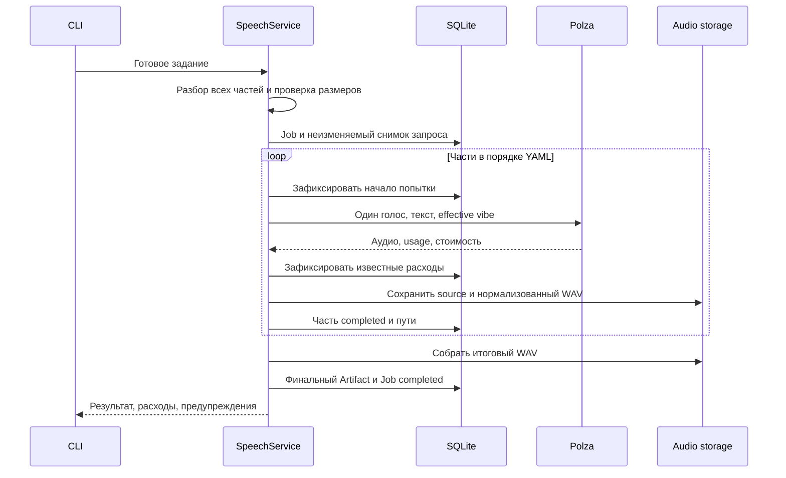
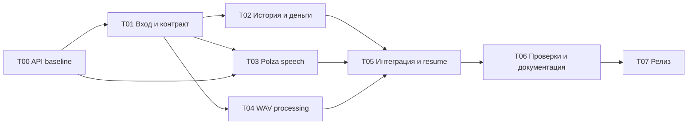

## 10. Генерация речи через Polza — план расширения aimedia 🎙️

> [!abstract] Назначение
> Добавляется один режим существующей утилиты: озвучивание текста моделями **Gemini 3.8 Flash TTS** и **Gemini 3.8 Flash-Lite TTS** через **Polza**. Короткое сообщение задаётся аргументами CLI. Составная запись задаётся YAML-файлом: автор заранее определяет части, в каждой части указан один голос. Программа проверяет структуру и длину, последовательно выполняет запросы, сохраняет расходы и собирает один WAV-файл.
>
> Это план небольшого модуля, а не проект универсального конструктора TTS-провайдеров.

| Поле | Значение |
|---|---|
| Вид документа | Дополнение к документам `01`–`09` и общему README-плану |
| Функциональная область | `audio.speech` |
| Провайдер первой реализации | `polza` |
| Модели | Gemini 3.8 Flash TTS; Gemini 3.8 Flash-Lite TTS |
| Дата проверки открытой документации | 28 сентября 2026 года |
| Статус реализации | `NOT_STARTED`: исходный код и результаты его запуска в рамках этого документа не проверялись |
| Статус живых запросов | `NOT_RUN`: платные генерации при подготовке документа не выполнялись |
| Главная внешняя неопределённость | Точный контракт передачи произвольного vibe для этих моделей именно через Polza |
| Конечный формат первой поставки | WAV; другие форматы не требуются для закрытия этого дополнения |
| Выполнение частей | Последовательно внутри одного Job, без отдельной очереди и фонового сервиса |

В тексте различаются три вида утверждений: **требование продукта**, **сведения источника** и **проверка, которую предстоит выполнить**. Пример будущей команды, JSON-ответа или названия теста не означает, что соответствующая функция уже реализована.

### Навигация по плану 🧭

| Раздел | Что фиксируется |
|---|---|
| Основание и границы | Как дополнение встраивается в существующие документы |
| Проверка API | Что подтверждено источниками и что блокирует реальную интеграцию |
| CLI и YAML | Два способа задания контента, правила голоса и vibe |
| Длина | Что именно измеряется до отправки запросов |
| Исполнение | Последовательные части, остановка, возобновление, склейка |
| Хранение и деньги | Снимок задания, состояние частей, расходы без повторного учёта |
| Логи и секреты | Диагностические события и исключение утечек |
| Разработка | Этапы, зависимости, параллельная работа, коммиты |
| Проверки и релиз | Матрица доказательств, приёмка, тег и установка через uv tool |

## Основание: расширение, а не перестройка приложения 🧱

Общий README уже разделяет CLI, домен, Polza-adapter, хранение, выполнение и встроенную документацию. В нём также прямо указано, что исходный релиз image-модуля не включает TTS. Этот документ добавляет отдельный согласованный объём работ; он не переобъявляет ранее запланированные возможности уже выполненными. fileciteturn6file0L11-L29

**Повторно используются** существующие Settings, загрузка секретов, HTTP-клиент Polza, JobRepository, ArtifactStorage, `Cost`/`Usage`, JSON presenter, logger и система help. Вторая SQLite, отдельный логгер, новый migration runner и независимое дерево конфигурации не создаются.

### Связь с девятью документами 📚

Относительные ссылки рассчитаны на расположение этого файла рядом с фундаментальными документами в `docs/project/`.

| Документ | Что используется | Минимальное дополнение |
|---|---|---|
| [01 — Product Scope](01-product-scope.md) | Локальная CLI и явно ограниченный scope | Добавить speech как отдельный этап/релиз, не возвращать остальные отложенные модальности |
| [02 — System Architecture](02-system-architecture.md) | Модульный монолит и существующие зависимости | Зарегистрировать SpeechService и один speech-adapter |
| [03 — Domain Model](03-domain-model.md) | Job, Artifact, Cost, Usage | Один пользовательский Job может содержать несколько последовательных speech-запросов |
| [04 — CLI Contract](04-cli-contract.md) | Грамматика, JSON, exit codes, `--out` | Добавить `audio speech`, вход `--script` и описанный ниже `--resume` |
| [05 — Provider System](05-provider-system.md) | Изоляция endpoint и преобразования API | Добавить генерацию одной speech-части через Polza |
| [06 — Model Registry](06-model-registry.md) | Общие команды сведений о моделях | Показывать две speech-модели без нового конструктора capabilities |
| [07 — Storage, History & Costs](07-storage-history-costs.md) | JSON snapshots, файлы, Decimal, RUB/USD | Хранить прогресс и попытки частей в speech-секции существующих JSON-полей |
| [08 — Job Execution](08-job-execution.md) | Нет скрытых повторов; разница retry/sync | Разделить полный retry, явный speech resume и неплатный sync |
| [09 — Documentation & Help](09-documentation-help.md) | Атомарный Markdown и машинная справка | Добавить несколько speech-тем и примеры конфигов |
| [README — общий план](README.md) | Этапы, доказательства, release runbook | Добавить эту ветку работ и отдельный gate живой проверки TTS |

> [!important] Уточнение прежних обсуждений
> Для этого дополнения не создаются `TextChunker`, реестр способов эмуляции диалогов, каталог provider bindings в отдельных YAML, автоматический выбор native/composed режима или валидатор эмоций. **Нарезка, распределение голосов и постановка задачи принадлежат автору конфига.** Программа исполняет готовые части.

Это целевое упрощение speech-модуля. Оно не требует удалять уже существующий image-registry или ослаблять проверки изображений.

## Что подтверждено об API, а что ещё нужно проверить 🔎

### Результат проверки открытых источников 📄

| Вопрос | Что удалось установить | Следствие для плана |
|---|---|---|
| Существуют ли обе модели Google | Официальные страницы содержат `gemini-3.8-flash-tts` и `gemini-3.8-flash-lite-tts`; для каждой указано 8 192 входных токена [S1], [S2] | Названия моделей не угадываются. Токены не объявляются символами |
| Как Google передаёт подачу | Руководство отделяет произносимый текст от `speech_metadata.style` и выбора голоса [S3] | Внутренне `text`, `voice` и `vibe` остаются разными полями |
| Как выглядит общий speech endpoint Polza | В документации описан `/api/v1/audio/speech`, `input`, `voice`, формат результата и данные usage [S4] | Используется отдельный speech-adapter, а не image polling |
| Какой символьный предел опубликован у Polza | Для `input` указано 5 000 символов [S4] | Это основание начального ограничения совместимости, но не доказанный физический предел Gemini |
| Подтверждён ли Gemini-vibe в контракте Polza | Описание `instructions` ограничено другой моделью; `style` в общей таблице — числовое поле другого семейства [S4] | Нельзя просто отправить строковый vibe как `style` и объявить интеграцию готовой |
| Можно ли проверить актуальный каталог | Polza документирует отдельный Models Catalog [S5] | Точный remote ID и обслуживающий endpoint фиксируются на T00 |
| Проверены ли реальные ответы Polza в этой работе | Нет | Голоса, фактический формат, стоимость и эффект vibe остаются `NOT_RUN` до живых проб |

Полные ссылки на первоисточники находятся в конце документа. В частности, при текущей проверке карточки двух конкретных TTS-моделей Polza и ответ публичного каталога не удалось получить. Это **не подтверждает отсутствия моделей**; это означает, что их текущие Polza-ID нельзя считать перепроверенными только на основании предыдущих сообщений.

Официальная документация Google подтверждает отделение режиссёрских инструкций от произносимого текста. Она не доказывает, что посредник пропускает те же поля без изменений. Поэтому точная Polza-сериализация vibe является небольшой предварительной интеграционной задачей, а не поводом строить универсальную систему настроек. [S3], [S4]

### T00 — короткая проверка маршрута до основной разработки 🧪

До фиксации adapter нужно получить **один воспроизводимый рабочий запрос на каждую модель**, в котором независимо передаются текст, голос и пожелания к подаче.

| Проверка | Что сохраняется в локальный отчёт | Что считается результатом |
|---|---|---|
| Каталог/поддержка Polza | Remote ID, endpoint, дата, источник контракта | Указаны реальные ID обеих целевых моделей |
| Базовая речь | Обезличенный payload, HTTP status, формат и длительность файла | Вернулся декодируемый звук с заданным текстом |
| Выбор голоса | Одна фраза с двумя выбранными preset-голосами | Нет очевидной подмены обоих голосов одним дефолтом; результат прослушан |
| Управление подачей | Одна фраза, один голос, два явно отличающихся vibe | Подача меняется; служебные инструкции не зачитываются |
| Общий + частный vibe | Снимок уже объединённой инструкции | В запросе сохранены обе составляющие; нет потери общей постановки |
| Граница длины | Длина текста, длина инструкции, общий локальный размер, ответ | Проверен заявленный рабочий предел на осмысленном русском тексте |
| Учёт | Исходный usage, обнаруженное поле цены и валюта | Известно, где брать цену; отсутствие цены также явно зафиксировано |
| Выходной звук | Фактические контейнер, codec, частота, каналы | Выбран один проверенный путь декодирования в итоговый WAV |

Проверка не требует двухголосого запроса: в целевом режиме каждый API-вызов содержит один голос. Пара Kore/Puck ниже используется как пример голосов из руководства Google, а не как уже испытанная комбинация через Polza. [S3]

**HTTP 200 сам по себе не подтверждает применение vibe или выбранного голоса.** Сервис может принять неизвестное поле, проигнорировать его и вернуть обычное аудио. Поэтому помимо сетевого результата нужно прослушивание контрольных фраз. Автоматическая проверка наличия файла этого не заменяет.

Для проб используются `.env`, тестовые тексты и заранее разрешённое число платных вызовов. Не выполняется большой перебор параметров и лимитов. Граница `5001` проверяется лишь как отдельная диагностическая проба при разрешённом бюджете; массовая серия `7000/10000/...` не является необходимой частью реализации.

> [!warning] Условие продолжения
> Если через Polza не найден рабочий способ передачи произвольного vibe, основная интеграция этой возможности остаётся `BLOCKED_PROVIDER_CONTRACT`. Нельзя молча озвучивать инструкции как часть текста, выбрасывать vibe, переключаться на другую модель или выдавать обычный TTS за выполненное требование.
>
> В этом случае разработчик запрашивает у Polza точный пример для двух целевых моделей. Локальный parser, сохранение и сборка аудио могут разрабатываться на fake provider, но live-gate и релиз speech не закрываются.

### Что именно спрашивается у поддержки при пробеле в документации ✉️

Запрос должен содержать названия двух моделей и один конкретный сценарий: single-speaker synthesis, произвольная инструкция подачи вне текста, выбранный preset voice, непотоковый ответ и фактическая стоимость. Требуется пример JSON, endpoint, пределы для текста и инструкций, единица подсчёта длины и ожидаемый формат ответа. Не требуется описание Voice Design, клонирования или нативных диалогов.

## Границы первой поставки 🎯

### Обязательные возможности ✅

| Возможность | Принятое поведение |
|---|---|
| Простая фраза | `--text`, `--voice`, необязательный `--vibe` |
| Составная запись | Только `--script` с YAML |
| Один голос в части | `voice` — одна строка, не список и не карта спикеров |
| Один или два голоса в записи | Разные части могут использовать одинаковые или разные голоса |
| Общая постановка | Корневой `vibe`, например «спокойный образовательный подкаст» |
| Подача конкретной части | `parts[i].vibe` добавляется к общему vibe |
| Границы частей | Берутся из конфига без изменений |
| Проверка длины | Все части проверяются до первого платного вызова |
| Выполнение | Один запрос на часть в штатном проходе, последовательно |
| Результат | Один WAV, собранный строго в порядке `parts` |
| История | Один пользовательский Job с состояниями и попытками частей |
| Расходы | Фактические суммы по запросам; неизвестные значения не превращаются в нули |
| Повторное использование | Сохранённые части не генерируются заново при локальной сборке |
| Интеграция | Общие логи, JSON, help, Settings и существующая БД |

Количество **проверенных сценариями** голосов в первой поставке — один и два. Программа не анализирует текст на наличие чужих реплик: требование «один голос» выражено структурой одной части и одним параметром API. Она также не ограничивает всю запись лимитом нативного multi-speaker режима Google, поскольку этот режим здесь не используется.

### Что не добавляется 🚫

Не реализуются автоматическая нарезка и переписывание текста, перевод, подбор эмоций из словаря, voice cloning/design, нативные два спикера в одном запросе, голосовые профили, stream-воспроизведение, музыка, crossfade, автоматическое выравнивание громкости, вставка пауз, STT-контроль, новые провайдеры и новые TTS-семейства.

Из этого также следует, что составной диалог не обещает точности таймингов, перебиваний и совместного дыхания нативного двухголосого запроса. Он представляет собой последовательность готовых одно-голосных фрагментов. Границы и паузы подготавливаются автором; программа не занимается режиссурой.

## Публичные команды ⌨️

### Короткое сообщение без конфига 💬

```bash
aimedia audio speech --text "Добрый вечер. Начинаем выпуск." --voice Kore --vibe "Тёплая, спокойная подача ведущего подкаста." --model flash
```

`--model` принимает `flash` или `flash-lite`; значение по умолчанию — `flash`. Эти короткие имена имеют смысл только в speech-команде и не занимают глобальный alias `flash` в image/text-каталоге.

```bash
aimedia audio speech --text "Спасибо за внимание." --voice Puck --model flash-lite --out ./results --name outro --json
```

### Составная запись из файла 📄

```bash
aimedia audio speech --script ./dialogue.yaml --model flash --out ./results --name episode-01
```

```bash
aimedia audio speech --script ./chapter.yaml --model flash-lite --json
```

`--script` выбран намеренно: существующий `--config` остаётся путём к **настройкам приложения**, а не к тексту озвучивания. Для одной роли не создаются одновременно `--script`, `--config` и `--input-config`.

### Ограниченный набор опций 🎛️

| Опция | Поведение |
|---|---|
| `--text TEXT` | Один короткий текст; создаётся одна внутренняя часть |
| `--voice NAME` | Обязательна в режиме `--text`; передаётся без автозамены имени |
| `--vibe TEXT` | Необязательная подача простой фразы |
| `--script PATH` | YAML с готовыми частями; в этом режиме голоса и vibe находятся внутри файла |
| `--model flash\|flash-lite` | Одна модель на весь Job |
| `--provider polza` | Общая существующая опция; в этой поставке speech обслуживает только Polza |
| `--out DIR` | Каталог результата, как в общем CLI-контракте |
| `--name NAME` | Базовое имя, например `episode-01` → `episode-01.wav` |
| `--format wav` | Только WAV; если общий parser уже имеет эту опцию, другая величина даёт понятную ошибку |
| `--dry-run` | Разобрать вход и показать размеры частей без сети и без платного Job |
| `--resume JOB_ID` | Явно продолжить сохранённое составное задание по правилам ниже |
| `--json` | Один JSON-документ в stdout, общая оболочка приложения |

`--text`, `--script` и `--resume` взаимоисключающие. Для `--script` не принимаются внешние `--voice`/`--vibe`: иначе появляются скрытые правила переопределения содержимого файла. Для `--resume` не принимаются новые модель, текст, голос, script или vibe. Возобновление использует сохранённый снимок и те же выходные настройки; новый контент означает новый Job.

`--text-file` не нужен: длинные и составные входы всегда представлены явным списком частей в YAML. Авторазбиение не появляется под видом удобного флага.

### Проверка без списания 🧪

```bash
aimedia audio speech --script ./dialogue.yaml --model flash --dry-run --json
```

Dry-run показывает количество частей, голоса, длину каждой составляющей, итоговый размер, установленный предел и предполагаемый путь результата. Не читает баланс, не выполняет TTS и не обещает, что удалённый API гарантированно примет запрос. `--help`, `models show` и dry-run работают без ключа. Режим dry-run может обходиться без FFmpeg: проверка его наличия обязательна перед фактическим исполнением, а не при чтении справки.

## Формат задания: один простой YAML 🧩

### Диалог из трёх независимых частей 🎭

```yaml
version: 1

vibe: >-
  Это образовательный подкаст о технологиях.
  Естественная разговорная речь, без рекламного пафоса.
  Сохранять спокойную, доброжелательную подачу.

parts:
  - voice: Kore
    vibe: >-
      С любопытством, как вопрос собеседнику.
    text: |-
      Что изменится, если агенту дать такой инструмент?

  - voice: Puck
    vibe: >-
      Уверенно и немного воодушевлённо.
    text: |-
      Он сможет подготовить части выпуска и заказать их озвучивание.

  - voice: Kore
    vibe: >-
      С лёгкой улыбкой, подводя итог.
    text: |-
      А программа просто выполнит задание и сохранит результат.
```

Здесь три элемента `parts`, следовательно, в обычном успешном проходе выполняются **три генерации**, а не один нативный двухголосый запрос. Первой и третьей частям передаётся Kore, второй — Puck. После этого файлы соединяются в том же порядке.

### Длинный монолог 📚

```yaml
version: 1
vibe: "Спокойное чтение научно-популярной статьи. Чёткая дикция, естественный темп."
parts:
  - voice: Kore
    text: |-
      Первый подготовленный автором фрагмент статьи.
  - voice: Kore
    vibe: "Немного сильнее подчеркнуть неожиданность вывода."
    text: |-
      Второй подготовленный автором фрагмент статьи.
```

Повторение `voice` в нескольких элементах сознательно оставлено. Для такого файла оно понятнее, чем отдельный реестр спикеров, наследование defaults и ссылки между конфигами.

### Схема и её единственные роли 📐

| Поле | Тип | Обязательно | Смысл |
|---|---|---:|---|
| `version` | Целое `1` | Да | Версия пользовательского формата |
| `vibe` | Строка | Нет | Общая инструкция подачи и контекста записи |
| `parts` | Непустой список | Да | Порядок и границы запросов |
| `parts[].voice` | Непустая строка | Да | Один голос для одной части |
| `parts[].text` | Непустая строка | Да | Текст, который должен прозвучать |
| `parts[].vibe` | Строка | Нет | Дополнительная подача этой части |

Отсутствующий vibe эквивалентен пустой строке. `null`, массив или число не приводятся молча к тексту. Неизвестные ключи и повторяющиеся ключи YAML отклоняются как ошибки структуры: опечатка `viibe` не должна незаметно менять платный результат. Это короткая проверка входного документа, а не система проверки способностей модели.

В YAML нет `provider`, API-адресов, секретов, расходов, retry policy, лимитов или имени конечного файла. Эти сведения принадлежат CLI/Settings и истории исполнения. Файл контента не может повысить предельную длину или сменить провайдера.

### Общий и частный vibe складываются буквально 🎨

Для части `i` формируется строка:

```python
effective_vibe = "\n\n".join(
    value for value in (script_vibe, part_vibe) if value
)
```

Если обе строки непустые, добавляются ровно два символа перевода строки. Частный vibe **добавляется**, а не заменяет общий. Программа не интерпретирует противоречивые пожелания, не перефразирует их и не гарантирует семантическое «переопределение» одной фразы другой.

Так общая инструкция «это подкаст» попадает в каждую генерацию, а «здесь удивиться» — только в нужную часть. При простой CLI-команде `--vibe` становится единственной инструкцией одной части.

Произносимый текст не смешивается с vibe. Разделение соответствует смыслу Google TTS, но конкретное поле Polza для полученной строки утверждается только после T00. [S3]

## Длина части: одно правило, без автоматической нарезки 📏

### Предельное значение и его статус ⚠️

Начальное проектное значение:

```python
MAX_TTS_PART_CHARS = 5000
```

**Это консервативный локальный бюджет совместимости**, выбранный на основании опубликованного ограничения `input` в Polza. Он не называется «пределом Gemini» и не переводит входное окно модели из токенов в символы. На T00 проверяется применимость к фактическому маршруту и полям; при необходимости значение меняется одной константой и одним набором граничных тестов. [S1], [S2], [S4]

Правило приложения учитывает **весь текст, который оно отправляет модели для одной части**, а не только озвучиваемые слова:

```text
request_chars = len(text) + len(effective_vibe)
request_chars <= MAX_TTS_PART_CHARS
```

Таким образом текст на 4 900 символов с инструкциями на 200 символов не проходит локальную проверку. Это сознательно более узкое правило продукта, чем ограничение только на `input`; оно оставляет единый понятный бюджет для автора конфига.

Имена JSON-полей, base64 ответа, имя модели, voice ID и YAML-разметка в этот размер не входят. Если после T00 adapter обязан добавить текстовый служебный префикс, его длина **также** включается в `request_chars` и видна в dry-run. Скрытого «добавили ещё 400 символов после проверки» быть не должно.

У Polza могут существовать отдельные ограничения на поле инструкций. Нельзя считать их автоматически закрытыми общим бюджетом. На T00 требуется либо подтверждение совместимого контракта, либо консервативное уменьшение единого бюджета так, чтобы он не превышал ни один применимый текстовый предел. Второй пользовательский набор лимитов и токенизатор не вводятся.

### Что означает «символ» 🔤

В первой реализации локальный счётчик — `len()` строки Python после разбора YAML. Считаются пробелы, переводы строк, знаки пунктуации, inline-теги и символы объединённого vibe. Это количество Unicode code points, не байтов UTF-8 и не визуальных графем. Например последовательность emoji с модификаторами может занимать несколько таких единиц.

Файл читается как UTF-8; допускается UTF-8 BOM. Текстовые переводы строк приводятся к `\n` при чтении; далее текст не обрезается и не нормализуется по содержанию. Результат YAML-блоков `|`, `|-`, `>` считается после декодирования — включая предусмотренный этим блоком завершающий перевод строки. Проверка «пусто ли» может использовать `strip()`, но для отправки и измерения сохраняется исходная разобранная строка.

Единицу реального серверного подсчёта необходимо проверить отдельным случаем с небазовым Unicode. До проверки нельзя обещать, что любой текст с emoji ровно на локальной границе совпадёт с серверной границей. Ошибка сервера возвращается как ошибка конкретной части; утилита не начинает резать или пересылать её заново.

### Проверяется весь файл до первой генерации 🛑

Если части 1–4 корректны, а часть 5 превышает лимит, **не выполняется ни один TTS-запрос**. Пользователь сразу получает список всех превышений, а не оплаченный обрывок записи.

Концептуальный результат ошибки:

```json
{
  "ok": false,
  "error": {
    "code": "SPEECH_PART_TOO_LONG",
    "message": "Часть 5 превышает допустимую длину одной генерации.",
    "details": {
      "part_index": 5,
      "text_chars": 4890,
      "vibe_chars": 132,
      "request_chars": 5022,
      "limit_chars": 5000
    }
  }
}
```

Номера частей в JSON, сообщениях и именах файлов — **с единицы**. Нулевые индексы могут использоваться только внутри Python, но не просачиваются в пользовательскую диагностику.

### Базовые проверки и то, чего они не делают 🧪

Помимо размера, проверяются только исполнимость структуры и технические условия: файл читается, версия поддержана, список непустой, значения имеют нужный тип, у каждой части один непустой voice, входные режимы не смешаны, выбрана одна из двух моделей, выход доступен для записи.

Vibe и voice не ограничиваются самодельными словарями. Текст не проверяется на количество языков, эмоциональную правильность, наличие XML-подобных тегов или имена персонажей. Проверка декодируемости **полученного аудио** остаётся обязательной технической проверкой результата, а не новым валидатором содержания задания.

## Встраивание в приложение без нового фреймворка 🔌

### Небольшой набор компонентов 🧰

```text
CLI: audio speech
       │
       ├── короткие аргументы
       └── script.yaml
               │
               ▼
      SpeechRequest с готовыми частями
               │
               ▼
          SpeechService
       ┌───────┼───────────┐
       ▼       ▼           ▼
 Polza speech  История   Сборка WAV
    adapter    SQLite   и файловый storage
```

Новые обязанности раскладываются по существующим каталогам. Дерево ниже задаёт зоны ответственности, а не требование создать каждый файл заранее:

```text
src/aimedia/
├── cli/
│   └── audio.py                       # команда speech, без HTTP и SQL
├── domain/requests/
│   └── speech.py                      # Request и Part, небольшие структуры
├── application/
│   └── speech.py                      # последовательный проход и resume
├── providers/polza/
│   └── speech.py                      # один запрос, нормализация ответа
├── processing/
│   └── audio.py                       # decode/normalize/concat
└── resources/docs/audio/
    ├── speech.md
    ├── speech-script.md
    └── speech-recovery.md
```

Сохраняются выбранные проектом `httpx`, Pydantic, Peewee, YAML-parser и logger. Не добавляются Google SDK, новый DI-контейнер, второй ORM, `pydub`, `librosa`, Redis или Celery. Для работы со звуком используется один системный **FFmpeg**; его наличие проверяется только перед реальным speech-выполнением. Image-команды и локальная справка от него не зависят.

### Что приходит в adapter 📨

Минимальный контракт для одного вызова содержит четыре значения:

```python
async def synthesize_part(
    *,
    model_id: str,
    text: str,
    voice: str,
    vibe: str,
) -> SpeechPartResult:
    ...
```

Это эскиз внутреннего интерфейса, не готовый код. `SpeechPartResult` содержит полученное аудио или ссылку на сохранённый source-файл, фактический content type, usage, цену, предупреждения и request/trace ID, если они предоставлены. Сырой `httpx.Response` за пределы adapter не передаётся.

Adapter не режет текст, не выбирает голос, не объединяет несколько элементов `parts` в один запрос и не пересылает предыдущую/следующую часть в качестве контекста. Общая постановка передаётся повторением готового `vibe`, а не скрытой историей диалога.

### Две модели — одна маленькая таблица 🧬

| Alias в speech-команде | Целевая модель Google | Кандидат Polza remote ID из обсуждения |
|---|---|---|
| `flash` | `gemini-3.8-flash-tts` | `google/gemini-3.8-flash-tts` |
| `flash-lite` | `gemini-3.8-flash-lite-tts` | `google/gemini-3.8-flash-lite-tts` |

Третий столбец утверждается по результатам T00. До этого нельзя выпускать эти строки как проверенные рабочие bindings. Для двух моделей достаточно небольшой таблицы в существующем Polza speech-модуле; это не повод переносить весь каталог изображений из YAML в код.

Общие `models list/show` получают эти две записи через текущий интерфейс каталога. Если он уже требует две небольшие YAML-записи, используются именно две обычные записи существующего формата — **без нового загрузчика, overlay и цепочки конфигов**. Список aliases и remote IDs должен иметь один источник в реализации, а не копии в CLI, adapter и help.

### Как остаётся возможность добавить другого поставщика ➕

В будущем новый adapter реализует тот же вызов одной части: модель, текст, голос, vibe → аудио и usage. SpeechService, формат YAML, порядок частей и история остаются прежними. Дополнительные возможности вводятся только при появлении второго реального случая; обещать одинаковые voice ID между провайдерами заранее нельзя.

Текущая реализация не делает автоматический fallback на Google Direct/OpenRouter и не использует второй ключ для спасения неудачного запроса Polza. Это изменило бы поставщика и условия списания без явного выбора пользователя.

## Контракт Polza: сначала рабочая передача vibe 🌐

### Чего нельзя зашивать по догадке ⚠️

В опубликованном speech-контракте Polza `style` описано для другого семейства как число, а `instructions` не документировано как общее поле Gemini. Поэтому следующие действия запрещены без подтверждения T00:

```text
vibe → top-level style как строка
vibe → instructions с предположением «наверняка прокинется»
Google speech_metadata → Polza payload без проверки поддержки
vibe + text → один произносимый input с надеждой, что инструкции не зачитают
```

Это не запрет проверять гипотезу отдельной пробой. Это запрет делать гипотезу контрактом рабочего продукта. [S4]

### Что должно быть зафиксировано после T00 📌

Результат T00 — небольшой `speech-api-baseline.md` и очищенные fixtures, содержащие:

| Положение | Что фиксируется |
|---|---|
| Endpoint | Один конкретный путь генерации речи |
| Модель | Реальные remote IDs обеих моделей |
| Голос | Точное поле и поведение при передаче preset voice |
| Подача | Точное место передачи `effective_vibe` отдельно от озвучиваемого текста |
| Лимит | Применимые пределы полей и выбранный общий локальный бюджет |
| Ответ | JSON/base64, бинарный ответ или иной **наблюдавшийся** формат |
| Деньги | Поле стоимости, единица валюты, наличие/отсутствие usage |
| Отказы | Наблюдавшиеся ошибки и возможность установить исход запроса |

В рабочем adapter реализуется только выбранный контракт. Не требуется поддерживать пять воображаемых форм ответа «на всякий случай». Если на практике модели отличаются, допускаются два коротких явных варианта внутри одного adapter, а не декларативный конструктор payload.

Если ответ содержит готовое аудио, `remote_job_id` не выдумывается. Если действительно возвращается асинхронная задача, её ID и правильный endpoint наблюдения сохраняются на уровне соответствующей части. Вызов `/media/{id}` не выбирается автоматически только потому, что такой polling уже существует у изображений.

### Ответ проверяется технически, а не по имени расширения 🎧

Сохраняются исходные байты и фактический content type. Данные base64 декодируются, но не остаются гигантской строкой в БД. FFmpeg должен распознать аудио и получить из него нормализованную часть. HTML ошибки с HTTP 200, пустой ответ, повреждённый base64 и файл без аудиопотока не превращаются в «успешный WAV».

Headerless PCM принимается только при известном из подтверждённого контракта sample format, byte order, частоте и числе каналов. Эти параметры нельзя угадывать по расширению `.pcm`. Уже готовый WAV не оборачивается вторым WAV-заголовком; также нельзя универсально удалять первые 44 байта.

## Жизненный цикл составной записи ⚙️

### Один Job, несколько платных вызовов 🧾

Пользовательская операция «озвучить этот файл» остаётся одним Job с `kind = audio.speech`. Части — внутренние единицы исполнения. Это точечное уточнение раннего правила «каждый внешний вызов — отдельный Job»: для составной речи нужно хранить детализацию вызовов **внутри** одного пользовательского задания.

Image batch не меняется: пять независимых картинок по-прежнему остаются пятью Jobs. Речь отличается тем, что части должны образовать один упорядоченный конечный артефакт.



Все размеры проверяются заранее. После разбора содержимого создаётся immutable snapshot задания. Порядок создания Job относительно локальной ошибки следует согласованному общему baseline: синтаксическая ошибка CLI не создаёт Job; если intent уже зарегистрирован, pre-submit отказ может сохраняться как failed Job. В обоих случаях неверный размер означает **ноль TTS-вызовов**.

### Последовательное выполнение вместо дополнительной очереди 🪶

Внутри одного speech Job выполняется одна часть за другой. Новый фрагмент не отправляется, пока предыдущий результат и его известные расходы не зафиксированы. Ошибка части останавливает дальнейшие отправки: нет смысла оплачивать хвост диалога, если середина уже потеряна.

Это сознательное отличие от независимого image batch, где ошибка одной картинки не отменяет остальные. Общая асинхронность HTTP сохраняется. Наличие нескольких одновременно запущенных общих Jobs не требует параллельно запускать все speech-части одного файла.

Параллельность частей не входит в первую поставку. Её можно добавить позже, сохранив сборку по порядку и учёт попыток, но сейчас она увеличивает число неоднозначных платных состояний без обязательной пользы.

### Состояния части нужны для восстановления, а не для оркестратора 🧩

| Состояние | Значение | Разрешённое действие |
|---|---|---|
| `pending` | Ни одна попытка не началась | Обычный запуск или явный resume может отправить часть |
| `in_flight` | Начало запроса записано, окончательный ответ ещё не сохранён | Ожидание; после аварии исход проверяется, а не пересылается автоматически |
| `received` | Удалённый ответ получен; локальная обработка ещё не завершена | Использовать уже сохранённый source, не генерировать заново |
| `completed` | Нормализованный WAV существует и связан с частью | Переиспользовать для сборки |
| `failed` | Известен определённый отказ или локальная ошибка | Локальная recovery либо новая попытка только по явной команде |
| `unknown` | Запрос мог быть принят и оплачен, но исход не установлен | Не повторять автоматически |

Состояние отправки и наличие локального файла проверяются вместе. `received` с утерянным source-файлом нельзя считать восстановимым локально. `completed` также проверяется по наличию и hash файла, а не только по строке статуса.

После аварии оставшийся `in_flight` без пригодного сохранённого ответа рассматривается как `unknown`. Нельзя заключить «генерации не было» по отсутствию итогового WAV.

### Остановка и повтор: три разные операции ♻️

| Операция | Может создавать новые списания | Семантика |
|---|---:|---|
| `jobs sync JOB_ID` | Нет новых генераций | Восстановить доступные результаты существующих вызовов или пересобрать звук из сохранённых частей |
| `audio speech --resume JOB_ID` | Да, только явно недостающие/подтверждённо неуспешные части | Продолжить исходное задание из snapshot, не повторяя готовые части |
| `jobs retry JOB_ID` | Да, весь запрос заново | Новый Job с отдельной историей и связью `retry_of` |

```bash
aimedia audio speech --resume 481 --json
```

Явный `--resume` разрешает продолжение того же составного задания, включая новые попытки частей с определённым отказом. Каждая попытка сохраняется отдельно; предыдущие расходы не стираются. В обычном проходе скрытых повторов POST нет.

Часть со статусом `unknown` блокирует resume с ошибкой `SPEECH_PART_OUTCOME_UNKNOWN`. Если provider имеет подтверждённый способ получить результат по request ID, сначала используется он. В противном случае пользователь получает честное предупреждение о возможном списании и может осознанно начать **новый** Job. Автоматическая кнопка «всё равно повторить неизвестную попытку» не нужна в этой поставке.

При изменении YAML на диске старый Job продолжает использовать исходный snapshot. Возобновление не перечитывает изменённый конфиг как новый текст.

### Ctrl+C и тайм-ауты 🛑

Ctrl+C прекращает локальное ожидание и не запускает следующую часть. Это не обещание удалённой отмены. Уже сохранённые WAV и стоимость остаются в истории; текущий вызов при неизвестном исходе отмечается соответствующим образом.

Тайм-аут отдельного HTTP-запроса не доказывает, что Polza не выполнила генерацию. POST после такого исхода не повторяется автоматически. Безопасные повторения скачивания уже известного результата и ограниченные GET status retries могут использовать существующую политику приложения.

Синхронный запрос без remote ID не получает придуманного polling-механизма. Для него после потери ответа восстановление ограничено тем, что действительно сохранилось или доступно в документированном API истории.

Для длительности ожидания используется существующая execution-настройка, подходящая для TTS. Новые пользовательские timeout-флаги и десятки operational-конфигов не требуются. На T00 проверяется, что выбранное значение не обрывает обычную допустимую часть.

## Звук: сохранение частей и честная склейка 🎧

### Один технический формат 📦

Для первой поставки принимается единый локальный формат: **WAV, PCM signed 16-bit little-endian, 24 kHz, mono**. Это решение приложения для совместимости частей, а не утверждение, что любой маршрут Polza всегда возвращает такой звук.

FFmpeg используется только для декодирования/приведения формата и соединения. Не выполняются нормализация громкости, подавление шума, автообрезка тишины, time-stretch, crossfade или генерация пауз. Слышимые различия между независимыми генерациями не объявляются решёнными за счёт одинакового WAV-контейнера.

В concat demuxer FFmpeg входы должны иметь совместимые потоки; поэтому сначала нормализуются отдельные части, а затем соединяются. [S6]

### Последовательность файловых операций 📁

Рекомендуемый внутренний каталог одного задания:

```text
<app_data>/outputs/<date>/job_<id>/
├── speech-parts/
│   ├── part-0001-attempt-01.source
│   ├── part-0001.wav
│   ├── part-0002-attempt-01.source
│   ├── part-0002.wav
│   └── concat.txt
└── result.wav
```

При `--out ./results --name episode-01` конечный файл находится в `./results/episode-01.wav`. Рабочие части остаются в app-managed каталоге этого Job. Это не скрытая вторая копия финального файла: исходные части нужны для повторной локальной сборки и прозрачного восстановления.

Имена рабочих файлов формируются программой из номера части и попытки. Голос, текст и другие пользовательские строки не превращаются в имена файлов. Непроверенные URL/path из ответа не определяют место записи.

Исходный ответ пишется во временный файл; после успешной записи фиксируется источник и начинается нормализация. Нормализованный файл также сначала пишется во временный путь. Финальный WAV публикуется только после успешной сборки **всех** частей и проверки файла. Неполная запись не получает имя готового результата.

Существующие пользовательские файлы не перезаписываются молча. Используется общая политика коллизий ArtifactStorage. Временный конечный файл создаётся на том же файловом томе, что и итоговый, для безопасной финальной операции перемещения; операция с внешним `--out` не должна полагаться на rename между разными дисками.

### Как вызывается FFmpeg 🛠️

В Python передаётся список аргументов с `shell=False`. Не собирается shell-строка из пользовательского пути. `-nostdin` запрещает ожидание интерактивного ввода; отсутствие FFmpeg обнаруживается до платной генерации.

Пример технической нормализации уже полученного source-файла:

```bash
ffmpeg -nostdin -hide_banner -loglevel error -n -i part-0001-attempt-01.source -map 0:a:0 -vn -c:a pcm_s16le -ar 24000 -ac 1 -f wav part-0001.wav
```

Пример внутреннего списка нормализованных файлов:

```text
file 'part-0001.wav'
file 'part-0002.wav'
```

Пример технической сборки:

```bash
ffmpeg -nostdin -hide_banner -loglevel error -n -f concat -safe 1 -i concat.txt -map 0:a:0 -c:a copy -f wav joined.part
```

Это иллюстрации будущего processing-кода, не команды, которые предлагается вручную выполнять вместо утилиты. В реализации используются уникальные временные пути; уже существующий `joined.part` не удаляется произвольно. Для headerless PCM формат входа указывается отдельно, только по известным параметрам ответа.

### Независимая проверка результата 🔬

После сборки проверяются контейнер, число каналов, частота, разрядность и непустое число frames. Для нормализованного PCM-WAV в тестах можно использовать стандартный Python `wave`: он читает параметры и кадры несжатого PCM. [S7]

В детерминированных тестах из искусственных PCM-частей дополнительно проверяются точный порядок sample-блоков и суммарное число frames. Это подтверждает склейку, но не качество голоса реальной модели. На живой записи обязательны прослушивание начала/конца каждой части, стыков и отсутствие зачитанных инструкций.

Части сохраняются и после успешной сборки в первой версии: это простая явная политика без автоматического TTL. Они не лежат в общем очищаемом cache. Дополнительная команда очистки не требуется для релиза; объём и политика хранения описываются в help. При будущей ручной очистке нельзя удалять внешние пользовательские результаты вместе с cache.

## История, состояние частей и расходы 🗃️

### Сначала используются существующие поля, а не новая БД 🧱

В документе `07` уже предусмотрены `request_json`, `response_json`, `usage_json`, отдельные поля стоимости и файловые artifacts. Это достаточная исходная форма для небольшого последовательного speech-задания. fileciteturn7file2L165-L183 fileciteturn7file2L185-L204

| Существующее место | Что добавляется для speech |
|---|---|
| `jobs.kind` | `audio.speech` |
| `request_json` | Версия speech-запроса, модель, provider, общий vibe, все части, effective vibe каждой части, размеры, выходные настройки |
| Snapshot источника | Исходный YAML, путь и SHA-256 либо inline-аргументы; без секретов |
| `response_json.speech` | Версия структуры прогресса, состояние частей, попытки, пути source/WAV, контрольные суммы и сведения о сборке |
| `usage_json.speech` | Данные по каждой попытке и агрегированные известные метрики |
| `cost_amount` / `cost_currency` | Полная известная стоимость Job, если её действительно можно определить |
| `artifacts` | Конечный WAV и технические характеристики; части отмечаются как промежуточные, не как отдельные пользовательские Jobs |
| `error_json` | Часть/попытка, стадия ошибки, известность исхода, допустимое следующее действие |

**Предпочтительное изменение SQL-схемы — никакого**, если указанные JSON-поля и нужный `JobKind` уже поддерживаются реализацией. Если действительная БД имеет ограничения enum/check или недостающие поля, выполняется одна аддитивная миграция через уже выбранный migration runner. До просмотра кода нельзя назвать номер миграции или объявить её ненужной наверняка.

Новая таблица `speech_parts`, таблица голосов и копия каталога моделей не нужны в первой версии. Один speech Job обновляется одним исполнителем последовательно, поэтому JSON-прогресс достаточен. Общая защита от двух одновременно работающих Runner одного Job переиспользуется, а не заменяется брокером или новой системой блокировок.

### Что хранится по каждой попытке 🧾

Ниже иллюстрация структуры, не реальный API-ответ и не тариф:

```json
{
  "schema_version": 1,
  "parts": [
    {
      "index": 1,
      "state": "completed",
      "pcm_path": "speech-parts/part-0001.wav",
      "sha256": "<sha256 фактического файла>",
      "attempts": [
        {
          "number": 1,
          "outcome": "received",
          "request_id": null,
          "cost": {"amount": "0.013", "currency": "RUB"},
          "usage": {"raw": {}},
          "error": null
        }
      ]
    },
    {
      "index": 2,
      "state": "pending",
      "pcm_path": null,
      "sha256": null,
      "attempts": []
    }
  ],
  "assembly": {"state": "pending", "artifact_id": null}
}
```

В реализации также сохраняются время начала/завершения попытки, source-путь, фактические model/endpoint и remote reference, если он существует. Полная base64-строка, заголовки Authorization и ключи в этих полях запрещены.

Запись «попытка началась» сохраняется до POST. Полученные usage/стоимость фиксируются как можно раньше, ещё до локальной нормализации звука. Запись completed выполняется после сохранения пригодной части. Между сетью, SQLite и файловой системой остаются окна аварии; код не обещает общей атомарной транзакции для этих трёх систем.

### Расходы: сумма вызовов, не сумма обновлений состояния 💰

Стоимость определяется по **уникальным попыткам**, а не по количеству `poll`, `resume` или повторных сохранений Job. Сборка WAV ничего не добавляет к provider cost. Известная платная неуспешная попытка остаётся в расходах даже после успешной повторной.

Например, тестовые суммы `0.013`, `0.021` и `0.007` дают `Decimal("0.041")`, а не результат вычисления через float. Повторное открытие Job и пересборка дают ту же сумму. В Polza `cost_rub` и `cost`, если они представлены как алиасы, не суммируются дважды.

Денежные значения остаются `Decimal` в Python и decimal-compatible TEXT в SQLite по общему контракту. Для точного агрегирования не используется SQL `SUM()` по текстовому столбцу с неявным преобразованием в float.

| Ситуация | Как показывается стоимость |
|---|---|
| Все выполненные попытки вернули цену | Полная сумма известных фактических списаний |
| Хотя бы одна отправленная попытка не вернула цену | Общий `cost = null`; отдельно известная часть суммы и `cost_complete = false` |
| Некоторые части ещё не запускались | Их цена не выдумывается; статус Job показывает, что вся запись ещё не готова |
| Provider явно сообщил ноль | Сохраняется `0`, а не `null` |
| Запрос завершился тайм-аутом с неизвестным исходом | Цена этой попытки неизвестна; отсутствие ответа не доказывает отсутствие списания |
| Локальная сборка упала после успешных генераций | Все известные расходы сохраняются |
| В будущем появились разные валюты | Суммы группируются по валютам; FX-конвертации нет |

`cost_complete` означает полноту учёта **уже отправленных попыток**, а не оценку цены ещё не созданной речи. При mixed-currency результате нельзя заполнять единственный `jobs.cost_amount` произвольной общей суммой. Для первой реализации все вызовы одного Job идут через Polza; общая денежная модель приложения всё равно сохраняет валюту явно.

### Возобновление — явное дополнение к старой state machine 🔄

Исходные документы отдельно описывают terminal states и recovery того же remote выполнения. Для составной речи нужен узкий новый случай: **явный `audio speech --resume` может вернуть failed speech Job в исполнение**, поскольку часть записи уже готова, а часть ещё не отправлена.

Это изменение фиксируется в `03` и `08` отдельным diff до реализации. Оно не разрешает произвольный `failed → running` для image Jobs. При resume предыдущая ошибка не исчезает: она остаётся в попытке и краткой истории возобновлений speech-секции. Старое время окончания сохраняется там же, а текущее `completed_at` Job пересчитывается по новому результату.

| Переход | Разрешение |
|---|---|
| `completed` → повторный resume | Возвращается уже готовый результат, без новой генерации |
| `failed` speech → `running` | Только явный resume после проверки снимка, частей и отсутствия неизвестного исхода |
| `failed` speech → `completed` | Только после локальной recovery/успешного завершения всего задания |
| `failed` image → speech resume | Запрещено: неподходящий JobKind |
| Любой Job → другой provider внутри resume | Запрещено |

Операция `jobs retry` продолжает создавать новый Job и не превращается в alias resume.

## Логирование и диагностика 📜

### Один существующий logger, три вида данных 🧭

Общий README уже разделяет историю, runtime-логи и QA evidence. Для speech сохраняется это разделение: текст и vibe находятся в snapshot, события объясняют стадии работы, отчёт проверки доказывает, что было испытано. fileciteturn7file1L141-L160

В каждую относящуюся к части запись добавляются `job_id`, `part_index` и `attempt_no`. Дополнительно допускаются provider, точная модель, длительность, длина текста/инструкций, HTTP status, нормализованный код ошибки, размер файла и стоимость с валютой. Корреляция не хранится в изменяемой общей глобальной переменной.

| Событие | Что должно быть понятно из записи |
|---|---|
| `speech_input_prepared` | Режим ввода, число частей, модель |
| `speech_validation_failed` | Часть, код отказа, измеренный размер и предел |
| `speech_part_started` | Какой фрагмент и какая попытка начали отправку |
| `provider_request_finished` | Транспортный результат и длительность, без тела с текстом/base64 |
| `speech_part_outcome_unknown` | Возможное удалённое выполнение, запрет скрытого повтора |
| `speech_part_cost_recorded` | Какая попытка получила цену; есть ли пробел в учёте |
| `speech_source_saved` | Полученные байты сохранены; размер и безопасный file reference |
| `speech_part_completed` | Пригодный PCM-WAV и время обработки |
| `speech_part_failed` | Стадия, код ошибки, возможность локального восстановления |
| `speech_resume_started` | Какие части переиспользуются, какие могут вызвать новые списания |
| `speech_assembly_started/completed/failed` | Количество частей и результат сборки |
| `job_completed/failed`, `job_wait_interrupted` | Общий итог с понятной причиной |

Не каждое повторное сохранение JSON создаёт отдельное событие стоимости. Текст/vibe, base64, заголовки авторизации, полный signed URL и сырой provider exception с секретами в логи не попадают. STDERR FFmpeg также очищается от чувствительных путей при попадании в распространяемый отчёт.

### Человек и агент получают разные представления одного результата 🤖

Human mode может показывать `часть 2/5`, этап сборки, путь и известные расходы. В JSON mode stdout содержит один JSON-документ; progress и логи не смешиваются с ним.

Пример будущего успешного ответа; сумма иллюстративная:

```json
{
  "ok": true,
  "data": {
    "job": {
      "id": 481,
      "kind": "audio.speech",
      "status": "completed",
      "provider": "polza",
      "model": "gemini-3.8-flash-tts"
    },
    "speech": {
      "parts_total": 3,
      "parts_completed": 3,
      "attempts_total": 3
    },
    "cost": {"amount": "0.041", "currency": "RUB"},
    "cost_complete": true,
    "known_costs_by_currency": {"RUB": "0.041"},
    "artifacts": [
      {"kind": "audio", "path": "/absolute/path/episode-01.wav", "mime_type": "audio/wav"}
    ]
  },
  "warnings": []
}
```

При ошибке сохраняется та же общая error-оболочка. В details указываются `job_id`, `part_index`, известные расходы и следующее допустимое действие. «Готово» не выводится, если синтез завершён, но конечный файл не собран.

### Exit codes не получают второй конкурирующей таблицы 🚪

Используются общие значения CLI: `2` для синтаксиса/формы входа, `3` для превышения локального ограничения и неподдержанного выбора, `4` для конфигурации/доступа к provider, `5` для удалённого отказа, `6` для тайм-аута/неопределённого сетевого исхода, `7` для локального аудио/файлового сбоя, `8` для БД, `130` для обработанного Ctrl+C и `1` для внутреннего дефекта. Конкретный код и машинная причина сверяются с принятым implementation baseline.

Частично озвученный файл — не image batch: не следует возвращать «успешный batch с одним отказом» там, где пользователь заказал одну цельную запись. Новый отдельный error enum на каждую эмоцию не создаётся.

## Настройки и секреты 🔐

Секрет остаётся один: `POLZA_API_KEY`. Для разработки используется уже согласованная явная загрузка `.env` через uv; установленная утилита не ищет `.env` автоматически в текущем каталоге. README задаёт именно такое разделение dev/user-режимов. fileciteturn6file0L186-L227

```bash
uv run --locked --env-file .env aimedia audio speech --script ./examples/speech/podcast.yaml --model flash --out ./.local/speech-results
```

Загрузка `.env` не является разрешением на автоматические paid tests. Живые проверки используют существующий gate `AIMEDIA_LIVE_ENABLED=1` и отдельный ограниченный бюджет/число вызовов. Обычная вручную вызванная команда генерации и тестовый live-suite не смешиваются.

В пользовательском TOML достаточно существующих настроек provider/secret reference и, при необходимости, двух speech-defaults: модель `flash` и формат `wav`. Параметры FFmpeg определяются проверенным processing-профилем в коде. Универсальный YAML конфигурации аудиотранспорта не вводится.

**Символьный лимит не меняется из script и не увеличивается пользовательским конфигом.** Его повышение — изменение adapter baseline, тестов и help после проверки API. При отсутствии ключа или FFmpeg программа завершает реальную генерацию до POST.

## План реализации и параллельная работа 🗺️

### Порядок этапов 🧱

Все этапы первоначально имеют статус `NOT_STARTED`. Чтение документации в этой работе даёт основания плану, но не закрывает T00: для него ещё нужен реальный контракт Polza и результаты ограниченных проб.

| Этап | Результат | Зависимость | План коммитов |
|---|---|---|---|
| T00 | Подтверждённый API baseline для двух моделей | Доступ к разрешённым probe-вызовам | SC00 |
| T01 | Входной контракт, parser, размер, port одной части | T00 для окончательной сериализации; локальные заготовки можно раньше | SC01–SC02 |
| T02 | Snapshot, прогресс частей, точные расходы, resume guards | T01 | SC03 |
| T03 | Polza adapter одной части | T00, T01 | SC04 |
| T04 | Реальная нормализация и сборка WAV | T01 | SC05 |
| T05 | SpeechService, команды, остановка и возобновление | T02–T04 | SC06–SC07 |
| T06 | Полная приёмка, help, регрессия image, installed package | T05 | SC08–SC09 |
| T07 | Release candidate, тег, установка через uv tool | T06 | SC10 и release artifacts |



Параллельно выполняются T02, T03 и T04 после фиксации структуры запроса/результата. Черновики help и тестовые WAV можно готовить раньше. Это параллельность **разработки**, а не требование параллельной генерации частей в программе.

У каждого потока своя ветка/worktree, временная БД и output root. Общие DTO, `uv.lock`, CLI-оболочка, номера миграций и release metadata меняются через интегратора. Второй исполнитель не должен одновременно «чуть-чуть улучшить» ту же структуру результата в другой ветке.

### T00. Утвердить конкретный API-маршрут 🔬

**Сделать.** Подтвердить ID двух моделей, одно-голосную генерацию с произвольным vibe, реальный способ передачи параметров и применимый лимит. Сохранить baseline и обезличенные fixtures. При непрохождении нужного сценария записать точный блокер, не добавлять скрытую альтернативную модель.

**Проверить.** Текст произнесён; две выбранные voice-настройки не сводятся к очевидному дефолту; контрастные vibe слышны; инструкции не зачитаны; boundary input не приводит к незамеченному обрезанию результата. Все слуховые оценки помечены как ручные наблюдения, а не математическая гарантия.

**Логи/evidence.** Здесь сохраняются probe-отчёт, ID запроса при наличии, параметры теста, реальные расходы и пути локальных аудиофайлов. Это не фиктивный отчёт unit tests.

**Коммит:** `docs(speech): record verified Polza TTS API baseline` — SC00.

- [ ] Проверены обе целевые модели, а не только Flash.
- [ ] Есть рабочая передача vibe отдельно от произносимого текста.
- [ ] Символьная политика помечена как локальная и проверена на рабочем диапазоне.
- [ ] В evidence нет ключей, signed URLs и приватного пользовательского текста.

### T01. Зафиксировать CLI, YAML и подсчёт размеров 📐

**Сделать.** Добавить небольшие SpeechRequest/Part, загрузку YAML, объединение vibe, локальное измерение и dry-run. Выбрать ровно одну форму script из этого плана. Зарегистрировать два scoped model aliases и port одной части.

**Проверить.** Inline-запрос равен script с одной частью; порядок не меняется; `voice` — одна строка; все превышения найдены до TTS; общий и частный vibe сохраняются; text не получает скрытого префикса после проверки. Проверить границы с пробелами, переводами строк, BOM, кириллицей и небазовыми Unicode-символами.

**Логируется.** `speech_input_prepared`, `speech_validation_failed` с размерами, без самого текста.

**Коммиты:** `feat(speech): add minimal script input and request contract` — SC01; `test(speech): cover request size and input-mode boundaries` — SC02.

- [ ] Нет TextChunker и преобразования «по предложениям».
- [ ] `--config` настроек не переиспользован для script.
- [ ] Неверная последняя часть предотвращает отправку первой.
- [ ] Неподдерживаемая структура отклоняется без платного вызова.

### T02. Сохранить части и списания без потери истории 🗄️

**Сделать.** Расширить snapshots и response/usage JSON для speech. Добавить небольшие repository-операции записи попытки, результата части и агрегатов. При необходимости — одну аддитивную миграцию; при отсутствии SQL-изменений проверить совместимость сериализации с прежними image Jobs.

**Проверить.** После повторного открытия БД видны все части, голос, обе инструкции и попытки. Повторное сохранение одной попытки не добавляет цену второй раз. Потерянный ответ оставляет неизвестную стоимость. Сломанная локальная сборка не стирает расходы.

**Логируется.** Общие `job_created`, `job_state_changed`, `cost_recorded` с дополнением `part_index`/`attempt_no`; события resume сохраняют предыдущую ошибку.

**Коммит:** `feat(storage): persist speech progress and per-attempt costs` — SC03.

- [ ] Готовые image Jobs читаются после обновления.
- [ ] Decimal не превращается в float при round-trip.
- [ ] RUB и USD проверены отдельно; USD здесь fixture, не живой Polza-ответ.
- [ ] Unknown cost не записан как `0`.

### T03. Реализовать один Polza speech-вызов 🔌

**Сделать.** Использовать существующие transport/config/errors и API baseline T00. Передавать одну часть с одним голосом и effective vibe. Нормализовать результат, цену и usage без сырых HTTP-объектов на выходе. Не добавлять автоматический POST retry.

**Проверить.** HTTP mock утверждает точный payload и число запросов. Проверить авторизацию, 400/401/402/429/5xx, malformed response, пустой base64, потерю ответа после отправки, нулевую и неизвестную стоимость. Vibe не попадает в произносимый text.

**Логируется.** Начало/конец provider request, результат known/unknown, request ID, размеры и длительность без секретов.

**Коммит:** `feat(polza): add single-part Gemini TTS adapter` — SC04.

- [ ] Используется именно контракт T00, а не скопированный Google payload.
- [ ] Один вызов adapter не генерирует скрыто несколько платных запросов.
- [ ] Синхронному ответу не приписан несуществующий remote ID.
- [ ] Контрактный mock не выдан за доказательство реального применения голоса.

### T04. Собрать настоящий аудиорезультат 🎧

**Сделать.** Сохранение source, FFmpeg-нормализация, склейка в порядке script, проверка WAV, интеграция с существующим ArtifactStorage. Рабочие файлы и конечный результат публикуются аккуратно; имя пользователя не перезаписывается.

**Проверить.** Реальные детерминированные WAV с различимыми sample-блоками проходят обработку. Итог имеет правильное число frames и порядок. Ошибка на втором input не оставляет «успешный» частичный результат. Проверить повреждённый файл, несовместимую частоту входов, отсутствующий FFmpeg и пути с пробелами/кириллицей.

**Логируется.** Source saved, normalize failed/completed, assembly started/completed/failed, artifact saved.

**Коммит:** `feat(audio): normalize and concatenate speech parts into WAV` — SC05.

- [ ] Проверяется реальный FFmpeg-процесс, а не только mock subprocess.
- [ ] WAV-файлы не соединяются простым сложением байтов с заголовками.
- [ ] Нет автоматической обрезки пауз или изменения громкости.
- [ ] Файлы не пишутся в package directory установленного инструмента.

### T05. Соединить модуль и обеспечить безопасное продолжение ⚙️

**Сделать.** Один SpeechService: preflight → Job snapshot → последовательные попытки → сохранение → сборка. Добавить публичную CLI-команду, JSON, error mapping и явный resume. Сохранить различие полного retry, continuation и неплатного sync.

**Проверить.** На fake provider пять частей вызываются строго по порядку; ошибка третьей не отправляет четвёртую. Повторная сборка и resume не отправляют готовые части. Неизвестный outcome блокирует повтор. Ctrl+C сохраняет уже известные результаты; два процесса не исполняют один Job одновременно.

**Логируется.** Полная коррелированная цепочка Job/part/attempt, прерывание и продолжение; в JSON stdout нет progress.

**Коммиты:** `feat(cli): integrate audio speech execution and JSON output` — SC06; `feat(speech): resume incomplete jobs without hidden duplicate calls` — SC07.

- [ ] Простая команда и YAML используют один execution path.
- [ ] Snapshot не перечитывается из изменённого script на resume.
- [ ] `jobs sync` не вызывает TTS POST.
- [ ] `jobs retry` создаёт новый Job; его расходы не смешиваются со старым.

### T06. Закрыть приёмку, справку и регрессию 🧪

**Сделать.** Добавить атомарные speech-темы, пример монолога/диалога, ограничения, расходы и восстановление. Прогнать весь offline suite приложения и ограниченные live-сценарии обеих моделей. Проверить установленный wheel вне репозитория и без development `.env`.

**Проверить.** Не только существование WAV: правильные голоса, слышимый vibe, текст не обрезан, инструкции не озвучены, порядок частей сохранён. На Windows проверяются фактический subprocess и пути; Linux остаётся средой автоматической регрессии по общему README. Проверка слухом документируется отдельно от pytest.

**Логируется/evidence.** Отчёт содержит SHA коммита, точные версии среды/FFmpeg, test IDs, live request IDs при наличии, стоимость, ручные наблюдения и известные пробелы.

**Коммиты:** `docs(speech): add atomic help and config examples` — SC08; `test(speech): add package, recovery and image regression evidence` — SC09.

- [ ] Ни один обязательный live-сценарий не скрыт за `SKIP`.
- [ ] Наличие файла и JSON 200 не выдано за проверку vibe.
- [ ] Image-команды не требуют FFmpeg или TTS-настроек.
- [ ] В wheel/sdist и отчётах отсутствуют `.env`, приватное аудио и ключи.

### T07. Выпустить проверенную версию 🏷️

**Сделать.** Обновить release scope, changelog, версию, lockfile при изменении зависимостей и команды установки. Выполнить release runbook общего README на принятом candidate SHA. Не добавлять новые TTS-возможности между последним прогоном и тегом.

**Проверить.** Установка по опубликованному тегу запускает именно релизный код; справка и script schema доступны из package resources; один offline составной сценарий работает в tool environment. Живая проверка установленной копии выполняется только при отдельно разрешённом бюджете.

**Evidence.** Release SHA, tag, hashes distributions, source commit установленного инструмента, результаты package-smoke и действительный список подтверждённых моделей/режимов.

**Коммит:** `chore(release): prepare speech-enabled release` — SC10.

- [ ] Тег не передвинут поверх прежнего релиза.
- [ ] Все обязательные gates T00–T06 закрыты на принятой версии.
- [ ] В release notes нет обещания нативного двухголосого Gemini-запроса.
- [ ] Политика сохранения промежуточных файлов и возможных списаний при resume описана.

## Что именно должны доказывать тесты 🔬

### Матрица проверяемых утверждений 📊

Все идентификаторы ниже относятся к **планируемым** тестам. Их начальный статус — `NOT_RUN`.

| ID | Уровень | Сценарий | Проверяемое утверждение |
|---|---|---|---|
| SP-01 | Unit | Inline и YAML с одной частью | Получаются одинаковые text/voice/effective vibe и число частей |
| SP-02 | Unit | Общий vibe + частный vibe | Итоговая строка содержит обе строки в правильном порядке с двумя `\n` |
| SP-03 | Unit | Отсутствует один или оба vibe | Нет текста `None`, лишних служебных инструкций и двойного добавления общего vibe |
| SP-04 | Unit | Размер `limit−1`, `limit`, `limit+1` | Ровно граничное значение принимается локально; превышение отклоняется |
| SP-05 | Unit | Text отдельно допустим, text + vibe превышает | Проверяется полный объявленный бюджет, а не только text |
| SP-06 | Unit | YAML literal/folded, BOM, CRLF, кириллица, emoji | Счётчик применяется к фактически разобранной строке; текст не режется |
| SP-07 | Unit/CLI | Невалидна последняя часть | Список ошибок сформирован до вызова provider; число TTS POST равно нулю |
| SP-08 | Unit | Повторённый YAML key, `viibe`, voice-массив | Структурная ошибка, а не тихое игнорирование |
| SP-09 | HTTP contract | Текст, голос, vibe одной части | Точный проверенный payload; vibe не добавлен к произносимому text |
| SP-10 | HTTP contract | Два model aliases | Каждый разрешается в утверждённый remote ID; не подменяется моделью по умолчанию |
| SP-11 | HTTP contract | Ответ потерян после отправки | Не выполняется второй POST; исход остаётся неизвестным |
| SP-12 | Integration | Три разные PCM-части | Итоговый WAV имеет правильные параметры, сумму frames и точный порядок sample-блоков |
| SP-13 | Integration | Входной контейнер/частота отличаются | Реальный FFmpeg приводит части к одному профилю; проверяется результат, а не только return code |
| SP-14 | Integration | Ошибка третьей части | Четвёртая не отправлена; первые две сохранены; Job не completed |
| SP-15 | Integration | Сбой локальной склейки после всех API | Стоимость сохранена; неплатный sync собирает WAV без TTS POST |
| SP-16 | Integration | Явный resume после остановки между частями | Готовые части не запрашиваются повторно; отправляются только нужные части |
| SP-17 | Integration | Resume при unknown outcome | Новые генерации блокируются; отчёт указывает проблемную попытку |
| SP-18 | Integration | Retry всего задания | Новый Job, чистые новые попытки, ссылка `retry_of`; старые деньги остаются в старом Job |
| SP-19 | Storage | Сохранение/reopen/повторное сохранение | Snapshot и прогресс устойчивы; цена одной попытки учтена один раз |
| SP-20 | Storage | Ноль, unknown, дробные RUB и USD | Ноль отличается от unknown; Decimal точен; разные валюты не суммируются |
| SP-21 | Subprocess | CLI `--json`, ошибка и Ctrl+C | stdout парсится как один JSON, exit code корректен, нет ANSI/progress |
| SP-22 | Security | Искусственный ключ в исключении/URL/details | Redaction срабатывает в logger, JSON и evidence; base64/текст не дублируются в логах |
| SP-23 | Integration | Два Runner одного speech Job | Не происходит двойной отправки одной части из-за параллельного запуска |
| SP-24 | Package | Установленный wheel вне cwd репозитория | Работают speech help, YAML-пример и fake/local execution; ресурсы включены в пакет |
| SP-25 | Regression | Старые image-команды/история | Поведение, формат результата и отсутствие зависимости от FFmpeg сохранены |
| SP-26 | Live/manual | Flash: голос и контрастные vibe | Есть реальные аудиофайлы, прослушивание и расход; инструкции не озвучены |
| SP-27 | Live/manual | Flash-Lite: те же случаи | Проверка второй модели не выводится из первой |
| SP-28 | Live/manual | Три части с чередованием двух голосов | Итог воспроизводится, порядок сохранён, текст на стыках не потерян при сборке |
| SP-29 | Live/manual | Допустимая длинная часть с общим/частным vibe | Проверен рабочий предел именно выбранного Polza-маршрута; нет наблюдаемой обрезки |

Тесты на точный порядок аудиосэмплов используют искусственные звуковые fixtures, не сравнение двух стохастических TTS-генераций. Тест на применение vibe не строится как `hash(audio_a) != hash(audio_b)`: разные байты не доказывают нужную подачу.

### Чего зелёный suite не доказывает ⚠️

Unit test подтверждает объединение строк, но не то, что Polza передала их upstream. HTTP-mock подтверждает наш mapping относительно fixture, но не доступность модели сегодня. Реальная SQLite проверяет локальную историю, но не полноту биллинга удалённого поставщика. Корректный WAV подтверждает техническую пригодность файла, но не дословность произнесённого текста.

Слуховая проверка подтверждает наблюдение на конкретных образцах, а не неизменный голос/эмоцию во всех будущих запросах. Автоматическое распознавание речи, оценка интонации и жёсткое доказательство отсутствия модельных пропусков не входят в этот модуль. Если provider сообщает признак обрезки/незавершённости, он сохраняется и не игнорируется, но не выдумывается для API, где такого поля нет.

### Воспроизводимый отчёт этапа 📋

Для каждого T-этапа используется общий шаблон evidence из README с небольшим speech-дополнением:

```text
Stage: T05
Commit: <SHA>
Environment: <OS, Python, uv, FFmpeg, dependency lock>
Implemented: <конкретное поведение>
Tests executed: <test IDs и точные команды>
Results: <passed / failed / skipped / not_run>
Observed logs: <события и корреляционные поля>
Live requests: <число, модели, request IDs, суммы без секретов>
Manual listening: <образцы, проверенные стыки, наблюдения>
Not verified: <что не проверялось>
Known blockers: <причина и блокируемый gate>
```

Обязательные проверки не закрываются значениями `SKIPPED`, `XFAIL` или `NOT_RUN`. Процент coverage используется как дополнительный сигнал; он не заменяет assertions из SP-01–SP-29. Имена тестов, которых нет в collection, нельзя включать в отчёт как пройденные.

### Организация тестового контура 🧪

```text
 tests/unit/speech/           # вход, vibe, длина, деньги
 tests/providers/test_polza_speech.py
 tests/integration/speech/    # настоящие SQLite и файловая система
 tests/cli/test_audio_speech.py
 tests/package/test_speech_install.py
 tests/live/test_polza_speech.py
```

Пути — предложение к существующей структуре tests, не требование создать вторую систему тестов. Fake provider подключается тестовым composition root или локальным emulator, а не публикуется пользователю как третья TTS-модель.

Офлайн-suite запускается с очищенным окружением ключей и запретом внешней сети. `--no-env-file` само по себе не удаляет уже экспортированный API key; тестовая изоляция должна делать это отдельно, как предусмотрено в README.

```bash
uv run --locked --no-env-file pytest -m "not live"
```

```bash
uv run --locked --no-env-file ruff check .
```

```bash
uv run --locked --no-env-file ruff format --check .
```

```bash
uv run --locked --no-env-file mypy src/aimedia
```

Живой suite — только отдельно после разрешения расходов и реализации gate:

```bash
uv run --locked --env-file .env pytest -m live tests/live/test_polza_speech.py
```

Такая команда не означает «можно использовать любой ключ из окружения и бесконечно перезапускать тест». Fixture проверяет live gate, тестовый data-root и установленное ограничение на число платных запросов; при отсутствии разрешения не выполняется ни один TTS POST. Точное число проб утверждается на T00 с учётом текущего тарифа, без выдуманной гарантированной стоимости.

## Документация и общие команды приложения 📚

### Атомарная справка для человека и агента 🤖

| Тема | Что содержит |
|---|---|
| `audio.speech` | Простая фраза, две модели, один голос на запрос, WAV |
| `audio.speech-script` | Полная минимальная схема YAML и порядок частей |
| `audio.speech-limits` | Текущий локальный предел и точная формула с vibe |
| `audio.speech-recovery` | Resume, sync, полный retry, неизвестный исход и возможные списания |

```bash
aimedia help audio.speech-script --raw
```

```bash
aimedia help audio.speech-limits --json
```

Значение лимита выводится из той же константы/согласованного spec, что используется проверкой, а не повторяется вручную в пяти файлах. Страница с примерами остаётся обычным читаемым Markdown. Не создаётся новая система динамических директив специально для речи.

`jobs show --json` должен показывать общую постановку, части с голосами и effective vibe, размеры, состояния, попытки, known costs, итоговый и промежуточные пути. Прежние history/cost reports читают агрегат Job и не прибавляют расходы его частей поверх этого агрегата.

### Список изменений документов перед merge 📝

| Место | Обязательное уточнение |
|---|---|
| README/release scope | Добавлен speech-объём и ссылка на этот план |
| `03` | Job пользовательской записи и внутренние попытки частей — разные уровни |
| `04` | `--script` для контента, `--config` для Settings; новый `--resume`; `--out` остаётся каталогом |
| `05` | Single-part speech-port; фактический Polza API baseline |
| `06` | Две speech-записи без общего рефакторинга Registry и без фиктивно подтверждённых capabilities |
| `07` | Версионированный speech-прогресс в JSON и учёт всех попыток |
| `08` | Явный multipart resume; sync не создаёт генераций; image batch не меняется |
| `09` | Новые атомарные темы и проверка installed package resources |

Документы не переписываются целиком. Вносятся точечные изменения с review, чтобы ранние ограничения terminal state, места хранения и семантика команд не противоречили новой реализации.

## Релиз и установка проверенного дополнения 🏷️

### Версия определяется состоянием проекта, а не примером в плане 🧭

Если исходный image-релиз `v0.1.0` уже опубликован, естественный следующий кандидат — `v0.2.0`. Если релиза ещё нет, включение speech в первый релиз сначала явно согласуется в release scope. Этот документ не утверждает, что `v0.1.0` существует, и не создаёт Git-тег.

Ниже `v0.2.0` — **пример принятой версии дополнения**, а `OWNER/REPOSITORY` — шаблон адреса. При другой фактической версии команды и metadata меняются согласованно. Тег отмечает проверенный коммит, а не «плавающую ветку».

После merge, фиксации версии и полного прогона выполняется сборка:

```bash
uv build
```

Проверяются wheel и sdist, включение speech help/примеров, отсутствие `.env`, контрольные суммы и совместимость истории. Установочный smoke выполняется в отдельной tool environment с временным data-root, вне `.venv` разработки. FFmpeg проверяется в той же среде, в которой пользователь запускает установленный executable.

Только после закрытия gates создаётся annotated tag:

```bash
git tag -a v0.2.0 -m "aimedia v0.2.0: multipart Gemini speech via Polza"
```

```bash
git push origin main
```

```bash
git push origin v0.2.0
```

`main` заменяется фактической веткой релиза, если проект использует другую. Ошибка при проверке кандидата исправляется новым коммитом **до тега**; опубликованные теги не передвигаются.

### Фиксация установленного инструмента 📌

uv поддерживает отдельную установку CLI-инструментов и Git-источники. Установка по тегу не является запуском editable checkout. [S8], [S9]

```bash
uv tool install --force --python 3.12 "git+https://github.com/OWNER/REPOSITORY.git@v0.2.0"
```

```bash
uv tool list --show-paths
```

```bash
aimedia version --json
```

```bash
aimedia help audio.speech-script --raw
```

```bash
aimedia audio speech --script ./examples/speech/podcast.yaml --model flash --dry-run --json
```

Проверяется источник executable и source commit установленного пакета по уже принятому runbook README, а не только строка версии. Для приватного Git-репозитория используется штатная Git-аутентификация без токена в URL.

Как и в общем плане, **Git-тег фиксирует исходный код, но не доказывает, что `uv tool` взял ровно версии зависимостей из project `uv.lock`**. Для строго согласованной установки применяются runtime constraints того же релиза и сохраняется install evidence. FFmpeg — отдельная системная зависимость: его версия фиксируется в evidence, uv не устанавливает её автоматически как Python-пакет.

Откат установленного инструмента на предыдущий тег не равен откату БД. Если дополнение меняло SQL-схему, совместимость старой версии и backup проверяются отдельно до обновления пользовательской истории.

## Итоговый чек-лист приёмки ✅

### Обязательное пользовательское поведение 🎙️

- [ ] Простая команда принимает текст, один голос и свободный vibe.
- [ ] Сложное задание задаётся только файлом, где автор уже определил части.
- [ ] В каждой части ровно один voice; программа не объединяет части в нативный двухголосый запрос.
- [ ] Общий vibe включается в каждую часть, частный vibe добавляется только к ней.
- [ ] Все размеры проверяются до первого TTS-запроса; общий текст инструкций учтён.
- [ ] Программа не режет, не переписывает и не переводит текст.
- [ ] Части соединяются в установленном порядке в один технически корректный WAV.

### История, деньги и восстановление 🗃️

- [ ] Снимок конфига и параметры вызовов сохранены независимо от исходного файла на диске.
- [ ] Стоимость каждой попытки сохранена; `cost_rub` и его alias не посчитаны дважды.
- [ ] Пропущенная цена не превращается в нулевую или «полную известную сумму».
- [ ] Неизвестный исход POST не вызывает скрытого повторного списания.
- [ ] Готовые части переиспользуются, локальная сборка не обращается к TTS.
- [ ] Resume, sync и полный retry имеют разные документированные правила.
- [ ] Старые image Jobs и отчёты читаются корректно.

### Доказательства готовности 🧪

- [ ] T00 подтверждён живыми пробами именно Polza, отдельно для обеих моделей.
- [ ] Голоса и vibe проверены прослушиванием, не только кодом ответа.
- [ ] Весь offline suite проходит без случайной внешней сети.
- [ ] Проверены настоящие SQLite, FFmpeg, файловая система и subprocess CLI.
- [ ] JSON, логи, reports и package не содержат секретов.
- [ ] Установленная по релизному тегу утилита проверена вне каталога разработки.
- [ ] Все непроверенные возможности названы явно; они не выданы за реализованные.

> [!success] Критерий завершения
> Дополнение готово, когда один небольшой speech-модуль принимает подготовленные части, передаёт каждой выбранный голос и общие/частные пожелания через **подтверждённый Polza-контракт**, сохраняет результат и фактические расходы, собирает запись и не скрывает ошибки или повторные платные попытки.
>
> Для этого не нужны автоматический чанкер, конструктор YAML-конфигов, нативный multi-speaker, брокер очередей или переработка всей архитектуры aimedia.

## Источники и границы проверки 📎

### Первичные внешние источники 🌐

Ссылки проверялись при подготовке плана 28 сентября 2026 года. Сведения о возможностях прямого Google API не подменяют доказательства работы через Polza.

| Метка | Источник | Для какого утверждения используется |
|---|---|---|
| [S1] | Google — Gemini 3.8 Flash TTS | Официальное имя модели и входной предел в токенах |
| [S2] | Google — Gemini 3.8 Flash-Lite TTS | Вторая модель и её входной предел |
| [S3] | Google — Text-to-speech generation | Разделение текста, голоса и speech metadata; примеры preset voices |
| [S4] | Polza — POST Audio Speech | Опубликованный endpoint, символьный предел input и пробел в Gemini-specific подаче |
| [S5] | Polza — GET Models Catalog | Официальный способ получить актуальные записи моделей |
| [S6] | FFmpeg — Formats / concat demuxer | Совместимость потоков при соединении частей |
| [S7] | Python — wave | Чтение параметров и PCM frames для независимых технических тестов |
| [S8] | uv — Using tools | Изолированная установка инструмента |
| [S9] | uv — CLI reference | Параметры `uv run` и `uv tool install` |

[S1]: https://ai.google.dev/gemini-api/docs/models/gemini-3.8-flash-tts
[S2]: https://ai.google.dev/gemini-api/docs/models/gemini-3.8-flash-lite-tts
[S3]: https://ai.google.dev/gemini-api/docs/speech-generation
[S4]: https://polza.ai/docs/api-reference/audio/speech
[S5]: https://polza.ai/docs/api-reference/models/catalog
[S6]: https://ffmpeg.org/ffmpeg-formats.html#concat-1
[S7]: https://docs.python.org/3/library/wave.html
[S8]: https://docs.astral.sh/uv/guides/tools/
[S9]: https://docs.astral.sh/uv/reference/cli/

### Что удалось и не удалось установить 🧭

Открытые источники подтверждают существование обеих моделей Google, разделение текста и инструкций в нативном API и опубликованный общий speech-контракт Polza. Они не дали проверенного примера Gemini-vibe именно через Polza, а текущие карточки двух моделей и фактический ответ каталога получить не удалось. Поэтому план содержит конкретный обязательный T00, а не вымышленный рабочий payload или выданный за выполненный live-test.

Материалы проекта используются как архитектурная основа; всё, что меняет ранее зафиксированные правила — multipart Job, JSON-прогресс, speech resume и минимальная регистрация двух моделей — обозначено как новое решение этого дополнения и должно попасть в review перед реализацией.
