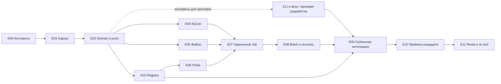
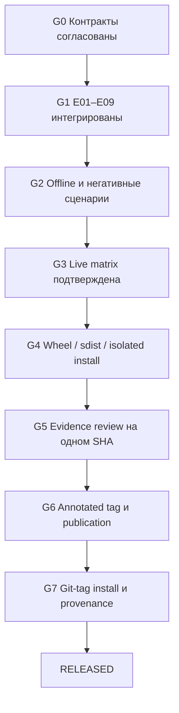

## aimedia — карта проекта и план разработки до v0.1.0 🧭

> [!abstract] Назначение
> Этот README связывает девять фундаментальных документов в исполнимый план: что реализуется, в каком порядке, какие части допускают параллельную разработку, какими коммитами поставляется результат и чем подтверждается готовность. Первый релиз завершается установкой проверенного Git-тега через `uv tool`, а не только сообщением «тесты зелёные».

| Поле | Значение |
|---|---|
| Основание | Документы `01`–`09`, перечисленные ниже, и дополнительные требования к разработке, проверке и релизу |
| Рабочее имя | `aimedia`; имя пакета и команды окончательно фиксируется на этапе E00 |
| Целевая версия | `0.1.0`, Git-тег `v0.1.0` |
| Статус плана | Карта плана; фактические статусы этапов, принятые SHA, блокеры и слоты доказательств — в [`release-board.md`](release-board.md) |
| Основная платформа приёмки | Windows; Linux — дополнительная обязательная среда автоматических проверок по предлагаемому плану |
| Секреты разработки | Локальный `.env`, исключённый из Git; загрузка только явно |
| Модель выполнения | Один процесс, SQLite, локальные файлы, несколько параллельных сетевых заданий |
| Не входит в первый релиз | STT/TTS, текстовые генерации, embeddings, sqlite-vec, видео, GUI, MCP, сервер, брокер очередей |

**Документ является планом, а не отчётом о работающей программе.** При его составлении были только спецификации: результаты запуска реализации, отчёт CI и подтверждённый релиз ещё отсутствовали. Поэтому исходные статусы этапов — `NOT_STARTED`, а проверок — `NOT_RUN`; актуальные статусы и evidence вынесены на доску ниже. Названия будущих тестов и служебных скриптов задают работу для разработчиков; их наличие в тексте не означает, что они уже существуют.

Текущее состояние этапов (что принято и на каком SHA, что в работе, какие блокеры и слоты доказательств открыты) ведётся отдельно в [`release-board.md`](release-board.md). Этот README остаётся картой плана и не подменяет доску статусов.

Каноническое место этого файла — `docs/plans/README.md`, рядом с документами `01`–`09` (относительные ссылки рассчитаны на такое соседство). Корневой `README.md` пакета позднее содержит короткую установку, первый запуск и ссылку на этот план: это не две конкурирующие спецификации. **Все терминальные команды в плане выполняются из корня репозитория**, если явно не указано другое.

### Как пользоваться планом 📖

Сначала закрывается E00 — согласование неоднозначных контрактов. Затем создаётся запускаемый каркас, фиксируются интерфейсы и открываются независимые ветки разработки. После сборки единого рабочего сценария проверяются отказоустойчивость, пакетная обработка, справка и установленный пакет. Только прошедший финальную приёмку коммит становится релизом.

У этапа есть четыре составляющие готовности: работающий результат, проверяемые утверждения, диагностические события и доказательства прогона. Отсутствие одной составляющей оставляет этап открытым.

## Карта фундаментальных документов 📚

Описания ниже — краткий указатель содержимого, а не замена соответствующих спецификаций.

| Документ | Что внутри | Когда используется |
|---|---|---|
| [01 — Product Scope](01-product-scope.md) | Назначение продукта, границы v0.1, image-сценарии, история, стоимость, отложенные модули и не-цели | При согласовании релиза и проверке, не разросся ли объём |
| [02 — System Architecture](02-system-architecture.md) | Модульный монолит, CLI/Application/Domain, ports/adapters, композиция зависимостей, тестирование слоёв | При раскладке модулей и каждом изменении зависимостей |
| [03 — Domain Model](03-domain-model.md) | Job, специализированные requests, результаты, prompts, inputs, artifacts, стоимость, usage, ошибки и инварианты | До начала параллельной реализации и при изменении контрактов |
| [04 — CLI Contract](04-cli-contract.md) | Команды, порядок prompt sources, batch, модели, пути, JSON, stdout/stderr, exit codes | При реализации публичного интерфейса и subprocess-тестов |
| [05 — Provider System](05-provider-system.md) | Изоляция Polza, преобразование запросов и ответов, remote refs, polling, ошибки, usage/cost | При разработке adapter и HTTP contract tests |
| [06 — Model Registry](06-model-registry.md) | YAML, ID/aliases, capabilities, ограничения, effective definition, provider bindings, связь со справкой | При наполнении каталога и проверке model-aware validation |
| [07 — Storage, History & Costs](07-storage-history-costs.md) | SQLite/Peewee, snapshots, входы и результаты, Decimal, валюты, транзакции, миграции, пути и индексы | При реализации хранения и проверке целостности истории |
| [08 — Job Execution](08-job-execution.md) | Запуск, ожидание, polling, semaphore, batch, тайм-ауты, retry, recovery, Ctrl+C, финализация | При реализации Runner и тестировании отказов |
| [09 — Documentation & Help](09-documentation-help.md) | Атомарные Markdown-темы, front matter, HelpRegistry, `--raw`/`--json`, динамические блоки, package resources | При разработке справки и приёмке установленного wheel |

Основа плана сохраняет исходную терминологию: **Job** — один запуск; **retry** создаёт новый Job; **sync/recovery** продолжает работу с существующим remote execution; **Artifact** — сохранённый результат. YAML описывает возможности моделей, а adapter — вызов API. Эти положения взяты из документов `03`, `05`, `06` и `08`.

Далее отдельно обозначены **уточнения плана**: они добавляют проверяемые критерии там, где исходники оставляют варианты. Они не считаются автоматически внесёнными исправлениями в файлы `01`–`09`.

### Аудио и речь: отдельное приложение, вне этого плана 🔇

Документы `01`–`09` остаются основой **image-only проекта**. Озвучивание,
speech/voice, STT/TTS и этапы T00–T07 принадлежат **отдельному приложению**, а не
очереди E00–E11 aimedia: здесь они не реализуются и не планируются — ни в
v0.1.0, ни после него. Справочный план речи удалён из `docs/plans/` (содержимое
остаётся в истории Git) и не открывает задач, не меняет release scope и не
означает реализованной команды. Причина и границы зафиксированы в
[`release-scope.md`](release-scope.md), change note `CN-03`.

## Что должно оказаться в первом релизе 🎯

### Обязательный объём из исходных спецификаций 🖼️

Релиз реализует image-модуль через Polza: prompt строкой и файлами, несколько источников в одном запросе, изображения-референсы, несколько независимых Jobs с ограничением параллельности, выбор проверенной модели и поддерживаемых параметров. Результаты сохраняются локально; PNG/JPEG/WebP выдаются в запрошенном конечном формате. История хранит точный prompt, параметры, ссылки и hashes входов, remote identifiers, результаты, usage и известную фактическую стоимость.

Для человека и агента доступны `image generate/batch`, `jobs recent/search/show/retry/sync/costs`, `models list/show`, `providers list`, `version`, короткий `--help` и атомарная справка. Все важные операции имеют машинный JSON-результат. Встроенный каталог содержит **только проверенные записи**, а не все красивые названия из демонстрационных примеров.

### Уточнение объёма для этого плана 🧩

В `01` FTS5, статистика расходов и hash входных файлов изначально обозначены как желательные, а не обязательные. Для предлагаемого первого релиза план включает **небольшой поиск по истории на FTS5, сводку расходов по отдельным валютам и обязательный hash входных файлов**. Они закрываются на E04/E09. Это осознанное расширение обязательной приёмки, которое зафиксировано на E00 в [`release-scope.md`](release-scope.md) и соответствующих спецификациях.

Если на E00 принимается более узкий релиз, эти возможности заранее исключаются из release scope, CLI и проверок обязательного объёма. Их нельзя объявить «необязательными» задним числом только потому, что тест не проходит.

`--detach`, удаление истории, универсальные batch manifests и публичные команды обслуживания не блокируют v0.1.0 и по умолчанию не реализуются. Архитектурное место для аудио, длинного текста и векторного поиска сохраняется без пустых сервисов и лишних runtime-зависимостей.

### Что является доказательством поддержки модели 🔍

Наличие YAML-записи означает лишь наличие локального описания. У модели отдельно фиксируются точный remote ID, источник параметров, дата проверки и результаты живых сценариев. Документированный `4K` не помечается как испытанный, если выполнялся только `1K`.

Минимальная приёмка Polza охватывает текст → изображение, prompt + один референс и prompt + несколько референсов. Эти сценарии могут выполняться разными моделями из подтверждённого каталога. Результаты проверки перечисляются по каждой комбинации «модель / provider / режим». RUB проверяется живым ответом Polza; обработка USD проверяется контрактными fixtures, пока второй реальный поставщик не интегрирован.

## E00: сначала закрыть развилки в спецификациях ⚖️

В исходных документах часть примеров обозначена как концептуальная, а некоторые положения уточняются следующими файлами. Реализатор не должен самостоятельно выбирать удобную трактовку в каждой ветке. На E00 составляется [`decisions/implementation-baseline.md`](decisions/implementation-baseline.md): исходное положение, выбранное решение, затронутые документы и требуемый тест. Обязательное и отложенное разделено в [`release-scope.md`](release-scope.md), начальная матрица требований — в [`verification-matrix.md`](verification-matrix.md).

| Вопрос | Что требует согласования | Предлагаемое уточнение для реализации |
|---|---|---|
| Terminal states и recovery | В `03` terminal Job не возвращается в работу; `08` вводит специальный `failed → completed` для того же remote execution | Оформить исключение явно. `sync` не вызывает submit; при продолжающемся remote Job обновляет наблюдение, но не стирает прежнюю ошибку. После успешной финализации возможен `completed` с сохранённой краткой записью recovery |
| Тайм-аут и Ctrl+C | `08` различает локальное прекращение ожидания и удалённое вычисление | Ctrl+C не отправляет remote cancel. Известный remote ref сохраняется; ожидающие локального слота Jobs отменяются. Тайм-аут с ref допускает recovery; неизвестный outcome submit запрещает автоматический повтор |
| Когда создавать Job | В разных схемах creation стоит до и после validation | Синтаксическая ошибка CLI не создаёт Job. После успешного разбора intent и чтения источников создаётся запись; предметная pre-submit validation выполняется до API и может завершить её ошибкой. Submit без сохранённого Job запрещён |
| Порядок промптов | `04` требует общий порядок перемежающихся `--prompt` и `--prompt-file` | Один упорядоченный список источников. Два отдельных списка параметров с последующим склеиванием не считаются реализацией контракта |
| Область глобальных опций | `04` описывает global options, но примеры ставят их и после подкоманды | Зафиксировать поддержку `--json` и `--provider` до домена и у конечной команды. Несогласованные повторные значения — ошибка, одинаковые — допустимы. Проверить реальным argv |
| ID и binding | Примеры используют точки/дефисы и варианты `remote_id`/`remote_model_id` | Выбрать одно каноническое имя поля `remote_model_id`, политику model ID и aliases. Не объявлять демонстрационные ID проверенными |
| Mapping в YAML | `05` закрепляет mapping за adapter; `06` допускает `parameter_map` | В v0.1 mapping реализуется в Python adapter. YAML содержит bindings/ограничения; `parameter_map` остаётся неактивной будущей возможностью. Отразить это в `06`, не поддерживать два конкурирующих механизма |
| Формат файла | `04` задаёт `--format` как локальный конечный формат; `06` обсуждает provider output отдельно | Отделить `final_format` от API-параметра. Локальная поддержка WebP не означает native WebP у модели |
| `--out` и копии | В `07` пользовательский путь заменяет стандартный путь результата | Один конечный файл по фактическому пути; скрытое двойное копирование не вводится. `--keep-original` отдельно сохраняет оригинал |
| Удалённая операция | `05` допускает разные remote endpoints, а ранняя схема `07` хранит в основном ID | Сохранять тип операции в remote ref/snapshot, для image — `media`. Восстановление не должно угадывать endpoint по строке ID |
| Деньги и миграции | `07` рекомендует decimal TEXT и допускает разные migration runners | TEXT ↔ Decimal, суммы по валюте в Python. Один механизм миграций, выбранный после проверки зафиксированной версии Peewee |
| Атомарная справка | `09` описывает raw source и затем выбирает resolved raw | `--raw` выдаёт готовый Markdown без front matter и неразрешённых директив. Исходники остаются обычными читаемыми MD |
| Неуказанные exit codes | В `04` не закрыты все случаи interrupt/internal error | Сохранить таблицу `04`; дополнить `130` для штатно обработанного Ctrl+C и `1` для внутренней непредвиденной ошибки, с тестами |
| Простая локальность | Один пользователь не исключает двух одновременно запущенных CLI | Добавить минимальную защиту от двух Runner одного Job, но не брокер/распределённую блокировку. Схему и способ снятия stale ownership утвердить до E08 |

После согласования правятся конкретные фрагменты исходных документов, чтобы план, код и тесты ссылались на одну семантику. До этого dependent work может создавать fixtures и изучать API, но не закреплять спорный контракт в реализации.

## Дорожная карта и контрольные ворота 🗺️

Колонка «Начальный статус» ниже — исходное состояние плана до реализации.
Фактические статусы, принятые SHA этапов и блокеры ведутся в
[`release-board.md`](release-board.md).

| Этап | Результат | Зависимости | Коммиты | Начальный статус |
|---|---|---|---|---|
| E00 | Согласованные контракты, release scope и матрица требований | Документы 01–09 | C00 | NOT_STARTED |
| E01 | uv-проект, конфигурация, безопасные логи, CI и тестовый контур | E00 | C01–C02 | NOT_STARTED |
| E02 | Domain, ports, prompt/input preparation, fake provider | E01 | C03–C04 | NOT_STARTED |
| E03 | Registry, effective capabilities, YAML-validation | E02 | C05 | NOT_STARTED |
| E04 | SQLite/Peewee, миграции, точные деньги, history repositories | E02 | C06–C07 | NOT_STARTED |
| E05 | Artifact storage и image conversion | E02 | C08 | NOT_STARTED |
| E06 | Polza adapter, HTTP-контракты, проверенные model bindings | E03 | C09–C10 | NOT_STARTED |
| E07 | Полный одиночный Job от submit до файлов и истории | E04–E06 | C11 | NOT_STARTED |
| E08 | Batch, Ctrl+C, retry/sync, восстановление и защита от дублей | E07 | C12–C13 | NOT_STARTED |
| E09 | Полный CLI, история/поиск/расходы, atomic help и документация | E03, E08; заготовки — с E02 | C14–C16 | NOT_STARTED |
| E10 | Финальная офлайн/живая/пакетная приёмка release candidate | E09 | C17 и исправления по результатам | NOT_STARTED |
| E11 | Git release, установка по тегу, доказательство происхождения | E10 | Тег и публикация артефактов | NOT_STARTED |



Порядок коммитов внутри независимых веток может различаться; зависимости этапов — нет. E09 не означает «вспомнить о документации в самом конце»: публичные страницы и тесты добавляются вместе с функцией, а на E09 проверяется их полная интеграция.

## Параллельная разработка без конфликтов 🤝

### Рабочие роли и границы файлов 🧱

| Поток | Основная зона | Что может делать параллельно | Что нельзя менять без согласования |
|---|---|---|---|
| Интегратор | Контракты, composition root, release scope, версии и CI | Принимает ветки, воспроизводит проверки | Не переписывает чужую feature-ветку в обход автора |
| Registry/provider | `registry/`, `providers/polza/`, соответствующие fixtures | E03 → E06 параллельно с E04/E05 | Domain DTO, money schema, CLI grammar |
| Storage | `storage/`, migrations, history/cost tests | E04 после фиксации ports | Порядок и номера чужих миграций |
| Artifacts | `processing/`, файловый adapter, image fixtures | E05 после фиксации ports | Финальный формат CLI и структура Artifact |
| CLI/docs | `cli/`, `help/`, Markdown resources, JSON schemas | Заготовки после E02; финальная сборка E09 | Сигнатуры application use cases без change request |
| Проверка | `tests/`, evidence, негативные сценарии | С любого этапа по доступным контрактам | Не подменяет ожидаемый результат фактическим ради зелёного теста |

Роли не требуют шести постоянных агентов: один разработчик может выполнять их последовательно. Параллельность полезна только после фиксации границ. Все изменения `pyproject.toml`, `uv.lock`, публичных DTO, migration numbering и release metadata проходят через интегратора.

Git worktree позволяет держать независимые рабочие каталоги одного репозитория с разными ветками. Это используется для изоляции работы, а не как механизм выполнения пользовательских AI-задач. [Git: worktree](https://git-scm.com/docs/git-worktree).

```bash
git worktree add -b feat/registry ../aimedia-registry main
```

```bash
git worktree add -b feat/storage ../aimedia-storage main
```

```bash
git worktree add -b feat/artifacts ../aimedia-artifacts main
```

Команды применяются после попадания E02 в `main`; если он находится в другом согласованном коммите, worktrees создаются от него. У каждого рабочего каталога свои `.venv`, тестовая БД, outputs и reports. Общий `.env` не коммитится и не дублируется автоматически; при необходимости используется явный абсолютный путь к локальному секретному файлу.

### Правило передачи результата 📬

Передача содержит ID этапа, SHA базового и итогового коммитов, список затронутых контрактов, команды проверок, результаты и известные ограничения. Фраза «всё сделано» без этих данных не закрывает этап. При несовместимом интерфейсе работа останавливается на change request, а не компенсируется новым необговорённым полем в словаре.

## Техническая база, окружения и секреты 🔐

### Стек и воспроизводимость 🧰

Используется согласованная основа: Python 3.12+, uv, Typer/Rich, httpx/asyncio, Pydantic/pydantic-settings, Peewee/SQLite, Pillow, YAML и platformdirs. Для качества добавляются dev-зависимости pytest, pytest-asyncio, pytest-cov, respx, Ruff и один type checker — mypy. Разработчик фиксирует совместимые версии в `uv.lock`; номера версий не угадываются по примерам этого плана.

Предлагаемый базовый интерпретатор v0.1 — Python 3.12 с зафиксированным patch-релизом в среде CI. Другие версии признаются поддерживаемыми только после отдельных прогонов. Настройка `requires-python` должна соответствовать проверенной матрице, а не обещать поддержку всех будущих версий.

Отдельно проверяется мигратор Peewee: актуальная официальная документация описывает `playhouse.migrations.Runner` и `pwmigrate`, включая последовательное применение и учёт миграций. Поэтому E01/E04 сначала проверяют этот API в выбранной версии; второй самописный runner не создаётся автоматически. Сгенерированная миграция всё равно проходит review и тест сохранения данных. Это внешнее техническое уточнение, а не уже выбранная реализация из `07`. [Peewee: Database Tooling](https://docs.peewee-orm.com/en/latest/peewee/db_tools.html#migration-runner).

### Три изолированных режима 🧪

| Режим | Секреты и сеть | Данные | Назначение |
|---|---|---|---|
| Offline tests | Ключи удаляются из окружения тестового процесса; внешняя сеть запрещена | Только временные каталоги | Логика, БД, файлы, HTTP-mocks, CLI |
| Development/live | `.env` загружается явно; платные вызовы отдельно разрешаются | `.local/dev-data` либо выделенный временный live-root | Ручная разработка и ограниченная проверка Polza |
| Installed user tool | Конфигурация по системному пути; secret reference указывает на переменную окружения | Пользовательская app-data | Повседневная работа установленной команды |

Для разработки вводится **явный override `AIMEDIA_DATA_DIR`** — уточнение implementation baseline. Тесты задают абсолютный временный путь; приложение в обычном режиме использует platformdirs. Нельзя случайно писать тестовые Jobs в пользовательскую историю.

Файл `.env.example` содержит только шаблон:

```dotenv
POLZA_API_KEY=
AIMEDIA_DATA_DIR=.local/dev-data
AIMEDIA_LOG_LEVEL=INFO
AIMEDIA_LIVE_ENABLED=0
```

`AIMEDIA_LIVE_ENABLED` — gate тестового контура, не разрешение автоматически тратить деньги при каждом запуске. Его проверяют live fixtures. Обычная явно вызванная пользователем генерация остаётся обычной командой.

Загрузка `.env` выполняется средствами uv при запуске development-команды; установленный пакет не ищет `.env` в произвольном текущем каталоге. Такая загрузка поддерживается флагом `uv run --env-file`; `--no-env-file` её отключает, но **не удаляет уже экспортированные переменные**, поэтому тестовая изоляция дополнительно очищает окружение. [uv: параметры запуска](https://docs.astral.sh/uv/reference/cli/#uv-run).

```bash
uv sync --locked
```

```bash
uv run --locked --env-file .env aimedia models list --json
```

```bash
uv run --locked --no-env-file pytest -m "not live"
```

Встроенная справка, версия и локальный список моделей должны работать без API key и без запроса в сеть. Вывод `providers list` различает наличие adapter, наличие конфигурации и фактическую проверку авторизации: «configured» не означает «ключ принят сервером».

### Пользовательский способ настройки после установки ⚙️

В v0.1 достаточно TOML с `api_key_env = "POLZA_API_KEY"` и переменной окружения, задаваемой пользователем вне истории Jobs. Это не требует таскать development `.env` вместе с установленной программой. Будущая команда настройки и системное хранилище секретов могут появиться позже; они не должны менять domain, историю или provider ports.

Секрет запрещено передавать флагом CLI, добавлять в URL репозитория, вставлять в fixtures, показывать в reports или включать в wheel/sdist. Логи и raw provider errors проходят redaction. Если ключ попал в commit, простого удаления файла недостаточно: требуется отзыв ключа и отдельное согласованное исправление истории Git.

### Git hygiene до первого ключа 🧹

Минимальные правила `.gitignore`:

```gitignore
.env
.env.*
!.env.example
.venv/
.local/
artifacts/
dist/
.coverage
htmlcov/
.pytest_cache/
.mypy_cache/
.ruff_cache/
__pycache__/
*.egg-info/
```

Данные тестов и приложения направляются в исключённые каталоги. Не нужно глобально игнорировать все `*.json` или `*.md`: среди них находятся контракты и документация. Синтетические migration fixtures при необходимости остаются версионируемыми в `tests/fixtures`.

```bash
git check-ignore -v .env
```

```bash
git ls-files -- .env
```

Вторая команда должна вернуть пустой список. Перед commit просматривается staged diff; автоматический secret scan дополняет этот просмотр, а не заменяет его.

## Этапы реализации: результат, проверки и самоприёмка 🛠️

Для каждого этапа ниже указаны **будущие обязательные проверки**, а не уже полученные результаты. Итоговый отчёт этапа ссылается на конкретные pytest node IDs, SHA и сохранённые результаты. Общие команды и формат доказательств приведены после дорожной карты.

### E00. Согласованный baseline и граница первого релиза 📐

**Результат.** Создаются [`release-scope.md`](release-scope.md), [`decisions/implementation-baseline.md`](decisions/implementation-baseline.md) и начальная [`verification-matrix.md`](verification-matrix.md). В них фиксируются решения из таблицы развилок, обязательные пользовательские сценарии, перечень доступных команд и список реальных моделей, которые предстоит проверить. Примеры с вымышленными IDs переводятся в явно демонстрационные; из них не создаётся рабочий каталог.

**Проверка.** Выполняется обзор связности документов: одинаковые поля remote ref, единая трактовка retry/sync, status transitions, final format, JSON envelope и model IDs. Для каждой неоднозначности должен существовать выбранный вариант либо явный блокер с владельцем. Это документальная проверка, не runtime-тест.

**Логирование и доказательства.** Приложение ещё не запускается. Вместо фиктивных runtime-логов сохраняется decision record с перечнем изменённых разделов. Проверка ссылок подтверждает только существование файлов и anchors, а не правильность архитектуры.

**Коммит:** C00 `docs(plan): approve implementation baseline and release scope`.

- [x] Все девять исходных файлов внесены без потери содержимого; изменения имеют отдельный diff.
- [x] Обязательные и отложенные функции явно разделены.
- [x] Нет двух различных правил для одного публичного поведения.
- [x] Для нерешённого вопроса указан блокируемый этап; dependent work не объявлена готовой.

### E01. Запускаемый проект, окружения и базовая наблюдаемость 🧰

**Результат.** Создаётся `src/aimedia`, package metadata, console entry point, `uv.lock`, настройки качества, `.env.example`, `.gitignore` и CI. Появляются Settings, явный data-root override и безопасный logger. Команда версии и краткая справка работают без ключа, БД и сети. Создаются служебный `scripts/quality.py`, [шаблон stage report](progress/stage-report.template.json) и общий тестовый запрет внешних запросов.

Build backend выбирается и фиксируется одной реализацией. В metadata пакета объявляются runtime-зависимости, dev-инструменты остаются в development group. Механизм подключения секретов не помещается в domain.

| Будущий тест | Что он действительно доказывает |
|---|---|
| `tests/unit/test_settings.py` | CLI/config/default precedence, изоляция data-root, отсутствие неявного чтения чужого `.env` |
| `tests/unit/test_logging_redaction.py` | Тестовый ключ удалён из сообщения, вложенных details и форматируемого исключения |
| `tests/cli/test_bootstrap.py` | `--help` и `version --json` работают subprocess-вызовом без ключа и не создают пользовательскую БД |
| `tests/security/test_offline_guard.py` | Неожиданный внешний запрос завершает тест ошибкой; gate не ограничивается pytest-маркером |
| `tests/tooling/test_quality_runner.py` | Ненулевой код проверки не теряется; отсутствующий обязательный набор тестов не даёт зелёный итог |

**Логируется:** `app_started`, `config_loaded` с именами источников без значений секретов, `command_finished`. Обычная справка не производит диагностический шум. Формат JSON-логов и разрешённые поля описываются в `docs/plans/logging-contract.md` (создаётся на E01).

**Коммиты:** C01 `chore(scaffold): create uv package and offline CI`; C02 `feat(config): add explicit settings and redacted logging`.

- [x] Чистый clone воспроизводит окружение через `uv sync --locked`.
- [x] `.env` не отслеживается и не попадает в собранный пакет.
- [x] Offline-тесты не используют экспортированный реальный ключ.
- [x] Один упавший child process делает quality command неуспешной.
- [x] Логгер и JSON presenter не пишут друг другу в stdout.

### E02. Domain, ports и точная подготовка входов 🧠

**Результат.** Реализуются Job/value objects, типизированные requests/results, errors, provider/storage ports и чистые преобразования данных. PromptCompiler принимает упорядоченные источники, сохраняет snapshots и использует документированный разделитель. Подготовка входов определяет порядок, размер, MIME и SHA-256. Создаётся fake provider с контролируемыми сценариями успеха, ожидания и ошибок.

Peewee records, `httpx.Response`, `Rich.Console` и YAML parser objects не пересекают domain boundary. Протоколы не содержат методов-заглушек, которые все providers вынуждены реализовывать через `NotImplementedError`.

| Будущий тест | Проверяемое утверждение |
|---|---|
| `tests/unit/test_prompt_compiler.py` | `file A → inline B → file C → inline D` даёт точно `A\n\nB\n\nC\n\nD`, без перестановки и скрытого переписывания текста |
| `tests/unit/test_domain_invariants.py` | Невалидные состояния/пустой prompt отклоняются; monetary unknown и zero различаются |
| `tests/unit/test_input_preparation.py` | Повреждённое изображение не принимается по одному расширению; порядок refs и hashes сохраняются |
| `tests/unit/test_serialization.py` | Decimal, UTC timestamps, enums и Paths сериализуются в согласованные значения |
| `tests/architecture/test_dependencies.py` | Domain не импортирует transport/ORM/CLI; проверяется реальный граф импортов, не только grep по названиям |

**Логируется:** на application-границе `input_prepared`, `prompt_compiled`, `validation_failed`; в записи — числа источников и размеры, не полный prompt и не содержимое файлов. Чистые domain-функции не получают обязательный logger.

**Коммиты:** C03 `feat(domain): define requests results and execution contracts`; C04 `feat(inputs): preserve ordered prompt and reference snapshots`.

- [x] Fake provider не подменяет реальный Polza adapter в production registry.
- [x] Тест сравнивает итоговый текст, а не только число частей.
- [x] Изменение source file после подготовки не меняет сохранённый prompt snapshot.
- [x] Batch inputs и несколько prompt sources одного Job не смешаны.
- [x] Сигнатуры ports зафиксированы до открытия E03/E04/E05.

### E03. YAML Registry и effective capabilities 📚

**Результат.** Loader, schema validation, alias resolver и effective model definition работают независимо от сети. Для выбранного provider применяются только документированные ограничения. Неизвестное ограничение не превращается в придуманное число. Все synthetic модели находятся в fixtures, а production records получают происхождение сведений.

Provider-specific renaming выполняет adapter согласно решению E00. Registry по-прежнему хранит remote model IDs, допустимые значения, defaults и bindings. Локальный конечный WebP проверяется локальными возможностями processing, а не выдаётся за native capability модели.

| Будущий тест | Проверяемое утверждение |
|---|---|
| `tests/unit/test_registry_loader.py` | Duplicate keys/IDs/aliases, неизвестная версия схемы и default вне enum дают явную ошибку |
| `tests/unit/test_model_resolution.py` | Alias разрешается в canonical ID; provider override действительно сужает набор значений |
| `tests/unit/test_model_validation.py` | Недопустимый resolution, seed или число refs останавливают request до любого вызова submit |
| `tests/contracts/test_model_views.py` | Справка/JSON отражают ту же effective definition, которую использует validation |
| `tests/security/test_registry_data_only.py` | YAML не исполняет Python constructors; неизвестные executable directives запрещены |

**Логируется:** `registry_loaded` с числом записей и digest, `model_resolved`, `model_validation_failed`. Не логируются секреты и содержимое изображений. Статус «есть в Registry» отделён от «проверена живым вызовом».

**Коммит:** C05 `feat(registry): validate models aliases and provider constraints`.

- [x] Все production YAML проходят единую schema; нет permissive fallback для битого файла.
- [x] Изменение Registry меняет validation и model JSON согласованно.
- [x] Удаление модели не ломает чтение старой Job history.
- [x] Ни один API ID или лимит не перенесён из условного примера без проверки.

**Ограничение:** встроенный production-каталог пока пуст: авторитетные Polza model IDs и лимиты не подтверждены. Это не блокирует офлайн-контракт E03, но блокирует утверждение, что реальная генерация готова.

### E04. SQLite, миграции, история и деньги 🗄️

**Результат.** Реализуются repositories, schema и migration lifecycle для Jobs, prompt sources, inputs и artifacts. Сохраняются resolved request, remote operation/ref, usage, cost и ошибки. Для ещё не существующего результата допускаются partial metadata без ложного `completed`.

Суммы хранятся decimal TEXT и читаются через Decimal. При выбранном формате отчёт не использует SQL `SUM()` как замену точной Decimal-арифметике. Повторное получение того же billing snapshot обновляет сведения Job идемпотентно, а не прибавляет новый расход. Raw usage не теряется, но не используется как второе независимое списание.

| Будущий тест | Проверяемое утверждение |
|---|---|
| `tests/integration/test_job_repository.py` | После закрытия и повторного открытия БД восстановлены все snapshots, порядок refs и remote operation |
| `tests/integration/test_migrations.py` | Пустая и предыдущая schema обновляются; существующие данные остаются; повторный запуск миграций — no-op |
| `tests/integration/test_migration_failure.py` | Ошибка миграции не записана как успех; БД не остаётся наполовину обновлённой; проверены FK |
| `tests/integration/test_cost_storage.py` | `0.0831`, `0.1`, `0.2`, неизвестная цена и ноль переживают round trip без потери смысла |
| `tests/integration/test_cost_aggregation.py` | Итог `0.1 + 0.2` равен Decimal `0.3`; RUB и USD не складываются; повторный sync не удваивает сумму |
| `tests/integration/test_sqlite_contention.py` | Короткие конкурирующие записи не теряют updates; ожидаемая блокировка даёт управляемый исход, без повторного API-submit |

**Логируется:** `database_opened`, `migration_started/completed/failed`, `job_created`, `job_state_changed`, `remote_ref_saved`, `usage_recorded`, `cost_recorded`. SQL с содержимым prompt и ключами не выводится в штатный log.

**Коммиты:** C06 `feat(storage): persist jobs snapshots and migrations`; C07 `feat(costs): preserve decimal amounts and currency boundaries`.

**Резервное копирование:** согласованная копия БД (WAL) и managed artifacts — не функция v0.1.0, а инвариант для E05+. Пока backup-команды нет, поддерживается только quiescent offline manual backup; один `database.sqlite3` под WAL копировать нельзя. Контракт — в [`backup-contract.md`](backup-contract.md).

**Новые данные сверх v1 (`CN-01`):** managed-копии reference images оформляются миграцией **v2**, а не правкой v1 `inputs` ([`release-scope.md`](release-scope.md), `CN-01`; контракт — [`07-storage-history-costs.md`](07-storage-history-costs.md), «Managed-копии reference images»). Реализованы схема v2 и связь входа с копией; файлы копий — `NOT IMPLEMENTED`.

- [x] Используется ровно один migration runner; установленная версия Peewee проверена.
- [x] Нет транзакции, удерживаемой через `await` сетевого вызова.
- [x] Не включён `check_same_thread=False` или thread offload «на всякий случай» без тестов ownership соединения.
- [x] Failure после remote success сохраняет известные usage/cost.
- [x] Данные БД, WAL и artifacts рассматриваются согласованно при backup, а не копируются вслепую.
- [x] Новая схема распознаётся старой программой как неподдерживаемая, а не мигрируется назад автоматически.

**Приёмка E04:** committed SHA `e13b56921844910f15bc6d5037d993d48d65442e`
проверен из чистого клона с `uv sync --locked --offline`: 81 целевой и 561
полный offline-тест, Ruff, mypy, quality quick/full/release, CLI smoke и сборка
wheel/sdist — exit 0; независимый нативный SOL6-review — `PASS`. Backup-критерий
означает согласованный ручной протокол, **не** работающую backup-команду;
сохранение cost/usage после remote success проверено симуляцией без live provider.
Неизвестные production Polza model IDs остаются отдельным блокером реальной
генерации, но не офлайн-приёмки хранилища.

### E05. Локальные artifacts и честная конвертация 🖼️

**Результат.** Файловый adapter сохраняет temp-файл, проверяет фактическое изображение, выполняет разрешённую конвертацию и безопасно публикует результат. Artifact metadata описывает конечные байты. Original и converted файлы различаются по роли; поддерживается `--keep-original`.

Политика JPEG-прозрачности фиксируется явно: предлагается белый фон по умолчанию с документированным преобразованием RGBA → RGB. Скрытое изменение размера не выполняется. Потеря alpha для JPEG ожидаема и проверяется, но не распространяется на PNG/WebP.

| Будущий тест | Проверяемое утверждение |
|---|---|
| `tests/integration/test_artifact_storage.py` | Файл существует, декодируется, hash/size/MIME/path соответствуют реальным байтам |
| `tests/unit/test_image_conversion.py` | PNG/JPEG/WebP действительно перекодируются; alpha и размеры соответствуют выбранной политике |
| `tests/integration/test_output_collisions.py` | Два Job с одним `--name` и `--out` не перезаписывают чужой файл и получают разные пути |
| `tests/integration/test_artifact_failures.py` | Оборванная запись, conversion error и simulated disk-full не создают ложный финальный artifact |
| `tests/security/test_output_names.py` | `--name ../...`, абсолютное имя и опасный суффикс не обходят выбранную output directory |

**Логируется:** `artifact_download_started`, `artifact_download_failed`, `artifact_converted`, `artifact_saved`, `artifact_cleanup_failed`. Для remote URL в diagnostics сохраняется безопасное представление без query-токенов; локальные пути не экспортируются в публичные reports без очистки.

**Коммит:** C08 `feat(artifacts): save verify and convert image outputs safely`.

- [x] Успех проверен декодированием, а не только наличием расширения `.webp`.
- [x] Атомарное перемещение не используется как способ незаметно перезаписать существующий output.
- [x] User-managed output не удаляется общей очисткой cache.
- [x] Hash рассчитывается по конечному файлу, а не по исходному PNG перед conversion.
- [x] При ошибке БД после записи файла остаётся диагностируемый orphan, а не ложный `completed`. При ошибке **после возможного commit** состояние истории неопределённо и требует сверки, а не заявления о доказанном rollback.

**Приёмка E05:** чистый клон committed SHA `701d2d830c9e8a8f636561a76f0692bc5b23eee3`: offline quality quick/full/release (по 716 тестов), Ruff, mypy, сборка и CLI help/version — exit 0; независимый нативный SOL6-review `PASS`. Live Polza, production model IDs, полный Job workflow и CLI `--keep-original` относятся к E06–E09; ручной backup-контракт не является backup CLI.

### E06. Polza adapter и ограниченная проверка API 🔌

**Результат.** Реальный adapter принимает domain request, разрешённый binding и возвращает нормализованный SubmissionResult/ProviderResult. Реализуются submit/status, media operation routing, upload encoding, parsing errors, usage/cost и безопасное получение remote artifacts. Один HTTP client переиспользуется в пределах команды.

Модельные ограничения берутся из подтверждённых model-specific сведений. Общий media DTO не трактуется как обещание поддержки каждого параметра каждой моделью. В предоставленном `Post Media.txt` описан общий input и передача refs, а `Get Media.txt` — polling/result/usage; они служат основанием fixtures, но не доказывают сегодняшнюю доступность конкретного model ID.

| Будущий тест | Проверяемое утверждение |
|---|---|
| `tests/contracts/test_polza_requests.py` | Точный HTTP payload: remote model ID, итоговый prompt, порядок images, `resolution → image_resolution`; лишние поля не отправлены |
| `tests/contracts/test_polza_responses.py` | Immediate и pending/completed ответы нормализуются; несколько artifacts и text-only ответ обработаны осмысленно |
| `tests/contracts/test_polza_costs.py` | `cost_rub` и его alias `cost` не суммируются; ноль не заменяется fallback через `or`; отсутствующая цена остаётся неизвестной |
| `tests/contracts/test_polza_errors.py` | 401/402/429/5xx, malformed JSON и remote failed становятся различимыми ошибками с redacted details |
| `tests/security/test_download_auth.py` | Provider bearer token не уходит на произвольный CDN или при redirect на другой host |
| `tests/live/test_polza_smoke.py` | При явном разрешении реальный API принял конкретный request, вернул изображение и фактические usage/cost; факт записан по модели и режиму |

**Логируется:** `provider_submit_started`, `provider_submit_accepted`, `provider_submit_uncertain`, `provider_status_observed`, `provider_response_invalid`, `provider_request_failed`. Журнал содержит local Job ID, operation, безопасный remote ID и trace ID при наличии. Полный Authorization, base64 и тело prompt в него не попадают.

**Коммиты:** C09 `feat(polza): normalize media requests statuses and billing`; C10 `test(polza): add verified fixtures and model evidence`.

- [ ] Unknown outcome submit не вызывает второй POST автоматически.
- [ ] Fixture обозначена как синтетическая либо полученная из реального ответа; эти статусы не смешаны.
- [ ] Стоимость из каталога не выдана за стоимость вызова.
- [ ] Активный binding не содержит `some/model/id`, `example-model` или непроверенный псевдо-ID.
- [ ] Live-прогон не входит в обычный test command и не запускается от одного наличия ключа.
- [ ] Лимиты и body-size проверены до base64-submit настолько, насколько они подтверждены источниками.

### E07. Один Job полностью, без скрытых пробелов ⚙️

**Текущий частичный срез (не принят):** `application.single_image.generate_image`
собирает новый image Job через существующие порты: prepared snapshots → confirmed
CREATED → callback validation/binding/output preflight → archive → один submit → confirmed ref →
bounded polling/result → safe billing snapshot → все локальные images → confirmed
history. `tests/integration/test_single_image.py` использует реальную временную
SQLite, managed copies, Pillow и fake/MockHTTP provider. CLI, batch, retry/sync,
recovery/locks и production bindings/live отсутствуют; E07/CN-01 целиком не приняты.
После возможного финального commit прерывание сохраняет опубликованный snapshot:
сверка known ID не позволяет заменить COMPLETED устаревшим FAILED. Явный `--out`
проверяется файловым портом до платного submit. Независимый review и full committed
clean-clone gate ещё требуются.

**Результат.** Собирается вертикальный сценарий: входы → Job в SQLite → submit → remote ref → polling/result → cost/usage → локальный artifact → финальное состояние. Use case не обращается к httpx/Peewee напрямую. Вызов через CLI возможен уже здесь, но полный публичный контракт ещё проходит E09.

| Будущий тест | Проверяемое утверждение |
|---|---|
| `tests/integration/test_single_job.py` | Fake provider + реальная временная SQLite + реальные файлы дают восстановимый completed Job |
| `tests/integration/test_async_job.py` | Remote ref сохранён до первого ожидания; pending/running/completed обрабатываются без busy loop |
| `tests/integration/test_finalization_failure.py` | Remote success и download/conversion failure оставляют failed Job с фактической стоимостью и данными для recovery |
| `tests/integration/test_submit_persistence_failure.py` | При сбое сохранения remote ref не выполняется повторная генерация; диагностический канал сохраняет пригодные для разбирательства идентификаторы |
| `tests/integration/test_result_invariants.py` | Image success без usable image не становится completed; partial result не теряется |
| `tests/integration/test_managed_inputs.py` (существует) | Managed-копия reference image (`CN-01`): файловый source-срез `aaf1c5e` сохраняет copies/links при reopen/resave и после удаления исходника; полный E07/CLI-сценарий ещё требуется. Связь и миграция v2 покрыты в `test_migrations.py`/`test_migration_failure.py`/`test_job_repository.py`; ручной backup/restore — в `test_manual_managed_backup.py` |

**Логируется:** полная цепочка `job_created → validation_completed → provider_submit_accepted → remote_ref_saved → remote_completed → usage_recorded → artifact_saved → job_completed`. Допускаются дополнительные события, но не успешное завершение раньше обязательного artifact commit.

**Коммит:** C11 `feat(execution): complete single-job pipeline with durable results`.

- [ ] Проверяются итоговые записи и файлы после повторного открытия хранилища.
- [ ] Ни одно assertion не ограничено только вызовом mocked метода.
- [ ] Remote-completed и local-completed различаются на негативном сценарии.
- [ ] В error path закрываются HTTP/file resources и сохраняются доступные данные.

**`CN-01`.** До платного POST Job публикует проверенные байты
reference images как managed-копии и сохраняет связи; ошибка публикации запрещает
submit, опубликованный файл после неопределённого DB commit не удаляется и не
повторяется ([`07-storage-history-costs.md`](07-storage-history-costs.md),
«Managed-копии reference images»). Schema v2/связь и файловый source-срез `aaf1c5e`
проверены отдельно: snapshot одного чтения, copies/resolve и confirmation hook.
Одиночная application-композиция D03 с submit/polling/finalization добавлена
частичным незакоммиченным срезом E07; пользовательский CLI/recovery ещё
`NOT IMPLEMENTED`, независимая приёмка этого среза и всего CN-01 не пройдена.

### E08. Параллельность, восстановление и защита от двойного запуска ⚡

**Результат.** Batch из 3–5 входов выполняется с ограничением одновременно активных Job. Ошибка одного Job не отменяет остальные. Реализуются controlled HTTP retries для безопасных операций, отдельный `jobs retry`, `jobs sync`, Ctrl+C и same-job recovery без нового submit.

`asyncio.TaskGroup` сам по себе не обеспечивает best-effort batch: необработанное исключение дочерней задачи может отменить соседние. Поэтому ожидаемые Job errors превращаются в результаты внутри job-boundary; управляющая cancellation не проглатывается как обычная ошибка. Это учитывается в реализации и тестах. [Python: Task groups и cancellation](https://docs.python.org/3/library/asyncio-task.html#task-groups).

| Будущий тест | Проверяемое утверждение |
|---|---|
| `tests/integration/test_batch_concurrency.py` | Пять Jobs реально перекрываются, максимум active равен разрешённому лимиту; следующие submit ждут освобождения slot |
| `tests/integration/test_batch_partial_failure.py` | Один предсказуемый failure даёт partial batch outcome, остальные Jobs завершаются и сохраняют свои результаты |
| `tests/integration/test_submit_uncertainty.py` | После имитации «POST принят, ответ потерян» счётчик submit остаётся 1 |
| `tests/integration/test_retry_lineage.py` | Новый Job имеет новый ID/ref, копию исходного request и ссылку retry_of; старый cost/result не перезаписан |
| `tests/integration/test_recovery_idempotency.py` | Два sync одного remote result не создают новую генерацию, duplicate artifacts или повторную стоимость |
| `tests/e2e/test_interrupt_and_restart.py` | После прерывания первого процесса второй процесс читает ту же БД и завершает known remote Job без нового POST |
| `tests/e2e/test_duplicate_runner.py` | Два процесса не запускают один Job повторно; stale ownership обрабатывается без долгоживущего lock-сервиса |

Параллельность доказывается счётчиком active jobs и управляемыми barriers/events. Измерение «пять вызовов заняли меньше секунды» не является надёжным тестом semaphore. Для process-restart используется локальный provider-emulator с журналом запросов, живущий независимо от прерываемого CLI. Production API для crash-теста не требуется.

**Логируется:** `batch_started/completed`, `job_slot_acquired/released`, `poll_state_changed`, `transport_retry_scheduled`, `job_wait_interrupted`, `job_timeout`, `recovery_started/completed`, `retry_job_created`, `duplicate_execution_rejected`. Poll ticks без изменения состояния не засоряют INFO.

**Коммиты:** C12 `feat(batch): run independent jobs with bounded concurrency`; C13 `feat(recovery): resume remote jobs without duplicate submissions`.

- [ ] Safe GET retry и новый платный Job retry имеют разные пути кода.
- [ ] `sync` технически не имеет доступа к операции создания новой генерации либо это запрещено контрактным тестом.
- [ ] Ctrl+C сохраняет known refs и не отправляет remote cancel.
- [ ] При timeout неизвестный remote outcome виден агенту, а не маскируется как «можно просто повторить».
- [ ] Synchronous provider без remote ref не получает ложное обещание восстановления потерянного ответа.
- [ ] Busy timeout БД, сетевой timeout и timeout целого Job различаются в ошибках.
- [ ] Запущены subprocess-тесты на Windows, а не только Unix signal tests.

### E09. Полный CLI, история, расходы и атомарная справка 🤖

**Результат.** В один публичный интерфейс собираются все обязательные команды, human/JSON presenters, фильтры истории, FTS5 и валютные сводки в согласованном scope. `models show` отдаёт те же данные, что validation. HelpRegistry читает Markdown resources, проверяет front matter и разрешает только согласованные dynamic directives.

Вывод help/raw/JSON работает после установки пакета из чужого cwd. Корневой README содержит установку и первый запуск, а подробные workflows живут в atomic topics. Source Markdown остаётся читаемым без CLI; динамические machine facts добавляются из Registry, а не поддерживаются вручную второй таблицей.

| Будущий тест | Проверяемое утверждение |
|---|---|
| `tests/cli/test_prompt_argv_order.py` | Реальный argv с перемежающимися options сохраняет порядок и на этапе парсинга, и в сохранённом compiled prompt |
| `tests/cli/test_json_contract.py` | stdout целиком разбирается как один JSON document при успехе и ошибках, включая invalid args; нет ANSI/баннера/прогресса |
| `tests/cli/test_exit_codes.py` | Каждому ожидаемому исходу соответствует согласованный exit code, а не всегда 0 |
| `tests/integration/test_history_search.py` | Prompts, refs и result artifact paths/hashes/metadata находят связанные Job IDs; DB-only v3 backfill/resave/rollback не меняет v1/v2 или файлы |
| `tests/cli/test_cost_report.py` | Известные RUB/USD и количество unknown Jobs показываются отдельно; границы периода проверены |
| `tests/contracts/test_help_topics.py` | Topic IDs уникальны, related существуют, raw не содержит unresolved directives, JSON markdown совпадает с raw body |
| `tests/cli/test_help_without_credentials.py` | Локальные help/version/models/history не требуют ключа и не вызывают API |

**Логируется:** `command_finished` с command/exit_code/duration, `history_queried` с фильтрами без чувствительного текста, `search_completed` с count, `help_topic_resolved`, `help_resolution_failed`. Пользовательский поисковый запрос не пишется целиком в общий diagnostic log по умолчанию.

**Коммиты:** C14 `feat(cli): expose stable commands JSON and exit codes`; C15 `feat(history): add lexical search and per-currency summaries`; C16 `feat(help): package atomic Markdown and model-aware reference`.

- [ ] Проверены оба согласованных расположения глобальных флагов и конфликтные значения.
- [ ] Human mode не используется как источник данных для JSON mode.
- [ ] FTS5 находит prompts, reference provenance/managed paths/hashes и result artifact paths/hashes после restart/удаления исходника; не выдан за OCR, семантический или морфологически полноценный поиск.
- [ ] `raw` возвращает готовый Markdown; source/front matter имеют отдельную внутреннюю роль.
- [ ] Документы будущих функций не показываются как действующие команды.
- [ ] Все приведённые пользовательские примеры проверены на существование команды/flags без платного запуска.

### E10. Полная приёмка release candidate и собранного пакета 🧪

**Результат.** Все обязательные требования связаны с тестами и доказательствами. Создаётся release candidate commit с версией `0.1.0`, согласованным lockfile, changelog и release constraints. На этом commit выполняются финальные проверки. Исторические результаты на другой ветке не заменяют прогоны кандидата.

| Проверка | Что подтверждается |
|---|---|
| Полный offline suite на Windows и Linux | Реализованные ветви и ожидаемые ошибки проходят на обеих заявленных платформах |
| Негативные и fault-injection сценарии | Не теряются refs/cost, не возникает скрытый duplicate submit, ошибки видимы |
| Wheel + sdist | Package содержит YAML, Markdown, migrations и entry point, но не `.env`, локальную БД и development outputs |
| Установка wheel в отдельный uv tool root | Команда работает без repo/.venv/PYTHONPATH из произвольной директории |
| Полный offline image flow установленного wheel | Через локальный emulator создаются настоящие файлы и SQLite-записи; проверяется не только `--help` |
| Живые Polza smoke-сценарии | Работают фактически заявленные model/mode combinations и сохраняется стоимость API |
| Secret canary scan | Специальная тестовая строка-ключ отсутствует в stdout/stderr, БД, logs и упакованных artifacts |
| Независимый review | Проверяющий сопоставил assertions с требованиями и повторил критические проверки |

Live-сценарии и визуальный просмотр результата выделяются отдельно. Тест декодирования PNG подтверждает формат и целостность, но **не доказывает**, что модель точно сохранила лицо персонажа или выполнила сложную художественную инструкцию. Эти наблюдения отмечаются в ручной части отчёта без универсальных обещаний качества модели.

**Логируется:** события самой программы по общему контракту; quality harness отдельно записывает команды, exit codes, tool versions, duration, commit и hashes отчётов. Эти два журнала не смешиваются.

**Коммит:** C17 `chore(release): prepare 0.1.0 candidate and release metadata`. Найденные дефекты исправляются обычными `fix(...)` с regression tests; после каждого изменения затронутые gates пересчитываются, а финальный suite повторяется на последнем candidate SHA.

- [ ] Нет обязательных `SKIP`, `XFAIL` или `NOT_RUN`, замаскированных общим количеством passed.
- [ ] Проверена чистая установка, а не только editable mode разработчика.
- [ ] Live-отчёт содержит точный model ID, режим, фактическую цену и дату; ключей в нём нет.
- [ ] Report ссылается на проверяемый SHA, а не просто на название ветки.
- [ ] Version metadata, changelog и lockfile входят в кандидат до финального прогона.
- [ ] Неизвестные ограничения указаны в release notes и не нарушают обязательный scope.

### E11. Первый релиз и фиксация установленного инструмента 🏷️

**Результат.** Проверенный commit получает annotated tag `v0.1.0`, публикуются release notes, wheel/sdist, checksums и очищенный отчёт приёмки. Через `uv tool install` проверяется установка именно по этому тегу и соответствие установленного source commit релизному SHA. Development environment остаётся отдельным.

На этом этапе новых функций и «маленьких улучшений заодно» не добавляют. Исправление кода возвращает кандидата на E10. Порядок Git/uv-команд приведён в отдельном runbook ниже.

**Проверяется:** тег указывает на прошедший проверку commit; пакет сообщает `0.1.0`; executable взят из uv tool environment, а не `.venv`; package resources доступны; новый временный data-root работает; установленная копия не зависит от development `.env` или cwd. После установки выполняется offline flow через emulator; живой запрос повторяется только при отдельно разрешённом бюджете.

**Логируется и сохраняется:** release SHA, tag, hashes distributions, ссылка/путь к отчётам, источник установленного пакета и версии runtime-зависимостей. Release record не содержит конфигурационных секретов.

- [ ] Ветка и тег опубликованы без force-перезаписи ранее опубликованного релиза.
- [ ] Источник установки — тег, не `main` и не editable checkout.
- [ ] Установленный commit сопоставлен с Git-тегом; одной строки version недостаточно.
- [ ] Откат инструментов описан отдельно от отката/совместимости БД.
- [ ] Финальный статус `RELEASED` выставлен только после проверки опубликованного источника установки.

## Что именно считать покрытым тестами 🔬

### Уровни доказательств 📏

| Уровень | Подтверждает | Не подтверждает |
|---|---|---|
| Unit | Детерминированное правило на заданных входах | Сеть, реальную БД, работу installed CLI |
| Contract + HTTP mock | Mapping, parsing и ошибки на конкретных payloads | Что provider сегодня принимает такой payload |
| Integration | Совместную работу application, SQLite и файлов в контролируемой среде | Доступность внешней модели и её художественное качество |
| Subprocess/E2E с emulator | Парсинг argv, stdout/stderr, exit codes, restart и целый локальный сценарий | Производительность серверов Polza |
| Packaging test | Поставку resources/entry point и работу установленного пакета | Реальный paid API без live-прогона |
| Live smoke | Конкретная модель и режим действительно сработали в конкретный момент | Все параметры модели, все account tiers и будущую стабильность API |
| Ручная проверка изображения | Наблюдаемые свойства нескольких результатов | Статистическую оценку качества или гарантированное следование любому промпту |

Маркировка pytest описывает категории тестов, но сама не запрещает сеть и не доказывает выполнение. Маркеры регистрируются явно; неизвестный marker считается ошибкой конфигурации тестов. [pytest: marks](https://docs.pytest.org/en/stable/how-to/mark.html).

### Сквозная матрица обязательных утверждений 🧾

В `verification-matrix.md` каждая строка получает реальные pytest node IDs, последнее состояние прогона и ссылку на evidence. Ниже — её обязательное начальное содержание; **у всех строк текущий execution status — NOT_RUN**.

| ID | Утверждение | Минимальное доказательство | Владелец этапа |
|---|---|---|---|
| R01 | Inline/file prompts не меняют порядок и текст | Сравнение compiled prompt после реального CLI argv и чтения БД | E02/E09 |
| R02 | Неподдерживаемые параметры не уходят в API | Invalid request + assertion `submit_count == 0` | E03/E07 |
| R03 | Model/provider IDs разрешаются однозначно | Alias/effective override tests + snapshot resolved IDs в истории | E03/E04 |
| R04 | Генерация и references работают через Polza | HTTP contracts + live evidence по отдельным режимам | E06/E10 |
| R05 | Локальный файл соответствует объявленному формату | Decode, dimensions, MIME, byte size и SHA-256 | E05/E07 |
| R06 | Outputs не перезаписываются при параллельном сохранении | Два simultaneous writers + проверка обоих исходных результатов | E05 |
| R07 | История переживает перезапуск | Новое соединение/процесс читает сохранённые prompts, inputs (path + SHA-256), refs (`remote_job_id` + `operation`), cost и artifacts | E04/E08 |
| R08 | RUB/USD и unknown/zero не смешиваются | Точные Decimal fixtures + currency grouping + unknown count | E04/E09 |
| R09 | Поля `cost` и `cost_rub` не удваивают расход | Один billing snapshot с обоими aliases + повторный sync | E06/E08 |
| R10 | Batch действительно параллелен и ограничен | Контролируемое перекрытие tasks, peak active, submit count и release slots | E08 |
| R11 | Один Job failure не убивает весь batch | 5 Jobs, 1 failure, 4 сохранённых успеха | E08 |
| R12 | Неизвестный outcome submit не создаёт дубль | Provider принимает POST и рвёт соединение; повторного POST нет | E08 |
| R13 | Recovery не равен повторной генерации | Restart + sync + assertion нулевых новых submit | E08 |
| R14 | Retry создаёт новый Job и сохраняет lineage | Два разных локальных IDs/remote refs; история исходного неизменна | E08 |
| R15 | Ctrl+C не выдаётся за подтверждённую remote cancellation | Process interruption + known ref в БД + отсутствие cancel request | E08 |
| R16 | JSON чистый и ошибки машинно различимы | Parse всего stdout, exit code, schema и отсутствие ANSI для success/error | E09 |
| R17 | Справка автономна и соответствует capabilities | Resolved raw/JSON equivalence + installed package outside cwd | E03/E09/E10 |
| R18 | Миграции сохраняют историю | Upgrade fixture, failure rollback, repeated apply и FK checks | E04 |
| R19 | Ключ не утёк в продуктовые данные и логи | Canary в request/error → скан stdout/stderr/logs/БД/distributions | E01/E06/E10 |
| R20 | Local search и расходы проверяют полезный результат | Известный corpus → ожидаемые IDs из `jobs search` и точные суммы периода из `jobs costs` (по валютам) | E09 |
| R21 | Installed tool соответствует релизу | Git peeled SHA ↔ installed VCS commit; версия и package resources | E11 |
| R22 | Отсутствие ключа не ломает локальные команды | Subprocess help/models/history без ключа и без внешней сети | E01/E09 |
| R23 | Неполная финализация не маскирует платный failure | Remote success + local error → saved actual cost, error и recoverable ref | E07/E08 |
| R24 | Два локальных процесса не исполняют один Job одновременно | Cross-process contention test с одним фактическим submit | E08 |

### Самопроверка самих тестов 🧨

Для критичных правил недостаточно увидеть зелёный результат. На временной ветке или изолированной копии выполняется небольшая контролируемая поломка: порядок источников меняется, semaphore отключается, в sync добавляется submit, Decimal заменяется float, удаляется package resource либо в logger пропускается canary. Связанный тест должен упасть по ожидаемой причине.

В отчёте указывается, какая поломка внесена, какой тест её поймал и что исходный код восстановлен. Это не требует массового mutation-testing framework. Пять-шесть осмысленных проверок полезнее сотни assertions, которые лишь повторяют структуру реализации.

Нельзя автоматически перегенерировать все expected snapshots после regression. Сначала объясняется, почему изменился публичный контракт, затем проверяющий принимает новый expected result.

### Coverage без подмены смысла 📊

Предлагаемый стартовый порог aggregate coverage — **85% с включённым branch measurement**. Это инженерный gate данного плана, не универсальная оценка качества. Для critical rules R01, R08–R16, R18–R19, R23–R24 обязателен каждый перечисленный сценарий вне зависимости от общего процента.

Coverage запускается по всему `src/aimedia`, а не только по импортированным тестами удобным модулям. Отчёт отдельно показывает пропущенные branches. Subprocess-сценарии подтверждаются собственными assertions; процент in-process coverage не объявляется измерением дочернего процесса, если отдельное покрытие subprocess не настроено и не проверено.

`SKIPPED`, `XFAILED`, `NOT_COLLECTED` и `NOT_RUN` — не `PASSED`. Для обязательного требования хотя бы один из этих статусов означает незакрытую проверку. Если функция исключена из релиза, это отражается в release scope, а не прячется в skip decorator.

## Логирование: что должно быть видно и чего там быть не должно 📜

### Три разных хранилища сведений 🗃️

**History в SQLite** отвечает, что отправлялось и что получилось. **Diagnostic log** объясняет переходы, отказы и длительность работы. **QA evidence** показывает, какими тестами проверялась программа. История prompt не дублируется целиком в log, а runtime log не заменяет отчёт pytest.

Минимальный event record имеет `timestamp_utc`, `level`, `event`, `component`, `command`, `job_id`, при необходимости `provider`, `remote_operation`, безопасный `remote_job_id`, `duration_ms` и нормализованный `error_code`. При batch каждому Job назначается собственная корреляция; global context одного Job не должен перетекать в соседний coroutine.

### Обязательные группы событий 🔎

| Область | События | Чем проверяется |
|---|---|---|
| Запуск/config | `app_started`, `config_loaded`, `command_finished` | Проверка capture logger/JSONL с отсутствием secret values |
| Registry/validation | `registry_loaded`, `model_resolved`, `validation_failed` | Сверка canonical/provider binding и отсутствия submit при отказе |
| История | `job_created`, `remote_ref_saved`, `job_state_changed` | Сверка событий с сохранённым состоянием БД |
| Provider | `provider_submit_started/accepted/uncertain`, `provider_request_failed` | Request journal + точный счётчик операций |
| Polling | `poll_state_changed`, `transport_retry_scheduled`, `job_timeout` | Fake clock; нет INFO-записи на каждый неизменившийся tick |
| Artifacts | `artifact_download_started/failed`, `artifact_converted`, `artifact_saved` | Реальные файлы, hash и negative file scenarios |
| Batch/recovery | `batch_started/completed`, `job_wait_interrupted`, `recovery_started/completed` | Частичный batch, Ctrl+C и повторный sync |
| Деньги | `usage_recorded`, `cost_recorded` | Совпадение currency/amount с единственным snapshot Job |
| Миграции | `migration_started/completed/failed` | Сверка с schema version и rollback test |

Тест проверяет семантику события и допустимые поля, а не хрупкую точную строку human output. Успешное `artifact_saved` не пишется до публикации файла; `job_completed` не появляется до финализации обязательных результатов.

В JSON mode stdout принадлежит одному итоговому JSON-документу. Diagnostic records направляются в файл и при необходимости в stderr; human progress отключён. `--quiet` уменьшает presentation, но не прячет ошибки и не меняет сохраняемое состояние Job.

### Redaction и границы безопасности 🔐

Ключи, Authorization, cookies, URL credentials, signed query-токены, base64 payloads и полный provider request body исключаются из diagnostics. Error mapper проверяет не только заголовки: сервер может повторить чувствительные данные внутри `message` или nested metadata.

Canary-тест намеренно помещает тестовый секрет в несколько таких мест и проверяет все каналы вывода. Сам plaintext prompt, который пользователь сознательно сохраняет в локальной истории, остаётся продуктовой функцией; это не разрешение копировать его в общедоступный CI-лог.

Ротация логов ограничивает локальный объём. Retention reports и доступ к ним определяются отдельно от истории пользователя. Автоматическая отправка telemetry в v0.1 не вводится.

## Единый контур проверок и отчётов 🧪

### Служебные скрипты, которые необходимо реализовать 🧰

| Скрипт | Контракт |
|---|---|
| `scripts/quality.py` | Режимы `quick`, `full`, `release`; запускает проверки последовательно, сохраняет stdout/stderr/exit codes, возвращает failure, если любой обязательный check не прошёл |
| `scripts/validate_docs.py` | Проверяет Markdown structure, внутренние ссылки, examples, front matter и связь Registry ↔ help |
| `scripts/verify_distribution.py` | Проверяет содержимое wheel/sdist, наличие migrations/YAML/MD/entry point и отсутствие запрещённых development-файлов |
| `scripts/smoke_installed.py` | Устанавливает/проверяет пакет в изолированном окружении, запускает CLI вне checkout с emulator и временным data-root |
| `scripts/verify_tool_install.py` | Через явный Python из tool environment проверяет distribution version, VCS commit и отсутствие editable source |
| `scripts/release_manifest.py` | Формирует SHA-256 distributions и manifest с source SHA, version и именами файлов, без секретов |

Эти скрипты — собственные будущие файлы проекта, а не встроенные команды uv. Они должны быть кроссплатформенными, использовать списки аргументов subprocess без `shell=True`, проверять return codes и не продолжать релиз после failure. Код harness тоже тестируется: пример фиктивной child-команды с exit code 7 обязан уронить общий результат.

### Быстрая проверка перед коммитом ⚡

После реализации harness используется одна команда:

```bash
uv run --locked --no-env-file python scripts/quality.py quick
```

Внутри — Ruff lint/format check, type check затронутых контрактов, relevant unit/contract tests и проверка документации. Эквивалентные отдельные команды полезны для диагностики:

```bash
uv run --locked --no-env-file ruff check .
```

```bash
uv run --locked --no-env-file ruff format --check .
```

```bash
uv run --locked --no-env-file mypy src/aimedia
```

```bash
uv run --locked --no-env-file pytest tests/unit tests/contracts -m "not live" --strict-markers
```

`--locked` используется, чтобы проверка не меняла lockfile молча. Различие режимов locking/syncing описано в документации uv; обновление зависимостей выполняется отдельным reviewable изменением. [uv: locking and syncing](https://docs.astral.sh/uv/concepts/projects/sync/).

### Полная offline-проверка перед merge и release candidate 🧱

```bash
uv run --locked --no-env-file python scripts/quality.py full --report-dir artifacts/quality
```

Основной pytest-прогон внутри harness:

```bash
uv run --locked --no-env-file pytest -m "not live" --strict-markers --cov=aimedia --cov-branch --cov-fail-under=85 --cov-report=term-missing --cov-report=xml:artifacts/quality/coverage.xml --cov-report=html:artifacts/quality/htmlcov --junitxml=artifacts/quality/junit.xml
```

Harness заранее создаёт report directory и проверяет, что все обязательные suites существуют и действительно collected. Никакого автоматического live-запуска после успешных offline-тестов не происходит. Доступ тестов к loopback emulator разрешается отдельно; внешние адреса остаются запрещёнными.

CI повторяет тот же контур на Windows и Linux. Версии Python и uv записываются в отчёт. macOS не объявляется проверенной только потому, что используется pathlib; она добавляется в support matrix после собственного прогона.

### Живая проверка Polza: только явно и с лимитом 💳

Запуск разрешён после E06, когда offline contracts зелёные. Требуются одновременно `--live`, `AIMEDIA_LIVE_ENABLED=1`, действующий key и согласованный test plan с числом submit. Отсутствие любого условия вызывает понятный отказ. Обычный `pytest` ничего платного не делает.

Предлагаемый интерфейс pytest options реализуется в live fixtures:

```bash
uv run --locked --env-file .env pytest tests/live -m live --live --live-model MODEL_ID --live-max-submits 3 --junitxml=artifacts/live/junit.xml
```

`MODEL_ID` заменяется проверенным canonical ID. Перед командой создаётся `artifacts/live`; необходимые input fixtures синтетические и не содержат личных материалов. Если один model не поддерживает все режимы, запускаются отдельные выборки сценариев с соответствующими моделями и общим согласованным лимитом.

Ограничение submit защищает от runaway-теста, но **не гарантирует точный денежный потолок**: фактическая цена может зависеть от API и параметров и становится известна после ответа. Поэтому до запуска фиксируется ожидаемый расход в валюте provider, а в отчёте — фактические суммы. Автоматического retry генераций и cross-provider fallback нет.

После каждого live-теста сохраняются local/remote IDs, exact model ID, settings, длительность, artifact hash, usage/cost и итог утверждений. Большие изображения и полные prompts не коммитятся; очищенные диагностические fixtures получают явную пометку происхождения. Живой batch из пяти заданий возможен как дополнительная приёмка, но не обязателен для доказательства локального semaphore: это надёжнее проверяется детерминированно.

## Как оформлять реальную готовность этапа ✅

### Статусы работы и проверки 🧭

Статус этапа проходит `NOT_STARTED → IN_PROGRESS → READY_FOR_REVIEW → VERIFIED → MERGED`. `BLOCKED` допускается с причиной. Для E11 конечный статус — `RELEASED`. Наличие implementation commit без доказательств соответствует максимум `READY_FOR_REVIEW`.

У отдельной проверки состояния другие: `NOT_RUN`, `PASSED`, `FAILED`, `SKIPPED`, `XFAILED`, `NOT_COLLECTED`. Они не выводятся из наличия файла теста. `PASSED` означает, что определённая команда на определённом SHA завершилась ожидаемо и её assertions действительно выполнились.

### Пакет доказательств 📦

```text
artifacts/quality/<source-sha>/
├── summary.json
├── commands.json
├── junit.xml
├── coverage.xml
├── stdout.txt
├── stderr.txt
├── environment.json
└── checksums.json
```

Эти результаты по умолчанию вне Git и сохраняются как CI/release artifacts. В `docs/plans/progress/` остаются короткие очищенные summaries и ссылки на evidence. В evidence указываются полный source SHA, clean/dirty state, OS, Python, uv, SQLite и lockfile digest. Для нечистого дерева обязательно фиксируется diff digest; финальный релиз из dirty tree запрещён.

Пример **пустого, ещё не выполненного** отчёта:

```json
{
  "stage": "E08",
  "work_status": "NOT_STARTED",
  "source_commit": null,
  "tree_clean": null,
  "environment": null,
  "checks": [
    {
      "requirement_id": "R13",
      "test_node_id": null,
      "status": "NOT_RUN",
      "exit_code": null,
      "evidence_path": null,
      "assertion": "Recovery creates no new provider submission"
    }
  ],
  "coverage": null,
  "live_checks": [],
  "known_gaps": [],
  "reviewer": null
}
```

В выполненном отчёте вместо `null` находятся реальные значения, а не предполагаемые. Snapshot суммы показывает исходную валюту. Ссылки на CI сохраняются без токенов авторизации.

Готовый каркас этого отчёта с заглушками `NOT_RUN` и без выдуманных pass/evidence — [`progress/stage-report.template.json`](progress/stage-report.template.json).

### Общий чек-лист закрытия любого этапа 🔎

- [ ] Изменение соответствует зафиксированному scope и не вводит неподтверждённую функцию.
- [ ] Код и обязательные regression tests находятся в проверяемом коммите.
- [ ] Известно, какие требования проверяет каждый новый тест и чего он не проверяет.
- [ ] Positive и negative сценарии выполнены; результаты не подменены количеством написанных тестов.
- [ ] События логирования проверены, секретный canary не найден в выходных каналах.
- [ ] Документация и публичные schemas обновлены вместе с кодом.
- [ ] Reviewer воспроизвёл критичную проверку либо сослался на валидный CI evidence того же SHA.
- [ ] После merge relevant suite повторён на объединённом дереве, а не только на feature-ветке.

Проверка «что на самом деле работает» всегда завершается наблюдаемым результатом: точным текстом, структурой ответа, сохранённой строкой БД, декодируемым файлом, количеством вызовов или происхождением установленного пакета.

## Git: план коммитов и правила интеграции 🌿

### Реестр коммитов 🧾

Каждый implementation commit включает относящиеся к нему tests/docs. Имена ниже описывают логические изменения; это не требование дробить одну маленькую функцию на десятки пустых коммитов.

| ID | Сообщение | Что должно войти |
|---|---|---|
| C00 | `docs(plan): approve implementation baseline and release scope` | Документы 01–09, план, решения развилок, матрица требований |
| C01 | `chore(scaffold): create uv package and offline CI` | Package skeleton, lockfile, quality harness, базовая сборка |
| C02 | `feat(config): add explicit settings and redacted logging` | `.env.example`, Settings, data roots, redaction tests |
| C03 | `feat(domain): define requests results and execution contracts` | Domain и ports, state/cost invariants, fakes |
| C04 | `feat(inputs): preserve ordered prompt and reference snapshots` | Compiler, input metadata, exact-text tests |
| C05 | `feat(registry): validate models aliases and provider constraints` | Registry schemas/resolver/validation + model views |
| C06 | `feat(storage): persist jobs snapshots and migrations` | Tables/repositories/migration tests |
| C07 | `feat(costs): preserve decimal amounts and currency boundaries` | Decimal serialization, idempotent billing, totals |
| C08 | `feat(artifacts): save verify and convert image outputs safely` | Filesystem pipeline, conversions, collisions, failure tests |
| C09 | `feat(polza): normalize media requests statuses and billing` | HTTP adapter/mappers, auth separation, contracts |
| C10 | `test(polza): add verified fixtures and model evidence` | Очищенные fixtures, подтверждённые bindings и limitations |
| C11 | `feat(execution): complete single-job pipeline with durable results` | Runner одиночного Job и интеграционная цепочка |
| C12 | `feat(batch): run independent jobs with bounded concurrency` | Semaphore, partial outcomes, deterministic concurrency tests |
| C13 | `feat(recovery): resume remote jobs without duplicate submissions` | Sync/retry/Ctrl+C/restart/duplicate-owner tests |
| C14 | `feat(cli): expose stable commands JSON and exit codes` | Полный CLI и subprocess contract tests |
| C15 | `feat(history): add lexical search and per-currency summaries` | Поиск/расходы в согласованном scope |
| C16 | `feat(help): package atomic Markdown and model-aware reference` | HelpRegistry, runtime docs и resource checks |
| C17 | `chore(release): prepare 0.1.0 candidate and release metadata` | Версия, changelog, runtime constraints, окончательный scope |

`fix(...)`-коммиты после C17 допускаются до приёмки кандидата и всегда влекут повтор затронутых проверок. Первый опубликованный stable tag не создаётся для отдельных промежуточных этапов.

### Ветки и review 🔀

`main` содержит интегрированную работу; короткие `feat/...` ветки — независимые модули. `release/0.1.0` создаётся после закрытия E09 и служит заморозкой кандидата. Отдельный вечный `develop` для маленького проекта не требуется.

Параллельные ветки не перенумеровывают миграции независимо после merge. Интегратор проверяет цепочку и сохраняет уже принятые migration files неизменными. Изменение dependencies в feature-ветке требует обновлённого lockfile и общего прогона после объединения.

Перед commit:

```bash
git diff --check
```

```bash
git diff --cached
```

```bash
git status --short
```

Staging выполняется по нужным путям, а не бездумным добавлением всего каталога вместе с outputs. Нельзя «чинить» падающую CI удалением тестов, снижением coverage gate или массовым добавлением skips без отдельного изменения release scope.

## Первый релиз: от проверенного commit до тега 🏷️

### Что означает «тег на ветку» 🧭

Релизная метка фиксирует **конкретный commit**, который после интеграции находится в `main`. Она не следует за будущими изменениями ветки. Для `v0.1.0` используется annotated tag; в release record отдельно сохраняется полный commit SHA. Это важно и для установки через uv, и для проверки того, какой код реально был испытан. [Git: tag](https://git-scm.com/docs/git-tag).

Опубликованный тег по правилам проекта не перемещается. Само имя тега не является криптографической гарантией неизменности репозитория: поэтому проверка сохраняет и сравнивает commit SHA. При обнаружении дефекта после публикации выпускается новый patch-тег, а старый не переписывается.

### Подготовка кандидата на E10 🧊

Команды ниже — runbook для уже реализованного проекта. Репозиторий, `origin`, ветки и служебные scripts должны быть созданы к этому моменту. Они **не выполняются автоматически из этого документа**.

Перед созданием ветки все принятые feature-изменения должны находиться в актуальном `main`.

```bash
git switch main
```

```bash
git pull --ff-only
```

```bash
git switch -c release/0.1.0
```

В release-ветке устанавливается единственный источник версии `0.1.0`, обновляются changelog, schema compatibility notes и dependency lock. Это делается **до** финального прогона, а не после него. Если используется `uv version`, его поведение также проверяется в закреплённой toolchain:

```bash
uv version 0.1.0
```

```bash
uv lock
```

Из lockfile экспортируются только runtime constraints: без development group и локального project entry. Каталог `release/` создаётся каркасом проекта. Экспорт requirements из uv.lock — отдельная поддерживаемая операция uv. [uv: exporting a lockfile](https://docs.astral.sh/uv/concepts/projects/export/).

```bash
uv export --locked --no-dev --no-emit-project --no-hashes --format requirements-txt --output-file release/runtime-constraints.txt
```

Полученный файл проверяется: в нём нет `-e .`, абсолютных development paths, секретов и dev-only инструментов. Если появятся optional runtime extras, экспортируются именно выбранные для релиза extras; не все возможные будущие модули.

После review изменений создаётся C17:

```bash
git add pyproject.toml uv.lock CHANGELOG.md release/runtime-constraints.txt docs/plans/release-scope.md
```

```bash
git commit -m "chore(release): prepare 0.1.0 candidate and release metadata"
```

Если дополнительные version files используются выбранным build backend, они включаются в этот же commit. Дублирующие несовпадающие версии в нескольких файлах не допускаются.

```bash
git status --porcelain
```

```bash
git rev-parse HEAD
```

Рабочее дерево должно быть чистым. Полученный SHA — кандидат для E10. Далее запускаются full offline checks, ограниченные live checks и package acceptance. Финальный harness требует актуальный live evidence того же кандидата, но **не запускает платные проверки сам**.

```bash
uv run --locked --no-env-file python scripts/quality.py release --report-dir artifacts/release
```

`release` повторяет обязательные offline suites, проверяет матрицу требований, читает `artifacts/live/summary.json`, собирает distributions и выполняет installed-package smoke. Отсутствующий или чужой SHA в live evidence блокирует релиз. JSON summary создаётся live fixtures вместе с JUnit; одна строка ручного «API работает» не принимается.

Сборка выполняется обычным механизмом uv; package metadata/resources проверяются уже в собранных архивах. [uv: building distributions](https://docs.astral.sh/uv/concepts/projects/build/).

```bash
uv build
```

В harness сборка и smoke выполняются один раз в согласованном порядке. Отдельная команда выше предназначена для диагностики; перед final manifest нельзя незаметно пересобрать другой пакет и оставить hashes от предыдущей сборки.

### Как не перепутать источник и отчёт о нём 🧾

Финальные JUnit, coverage, live summary и manifest создаются **вне отслеживаемого дерева** и сохраняются как release artifacts с `source_commit`. Иначе попытка закоммитить отчёт с SHA самого себя создаёт ненужную рекурсию.

Кандидат не меняется после прохождения gates. Поправка даже package metadata возвращает новый SHA на E10. Технический отчёт может публиковаться рядом с релизом, не изменяя code commit, на который ставится тег.

### Package acceptance до публикации 📦

Harness создаёт изолированные временные `UV_TOOL_DIR` **и** `UV_TOOL_BIN_DIR`, чтобы тест установки не заменил личную `aimedia` в PATH. Внутри выполняется установка собранного wheel и вызов команды из каталога, не являющегося checkout. Убираются `PYTHONPATH`, development secret variables и активированная `.venv`; settings направляются во временный data-root.

Проверяется не только version/help: установленный CLI проходит image flow через loopback emulator и создаёт файл + Job history. Затем проверяются raw help, model JSON, миграции из package resources и retry/sync на доступных сценариях. Fake provider не устанавливается в production registry; emulator обслуживает обычный HTTP adapter через явный тестовый base URL. Production TLS-проверка не отключается глобально.

Wheel и sdist содержат необходимые runtime MD/YAML/migration files. Поддерживается установка из sdist либо VCS-build; только успешный wheel smoke не доказывает корректную Git-установку. Публикация на PyPI для личного первого релиза не требуется.

### Интеграция и создание annotated tag 🔖

Ниже показан простой fast-forward путь. Если правила площадки требуют PR/merge commit или `main` уже ушёл вперёд, финальный проверяемый SHA меняется: сначала принимается итоговое объединение, затем **заново выполняется E10**. Force-push для обхода этого правила не используется.

```bash
git switch main
```

```bash
git merge --ff-only release/0.1.0
```

```bash
git rev-parse HEAD
```

SHA должен совпадать с принятым candidate SHA.

```bash
git tag -a v0.1.0 -m "aimedia 0.1.0: first verified image CLI release"
```

```bash
git rev-parse "v0.1.0^{commit}"
```

```bash
git show --no-patch v0.1.0
```

После этого публикуются только нужная ветка и конкретный тег, а не все случайные локальные метки:

```bash
git push --atomic origin main refs/tags/v0.1.0
```

`--atomic` требует поддержки сервера: при её отсутствии push завершается ошибкой, и процедура не считается выполненной. Тогда используется согласованный последовательный push ветки и тега с проверкой результата каждого шага; ошибка не игнорируется. [Git: push](https://git-scm.com/docs/git-push).

```bash
git ls-remote origin "refs/tags/v0.1.0*"
```

Для annotated tag вывод может содержать SHA объекта тега и отдельный **peeled commit** в строке `refs/tags/v0.1.0^{}`. С проверенным code SHA сравнивается commit, а не SHA самого tag object.

### Содержимое первого релиза 📋

Release notes содержат реализованные команды, проверенные OS/Python, model/mode matrix, источник стоимости, способ настройки ключа, известные ограничения, DB schema version и установку по тегу. К публикации прикладываются wheel/sdist, SHA-256 manifest, runtime constraints и очищенный verification report.

Не заявляется «поддерживаются все модели Polza» или «все возможности проверены», если evidence покрывает конкретное небольшое подмножество. Не выбирается автоматически публичный доступ к репозиторию или лицензия: политика распространения фиксируется владельцем проекта до публикации.

## Установка личной копии через uv tool по тегу 📌

### Простая установка фиксированного релиза 🧰

В примерах GitHub используется как шаблон адреса. `OWNER/REPOSITORY` необходимо заменить настоящим репозиторием; его адрес пока не задан. Для другой Git-площадки меняется URL, а принцип установки по тегу сохраняется.

Команда выполняется в обычной новой оболочке: без активированной project `.venv` и без временных `UV_TOOL_DIR`/`UV_TOOL_BIN_DIR`, оставленных package-тестами.

```bash
uv tool install --python 3.12 "git+https://github.com/OWNER/REPOSITORY.git@v0.1.0"
```

uv устанавливает tool в отдельное окружение и предоставляет executable для PATH; Git source может указывать конкретную revision. Это отдельная установка, не запуск исходников из development checkout. [uv: using tools](https://docs.astral.sh/uv/guides/tools/).

При необходимости добавляется каталог executable в PATH, после чего открывается новая оболочка:

```bash
uv tool update-shell
```

Проверка установленной записи:

```bash
uv tool list --show-paths
```

В PowerShell проверяется, какой executable будет запущен:

```powershell
Get-Command aimedia | Select-Object Source
```

В POSIX shell:

```bash
command -v aimedia
```

Затем из каталога вне репозитория:

```bash
aimedia version --json
```

```bash
aimedia help image.generate --raw
```

```bash
aimedia models list --json
```

Ни одна из этих команд не должна требовать `.env` из checkout или делать paid request. Для private repository используется настроенная Git-аутентификация; access token не вставляется прямо в команду или remote URL.

### Фиксация тега не равна фиксации всех зависимостей 🧷

Git-тег закрепляет исходный проект при условии политики неизменяемых тегов. **Наличие `uv.lock` в Git само по себе не является доказательством, что tool environment установлен с этим же набором зависимостей.** Tool installation и project sync — разные режимы. Для максимально близкой к проверенной установки используются экспортированные runtime constraints, а полученные версии сохраняются в install evidence. [uv: tools и project isolation](https://docs.astral.sh/uv/concepts/tools/).

Файл `runtime-constraints.txt` берётся из того же релиза, его hash сверяется с release manifest. Пример установки:

```bash
uv tool install --python 3.12 --constraints runtime-constraints.txt "git+https://github.com/OWNER/REPOSITORY.git@v0.1.0"
```

Constraints ограничивают версии runtime-пакетов; они не являются полным обещанием побайтовой воспроизводимости. Отдельно важны версия интерпретатора, платформа, выбранный build backend и build dependencies. В export выше намеренно нет hashes: это constraints для resolver, а не режим проверки hashes всех скачиваемых wheels. [uv: tool install options](https://docs.astral.sh/uv/reference/cli/#uv-tool-install).

Для более строгого закрепления кода допускается установка по полному SHA вместо тега, но основная пользовательская инструкция остаётся по `v0.1.0`:

```bash
uv tool install --python 3.12 "git+https://github.com/OWNER/REPOSITORY.git@FULL_RELEASE_COMMIT_SHA"
```

### Как подтвердить именно тот исходный commit 🔎

Одной строки `version = 0.1.0` недостаточно: разные деревья могут иметь одинаковую версию. Проверка E11 использует Python **из найденного tool environment**, читает metadata distribution и `direct_url.json`. Для Git-установки сопоставляются `vcs_info.commit_id` и при наличии `requested_revision` с проверенным SHA/тегом. Эти поля определены стандартом metadata direct URL. [PyPA: Direct URL Data Structure](https://packaging.python.org/en/latest/specifications/direct-url-data-structure/).

Из корня служебного checkout запускается скрипт, реализованный на E10. Для проверки установленного пакета он использует именно переданный `--tool-python`, а не интерпретатор, запустивший сам verifier:

```bash
uv run --locked --no-env-file python scripts/verify_tool_install.py --tool-python "ABSOLUTE_PATH_TO_TOOL_PYTHON" --expected-commit "FULL_RELEASE_COMMIT_SHA"
```

Он не доверяет Python из активированной project `.venv`, проверяет отсутствие editable mode, версию пакета и records выбранного tool environment. Для установки из wheel VCS metadata может не быть: тогда основанием выступают hash проверенного wheel и install report. В процедуре установки по Git-тегу требуется именно VCS provenance.

Результат проверки сохраняется в `installation.json`: version, source commit, requested revision, interpreter version, package resource checks и dependency list. Secrets и полный локальный пользовательский path не включаются в общедоступный отчёт.

### Обновление и откат ♻️

Повседневная копия не устанавливается из `main` и не обновляется командой «latest». Когда будет выпущен следующий проверенный релиз, он устанавливается явно:

```bash
uv tool install --reinstall --python 3.12 "git+https://github.com/OWNER/REPOSITORY.git@v0.1.1"
```

`v0.1.1` здесь — пример будущего тега, а не существующий релиз. Перед обновлением выполняется согласованная резервная копия истории и проверяется совместимость DB schema. Если используется constraints-file, при обновлении берётся файл именно нового релиза.

Возврат к `v0.1.0` после последующего обновления:

```bash
uv tool install --reinstall --python 3.12 "git+https://github.com/OWNER/REPOSITORY.git@v0.1.0"
```

**Откат Python-пакета не откатывает SQLite.** Старый executable может не понимать новую схему. Автоматический destructive downgrade запрещён: либо проверена обратная совместимость, либо восстанавливается согласованная резервная копия. Переустановка tool не должна удалять user app-data.

## Итоговые ворота релиза 🚦



| Ворота | Критерий | Блокирующий пример |
|---|---|---|
| G0 | Нет незакрытого решения, от которого зависит реализация | `sync` у двух модулей означает разные операции |
| G1 | Все функции согласованного scope существуют и интегрированы | Runtime help описывает отсутствующую команду |
| G2 | Все обязательные offline assertions выполнены на кандидате | Зелёный suite с пропущенным restart test |
| G3 | Есть live evidence заявленных моделей/режимов | YAML активен, но remote ID не проверялся |
| G4 | Собранные distributions и установленный пакет работают вне checkout | В wheel забыты YAML, MD или migrations |
| G5 | Reviewer проверил evidence и известных блокеров нет | Отчёт относится к другой ветке или dirty tree |
| G6 | Тег указывает на проверенный SHA и опубликован корректно | После тестов добавлен «маленький фикс» |
| G7 | Личная/контрольная копия установлена по тегу с нужным provenance | Запускается `aimedia` из старой `.venv` |

**Первый релиз считается завершённым только после G7.** Публикация тега сама по себе не закрывает E11. Если уже опубликованный тег дефектен, он не перемещается: release notes отмечают проблему, а исправление получает новый patch-tag и повторяет соответствующие gates.

### Финальный чек-лист 📋

- [ ] Все этапы E00–E10 закрыты и их актуальные доказательства доступны.
- [ ] Для каждого обязательного требования R01–R24 есть выполненная проверка или заранее согласованное исключение из scope.
- [ ] Нет неподтверждённых заявлений о модели, параметре или поддержке платформы.
- [ ] Неизвестная стоимость не выдана за ноль, а разные валюты не сложены.
- [ ] Проверены неизвестный outcome submit, Ctrl+C, повторный sync и partial batch.
- [ ] Логи помогают восстановить ход Job, но не раскрывают secrets и payloads.
- [ ] Wheel/sdist не содержат `.env`, личных данных, БД или development outputs.
- [ ] Версия, tag, peeled commit, distributions и release manifest согласованы.
- [ ] Установка через uv tool по тегу выполнена вне development environment.
- [ ] Подтверждено происхождение установленной копии и описан безопасный путь обновления.

## Рабочая структура репозитория 📂

Структура фиксирует места результатов, но не требует заранее создавать пустые модули будущих возможностей.

```text
aimedia/
├── README.md                         # короткий пользовательский вход
├── CHANGELOG.md
├── pyproject.toml
├── uv.lock
├── .python-version
├── .env.example
├── .gitignore
├── src/aimedia/
│   ├── cli/
│   ├── application/
│   ├── domain/
│   ├── providers/polza/
│   ├── registry/
│   ├── storage/
│   ├── processing/
│   ├── help/
│   └── resources/
│       ├── models/
│       ├── help/
│       └── migrations/
├── tests/
│   ├── unit/
│   ├── contracts/
│   ├── integration/
│   ├── cli/
│   ├── e2e/
│   ├── security/
│   ├── architecture/
│   ├── tooling/
│   ├── packaging/
│   ├── live/
│   └── fixtures/
├── scripts/
├── docs/plans/
│   ├── README.md                     # этот план
│   ├── 01-product-scope.md
│   ├── 02-system-architecture.md
│   ├── 03-domain-model.md
│   ├── 04-cli-contract.md
│   ├── 05-provider-system.md
│   ├── 06-model-registry.md
│   ├── 07-storage-history-costs.md
│   ├── 08-job-execution.md
│   ├── 09-documentation-help.md
│   ├── release-scope.md
│   ├── verification-matrix.md
│   ├── release-board.md
│   ├── logging-contract.md
│   ├── decisions/
│   └── progress/
├── release/
│   └── runtime-constraints.txt
├── .github/workflows/                # если выбран GitHub CI
├── .local/                          # исключён из Git
└── artifacts/                       # исключён из Git; CI/release evidence
```

`resources/` — предлагаемое единое расположение package data; точный layout согласуется на E00/E01 с существующей архитектурой. Важно не имя каталога, а отсутствие двух независимых копий Registry/help и доступность ресурсов из установленного пакета. Миграции поставляются с программой и не читаются только из source checkout.

### Правило для исполнителя каждого этапа 🧑‍💻

Исполнитель берёт один готовый к работе этап, читает указанные фундаментальные документы и baseline, реализует оговорённый результат, добавляет наблюдаемость и проверяемые assertions, запускает проверки и передаёт SHA с evidence. Он не изменяет scope молча, не объявляет mock-тест доказательством реального API и не закрывает работу по одной удачной команде.

После G7 будущие аудио, длинный текст, embeddings и sqlite-vec оформляются отдельными итерациями со своими module specs и матрицами проверки. Первый релиз не откладывается ради реализации всех предусмотренных архитектурой возможностей.

## Источники и границы достоверности 🔗

Продуктовые требования и термины происходят из локальных файлов `01`–`09`, ссылки на которые приведены в начале. Scope-уточнения, этапы E00–E11, commit plan и gates — предложения настоящего плана. Они не означают, что исходные файлы уже исправлены или код существует.

Синтаксис и технические особенности инструментов дополнительно сверены с официальными источниками: [uv tools](https://docs.astral.sh/uv/guides/tools/), [uv command reference](https://docs.astral.sh/uv/reference/cli/), [uv locking](https://docs.astral.sh/uv/concepts/projects/sync/), [uv export](https://docs.astral.sh/uv/concepts/projects/export/), [Git tag](https://git-scm.com/docs/git-tag), [Git push](https://git-scm.com/docs/git-push), [Peewee migration runner](https://docs.peewee-orm.com/en/latest/peewee/db_tools.html#migration-runner), [Python asyncio](https://docs.python.org/3/library/asyncio-task.html#task-groups) и [PyPA direct URL metadata](https://packaging.python.org/en/latest/specifications/direct-url-data-structure/).

Проверка документации инструментов не является выполнением проекта: окончательная совместимость выбранных версий, актуальных model IDs и Git-установки подтверждается только прогонами, предусмотренными этим планом.

> [!success] Критерий завершения
> Готовность — это согласованная функция, работающая в установленной версии и подтверждённая конкретной проверкой. Для каждого важного утверждения известны тест, его результат, проверенный commit и границы доказательства. Только такой результат получает релизный тег и становится постоянной копией `aimedia`, установленной через uv tool.

## Связная пользовательская поставка E07–E09

По прямому указанию владельца E07–E09 выполняются одним набором до рабочего
image CLI, не микросрезами отдельных полей/docs receipts. Один consolidated
offline gate и независимый review/frozen commit на полезную поставку, при
сохранении обязательных security/negative assertions. Карта Cxx выше описывает
логические зависимости, а не обязательное количество согласований/коммитов.

Текущий кандидат включает одиночную генерацию, batch/retry/sync, local kernel Job
ownership, v3 FTS5, историю/расходы, atomic package help и documented experimental
Polza bindings. Актуальные writer evidence и непроверенные E10 live/Linux/E11
слоты — [release-board](release-board.md), [verification-matrix](verification-matrix.md).
Наличие кода не является release acceptance.
